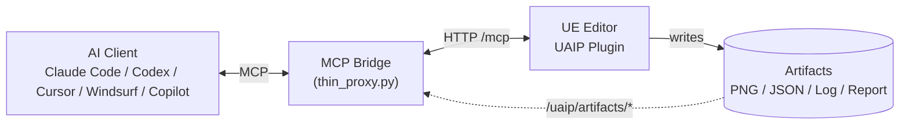

**[日本語](docs/ja/overview.md)**

> [!TIP]
> **Want to see what's coming next?** Unreleased changes in progress toward the next Fab release are listed in the **[Unreleased section of the Changelog](https://github.com/Naotsun19B/UnrealAIIntegrationPlatform-Document/blob/next/docs/en/changelog.md#unreleased)** (`next` branch).

  

<video src="https://github.com/user-attachments/assets/58e03ed1-6dc5-4068-8789-4b3e81bbb1f8" autoplay loop muted playsinline controls width="100%"></video>

  

# UnrealAIIntegrationPlatform

<!--ts-->
   * [Description](#Description)
   * [Requirement](#Requirement)
   * [Installation](#Installation)
   * [Setup](#Setup)
   * [Documentation](#Documentation)
   * [License](#License)
   * [Author](#Author)
   * [Changelog](#Changelog)
<!--te-->

## Description

**UnrealAIIntegrationPlatform (UAIP)** is an Unreal Engine plugin that lets AI agents **drive, observe, execute, and verify** the UE Editor and Runtime over a structured API.

AI tools such as Claude Code, Codex CLI, Cursor, Windsurf, and GitHub Copilot can connect via the **Model Context Protocol (MCP)** and issue semantic commands — no coordinate clicks, no brittle UI scripting.

Key capabilities:
- **Editor control** — open/save assets, edit Blueprints, manipulate actors, run Automation Tests, drive the Sequencer, and much more through 540+ UAIP commands (plus 190+ [Toolset](docs/en/glossary.md#toolset--toolset-bridge) bridges to the official UE 5.8 Toolset, ~730+ total)
- **Visual & structural observation** — capture screenshots of any editor tab or viewport, dump JSON state of the world, Slate widget tree, editor state, and so on, returned as [Artifacts](docs/en/glossary.md#artifact)
- **Runtime / [PIE](docs/en/glossary.md#pie-play-in-editor) control** — start/stop PIE, spawn actors, inject input, run Gauntlet tests, assert actor properties
- **[Scenario](docs/en/glossary.md#scenario) execution** — submit an ordered list of commands as one request with abort-on-failure, retry, and per-step timeouts
- **Multi-transport** — reachable over [MCP](docs/en/glossary.md#mcp-model-context-protocol), HTTP, WebSocket, or CLI from within the same process
- **Safety & capability policy** — per-[session](docs/en/glossary.md#session) [Capability](docs/en/glossary.md#capability) gates and process-wide [SafetyPolicy](docs/en/glossary.md#safetypolicy) switches

<video src="https://github.com/user-attachments/assets/1e4f4ab9-8cf1-4a0a-ba69-bee81b322a31" muted controls width="100%"></video>

### Architecture

The MCP Bridge translates AI client tool calls into HTTP requests against the editor. Capture / dump commands write their results as artifacts that the bridge can stream back to the AI client by id. For HTTP API, WebSocket, and CLI alternatives, see [Connection Methods](docs/en/connections.md).

## Requirement

Target version : UE 5.7 / 5.8  
Target platform : Windows  
Python : 3.10 or newer (required for the MCP Bridge)

## Installation

UAIP ships in two forms: a free **Demo** build and the upcoming **Pro** version.

### Demo (free, from GitHub Releases)

A feature-limited binary build that already covers MCP connection, observation, PIE control, scenario execution, UI automation, and assertions — enough to integrate an AI agent into your review and testing workflow. The full command list and limitations are documented in the [Demo Version Guide](docs/en/demo.md).

1. Download `UAIP-Demo-UE<version>-Win64.zip` from this repository's [Releases](../../releases)
2. Extract the zip into your UE project as `Plugins/UnrealAIIntegrationPlatform/`
3. Open the project and confirm **UnrealAIIntegrationPlatform** is enabled under **Edit > Plugins**

### Pro — available now on Fab

The full version (every transport, full Editor / Runtime editing, no watermark) is **[available on Fab](https://www.fab.com/listings/0eedf909-00ac-4d95-b109-8fda51800fff)**, distributed as a Fab Code Plugin (source included). Install from Fab and place the plugin under the same `Plugins/UnrealAIIntegrationPlatform/` path.

## Setup

The MCP Bridge is a thin Python proxy that connects your AI client to the UE Editor. It is distributed **separately from the plugin** as `UAIP-MCPBridge-<version>.zip` in this repository's [Releases](../../releases) (UE-version-agnostic).

1. Download `UAIP-MCPBridge-<version>.zip` and extract it anywhere
2. Run the installer from the extracted folder — `install/install.ps1` (Windows; or `install/install.cmd` if PowerShell execution policy is restricted) — and answer the interactive prompts for your `.uproject` or engine path. The installer deploys the bridge to `<UAIP-parent>/UAIPMCPBridge/` (sibling to the UAIP plugin), creates a Python venv, and prints an MCP client registration snippet
3. Paste the printed snippet into your AI client's MCP config file
4. Ask the AI: **"Run a UAIP HealthCheck"** to verify

For a 5-minute walkthrough see [Quickstart](docs/en/quickstart.md); for per-client setup see [Connection Methods](docs/en/connections.md). Full installer details are in `install/SETUP.md` inside the bridge zip.

## Documentation

| Document | Description |
|---|---|
| [Quickstart](docs/en/quickstart.md) | 5-minute path from install to first command |
| [Connection Methods](docs/en/connections.md) | All transports: MCP Bridge setup + HTTP / WebSocket / CLI (Pro) |
| &nbsp;&nbsp;↳ [Claude Code](docs/en/clients/claude-code.md) / [Codex CLI](docs/en/clients/codex.md) / [Claude Desktop](docs/en/clients/claude-desktop.md) / [Cursor](docs/en/clients/cursor.md) / [Windsurf](docs/en/clients/windsurf.md) / [Copilot](docs/en/clients/copilot.md) | Per-client config JSON and verification |
| [Use Cases](docs/en/use-cases.md) | Who uses UAIP for what — testing, review, audits, pair programming |
| [Examples / Cookbook](docs/en/cookbook.md) | Recipes — PIE smoke, AI review, asset audit, BP edit, UI automation |
| [Commands Reference](docs/en/commands.md) | All 730+ commands organized by domain |
| [API Reference](docs/en/api.md) | Full per-command schemas as JSON — for tooling, codegen, validation |
| [Scenario Execution](docs/en/scenario.md) | Multi-step ordered command batches |
| [Artifacts](docs/en/artifacts.md) | Screenshots, JSON dumps, logs — how to read them |
| [Safety & Capabilities](docs/en/safety.md) | SafetyPolicy and Capability configuration reference |
| [Configuration](docs/en/config.md) | ini sections (Session / ArtifactGC / CommandNotification), CLI launch flags, MCP Bridge `config.json` |
| [Security](docs/en/security.md) | Threat model, auth, recommended hardening profiles |
| [Architecture](docs/en/architecture.md) | Layers, dispatch sequence, capability decision flow |
| [Demo Version Guide](docs/en/demo.md) | Demo command list, limitations, and installation |
| [FAQ](docs/en/faq.md) | Common questions on demo/Pro, capabilities, workflows, CI |
| [Troubleshooting](docs/en/troubleshooting.md) | Error code reference and common failure modes |
| [Glossary](docs/en/glossary.md) | Definitions of Capability, Artifact, Scenario, Toolset, etc. |
| [Roadmap](docs/en/roadmap.md) | Planned features and future direction |
| [Changelog](docs/en/changelog.md) | Versioning policy and per-release change history |

## License

The demo binary available in this repository's [Releases](https://github.com/Naotsun19B/UnrealAIIntegrationPlatform-Document/releases?q=Demo) (under `Demo-v<X.Y.Z>` tags) is provided under the terms of `EULA.txt` included in the release archive.  
The full product distributed on Fab is provided under the [Fab Standard License (Fab EULA)](https://www.fab.com/eula).  
The **MCP Bridge** (`UAIP-MCPBridge-<version>.zip`, also distributed via this repository's [Releases](https://github.com/Naotsun19B/UnrealAIIntegrationPlatform-Document/releases?q=MCPBridge) under `MCPBridge-v<X.Y.Z>` tags) is provided under the [MIT License](https://opensource.org/licenses/MIT) — the full license text ships inside the archive as `LICENSE`.  
Unless explicitly stated otherwise, all documentation content in this repository is © 2026 Naotsun. All rights reserved.

## Author

[Naotsun](https://twitter.com/Naotsun_UE)

## Changelog

**Current version**: 1.0.0 (released 2026-06-18) — Pro is now [available on Fab](https://www.fab.com/listings/0eedf909-00ac-4d95-b109-8fda51800fff). See [Changelog](docs/en/changelog.md) for the full history and versioning policy.
