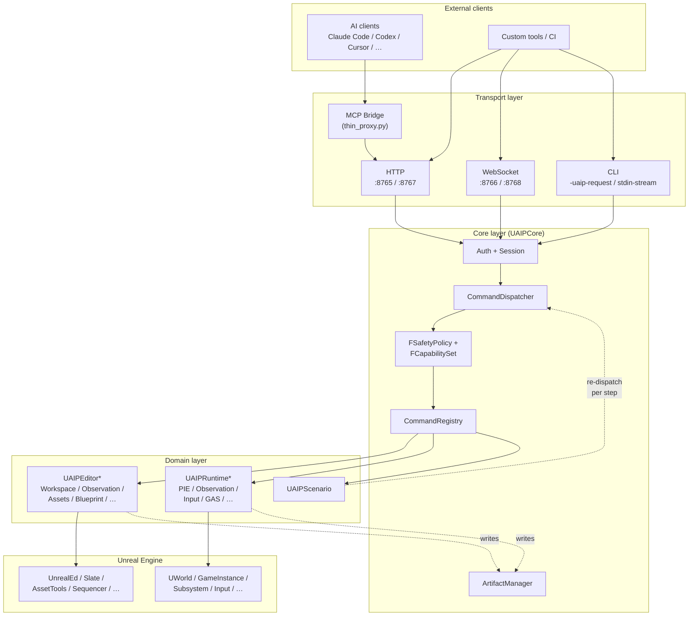
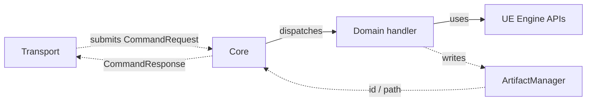
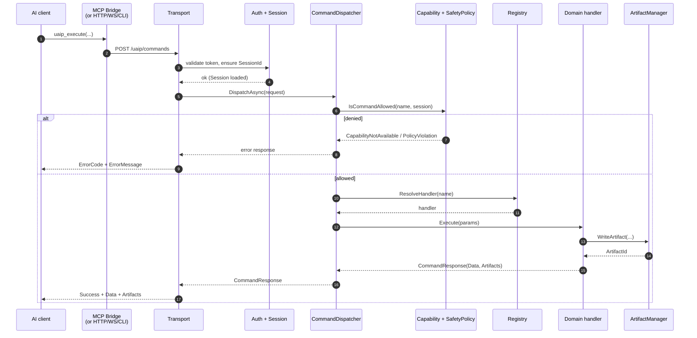
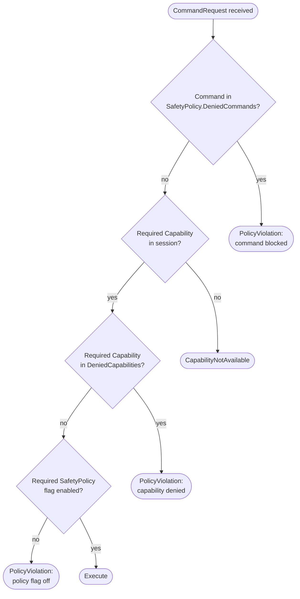
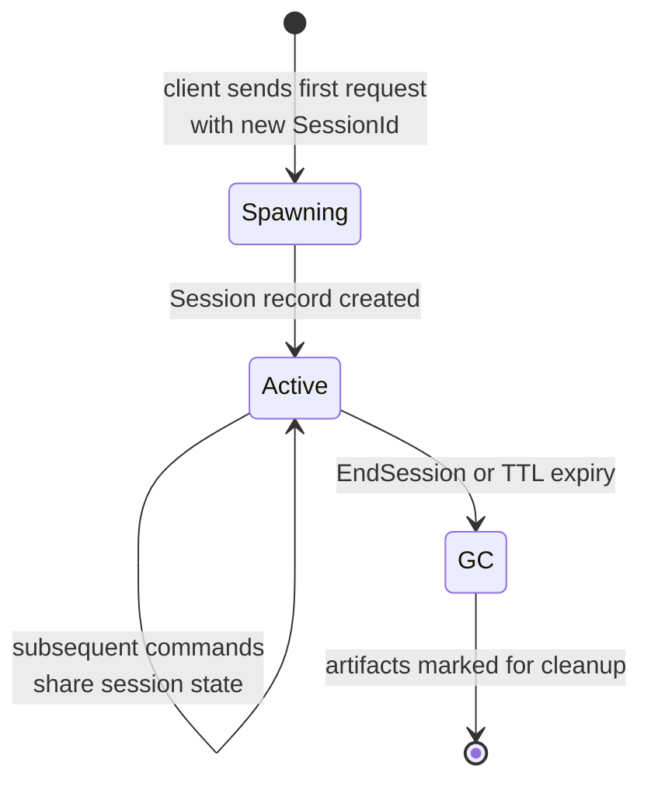
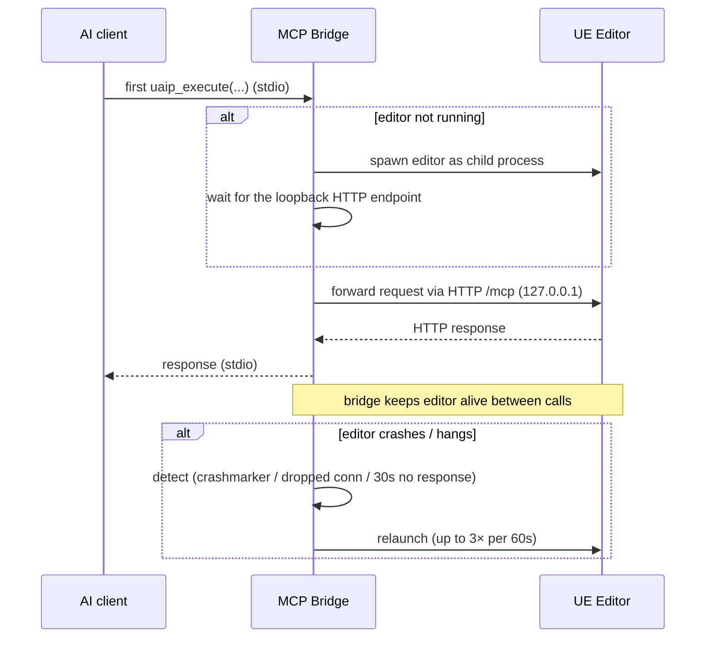

**[日本語](../ja/architecture.md)** | [Back to README](../../README.md)

# Architecture

This page describes how UAIP is organized internally. If you only want to use UAIP, [Quickstart](quickstart.md) and [Commands Reference](commands.md) are enough. This page is for tools programmers, plugin extenders, and reviewers who need to understand the moving parts.

---

## 1. Layered overview

The hard rule: **dependencies only flow downward**. The Transport layer doesn't import Domain handlers; Domain handlers don't import Transport. Core sits in the middle.

---

## 2. Module map

| Layer | Modules | Role |
|---|---|---|
| **Core** | `UAIPCore` | Session, capability, policy, command registry, artifact manager. Loaded in every configuration |
| **Shared** | `UAIPEditorShared`, `UAIPRuntimeShared`, `UAIPExecutionShared`, `UAIPArtifacts`, `UAIPBuildSupport`, `UAIPWatchdogSupport` | Cross-domain utilities — no commands directly |
| **Transports** | `UAIPTransportHTTP`, `UAIPTransportWS`, `UAIPTransportCLI` | Per-transport listeners; MCP is external to the editor (Python bridge) |
| **Editor domain** | `UAIPEditor*` (Workspace, Observation, Execution, UIAutomation, Assets, Level, Property, Blueprint, UMG, Material, GameplayTags, GameFeatures, Niagara, Physics, Dataflow, Skeleton, DataTable, AnimBlueprint, SoundCue, BehaviorTree, MetaSound, EQS, Sequencer, StateTree, Curve, PCG, WorldConditions, Conversation, ControlRig, EnhancedInput, GAS, PythonExtension) | Editor-side semantic commands. Loaded in `EditorNoCommandlet` phase |
| **Runtime domain** | `UAIPRuntimePIE`, `UAIPRuntimeObservation`, `UAIPRuntimeExecution`, `UAIPRuntimeAssertion`, `UAIPRuntimeWorld`, `UAIPRuntimeGAS`, `UAIPRuntimeInput`, `UAIPRuntimeNiagara` | Runtime / PIE-side commands. Some opt-in to packaged builds for Gauntlet |
| **Scenario** | `UAIPScenario` | Scenario route — independent of `uaip_execute` but reuses `CommandDispatcher` |

For the full registered count, see [Commands Reference](commands.md).

---

## 3. Dependency direction

- Transport never calls Domain directly.
- Domain never imports another Domain (e.g., `UAIPEditorBlueprint` does not depend on `UAIPEditorMaterial`).
- Cross-domain sharing goes through `UAIPEditorShared` / `UAIPRuntimeShared`.
- `UAIPScenario` is a route alongside `uaip_execute`; it submits steps back through `CommandDispatcher` rather than reaching domains directly.

Circular dependencies are forbidden. UE's `.Build.cs` system enforces this — adding a cycle won't compile.

---

## 4. Command dispatch sequence

Everything runs on the **game thread by default**. Handlers that need long-running work mark themselves async and post completion back to the game thread before invoking the callback.

---

## 5. Authorization decision flow

Two distinct gates (Capability vs SafetyPolicy) and three result codes (`CapabilityNotAvailable`, `PolicyViolation`, `Success`). The `ErrorMessage` always names the specific capability or flag so the AI / user can fix it without guessing. See [Safety & Capabilities](safety.md).

---

## 6. Session lifecycle

A session is the unit that owns:
- Capability set (assigned at spawn time from SafetyPolicy)
- Observed widget cache (for `ObserveWidget`)
- Artifact subfolder (`Saved/UAIP/<SessionId>/`)
- Per-session rate limiters (e.g., scenario submit)

Anonymous sessions (no `SessionId` passed) get an auto-generated `MCP-Anonymous-<guid>` ID — fine for one-off calls, but per-task sessions make artifacts easier to find.

---

## 7. Artifact lifecycle

Every command that produces output (capture, dump, log, report) writes one or more **artifacts** to `Saved/UAIP/<SessionId>/` and returns artifact IDs in the response. Clients fetch the content by ID — file paths are not exposed in the response payload, which prevents path-leak attacks and keeps the contract stable across transports.

See [Artifacts](artifacts.md) for the on-disk layout, inline-vs-fetch behavior, and per-type policies.

---

## 8. Editor lifecycle (managed by the bridge)

The AI client ↔ Bridge link is MCP over stdio; the Bridge ↔ UE Editor link is **loopback HTTP**.

The bridge owns the editor process lifecycle so clients don't need to. AI clients **must not** call `taskkill` / `Stop-Process` — that takes down editors of other projects too. Use `UAIP.Workspace.RestartEditor` instead. See [Troubleshooting → MCP appears stuck](troubleshooting.md#mcp-appears-stuck--should-i-kill-the-editor).

---

## 9. Extension points

UAIP exposes extension hooks so projects can publish their own commands to AI agents without forking the plugin. The main building blocks for adding custom commands are:

- **`ICommandProvider`** — the provider (command group) interface. Register a provider with `CommandRegistry` at module startup to expose commands under your own namespace. Provider implementations also declare each command's name, required capabilities, `IsReadOnly` flag, and other metadata.
- **`ICommandHandler`** — the per-command implementation. Your business logic goes in `Execute(Params)` and returns a `CommandResponse`. Handlers are dispatched through the provider you registered.

With these two, custom commands appear to AI clients exactly like built-in ones: same `uaip_execute` invocation, same schema discovery, same capability check, same artifact contract. Whenever you want to make a project-specific asset or in-house tool accessible to AI, implementing these two interfaces is the standard starting point.

Other hooks:

- **`ICaptureProvider`** — bridge an external graph-image source (e.g., GraphPrinter) so `CaptureCanonicalGraphImage` can use it
- **Python `@uaip_command`** — register a Python function as a UAIP command (requires `PythonScriptPlugin` + `PythonExtensionReload` capability)

Project-specific extensions go in **separate plugins or modules**, not in the UAIP source tree. This keeps `git pull` clean when UAIP is updated.

---

## 10. Where to read next

| If you want to… | Read |
|---|---|
| Author a new command | [Commands Reference](commands.md) (for naming) + the source of an existing handler in the relevant `UAIPEditor*` module |
| Understand auth in depth | [Safety & Capabilities](safety.md), [Security](security.md) |
| Understand scenario internals | [Scenario Execution](scenario.md) |
| Understand artifact storage / fetch | [Artifacts](artifacts.md) |
| Look up a term | [Glossary](glossary.md) |
