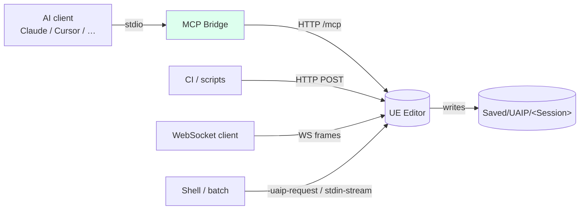
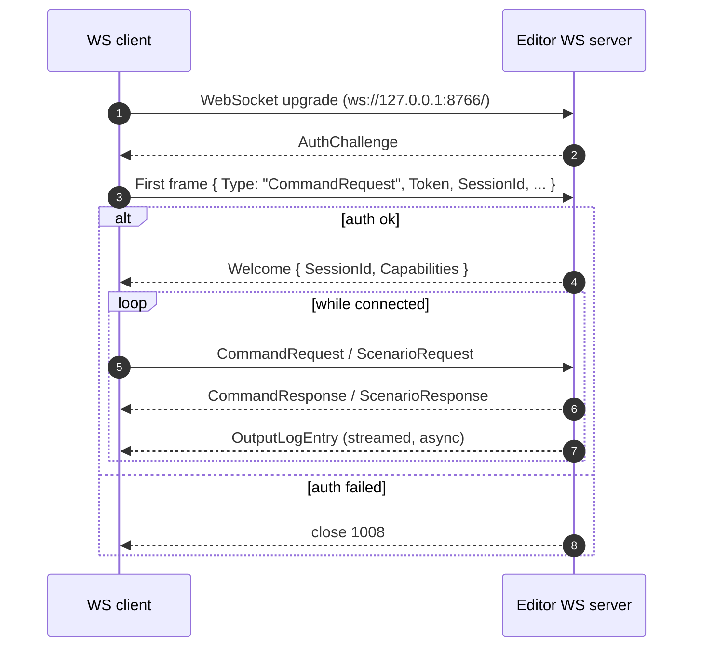
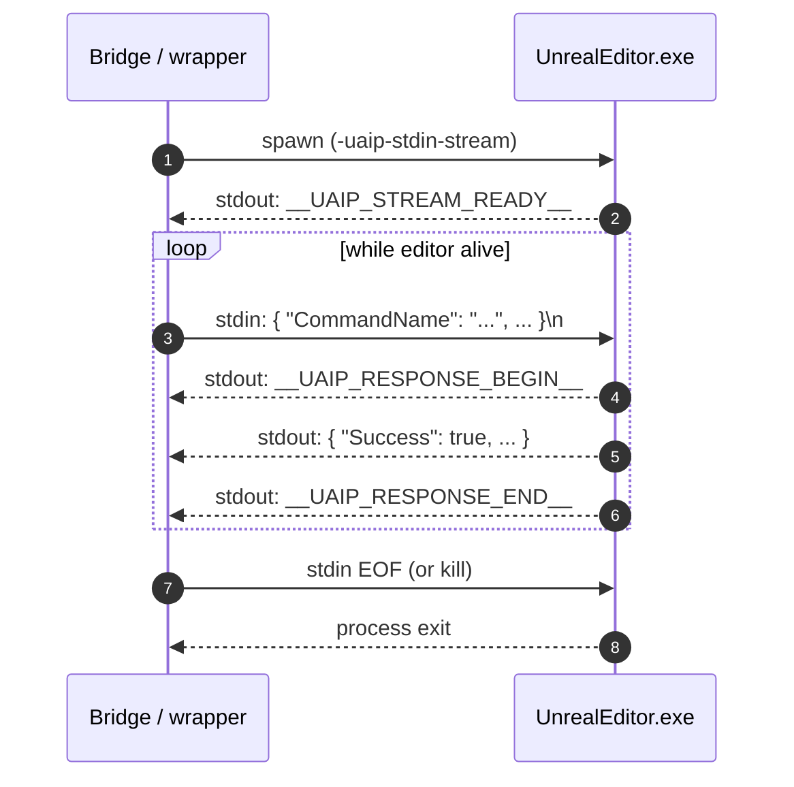

**[日本語](../ja/connections.md)** | [Back to README](../../README.md)

# Connection Methods

UAIP supports four transport options. Choose the one that fits your integration scenario.

| Transport | Port (Editor) | Port (Packaged) | Best for |
|---|---|---|---|
| **MCP Bridge** | — | — | AI clients (Claude Code, Cursor, Windsurf, Copilot) |
| **HTTP API** | 8765 | 8767 | Custom integrations, REST clients, CI/CD pipelines |
| **WebSocket** | 8766 | 8768 | Real-time streaming, persistent connections |
| **CLI** | — | — | One-shot automation, shell scripts |

> **Demo limitation**: the demo binary supports the **MCP transport only**. HTTP, WebSocket, and CLI require the Pro version.

---

## Transport comparison



All four transports terminate at the same dispatch core inside the editor (see [Architecture](architecture.md)) so capability + policy semantics are identical regardless of which transport you use.

---

## MCP Bridge

The MCP Bridge is the recommended transport for AI client integration. A thin Python proxy (`thin_proxy.py`) sits between the AI client and the UE Editor, translating MCP tool calls into UAIP HTTP requests internally. The AI client ↔ Bridge link is MCP over stdio; the Bridge ↔ UE Editor link is loopback HTTP.

If you only want the shortest path to a working setup, see [Quickstart](quickstart.md).

> The MCP Bridge is distributed **separately from the plugin** as `UAIP-MCPBridge-<version>.zip` in the documentation repository's [Releases](../../../releases). Per Fab packaging rules, it is not bundled with the plugin itself. A single zip works for every supported UE version.

### Prerequisites

- The `Plugins/UnrealAIIntegrationPlatform` folder is placed in your project's `Plugins` folder
- The **UnrealAIIntegrationPlatform** plugin is enabled in the UE project
- Python 3.10 or newer is installed and available on `PATH`
- One of the supported AI clients (Claude Code, Codex CLI, Claude Desktop, Cursor, Windsurf, GitHub Copilot)

### Step 1 — Download and extract the Bridge zip

Download `UAIP-MCPBridge-<version>.zip` from the documentation repository's [Releases](../../../releases) page and extract it anywhere — for example, a temporary `Downloads/UAIPMCPBridge/` folder. The extracted layout is the **installer source**, not the final deployment location.

### Step 2 — Run the installer

From the extracted folder, run `install/install.ps1` (Windows) or `install/install.cmd` (wrapper for restricted PowerShell execution policy):

```powershell
.\install\install.ps1
```

The installer is **interactive** when called without arguments: it asks whether to deploy as a project plugin sibling or an engine plugin sibling, then prompts for the corresponding path.

| Choice | Prompt | Deploys to |
|---|---|---|
| `1` Project install | `.uproject` path | `<Project>/Plugins/UAIPMCPBridge/` |
| `2` Engine install | Engine root | `<Engine>/Engine/Plugins/.../UAIPMCPBridge/` |

You can skip the prompts by passing the path directly:

```powershell
.\install\install.ps1 -ProjectPath "F:\MyProjects\MyGame\MyGame.uproject"
.\install\install.ps1 -EnginePath  "F:\Epic Games\UE_5.8"
```

What the installer does:

| Step | Action |
|---|---|
| 1 | Locate the UAIP plugin and resolve the deploy target |
| 2 | Copy bridge files into `<UAIP-parent>/UAIPMCPBridge/` |
| 3 | Verify Python 3.10+ is available |
| 4 | Create a Python virtual environment at `<bridge-root>/.venv/` |
| 5 | `pip install -r requirements.txt` into the venv |
| 6 | Write a default `<bridge-root>/config.json` |
| 7 | Print an MCP client registration snippet with auto-detected paths |

Once finished, the bridge lives at `<UAIP-parent>/UAIPMCPBridge/` (sibling to `UnrealAIIntegrationPlatform/`) and the venv Python is at `<bridge-root>/.venv/Scripts/python.exe` (Windows) or `<bridge-root>/.venv/bin/python` (macOS / Linux).

### Step 3 — Pick an MCP server key

The server key is how this bridge instance is identified in your AI client's config. The installer chooses a sensible default and prints it; the value below is for reference if you need to pick a different one.

| Plugin location | Key format | Example |
|---|---|---|
| Project plugin (bridge under `<Project>/Plugins/`) | `uaip-<ProjectName>` | `uaip-MyGame` |
| Engine plugin (bridge under `<Engine>/Engine/Plugins/`) | `uaip-<engine-folder>` | `uaip-UE_5.8` |

Any unique name works — the key only affects how the AI client lists the server.

### Step 4 — Register the MCP server in your AI client

The installer printed a JSON snippet with the venv Python path and auto-detected `UAIP_UE_EDITOR_PATH` / `UAIP_UPROJECT_PATH`. Paste it as-is into your client's config file.

```json
{
  "mcpServers": {
    "<key>": {
      "command": "<bridge-root>/.venv/Scripts/python.exe",
      "args":    ["<bridge-root>/thin_proxy.py"],
      "env": {
        "UAIP_UE_EDITOR_PATH": "<absolute path to UnrealEditor.exe>",
        "UAIP_UPROJECT_PATH":  "<absolute path to your.uproject>"
      }
    }
  }
}
```

> The installer puts the venv Python in `command` so MCP clients do not need a system-wide Python on `PATH`.

Pick your client and follow its dedicated page for the file location and per-client conventions:

| Client | Page | Notes |
|---|---|---|
| **Claude Code** (CLI / VS Code extension) | [claude-code.md](clients/claude-code.md) | Best support; `.mcp.json` per project or `~/.claude.json` global |
| **Codex CLI** | [codex.md](clients/codex.md) | OpenAI's official CLI. `~/.codex/config.toml` (TOML) |
| **Claude Desktop** | [claude-desktop.md](clients/claude-desktop.md) | `claude_desktop_config.json` |
| **Cursor** | [cursor.md](clients/cursor.md) | `~/.cursor/mcp.json` or `.cursor/mcp.json` |
| **Windsurf** | [windsurf.md](clients/windsurf.md) | `~/.codeium/windsurf/mcp_config.json` |
| **GitHub Copilot (VS Code)** | [copilot.md](clients/copilot.md) | `.vscode/mcp.json` |

Each per-client page has the exact config JSON, the deployment of the AI usage guides under `<bridge-root>/install/guides/`, and the verification step ("ask the AI to run HealthCheck").

Full installer / paths reference: `<bridge-root>/install/SETUP.md` (deployed alongside the bridge).

### Enable scenario execution (optional)

`uaip_run_scenario` is disabled by default. To enable, set `enable_scenario` to `true` in `<bridge-root>/config.json`:

```json
{
  "editor_path":                  "",
  "uproject_path":                "",
  "http_startup_timeout_seconds": 120,
  "command_timeout_seconds":      60,
  "log_level":                    "INFO",
  "enable_scenario":              true,
  "inline_artifacts": { "image": false, "json": true, "text": true }
}
```

`editor_path` / `uproject_path` in `config.json` are fallbacks; per-connection paths supplied through the MCP client's `env` block (`UAIP_UE_EDITOR_PATH` / `UAIP_UPROJECT_PATH`) take precedence. See [Scenario Execution](scenario.md) for what scenarios enable and [Configuration](config.md#mcp-bridge-configjson) for the full key list.

### Reload config without restarting the MCP client

After editing `config.json`, call `uaip_reload_config` from the AI — the bridge reads the file, shuts down the running editor if launch parameters changed, and restarts it on the next command:

```
uaip_reload_config()
```

To switch engine version or project for the current session only (without editing `config.json`):

```
uaip_reload_config(EditorPath="F:\\Epic Games\\UE_5.9\\Engine\\Binaries\\Win64\\UnrealEditor.exe")
```

See [Configuration → Reloading config at runtime](config.md#reloading-config-at-runtime-uaip_reload_config) for full details.

### MCP setup troubleshooting

| Symptom | Likely cause | Fix |
|---|---|---|
| `install.ps1` is blocked by execution policy | PowerShell execution policy | Use `install.cmd`, or run `Set-ExecutionPolicy -Scope CurrentUser RemoteSigned` then re-run |
| Installer cannot find the UAIP plugin | Wrong `.uproject` / engine path | Re-run and pass the correct `-ProjectPath` / `-EnginePath` |
| Tool not found in AI client | MCP server not connected | Check the key and the `thin_proxy.py` path in the snippet; restart the client |
| Timeout after ~120 s on first command | Editor failed to start | Verify `UAIP_UE_EDITOR_PATH` / `UAIP_UPROJECT_PATH` in the MCP `env` block |
| Python error on startup | Missing dependencies in venv | Re-run the installer (the venv is recreated) |
| `PolicyViolation` on a command | Capability not granted, or SafetyPolicy flag off | See [Safety & Capabilities](safety.md) |
| `CommandNotFound` | Wrong command name | `uaip_list_commands(ProviderPrefix="UAIP.Core")` |

For broader diagnostics, see [Troubleshooting](troubleshooting.md).

---

## HTTP API (Pro)

The HTTP API exposes a REST interface. It's suited for custom scripts, CI/CD pipelines, and any integration where an AI client isn't involved. The socket binds to `0.0.0.0`, so with the Bearer token and a firewall allowance the editor can be reached from another machine (FullHTTP mode). Access control is the responsibility of the token and your network setup — see [Security → Network surface](security.md#network-surface) for the detailed model.

### Enable

Launch the editor with `-uaip-http-enable`:

```
UnrealEditor.exe MyProject.uproject -uaip-http-enable
```

To change the port (default: `8765` for editor, `8767` for packaged):

```
UnrealEditor.exe MyProject.uproject -uaip-http-enable -uaip-http-port=9000
```

### Authentication

On startup, UAIP writes a random 32-character Bearer token to:

```
Saved/UAIP/EditorHttpAuthToken.txt
```

Include this token in every request:

```http
Authorization: Bearer <token>
```

For development or CI environments where authentication is not needed:

```
-uaip-http-no-auth
```

### Endpoints

| Method | Path | Description |
|---|---|---|
| GET | `/uaip/health` | Health check — returns `{"status":"ok"}` |
| GET | `/uaip/capabilities` | Available capabilities for the current session |
| POST | `/uaip/sessions` | Create a session — returns `{"SessionId":"..."}` |
| DELETE | `/uaip/sessions/:sessionId` | End a session |
| POST | `/uaip/commands` | Execute a command |
| POST | `/uaip/scenarios` | Execute a scenario (waits for completion) |
| GET | `/uaip/artifacts/:artifactId` | Download an artifact |
| GET | `/uaip/sessions/:sessionId/artifacts` | List artifacts for a session |

### Executing a command

```http
POST /uaip/commands
Content-Type: application/json
Authorization: Bearer <token>

{
  "CommandName": "UAIP.Core.HealthCheck",
  "Params": {},
  "SessionId": "my-session"
}
```

Response:

```json
{
  "Success": true,
  "Data": { ... },
  "Artifacts": [...],
  "ErrorCode": null,
  "ErrorMessage": null
}
```

### Limits

| Item | Limit |
|---|---|
| Max request body | 64 KiB |
| Max artifact response | 100 MiB |
| Max concurrent commands | 1 |
| Command timeout | 120 s |

---

## WebSocket (Pro)

The WebSocket transport provides persistent bidirectional connections with real-time log streaming.

### Enable

```
UnrealEditor.exe MyProject.uproject -uaip-ws-enable
```

Custom port (default: `8766` for editor, `8768` for packaged):

```
UnrealEditor.exe MyProject.uproject -uaip-ws-enable -uaip-ws-port=9001
```

### Connection URL

```
ws://127.0.0.1:8766/
```

Connections are restricted to localhost (`127.0.0.1` and `::1`).

### Authentication

On startup, UAIP writes a token to:

```
Saved/UAIP/EditorWsAuthToken.txt
```

Include it in the first request frame:

```json
{
  "Type": "CommandRequest",
  "ClientProtocolVersion": "1.0",
  "Token": "<token>",
  "RequestId": "req-001",
  "SessionId": "my-session",
  "CommandName": "UAIP.Core.HealthCheck",
  "Params": {}
}
```

To disable authentication (development / CI only):

```
-uaip-ws-no-auth
```

### Handshake & message flow



**Inbound (client → server):**

| `Type` | Purpose |
|---|---|
| `CommandRequest` | Execute a command |
| `ScenarioRequest` | Execute a scenario |

**Outbound (server → client):**

| `Event` | Purpose |
|---|---|
| `AuthChallenge` | Authentication required |
| `Welcome` | Connection established — includes `SessionId` and `Capabilities` |
| `CommandResponse` | Command result |
| `ScenarioResponse` | Scenario result |
| `OutputLogEntry` | Streamed log line (real-time) |

### Output log streaming

The server pushes `OutputLogEntry` events for all UE log output in real time. To disable:

```
-uaip-ws-no-output-log
```

### Limits

| Item | Limit |
|---|---|
| Max receive message | 64 KiB |
| Max scenario payload | 1 MiB |
| Max concurrent connections | 4 |
| Handshake timeout | 5 s |
| Command timeout | 12 s |

---

## CLI (Pro)

The CLI transport runs commands by launching the editor with specific arguments. It is suited for shell scripts and CI pipelines that need tight one-shot automation without a persistent server.

### One-shot execution

The editor executes the command, writes the result, and exits.

**Inline JSON:**

```
UnrealEditor.exe MyProject.uproject -uaip-request="{\"CommandName\":\"UAIP.Core.HealthCheck\",\"Params\":{}}"
```

**From a JSON file:**

```
UnrealEditor.exe MyProject.uproject -uaip-request-file="Saved/UAIP/Requests/cmd.json"
```

**Write the response to a file:**

```
UnrealEditor.exe MyProject.uproject -uaip-request-file="..." -uaip-response-file="Saved/UAIP/Responses/result.json"
```

**Scenario from a file:**

```
UnrealEditor.exe MyProject.uproject -uaip-scenario-file="path/to/scenario.json"
```

### Stream mode

In stream mode the editor reads JSON requests from stdin and writes responses to stdout. It is intended for shell scripts or CI wrappers that drive the editor as a persistent child process. (The current MCP Bridge talks to the editor over loopback HTTP, so it does not use this mode.)



The markers (`__UAIP_*__`) make it possible to mix request/response with normal UE log output on stdout.

```
UnrealEditor.exe MyProject.uproject -uaip-stdin-stream
```

**stdout markers:**

| Marker | Meaning |
|---|---|
| `__UAIP_STREAM_READY__` | Editor is ready to receive requests |
| `__UAIP_RESPONSE_BEGIN__` | Start of a JSON response |
| `__UAIP_RESPONSE_END__` | End of a JSON response |

### CLI flags reference

| Flag | Description |
|---|---|
| `-uaip-request=<json>` | Execute a command from inline JSON |
| `-uaip-stdin` | Read a single request from stdin |
| `-uaip-request-file=<path>` | Read a command from a JSON file |
| `-uaip-response-file=<path>` | Write the response to a file |
| `-uaip-scenario=<json>` | Execute a scenario from inline JSON |
| `-uaip-scenario-file=<path>` | Read a scenario from a JSON file |
| `-uaip-stdin-stream` | Enable persistent stream mode |

### Limits

| Item | Limit |
|---|---|
| Max request body | 1 MiB |
| Command timeout | 120 s |
