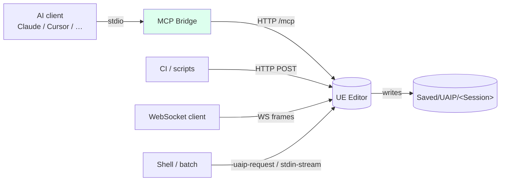
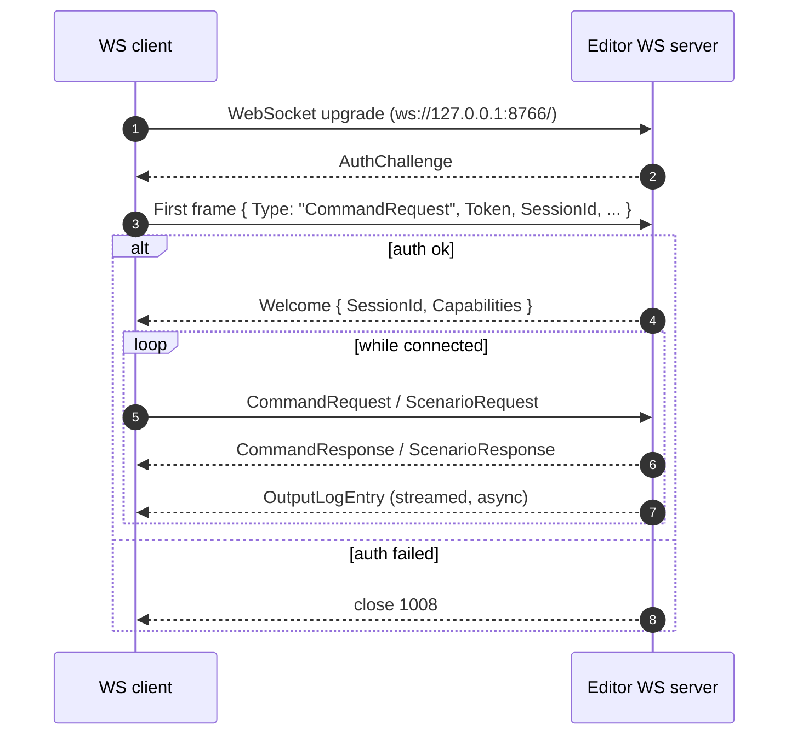
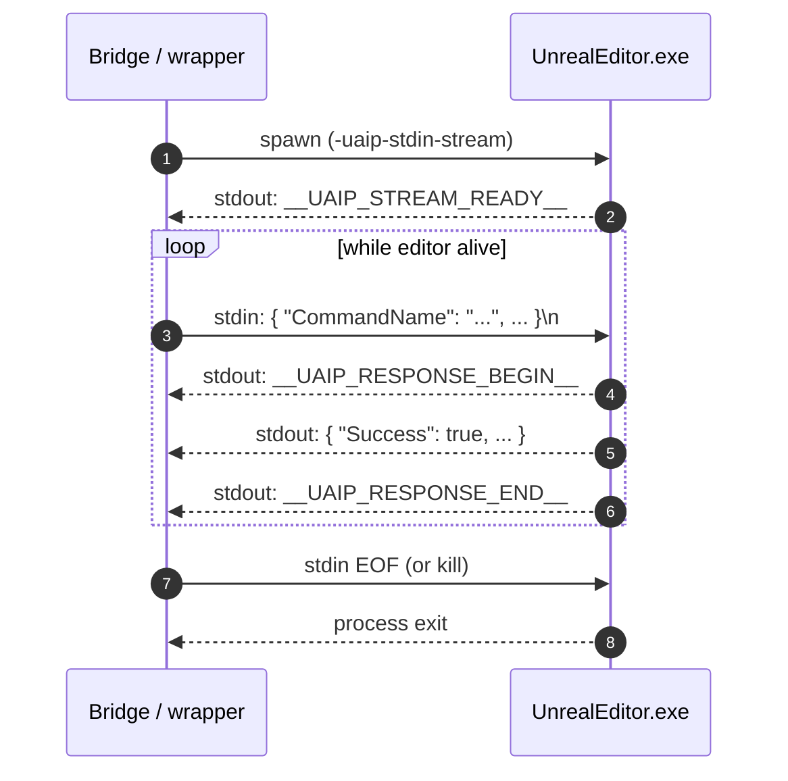

**[日本語](../ja/connections.md)** | [Back to README](../../README.md)

# Connection Methods

UAIP supports four transport options. Choose the one that fits your integration scenario.

| Transport | Port (Editor) | Port (Packaged) | Best for |
|---|---|---|---|
| **MCP Bridge** | — | — | AI clients (Claude Code, Cursor, Windsurf, Copilot) |
| **HTTP API** | 8765 | 8767 | Custom integrations, REST clients, CI/CD pipelines |
| **WebSocket** | 8766 | 8768 | Real-time streaming, persistent connections |
| **CLI** | — | — | One-shot automation, shell scripts |

> **Demo limitation**: the demo binary supports the **MCP transport only**. HTTP, WebSocket, and CLI require the Pro version.

---

## Transport comparison



All four transports terminate at the same dispatch core inside the editor (see [Architecture](architecture.md)) so capability + policy semantics are identical regardless of which transport you use.

---

## MCP Bridge

The MCP Bridge is the recommended transport for AI client integration. A thin Python proxy (`thin_proxy.py`) sits between the AI client and the UE Editor, translating MCP tool calls into UAIP HTTP requests internally.

See the [Setup Guide](setup.md) for full installation and configuration instructions.

---

## HTTP API (Pro)

The HTTP API exposes a RESTful interface on localhost. It is suited for custom scripts, CI/CD pipelines, and any integration where an AI client is not involved.

### Enable

Launch the editor with `-uaip-http-enable`:

```
UnrealEditor.exe MyProject.uproject -uaip-http-enable
```

To change the port (default: `8765` for editor, `8767` for packaged):

```
UnrealEditor.exe MyProject.uproject -uaip-http-enable -uaip-http-port=9000
```

### Authentication

On startup, UAIP writes a random 32-character Bearer token to:

```
Saved/UAIP/EditorHttpAuthToken.txt
```

Include this token in every request:

```http
Authorization: Bearer <token>
```

For development or CI environments where authentication is not needed:

```
-uaip-http-no-auth
```

### Endpoints

| Method | Path | Description |
|---|---|---|
| GET | `/uaip/health` | Health check — returns `{"status":"ok"}` |
| GET | `/uaip/capabilities` | Available capabilities for the current session |
| POST | `/uaip/sessions` | Create a session — returns `{"SessionId":"..."}` |
| DELETE | `/uaip/sessions/:sessionId` | End a session |
| POST | `/uaip/commands` | Execute a command |
| POST | `/uaip/scenarios` | Execute a scenario (waits for completion) |
| GET | `/uaip/artifacts/:artifactId` | Download an artifact |
| GET | `/uaip/sessions/:sessionId/artifacts` | List artifacts for a session |

### Executing a command

```http
POST /uaip/commands
Content-Type: application/json
Authorization: Bearer <token>

{
  "CommandName": "UAIP.Core.HealthCheck",
  "Params": {},
  "SessionId": "my-session"
}
```

Response:

```json
{
  "Success": true,
  "Data": { ... },
  "Artifacts": [...],
  "ErrorCode": null,
  "ErrorMessage": null
}
```

### Limits

| Item | Limit |
|---|---|
| Max request body | 64 KiB |
| Max artifact response | 100 MiB |
| Max concurrent commands | 1 |
| Command timeout | 120 s |

---

## WebSocket (Pro)

The WebSocket transport provides persistent bidirectional connections with real-time log streaming.

### Enable

```
UnrealEditor.exe MyProject.uproject -uaip-ws-enable
```

Custom port (default: `8766` for editor, `8768` for packaged):

```
UnrealEditor.exe MyProject.uproject -uaip-ws-enable -uaip-ws-port=9001
```

### Connection URL

```
ws://127.0.0.1:8766/
```

Connections are restricted to localhost (`127.0.0.1` and `::1`).

### Authentication

On startup, UAIP writes a token to:

```
Saved/UAIP/EditorWsAuthToken.txt
```

Include it in the first request frame:

```json
{
  "Type": "CommandRequest",
  "ClientProtocolVersion": "1.0",
  "Token": "<token>",
  "RequestId": "req-001",
  "SessionId": "my-session",
  "CommandName": "UAIP.Core.HealthCheck",
  "Params": {}
}
```

To disable authentication (development / CI only):

```
-uaip-ws-no-auth
```

### Handshake & message flow



**Inbound (client → server):**

| `Type` | Purpose |
|---|---|
| `CommandRequest` | Execute a command |
| `ScenarioRequest` | Execute a scenario |

**Outbound (server → client):**

| `Event` | Purpose |
|---|---|
| `AuthChallenge` | Authentication required |
| `Welcome` | Connection established — includes `SessionId` and `Capabilities` |
| `CommandResponse` | Command result |
| `ScenarioResponse` | Scenario result |
| `OutputLogEntry` | Streamed log line (real-time) |

### Output log streaming

The server pushes `OutputLogEntry` events for all UE log output in real time. To disable:

```
-uaip-ws-no-output-log
```

### Limits

| Item | Limit |
|---|---|
| Max receive message | 64 KiB |
| Max scenario payload | 1 MiB |
| Max concurrent connections | 4 |
| Handshake timeout | 5 s |
| Command timeout | 12 s |

---

## CLI (Pro)

The CLI transport runs commands by launching the editor with specific arguments. It is suited for shell scripts and CI pipelines that need tight one-shot automation without a persistent server.

### One-shot execution

The editor executes the command, writes the result, and exits.

**Inline JSON:**

```
UnrealEditor.exe MyProject.uproject -uaip-request="{\"CommandName\":\"UAIP.Core.HealthCheck\",\"Params\":{}}"
```

**From a JSON file:**

```
UnrealEditor.exe MyProject.uproject -uaip-request-file="Saved/UAIP/Requests/cmd.json"
```

**Write the response to a file:**

```
UnrealEditor.exe MyProject.uproject -uaip-request-file="..." -uaip-response-file="Saved/UAIP/Responses/result.json"
```

**Scenario from a file:**

```
UnrealEditor.exe MyProject.uproject -uaip-scenario-file="path/to/scenario.json"
```

### Stream mode

In stream mode the editor reads JSON requests from stdin and writes responses to stdout. This is the mode used internally by the MCP Bridge.



The markers (`__UAIP_*__`) make it possible to mix request/response with normal UE log output on stdout.

```
UnrealEditor.exe MyProject.uproject -uaip-stdin-stream
```

**stdout markers:**

| Marker | Meaning |
|---|---|
| `__UAIP_STREAM_READY__` | Editor is ready to receive requests |
| `__UAIP_RESPONSE_BEGIN__` | Start of a JSON response |
| `__UAIP_RESPONSE_END__` | End of a JSON response |

### CLI flags reference

| Flag | Description |
|---|---|
| `-uaip-request=<json>` | Execute a command from inline JSON |
| `-uaip-stdin` | Read a single request from stdin |
| `-uaip-request-file=<path>` | Read a command from a JSON file |
| `-uaip-response-file=<path>` | Write the response to a file |
| `-uaip-scenario=<json>` | Execute a scenario from inline JSON |
| `-uaip-scenario-file=<path>` | Read a scenario from a JSON file |
| `-uaip-stdin-stream` | Enable persistent stream mode |

### Limits

| Item | Limit |
|---|---|
| Max request body | 1 MiB |
| Command timeout | 120 s |
