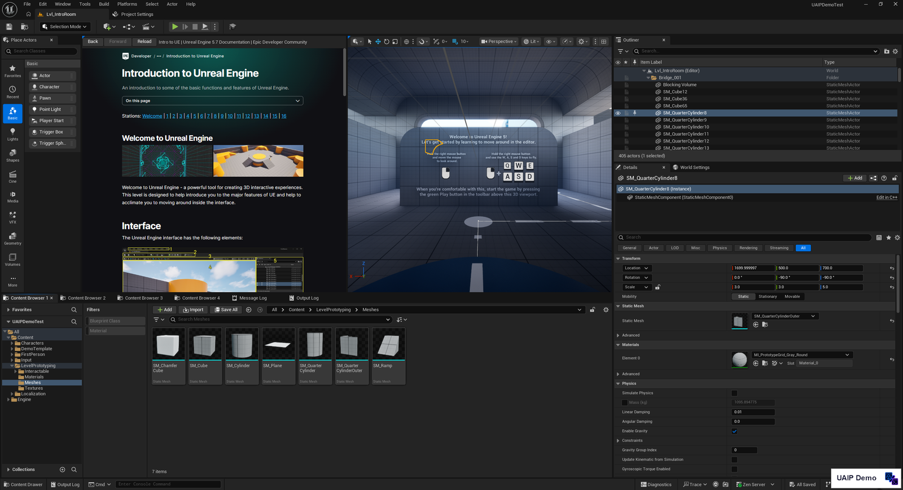
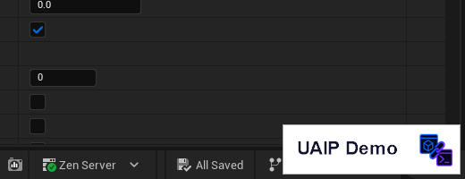

**[日本語](../ja/demo.md)** | [Back to README](../../README.md)

# Demo Version Guide

The UAIP demo binary is a free, feature-limited build distributed via GitHub Releases. It provides observation, PIE control, assertion, scenario execution, and UI automation — enough to integrate an AI agent into your review and testing workflow without any cost.

> **License**: the demo is licensed for **personal use and evaluation only**. Commercial use is not covered — see the `EULA.txt` shipped with the release archive. For commercial use, please wait for the Pro version (coming soon on Fab).

---

## Demo vs Pro

| | Demo | Pro (Fab) |
|---|:---:|:---:|
| **Connection** | | |
| MCP | ✅ | ✅ |
| HTTP API (`/uaip/execute`) | — | ✅ |
| WebSocket | — | ✅ |
| CLI | — | ✅ |
| Artifact retrieval (`/uaip/artifacts/*`) | ✅ | ✅ |
| **Commands** | | |
| Core (HealthCheck, ListCommands, …) | ✅ | ✅ |
| Editor observation (screenshots, dumps) | ✅ | ✅ |
| PIE control (StartPIE, StopPIE, LoadMap, …) | ✅ | ✅ |
| Runtime observation (viewport capture, world dump) | ✅ | ✅ |
| Scenario execution (`uaip_run_scenario`) | ✅ | ✅ |
| UI automation (ClickWidget, PressKey, FillForm, …) | ✅ | ✅ |
| Runtime assertion (WaitSeconds, AssertActorProperty, …) | ✅ | ✅ |
| Editor editing (Blueprint, Level, Assets, Material, …) | — | ✅ |
| Runtime world editing (SpawnActor, GAS, Input inject, …) | — | ✅ |
| Python script execution (`RunEditorPythonScript`) | — | ✅ |
| Canonical graph capture (external capture provider bridge) | — | ✅ |
| **Other** | | |
| Watermark on captured images | ✅ | — |
| User extension points (`ICommandProvider`) | ✅ | ✅ |
| Optional plugin dependencies (Toolset, GAS, Niagara, …) | — | ✅ |
| UE version | 5.7 / 5.8 | 5.7 / 5.8 |

---

## Installation

1. Download `UAIP-Demo-UE<version>-Win64.zip` from the [Releases](../../../releases) page
2. Extract the zip as `Plugins/UnrealAIIntegrationPlatform/` in your UE project
3. Copy `Config/DefaultUAIP.ini` from the zip to your project's `Config/` folder — it pre-enables the `PIEControl`, `SlateUIAutomation`, and `ObservationCapture` capabilities
4. Register the MCP server in your AI client (see [Connection Methods → MCP Bridge](connections.md#mcp-bridge))

### Upgrading to Pro

`Config/DefaultUAIP.ini` uses the same format in both the demo and Pro. The ini you copied from the demo zip carries over as-is — no replacement is needed. The plugin folder structure and MCP server registration are identical, so no other changes are required.

---

## Available commands

### `UAIP.Core.*`

| Command | Description |
|---|---|
| `UAIP.Core.HealthCheck` | Verify the connection and return the UAIP version |
| `UAIP.Core.GetSystemInfo` | Return project name, platform, engine version, and build config |
| `UAIP.Core.ListCommands` | List registered commands (supports `ProviderPrefix` and keyword filter) |
| `UAIP.Core.DescribeCommand` | Return full details of one command (description, parameter schema, requirements) |
| `UAIP.Core.QueryCapabilities` | Return the current session's capability set |
| `UAIP.Core.ListPlugins` | Return UE plugin information (name, version, enabled state) |
| `UAIP.Core.EndSession` | End the session, release widget refs, and GC artifacts |
| `UAIP.Core.ReloadCapabilities` | Reload capabilities from `DefaultUAIP.ini` (requires `AllowCapabilityReload=True`) |

### `UAIP.Editor.Observation.*`

| Command | Description | Note |
|---|---|---|
| `UAIP.Editor.Observation.CaptureActiveWindowImage` | Screenshot of the active editor window | Watermarked |
| `UAIP.Editor.Observation.CaptureEditorTabImage` | Screenshot of a specific editor tab | Watermarked |
| `UAIP.Editor.Observation.CaptureGraphViewportImage` | Screenshot of a graph editor (Blueprint, Material, …) | Watermarked |
| `UAIP.Editor.Observation.DumpEditorState` | JSON dump of open assets, active tab, window dimensions | |
| `UAIP.Editor.Observation.DumpSelectionState` | JSON dump of the current selection | |
| `UAIP.Editor.Observation.DumpOpenTabs` | JSON list of open tabs | |
| `UAIP.Editor.Observation.DumpOutputLog` | Retrieve the Output Log | |
| `UAIP.Editor.Observation.DumpMessageLog` | Retrieve the Message Log | |
| `UAIP.Editor.Observation.DumpSlateTree` | JSON dump of the Slate widget hierarchy | |
| `UAIP.Editor.Observation.InspectMenu` | Return menu structure information | |
| `UAIP.Editor.Observation.InspectContextMenu` | Return context menu information | |
| `UAIP.Editor.Observation.ObserveWidget` | Register a widget for monitoring (cache) | |
| `UAIP.Editor.Observation.ListGraphNodes` | Return a list of nodes in a graph | |

### `UAIP.Runtime.PIE.*`

| Command | Description |
|---|---|
| `UAIP.Runtime.PIE.StartPIE` | Start Play in Editor (PIE) |
| `UAIP.Runtime.PIE.StopPIE` | Stop PIE |
| `UAIP.Runtime.PIE.PausePIE` | Pause PIE |
| `UAIP.Runtime.PIE.ResumePIE` | Resume PIE |
| `UAIP.Runtime.PIE.LoadMap` | Load a map |

### `UAIP.Runtime.Observation.*`

| Command | Description | Note |
|---|---|---|
| `UAIP.Runtime.Observation.CaptureViewportImage` | Screenshot of the game viewport | Watermarked |
| `UAIP.Runtime.Observation.DumpWorldState` | JSON dump of all actors, components, and transforms | |
| `UAIP.Runtime.Observation.DumpActorState` | JSON dump of a specific actor | |
| `UAIP.Runtime.Observation.DumpComponentState` | JSON dump of a specific component | |
| `UAIP.Runtime.Observation.DumpRuntimeLog` | Retrieve the runtime log | |
| `UAIP.Runtime.Observation.CapturePerformanceSnapshot` | Capture FPS, memory, and other performance stats | |
| `UAIP.Runtime.Observation.CheckpointCapture` | Screenshot + state dump combined (scenario primitive) | |
| `UAIP.Runtime.Observation.SearchLoadedClasses` | Search loaded classes | |

### `UAIP.Runtime.Assertion.*`

| Command | Description |
|---|---|
| `UAIP.Runtime.Assertion.WaitSeconds` | Wait for a specified number of seconds (scenario primitive) |
| `UAIP.Runtime.Assertion.WaitForCondition` | Wait in a condition-evaluation loop (scenario primitive) |
| `UAIP.Runtime.Assertion.AssertActorProperty` | Assert an actor property value (outputs artifact on failure) |
| `UAIP.Runtime.Assertion.AssertWorldState` | Batch-assert multiple properties |

### `UAIP.Editor.UIAutomation.*`

| Command | Description |
|---|---|
| `UAIP.Editor.UIAutomation.SnapshotUI` | Take a UI structure snapshot |
| `UAIP.Editor.UIAutomation.ClickWidget` | Click a widget |
| `UAIP.Editor.UIAutomation.SelectMenuItem` | Select a menu item |
| `UAIP.Editor.UIAutomation.InputText` | Input text |
| `UAIP.Editor.UIAutomation.SetCheckboxState` | Set a checkbox state |
| `UAIP.Editor.UIAutomation.SetComboSelection` | Select a combo box item |
| `UAIP.Editor.UIAutomation.DragGraphNode` | Drag a graph node |
| `UAIP.Editor.UIAutomation.ConnectGraphPins` | Connect graph pins |
| `UAIP.Editor.UIAutomation.AcceptDialog` | Close a dialog with OK |
| `UAIP.Editor.UIAutomation.CancelDialog` | Close a dialog with Cancel |
| `UAIP.Editor.UIAutomation.InvokeContextMenuAction` | Invoke a context menu action |
| `UAIP.Editor.UIAutomation.HoverWidget` | Hover over a widget |
| `UAIP.Editor.UIAutomation.PressKey` | Send a key input |
| `UAIP.Editor.UIAutomation.WaitForWidget` | Wait for a widget to appear |
| `UAIP.Editor.UIAutomation.FillForm` | Auto-fill a form |

---

## Limitations

### Connection

The demo runs in **MCP-only mode**. The HTTP API routes (`/uaip/execute`, etc.) are not registered even if `-uaip-http-enable` is passed — the flag is silently ignored. Only `/mcp` and `/uaip/artifacts/*` are active.

### Watermark on captured images

The following capture commands embed a **"UAIP Demo"** watermark in the output PNG:

- `CaptureActiveWindowImage`
- `CaptureEditorTabImage`
- `CaptureGraphViewportImage`
- `CaptureViewportImage`

<p align="center">
  
</p>

<p align="center">
  
</p>

The mark makes it clear that a screenshot — when it ends up shared as review or test evidence — was produced by the demo build. The Pro version emits captures without the watermark.

### Excluded commands

Commands that exist in Pro but return `CommandNotFound` in the demo:

| Command | Reason |
|---|---|
| `UAIP.Editor.Execution.RunEditorPythonScript` | Python execution — Pro only |
| All commands from non-whitelisted modules | Editor editing, runtime world editing, GAS, Niagara, Input injection, etc. |

### Where the demo loads

The demo is an editor-only build. It does not load into packaged builds or commandlet runs. If you need UAIP on the runtime side (Gauntlet tests, post-shipping observation, etc.), use the Pro version.

---

## Scenario execution

Scenario execution (`uaip_run_scenario`) is available in the demo. Enable it in `config.json`:

```json
{
  "editor_path":    "...",
  "uproject_path":  "...",
  "enable_scenario": true
}
```

See [Scenario Execution](scenario.md) for full details.
