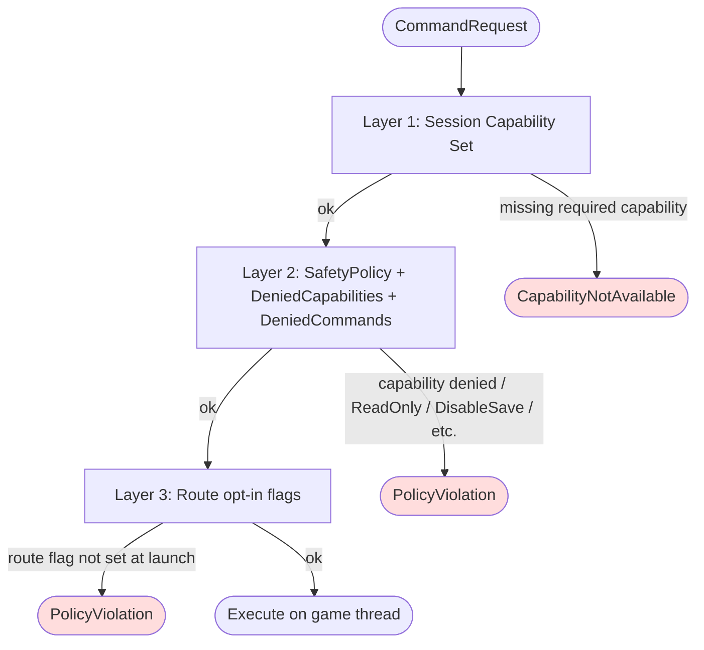
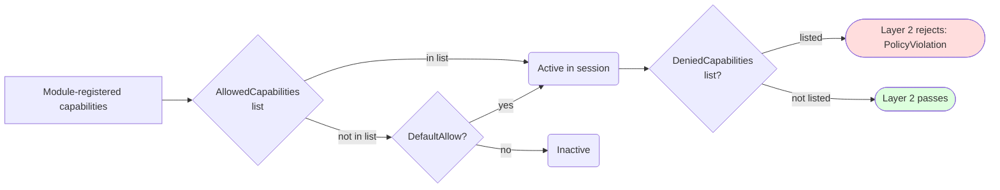

**[日本語](../ja/safety.md)** | [Back to README](../../README.md)

# Safety & Capabilities

UAIP applies per-command authorization in three layers. Understanding the layers helps you diagnose errors quickly and configure the right permissions for your workflow.

---

## Authorization layers

| Layer | Mechanism | Error on failure |
|---|---|---|
| 1 | Session's `FCapabilitySet` — per-session × per-command | `CapabilityNotAvailable` |
| 2 | `FSafetyPolicy` bool switches / DeniedCapabilities — process-wide | `PolicyViolation` |
| 3 | Route-specific opt-in (e.g. scenario route) — process-wide | `PolicyViolation` |



`AllowedCapabilities` and `DeniedCapabilities` interact at Layer 1 / 2 with **deny-wins** semantics:



---

## Capability reference

Each command declares the capabilities it requires. A command runs only when the session holds every required capability. Capabilities are either **DefaultAllow** (granted automatically) or **DefaultDenied** (must be explicitly enabled in `Config/DefaultUAIP.ini`).

Capabilities marked 🧩 require an optional plugin. If that plugin is not enabled in your `.uproject`, the capability is never registered and commands that require it return `CommandNotFound`.

---

### DefaultAllow capabilities

These are active in every session without any configuration. They cover read-only observation and common non-destructive operations.

| Capability | What it unlocks |
|---|---|
| `EditorObservation` | Screenshots (`CaptureActiveWindowImage`, `CaptureEditorTabImage`, `CaptureGraphViewportImage`) and JSON state dumps (`DumpEditorState`, `DumpSlateTree`, `DumpSelectionState`, `DumpOutputLog`, `DumpMessageLog`, etc.) |
| `EditorInspect` | Read-only inspection of editor state — assets, details panel, viewport, graph info. Used by shared infrastructure commands |
| `EditorUIAutomation` | UI-driving commands — `ClickWidget`, `SelectMenuItem`, `InputText`, `SetCheckboxState`, `DragGraphNode`, `AcceptDialog`, `CancelDialog`, `InvokeContextMenuAction`, `WaitForWidget`, `FillForm`, etc. |
| `EditorWorkspaceControl` | Tab and panel management — open/close tabs, focus graph editors, manage editor layout |
| `EditorLifecycle` | Editor lifecycle operations — `SaveAll`, `ShutdownEditor`, `RestartEditor` |
| `EditorExecution` | Run Automation Tests and Editor Utility Blueprints from the editor |
| `LiveCoding` | Hot-reload and Live Coding compilation trigger |
| `CrashReportRead` | Access to crash report diagnostic information |
| `AssetCreate` | Create new assets in the Content Browser |
| `AssetMutate` | Modify existing asset properties |
| `AssetWindowControl` | Open and close asset editors |
| `PIEControl` | PIE session control — `StartPIE`, `StopPIE`, `PausePIE`, `ResumePIE`, `LoadMap` |
| `RuntimeInspect` | Read-only inspection of runtime world state — `DumpWorldState`, `DumpActorState`, `DumpComponentState`, `DumpRuntimeLog`, `CapturePerformanceSnapshot` |
| `RuntimeCapture` | Runtime captures — `CaptureViewportImage`, `CheckpointCapture` |
| `RuntimeExecution` | Run functional tests and automation tests in PIE or Standalone |
| `RuntimeGASInspect` 🧩 | Read GAS state during PIE — `GetAttributeValues`, `GetActiveEffects`, `GetGrantedAbilities`, `GetActiveTags`, `FindAttributeSetClasses` (requires `GameplayAbilities` plugin) |
| `RuntimeNiagaraInspect` 🧩 | Read Niagara component state during PIE — `GetUserVariables`, `GetVariable` (requires `Niagara` plugin) |
| `SandboxObserve` 🧩 | Observe the active sandbox — `GetSandboxStatus`, `GetSandboxChanges` (requires `FileSandbox` plugin) |

---

### DefaultDenied capabilities

These must be explicitly enabled by adding `+AllowedCapabilities=<name>` entries to `[UAIP.SafetyPolicy]` in `Config/DefaultUAIP.ini`. They cover destructive or significant editing operations.

#### Blueprint & Anim Blueprint editing

| Capability | What it unlocks |
|---|---|
| `BlueprintEdit` | Compile Blueprint assets and inspect their structure |
| `BlueprintVariableEdit` | Add, remove, and modify Blueprint variables |
| `BlueprintGraphEdit` | Add, delete, and connect nodes in Blueprint event graphs |
| `BlueprintComponentEdit` | Add, remove, rename, reparent, duplicate, and edit properties of Blueprint SCS components |
| `AnimBlueprintGraphEdit` | Add, delete, and connect nodes in AnimGraph; compile Anim Blueprints |
| `AnimStateMachineEdit` | Add and remove States and Transitions in Anim State Machines |

#### Level / Actor / Property editing

| Capability | What it unlocks |
|---|---|
| `EditorActorEdit` | Spawn, delete, and set transforms of actors in the Level Editor |
| `EditorLevelLoad` | Open and create levels in the editor viewport |
| `EditorViewportControl` | Control the level editor viewport camera — `FocusOnActors`, `GetCameraTransform`, `SetCameraTransform` |
| `PropertyEdit` | Read and write actor / asset properties via the Details panel (`GetActorProperty`, `SetActorProperty`, `GetAssetProperty`, `SetAssetProperty`, etc.) |
| `ProjectConfigEdit` | Read and write project settings (`GetProjectSetting`, `SetProjectSetting`) |
| `EditorUndoRedo` | Undo and redo editor operations |

#### Asset management

| Capability | What it unlocks |
|---|---|
| `AssetDelete` | Permanently delete assets |
| `FolderDelete` | Permanently delete content folders |
| `AssetFolderRefactor` | Move and rename assets and folders |
| `RedirectorFixup` | Fix up stale asset redirectors |
| `ShaderCompilation` | Control shader compilation and query its status |

#### Material editing

| Capability | What it unlocks |
|---|---|
| `MaterialGraphEdit` | Add, delete, and connect nodes in Material graphs; compile materials |
| `MaterialParameterEdit` | Modify Material parameter values and defaults |
| `MaterialCustomNodeEdit` | Edit custom HLSL expression nodes in Material graphs |

#### DataTable editing

| Capability | What it unlocks |
|---|---|
| `DataTableRowEdit` | Add and modify rows in DataTable assets |
| `DataTableRowDelete` | Delete rows from DataTable assets |
| `DataTableImport` | Import CSV/JSON data into DataTable assets |

#### Physics Asset editing

| Capability | What it unlocks |
|---|---|
| `PhysicsAssetEdit` | Add, delete, and modify shapes and constraints in Physics Assets |
| `PhysicsBodyEdit` | Add and delete Physics Asset bodies; edit per-body properties (PhysicsMode, MassScale, CollisionProfile, Damping, Offset) |

#### Skeleton / SkeletalMesh editing

| Capability | What it unlocks |
|---|---|
| `SkeletonAssetEdit` | Add, remove, and modify sockets, virtual bones in Skeleton assets |
| `SkeletalMeshMaterialEdit` | Assign and replace material slots on Skeletal Meshes |

#### UMG / Widget editing

| Capability | What it unlocks |
|---|---|
| `WidgetTreeEdit` | Add, remove, and reparent widgets in UMG Widget Blueprints |
| `WidgetVariableEdit` | Add and remove widget variables |
| `WidgetAnimationEdit` | Create Widget Animations and add animation tracks |
| `WidgetBindingEdit` | Add and remove property bindings |

#### Sequencer editing

| Capability | What it unlocks |
|---|---|
| `SequencerStructureEdit` | Add / remove tracks and sections; set playback range |
| `SequencerKeyframeEdit` | Add, delete, and edit keyframes on Sequencer channels |
| `SequencerBindingEdit` | Add and remove actor Possessable bindings in Level Sequences |
| `SequencerPlaybackControl` | Control Sequencer playback state (Play, Pause, SetPlayheadFrame, SetPlaybackSpeed, SetLoopMode) |
| `SequencerPropertyEdit` | Read and write `UMovieSceneSection` properties |

#### ControlRig editing

| Capability | What it unlocks |
|---|---|
| `ControlRigHierarchyEdit` | Add / remove / transform Control elements, bones, and nulls in the ControlRig hierarchy |
| `ControlRigGraphEdit` | Add, delete, and connect nodes in RigVM graphs; compile ControlRigs |
| `ControlRigBlueprintCreate` | Create ControlRigBlueprint assets via `CreateAsset` |

#### AI systems

| Capability | What it unlocks |
|---|---|
| `BehaviorTreeGraphEdit` | Add and remove Behavior Tree nodes; set node properties |
| `BlackboardEdit` | Add and remove Blackboard keys |

#### StateTree editing

| Capability | What it unlocks |
|---|---|
| `StateTreeStructureEdit` | Add / remove States; compile StateTree assets |
| `StateTreeNodeEdit` | Add / remove Tasks and Transitions; edit node properties |

#### SoundCue editing

| Capability | What it unlocks |
|---|---|
| `SoundCueGraphEdit` | Add, delete, and connect nodes in SoundCue graphs; edit properties; compile SoundCues |

#### Sound asset editing

| Capability | What it unlocks |
|---|---|
| `SoundClassEdit` | Set SoundClass asset properties; add and remove child classes (`SetSoundClassSettings`, `AddSoundClassChild`, `RemoveSoundClassChild`) |
| `SoundAttenuationEdit` | Set FSoundAttenuationSettings fields on SoundAttenuation assets (`SetSoundAttenuationSettings`) |
| `SoundMixEdit` | Set SoundMix properties; add, update, and remove SoundClassAdjuster entries (`SetSoundMixSettings`, `SetSoundMixAdjuster`, `RemoveSoundMixAdjuster`) |

#### MVVM editing

| Capability | What it unlocks |
|---|---|
| `ViewModelBindingEdit` | Add / remove / update View Bindings and View Events on WidgetBlueprints; add / remove ViewModel properties (`AddViewBinding`, `RemoveViewBinding`, `UpdateViewBinding`, `SetViewBindingEnabled`, `SetViewBindingConversionFunction`, `SetViewBindingExecutionMode`, `AddViewEvent`, `RemoveViewEvent`, `AddViewModelProperty`, `RemoveViewModelProperty`) |
| `ViewModelSourceEdit` | Wire and manage ViewModel connections in WidgetBlueprints (`AddViewModelToWidget`, `RemoveViewModelFromWidget`, `RenameViewModelInWidget`, `ReparentViewModelInWidget`, `SetViewModelSource`) |

#### Curve editing

| Capability | What it unlocks |
|---|---|
| `CurveKeyEdit` | Add, delete, and edit keys (value, interpolation, tangents) on UCurveFloat / UCurveVector / UCurveLinearColor |

#### Gameplay systems

| Capability | What it unlocks |
|---|---|
| `GameplayTagEdit` | Add, remove, and rename tags in project tag tables |
| `GameplayTagRestrictedEdit` | Modify restricted tag lists |
| `GameFeatureCreate` 🧩 | Create and scaffold GameFeature Plugin definitions (requires `GameFeatures` + `GameFeaturesEditor` plugins) |
| `GameplayCueMutation` 🧩 | Add / remove GameplayCue tags, create GameplayCueNotify assets, execute Cues on actors (requires `GameplayAbilities` plugin) |
| `EnhancedInputEdit` | Edit Input Action / Input Mapping Context assets — add / remove / modify mappings, modifiers, and triggers |

#### Editor operations

| Capability | What it unlocks |
|---|---|
| `EditorKeyboardInput` | Simulate keyboard input to editor UI widgets (`PressKey`) |
| `EditorExecCommand` | Execute low-level editor commands via `GUnrealEd->Exec` |

#### Script execution

| Capability | What it unlocks |
|---|---|
| `ScriptExecution` 🧩 | Run Python scripts in the editor (`RunEditorPythonScript`; requires `PythonScriptPlugin`) |
| `PythonCommandExecution` 🧩 | Execute dynamically registered `@uaip_command` Python commands (requires `PythonScriptPlugin`) |
| `PythonExtensionReload` 🧩 | Rescan and reload registered Python commands (`ReloadPythonCommands`; requires `PythonScriptPlugin`) |

#### Runtime — restricted operations

| Capability | What it unlocks |
|---|---|
| `RuntimeCVarRead` | Read console variable (CVar) values — `GetConsoleVariable`, `SearchConsoleVariables` |
| `RuntimeActorManipulation` | Spawn, destroy, teleport, and possess actors during PIE |
| `RuntimeExecCommand` | Execute console commands at runtime via `UWorld` |
| `RuntimeInputInjection` | Inject keyboard / Enhanced Input / legacy input events into PIE (`InjectInputKey`, `InjectEnhancedInputAction`, `AddMappingContext`, `SetInputMode`, `FlushInput`, …) |
| `RuntimeNiagaraMutation` 🧩 | Set Niagara user variables / replace Niagara system at runtime (`SetVariable`, `SetSystem`; requires `Niagara` plugin) |
| `GauntletExecution` | Launch Gauntlet automated test sessions |

#### Optional graph editors

These capabilities depend on specific optional plugins. If the plugin is not enabled, the capability is never registered.

| Capability | Plugin required | What it unlocks |
|---|---|---|
| `MetaSoundGraphEdit` 🧩 | `Metasound` | Add, delete, and connect nodes in MetaSound graphs |
| `DataflowGraphEdit` 🧩 | `Dataflow` | Add, delete, and connect nodes in Dataflow graphs |
| `PCGGraphEdit` 🧩 | `PCG` | Add, delete, and connect nodes in PCG graphs; execute PCG graphs |
| `PCGCustomNodeEdit` 🧩 | `PCG` | Add custom HLSL nodes to PCG graphs (reserved — not yet available) |
| `PCGBlueprintNodeEdit` 🧩 | `PCG` | Add Blueprint nodes to PCG graphs (reserved — not yet available) |
| `ConversationGraphEdit` 🧩 | `CommonConversation` | Structurally edit `UConversationDatabase` assets |
| `EQSAssetEdit` 🧩 | `EnvironmentQueryEditor` | Add / remove EQS Generators and Tests; set their properties |
| `WorldConditionStructureEdit` 🧩 | `WorldConditions` | Add and remove conditions in WorldCondition assets |
| `WorldConditionNodeEdit` 🧩 | `WorldConditions` | Edit WorldCondition operator, expression depth, and properties |

#### Semantic search

| Capability | Plugin required | What it unlocks |
|---|---|---|
| `SemanticSearchEdit` 🧩 | `SemanticSearch` (UE 5.8+) | Trigger and cancel semantic index rebuilds — `StartIndexing`, `CancelIndexing` |

#### Niagara editing

These capabilities all require the `Niagara` plugin.

| Capability | What it unlocks |
|---|---|
| `NiagaraAssetCreate` 🧩 | Create Niagara System and Parameter Collection assets |
| `NiagaraBlueprintCreate` 🧩 | Generate Blueprint wrapper classes from Niagara Systems and Components |
| `NiagaraEmitterEdit` 🧩 | Add, remove, and configure emitters in Niagara Systems |
| `NiagaraStackEdit` 🧩 | Add / remove modules and set stack input parameters on Niagara emitters |
| `NiagaraStackAutoFix` 🧩 | Automatically resolve Niagara stack diagnostic issues |

#### Sandbox session management

These capabilities all require the `FileSandbox` plugin.

| Capability | What it unlocks |
|---|---|
| `SandboxSessionControl` 🧩 | Open and close FileSandbox sessions — `BeginSandboxSession`, `EndSandboxSession` |
| `SandboxPersist` 🧩 | Flush sandbox changes to disk — `CommitSandboxChanges` |
| `SandboxRevert` 🧩 | Discard pending sandbox changes — `RevertSandboxChanges` |

---

## Enabling DefaultDenied capabilities

Edit `Config/DefaultUAIP.ini` in your project and add one `+AllowedCapabilities` line per capability:

```ini
[UAIP.SafetyPolicy]
+AllowedCapabilities=BlueprintEdit
+AllowedCapabilities=BlueprintVariableEdit
+AllowedCapabilities=BlueprintGraphEdit
+AllowedCapabilities=EditorActorEdit
```

After editing, either restart the editor or (if `AllowCapabilityReload=True` is set) call:

```
uaip_execute(CommandName="UAIP.Core.ReloadCapabilities")
```

---

## SafetyPolicy settings

In addition to capability gates, `FSafetyPolicy` provides process-wide coarse switches. All default to `False`.

```ini
[UAIP.SafetyPolicy]
ReadOnly=False
DisableSave=False
AllowLogDump=False
AllowContextMenuMutation=False
AllowKeyboardInput=False
AllowKeyboardModifierInput=False
AllowPasswordFieldWrite=False
AllowInputModeBypass=False
DisablePIEStart=False

; Lift DefaultDenied capabilities:
; +AllowedCapabilities=BlueprintEdit

; Remove DefaultAllow capabilities from sessions:
; +DeniedCapabilities=EditorUIAutomation

; Block specific commands by fully-qualified name:
; +DeniedCommands=UAIP.Editor.Level.PlaceActorInLevel

; Enable runtime capability reload without editor restart:
; AllowCapabilityReload=True
```

| Key | Default | Effect |
|---|---|---|
| `ReadOnly` | `False` | Reject every mutating command |
| `DisableSave` | `False` | Reject disk-writing commands |
| `AllowLogDump` | `False` | Allow `DumpOutputLog` / `DumpMessageLog` |
| `AllowContextMenuMutation` | `False` | Allow `InvokeContextMenuAction` |
| `AllowKeyboardInput` | `False` | Allow `PressKey` (also requires `EditorKeyboardInput` capability) |
| `AllowKeyboardModifierInput` | `False` | Allow Ctrl/Alt/Shift modifier keys inside `PressKey` |
| `AllowPasswordFieldWrite` | `False` | Allow `FillForm` to write into password fields |
| `AllowInputModeBypass` | `False` | Allow `BypassInputMode=true` in Inject commands |
| `DisablePIEStart` | `False` | Reject PIE startup |
| `AllowedCapabilities` | empty | DefaultDenied capabilities to grant (one `+` entry per line) |
| `DeniedCapabilities` | empty | Remove DefaultAllow capabilities from all sessions |
| `DeniedCommands` | empty | Block commands by fully-qualified name |
| `AllowCapabilityReload` | `False` | Enable `UAIP.Core.ReloadCapabilities` for hot-reload of capability settings |

---

## Diagnosing errors

| ErrorCode | Diagnosis | Action |
|---|---|---|
| `CapabilityNotAvailable` | Session lacks the capability | Read the name from `ErrorMessage`; add it to `AllowedCapabilities` in the ini and restart (or call `ReloadCapabilities`) |
| `PolicyViolation: ... denied by SafetyPolicy` | SafetyPolicy ini flag is blocking | Set the corresponding flag to `True` in `[UAIP.SafetyPolicy]` and restart |
| `PolicyViolation: Scenario execution is not enabled` | Scenario route opt-in missing | Add `"enable_scenario": true` to `config.json` |
| `PolicyViolation: Command is denied` | Command is in `DeniedCommands` | Remove it from `DeniedCommands` in the ini |
| `CommandNotFound` for a 🧩 command | Optional plugin not enabled | Enable the required plugin in your `.uproject` and rebuild |

---

## Other ini sections

`[UAIP.SafetyPolicy]` is the only section covered on this page. The other ini sections (`[UAIP.Session]`, `[UAIP.ArtifactGC]`, `[UAIP.CommandNotification]`, `[UAIP.PythonExtension]`), along with every `-uaip-*` CLI launch flag and the MCP Bridge `config.json`, are documented in [Configuration](config.md).
