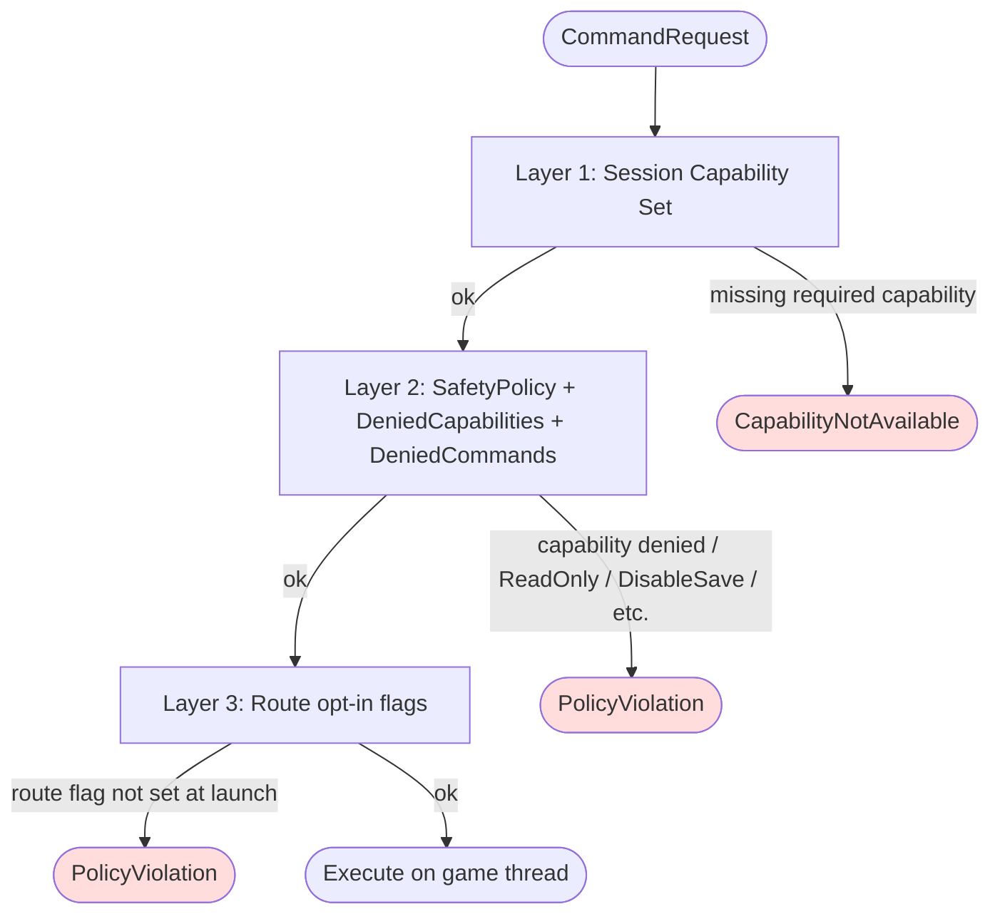
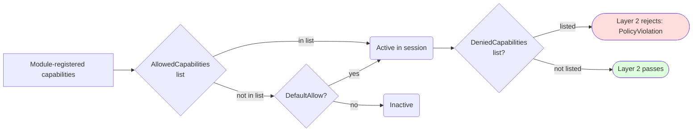

**[日本語](../ja/safety.md)** | [Back to README](../../README.md)

# Safety & Capabilities

UAIP applies per-command authorization in three layers. Understanding the layers helps you diagnose errors quickly and configure the right permissions for your workflow.

---

## Authorization layers

| Layer | Mechanism | Error on failure |
|---|---|---|
| 1 | Session's `FCapabilitySet` — per-session × per-command | `CapabilityNotAvailable` |
| 2 | `FSafetyPolicy` bool switches / DeniedCapabilities — process-wide | `PolicyViolation` |
| 3 | Route-specific opt-in (e.g. scenario route) — process-wide | `PolicyViolation` |


```mermaid
flowchart TB
    Cmd([CommandRequest])
    L1[Layer 1: Session Capability Set]
    L2[Layer 2: SafetyPolicy + DeniedCapabilities + DeniedCommands]
    L3[Layer 3: Route opt-in flags]
    Exec([Execute on game thread])

    Cmd --> L1
    L1 -- "missing required capability" --> E1([CapabilityNotAvailable])
    L1 -- ok --> L2
    L2 -- "capability denied / ReadOnly / DisableSave / etc." --> E2([PolicyViolation])
    L2 -- ok --> L3
    L3 -- "route flag not set at launch" --> E3([PolicyViolation])
    L3 -- ok --> Exec

    style E1 fill:#fdd
    style E2 fill:#fdd
    style E3 fill:#fdd
```

`AllowedCapabilities` and `DeniedCapabilities` interact at Layer 1 / 2 with **deny-wins** semantics:


```mermaid
flowchart LR
    Reg[Module-registered capabilities] --> Allow{"AllowedCapabilities<br/>list"}
    Allow -- "in list" --> Active(Active in session)
    Allow -- "not in list" --> S1{"DefaultAllow?"}
    S1 -- yes --> Active
    S1 -- no --> X1(Inactive)
    Active --> Deny{"DeniedCapabilities<br/>list?"}
    Deny -- "listed" --> Final([Layer 2 rejects: PolicyViolation])
    Deny -- "not listed" --> OK([Layer 2 passes])
    style Final fill:#fdd
    style OK fill:#dfd
```

---

## Capability reference

Each command declares the capabilities it requires. A command runs only when the session holds every required capability. Capabilities are either **DefaultAllow** (granted automatically) or **DefaultDenied** (must be explicitly enabled in `Config/DefaultUAIP.ini`).

Capabilities marked 🧩 require an optional plugin. If that plugin is not enabled in your `.uproject`, the capability is never registered and commands that require it return `CommandNotFound`.

---

### DefaultAllow capabilities

These are active in every session without any configuration. They cover read-only observation and common non-destructive operations.

| Capability | What it unlocks |
|---|---|
| `EditorObservation` | Screenshots (`CaptureActiveWindowImage`, `CaptureEditorTabImage`, `CaptureGraphViewportImage`) and JSON state dumps (`DumpEditorState`, `DumpSlateTree`, `DumpSelectionState`, `DumpOutputLog`, `DumpMessageLog`, etc.) |
| `EditorInspect` | Read-only inspection of editor state — assets, details panel, viewport, graph info. Used by shared infrastructure commands |
| `EditorUIAutomation` | UI-driving commands — `ClickWidget`, `SelectMenuItem`, `InputText`, `SetCheckboxState`, `DragGraphNode`, `AcceptDialog`, `CancelDialog`, `InvokeContextMenuAction`, `WaitForWidget`, `FillForm`, etc. |
| `EditorWorkspaceControl` | Tab and panel management — open/close tabs, focus graph editors, manage editor layout |
| `EditorLifecycle` | Editor lifecycle operations — `SaveAll`, `ShutdownEditor`, `RestartEditor` |
| `EditorExecution` | Run Automation Tests and Editor Utility Blueprints from the editor |
| `LiveCoding` | Hot-reload and Live Coding compilation trigger |
| `CrashReportRead` | Access to crash report diagnostic information |
| `AssetCreate` | Create new assets in the Content Browser |
| `AssetMutate` | Modify existing asset properties |
| `AssetWindowControl` | Open and close asset editors |
| `PIEControl` | PIE session control — `StartPIE`, `StopPIE`, `PausePIE`, `ResumePIE`, `LoadMap` |
| `RuntimeInspect` | Read-only inspection of runtime world state — `DumpWorldState`, `DumpActorState`, `DumpComponentState`, `DumpRuntimeLog`, `CapturePerformanceSnapshot` |
| `RuntimeCapture` | Runtime captures — `CaptureViewportImage`, `CheckpointCapture` |
| `RuntimeExecution` | Run functional tests and automation tests in PIE or Standalone |
| `RuntimeGASInspect` 🧩 | Read GAS state during PIE — `GetAttributeValues`, `GetActiveEffects`, `GetGrantedAbilities`, `GetActiveTags`, `FindAttributeSetClasses` (requires `GameplayAbilities` plugin) |
| `RuntimeNiagaraInspect` 🧩 | Read Niagara component state during PIE — `GetUserVariables`, `GetVariable` (requires `Niagara` plugin) |
| `SandboxObserve` 🧩 | Observe the active sandbox — `GetSandboxStatus`, `GetSandboxChanges` (requires `FileSandbox` plugin) |
| `RuntimeInsightsInspect` | Read-only inspection of Unreal Insights tracing — `ListTraceChannels`, `GetTraceStatus`, `ListTraceFiles`. Does not allow starting, stopping or otherwise altering a trace |

---

### DefaultDenied capabilities

These must be explicitly enabled by adding `+AllowedCapabilities=<name>` entries to `[UAIP.SafetyPolicy]` in `Config/DefaultUAIP.ini`. They cover destructive or significant editing operations.

#### Blueprint & Anim Blueprint editing

| Capability | What it unlocks |
|---|---|
| `BlueprintEdit` | Compile Blueprint assets and inspect their structure |
| `BlueprintVariableEdit` | Add, remove, and modify Blueprint variables |
| `BlueprintGraphEdit` | Add, delete, and connect nodes in Blueprint event graphs |
| `BlueprintComponentEdit` | Add, remove, rename, reparent, duplicate, and edit properties of Blueprint SCS components |
| `AnimBlueprintGraphEdit` | Add, delete, and connect nodes in AnimGraph; compile Anim Blueprints |
| `AnimStateMachineEdit` | Add and remove States and Transitions in Anim State Machines |

#### Level / Actor / Property editing

| Capability | What it unlocks |
|---|---|
| `EditorActorEdit` | Spawn, delete, and set transforms of actors in the Level Editor |
| `EditorLevelLoad` | Open and create levels in the editor viewport |
| `EditorViewportControl` | Control the level editor viewport camera — `FocusOnActors`, `GetCameraTransform`, `SetCameraTransform` |
| `PropertyEdit` | Read and write actor / asset properties via the Details panel (`GetActorProperty`, `SetActorProperty`, `GetAssetProperty`, `SetAssetProperty`, etc.) |
| `ProjectConfigEdit` | Read and write project settings (`GetProjectSetting`, `SetProjectSetting`) |
| `EditorUndoRedo` | Undo and redo editor operations |

#### Asset management

| Capability | What it unlocks |
|---|---|
| `AssetDelete` | Permanently delete assets |
| `FolderDelete` | Permanently delete content folders |
| `AssetFolderRefactor` | Move and rename assets and folders |
| `RedirectorFixup` | Fix up stale asset redirectors |
| `ShaderCompilation` | Control shader compilation and query its status |
| `ContentBrowserNavigate` | Navigate the Content Browser and select assets — `SelectAssets`, `SetContentBrowserPath` (native and bridge) |
| `PrimaryAssetTypeAdd` | Add a `PrimaryAssetType` to `PrimaryAssetTypesToScan` (`AddPrimaryAssetType`, persisted to `DefaultGame.ini`) |
| `PrimaryAssetTypeRemove` | Remove a `PrimaryAssetType` from `PrimaryAssetTypesToScan` (`RemovePrimaryAssetType`, persisted) |
| `PrimaryAssetRulesOverride` | Temporarily override a `PrimaryAssetId`'s rules in memory (`SetPrimaryAssetRules`, not persisted) |
| `PrimaryAssetLoad` | Explicitly load `PrimaryAsset`s into memory (`LoadPrimaryAsset`) |
| `PrimaryAssetUnload` | Explicitly unload `PrimaryAsset`s from memory (`UnloadPrimaryAsset`) |

#### Material editing

| Capability | What it unlocks |
|---|---|
| `MaterialGraphEdit` | Add, delete, and connect nodes in Material graphs; compile materials |
| `MaterialParameterEdit` | Modify Material parameter values and defaults |
| `MaterialCustomNodeEdit` | Edit custom HLSL expression nodes in Material graphs |

#### DataTable editing

| Capability | What it unlocks |
|---|---|
| `DataTableRowEdit` | Add and modify rows in DataTable assets |
| `DataTableRowDelete` | Delete rows from DataTable assets |
| `DataTableImport` | Import CSV/JSON data into DataTable assets |

#### Physics Asset editing

| Capability | What it unlocks |
|---|---|
| `PhysicsAssetEdit` | Add, delete, and modify shapes and constraints in Physics Assets |
| `PhysicsBodyEdit` | Add and delete Physics Asset bodies; edit per-body properties (PhysicsMode, MassScale, CollisionProfile, Damping, Offset) |

#### Skeleton / SkeletalMesh editing

| Capability | What it unlocks |
|---|---|
| `SkeletonAssetEdit` | Add, remove, and modify sockets, virtual bones in Skeleton assets |
| `SkeletalMeshMaterialEdit` | Assign and replace material slots on Skeletal Meshes |

#### Motion Matching / Pose Search editing

| Capability | What it unlocks |
|---|---|
| `PoseSearchAssetEdit` 🧩 | Add, remove, reorder, and configure channels and compatible skeletons in PoseSearch Schema assets; add and remove animations, set database schema, animation settings, and Normalization Set membership on PoseSearch Database assets; start database index builds (requires `PoseSearch` plugin) |

#### MetaHuman character editing

These capabilities all require the `MetaHumanCharacter` plugin. They are split by risk profile rather than by command count — creating an asset, reading a file off disk, starting a minutes-long synthesis job, sending data to an external service, and running a build that deletes assets on failure each deserve a separate decision.

| Capability | What it unlocks |
|---|---|
| `MetaHumanAssetCreate` 🧩 | Create new MetaHuman character assets — `CreateMetaHumanCharacter` native and `Toolset.Editor.MetaHuman.Create` bridge. The generic `UAIP.Editor.Assets.CreateAsset` command is also blocked for `UMetaHumanCharacter` (and any subclass) unless this capability is granted, so the DefaultAllow `AssetCreate` capability cannot be used to bypass it |
| `MetaHumanEdit` 🧩 | Every local mutation of an existing character — body constraints and shape, skin, eyes, makeup, head model and face evaluation settings, face sculpting and landmark editing, conforming and fitting, wardrobe slot assignment, preview viewport settings, build prerequisite checks and state polling, and `ReleaseEditSession` — plus the reads that require an edit session and therefore cannot declare themselves read-only. Also gates every `Toolset.Editor.MetaHuman.*` bridge command except `Create` |
| `MetaHumanFileImport` 🧩 | Read a face DNA file from the OS file system — `ImportFaceFromDna`, `FitFaceFromBodyWithEyesTeethDna`. Gated separately from ordinary edits because the imported file is untrusted binary handed to an engine parser |
| `MetaHumanTextureSynthesis` 🧩 | Start high resolution face texture synthesis — `RequestTextureSources`. Runs for minutes and writes its results to disk, so it is not granted along with ordinary parameter edits |
| `MetaHumanCloudRigging` 🧩 | Start face rig generation — `RequestAutoRigging`. ⚠️ This is the only command in the module that sends character data to an external service (Epic's cloud rigging service), so it is always an explicit decision |
| `MetaHumanBuild` 🧩 | Run the MetaHuman asset build pipeline — `BuildMetaHuman`. Blocks the game thread for the whole build and deletes the assets it created when the build fails, so it carries both a responsiveness and a destructive aspect |

#### UMG / Widget editing

| Capability | What it unlocks |
|---|---|
| `WidgetTreeEdit` | Add, remove, and reparent widgets in UMG Widget Blueprints |
| `WidgetVariableEdit` | Add and remove widget variables |
| `WidgetAnimationEdit` | Create Widget Animations and add animation tracks |
| `WidgetBindingEdit` | Add and remove property bindings |

#### Sequencer editing

| Capability | What it unlocks |
|---|---|
| `SequencerStructureEdit` | Add / remove tracks and sections; set playback range |
| `SequencerKeyframeEdit` | Add, delete, and edit keyframes on Sequencer channels |
| `SequencerBindingEdit` | Add and remove actor Possessable bindings in Level Sequences |
| `SequencerPlaybackControl` | Control Sequencer playback state (Play, Pause, SetPlayheadFrame, SetPlaybackSpeed, SetLoopMode) |
| `SequencerPropertyEdit` | Read and write `UMovieSceneSection` properties |

#### ControlRig editing

| Capability | What it unlocks |
|---|---|
| `ControlRigHierarchyEdit` | Add / remove / transform Control elements, bones, and nulls in the ControlRig hierarchy |
| `ControlRigGraphEdit` | Add, delete, and connect nodes in RigVM graphs; compile ControlRigs |
| `ControlRigBlueprintCreate` | Create ControlRigBlueprint assets via `CreateAsset` |

#### AI systems

| Capability | What it unlocks |
|---|---|
| `BehaviorTreeGraphEdit` | Add and remove Behavior Tree nodes; set node properties |
| `BlackboardEdit` | Add and remove Blackboard keys |

#### StateTree editing

| Capability | What it unlocks |
|---|---|
| `StateTreeStructureEdit` | Add / remove States; compile StateTree assets |
| `StateTreeNodeEdit` | Add / remove Tasks and Transitions; edit node properties |

#### SoundCue editing

| Capability | What it unlocks |
|---|---|
| `SoundCueGraphEdit` | Add, delete, and connect nodes in SoundCue graphs; edit properties; compile SoundCues |

#### Sound asset editing

| Capability | What it unlocks |
|---|---|
| `SoundClassEdit` | Set SoundClass asset properties; add and remove child classes (`SetSoundClassSettings`, `AddSoundClassChild`, `RemoveSoundClassChild`) |
| `SoundAttenuationEdit` | Set FSoundAttenuationSettings fields on SoundAttenuation assets (`SetSoundAttenuationSettings`) |
| `SoundMixEdit` | Set SoundMix properties; add, update, and remove SoundClassAdjuster entries (`SetSoundMixSettings`, `SetSoundMixAdjuster`, `RemoveSoundMixAdjuster`) |

#### MVVM editing

| Capability | What it unlocks |
|---|---|
| `ViewModelBindingEdit` | Add / remove / update View Bindings and View Events on WidgetBlueprints; add / remove ViewModel properties (`AddViewBinding`, `RemoveViewBinding`, `UpdateViewBinding`, `SetViewBindingEnabled`, `SetViewBindingConversionFunction`, `SetViewBindingExecutionMode`, `AddViewEvent`, `RemoveViewEvent`, `AddViewModelProperty`, `RemoveViewModelProperty`) |
| `ViewModelSourceEdit` | Wire and manage ViewModel connections in WidgetBlueprints (`AddViewModelToWidget`, `RemoveViewModelFromWidget`, `RenameViewModelInWidget`, `ReparentViewModelInWidget`, `SetViewModelSource`) |

#### Curve editing

| Capability | What it unlocks |
|---|---|
| `CurveKeyEdit` | Add, delete, and edit keys (value, interpolation, tangents) on UCurveFloat / UCurveVector / UCurveLinearColor |

#### Gameplay systems

| Capability | What it unlocks |
|---|---|
| `GameplayTagEdit` | Add, remove, and rename tags in project tag tables |
| `GameplayTagRestrictedEdit` | Modify restricted tag lists |
| `GameFeatureCreate` 🧩 | Create and scaffold GameFeature Plugin definitions (requires `GameFeatures` + `GameFeaturesEditor` plugins) |
| `GameplayCueMutation` 🧩 | Add / remove GameplayCue tags, create GameplayCueNotify assets, execute Cues on actors (requires `GameplayAbilities` plugin) |
| `EnhancedInputEdit` | Edit Input Action / Input Mapping Context assets — add / remove / modify mappings, modifiers, and triggers |

#### Editor operations

| Capability | What it unlocks |
|---|---|
| `EditorKeyboardInput` | Simulate keyboard input to editor UI widgets (`PressKey`) |
| `EditorExecCommand` | Execute low-level editor commands via `GUnrealEd->Exec` |
| `LogVerbosityEdit` | Change log verbosity levels — `SetLogVerbosity` native and `Toolset.Editor.Toolset.Logs.SetVerbosity` bridge |
| `ViewportAnnotationCapture` | Capture annotated viewport images with world-coordinate labels — `CaptureViewportImageAnnotated` |

#### Script execution

| Capability | What it unlocks |
|---|---|
| `ScriptExecution` 🧩 | Run Python scripts in the editor (`RunEditorPythonScript`; requires `PythonScriptPlugin`) |
| `PythonCommandExecution` 🧩 | Execute dynamically registered `@uaip_command` Python commands (requires `PythonScriptPlugin`) |
| `PythonExtensionReload` 🧩 | Rescan and reload registered Python commands (`ReloadPythonCommands`; requires `PythonScriptPlugin`) |

#### Runtime — restricted operations

| Capability | What it unlocks |
|---|---|
| `RuntimeCVarRead` | Read engine-wide CVar values — `UAIP.Runtime.Engine.CVar.GetConsoleVariable`, `SearchConsoleVariables` (owned by `UAIPRuntimeEngineManagement`) |
| `RuntimeCVarWrite` | Set or reset CVar values — `UAIP.Runtime.Engine.CVar.SetConsoleVariable`, `ResetConsoleVariable` (sensitive names and `ECVF_ReadOnly` CVars are rejected; `ECVF_Cheat` CVars additionally require the `AllowCheatCVarWrite` SafetyPolicy switch; owned by `UAIPRuntimeEngineManagement`) |
| `CVarInspect` | Search CVars with sensitive-pattern filtering — `Toolset.Editor.Toolset.EngineManagement.SearchCVars` bridge (owned by `UAIPEditorEngineManagement`) |
| `RuntimeActorManipulation` | Spawn, destroy, teleport, and possess actors during PIE |
| `RuntimeExecCommand` | Execute console commands at runtime via `UWorld` |
| `RuntimeInputInjection` | Inject keyboard / Enhanced Input / legacy input events into PIE (`InjectInputKey`, `InjectEnhancedInputAction`, `AddMappingContext`, `SetInputMode`, `FlushInput`, …) |
| `RuntimeNiagaraMutation` 🧩 | Set Niagara user variables / replace Niagara system at runtime (`SetVariable`, `SetSystem`; requires `Niagara` plugin) |
| `GauntletExecution` | Launch Gauntlet automated test sessions |

#### Runtime Insights trace capture

Unreal Insights tracing is split into four capabilities because reading the state of tracing, altering it, taking the raw capture file, and analysing a capture are four different decisions.

| Capability | What it unlocks |
|---|---|
| `RuntimeInsightsControl` | Start, stop, pause and resume a trace, mutate its channel set, and write bookmarks and regions into it — `StartTrace`, `StopTrace`, `PauseTrace`, `ResumeTrace`, `SetTraceChannels`, `AddTraceBookmark`, `BeginTraceRegion`, `EndTraceRegion` |
| `RuntimeInsightsAttachTraceFile` | Hand the captured `.utrace` file itself over as an artifact (`StopTrace` with `AttachTraceFile: true`). Gated separately from `RuntimeInsightsControl`, and never required to *stop* a trace — a session without it can always stop cleanly, the file is simply skipped |
| `RuntimeInsightsAnalyze` | Analyse a captured trace and read the extracted sections — `AnalyzeTrace`, `GetTraceAnalysisStatus`, `GetTraceAnalysisResult`. Only registered in builds where trace analysis is supported |

> ⚠️ **Taking the `.utrace` file discloses more than any channel setting suggests.**
> The full process command line — absolute paths, the user name and every launch option — is written through an always-on internal channel that can neither be listed nor turned off. It is therefore present in **every** trace file regardless of which channels were recorded, and setting `AllowLogDump=False` does **not** prevent it. This is the reason `RuntimeInsightsAttachTraceFile` exists as its own DefaultDenied capability.
> The analysis commands are not equivalent: the `Diagnostics` section reports a sanitised command line, so an analysis result and the raw `.utrace` disclose different things.

**Channel disclosure gating.** Trace channels are classified by what they can disclose (log text, host paths, screen content, network data, asset structure, code structure, or nothing beyond timings). `StartTrace` is rejected with `PolicyViolation` when the effective channel set records log text and `AllowLogDump` is false, so Insights cannot be used to route around the flag that gates `DumpOutputLog`.

Attaching the raw file is then decided per disclosure class, on top of the `RuntimeInsightsAttachTraceFile` capability:

| What the recorded channels could disclose | What has to be set for the file to be attached |
|---|---|
| Nothing beyond timings, asset structure, code structure | Nothing — the analysis sections report these unredacted anyway, so the file discloses nothing they do not |
| Log text (`log`, `bookmark`, `region`) | `AllowLogDump` — the same flag that decides whether those channels may record at all and whether the matching analysis sections may be extracted |
| Host paths (`file`, `cook`), screen content (`screenshot`), network addresses (`net`) | `AllowDisclosingTraceAttachment` — the analysis sections sanitise, mask or reduce these to metadata, and the raw file does none of that |
| A channel this build does not classify | Refused whatever is set — nothing knows what such a channel records, so no setting can speak for it |

Attaching is refused regardless of those settings for a channel set that was mutated while recording, for a trace recovered as an orphan, and for files larger than 64 MB.

> ⚠️ **In the editor, attaching normally needs both flags.** The engine enables `cpu`, `gpu`, `frame`, `log`, `bookmark`, `screenshot` and `region` at editor startup even without a `-trace` argument, so virtually every trace captured in the editor carries both log text and screen content. UAIP will not turn those channels off for you — channel state is process-global and disabling them would break a measurement someone else set up. Set **both** `AllowLogDump=True` and `AllowDisclosingTraceAttachment=True` if you want the `.utrace` file itself.
>
> `StartTrace` says so up front rather than letting you find out after several hundred megabytes: when the channels that would be recording carry something the policy withholds the raw file for, its `Data.Warnings[]` contains an `AttachDisabledByPolicy` entry naming those channels and the setting that would allow them. `StopTrace` still succeeds in that case — it reports `AttachSkippedReason: "DisclosureChannelPolicy"` instead of returning the file, so a cleanup step never fails and leaves a trace running.

> ⚠️ **The channel set is sampled about once per second.** A channel enabled and disabled again inside that window can be missed, which is precisely why attaching the raw file is gated by its own capability rather than by the observed channel set alone. Treat the polling loop as a safety net, not as a guarantee.

**Scope of the network-destination restriction.** No command in this module can send a trace to a network destination — the connection type is hard-coded to a file inside UAIP's own trace directory, and no parameter exposes it. The `trace.` console prefix is additionally on the `ExecuteConsoleCommand` deny-list, so `Trace.Send` / `Trace.Start` / `Trace.Enable` cannot be reached through that command. That deny-list covers one route, not every route: an editor with `PythonScriptPlugin` enabled can still reach the same console commands through `RunEditorPythonScript`, which is why `ScriptExecution` is a capability of its own. Read this as "no command here sends a trace to the network", not as "nothing in the editor can".

**Analysing traces captured outside UAIP.** By default `AnalyzeTrace` only accepts a file name that `ListTraceFiles` reported, which keeps it inside UAIP's own trace directory. To analyse a `.utrace` produced by a packaged build, another machine or a CI run, **both** of these must be set in `[UAIP.SafetyPolicy]`:

```ini
AllowExternalTraceAnalysis=True
ExternalTraceDirectory=D:/TraceDrop
```

Either one alone opens nothing. The path passed as `ExternalTracePath` is then required to resolve inside that directory.

> ⚠️ **Symbolic links and junctions are not resolved.** A link placed inside `ExternalTraceDirectory` that points somewhere else is followed. Point `ExternalTraceDirectory` at a directory kept for UAIP alone — not at a shared drop location, a user profile folder, or the project directory.

> **This is a scope limitation, not a structural guarantee.** `RunEditorPythonScript` still reaches the engine's trace system directly — Python execution is a known path around the capability layer, and it is managed by the capabilities that command requires (`EditorExecution` plus `ScriptExecution`, which is DefaultDenied) rather than by anything in this module. `GetTraceStatus` can report a networked destination such as `TracingToServer`; that is observability of something else's trace, not something UAIP can produce.

#### Optional graph editors

These capabilities depend on specific optional plugins. If the plugin is not enabled, the capability is never registered.

| Capability | Plugin required | What it unlocks |
|---|---|---|
| `MetaSoundGraphEdit` 🧩 | `Metasound` | Add, delete, and connect nodes in MetaSound graphs |
| `DataflowGraphEdit` 🧩 | `Dataflow` | Add, delete, and connect nodes in Dataflow graphs; get/set node properties |
| `ClothAssetEdit` 🧩 | `ChaosClothAsset` | Create/convert Chaos Cloth Assets, create legacy Clothing Assets, bind/unbind them to Skeletal Mesh sections, set Weight Map vertex values, and set Import node mesh references (all destructive operations) |
| `PCGGraphEdit` 🧩 | `PCG` | Add, delete, connect, and reposition nodes; edit graph/instance parameters; manage comment boxes and subgraph nodes in PCG graphs |
| `PCGCustomNodeEdit` 🧩 | `PCG` | Write properties on C++ custom PCG nodes (`SetCustomCppPCGNodeProperty`) |
| `PCGBlueprintNodeEdit` 🧩 | `PCG` | Write properties on Blueprint custom PCG nodes — Class CDO and per-Instance modes (`SetCustomBlueprintPCGNodeProperty`) |
| `PCGGraphAssetCreate` 🧩 | `PCG` | Create new UPCGGraph assets (`CreatePCGGraph`) |
| `PCGGraphExecute` 🧩 | `PCG` | Fire-and-forget PCG graph execution without an actor (`RunPCGInstantGraph`) |
| `PCGVolumeSpawn` 🧩 | `PCG` | Spawn APCGVolume actors into the world (`SpawnPCGGraphInstance`) — ⚠️ do not add to `AllowedCapabilities` in DefaultUAIP.ini (world mutation risk) |
| `PCGNodeInspect` 🧩 | `PCG` | Inspect PCG node execution data views (`GetPCGNodeDataView`) — only functional when `PCG_PROFILING_ENABLED=1` |
| `PCGToolsetUnsafeNodeAdd` 🧩 | `PCG` + `PCGToolset` | Bypass the node-type allowlist guard in `Toolset.Editor.PCG.AddNode` — ⚠️ do not add to `AllowedCapabilities` in DefaultUAIP.ini (allowlist bypass risk) |
| `ConversationGraphEdit` 🧩 | `CommonConversation` | Structurally edit `UConversationDatabase` assets |
| `EQSAssetEdit` 🧩 | `EnvironmentQueryEditor` | Add / remove EQS Generators and Tests; set their properties |
| `WorldConditionStructureEdit` 🧩 | `WorldConditions` | Add and remove conditions in WorldCondition assets |
| `WorldConditionNodeEdit` 🧩 | `WorldConditions` | Edit WorldCondition operator, expression depth, and properties |

#### Semantic search

| Capability | Plugin required | What it unlocks |
|---|---|---|
| `SemanticSearchEdit` 🧩 | `SemanticSearch` (UE 5.8+) | Trigger and cancel semantic index rebuilds — `StartIndexing`, `CancelIndexing` |

#### Niagara editing

These capabilities all require the `Niagara` plugin.

| Capability | What it unlocks |
|---|---|
| `NiagaraAssetCreate` 🧩 | Create Niagara System and Parameter Collection assets |
| `NiagaraBlueprintCreate` 🧩 | Generate Blueprint wrapper classes from Niagara Systems and Components |
| `NiagaraEmitterEdit` 🧩 | Add, remove, and configure emitters in Niagara Systems |
| `NiagaraStackEdit` 🧩 | Add / remove modules and set stack input parameters on Niagara emitters |
| `NiagaraStackAutoFix` 🧩 | Automatically resolve Niagara stack diagnostic issues |

#### World Partition editing

| Capability | What it unlocks |
|---|---|
| `WorldPartitionEdit` | Modify World Partition settings — `SetWorldPartitionStreamingEnabled`, `SetRuntimeGridSettings`, `SetActorIsSpatiallyLoaded`, `SetActorRuntimeGrid`, `PinActorInWorldPartition`, `UnpinActorFromWorldPartition` |
| `DataLayerEdit` | Create, delete, and modify Data Layer assets and instances — `CreateDataLayerAsset`, `DeleteDataLayerAsset`, `CreateDataLayerInstance`, `DeleteDataLayerInstance`, `SetDataLayerType`, `SetDataLayerInitialRuntimeState`, `SetDataLayerIsLoadedInEditor`, `SetDataLayerVisibility`, `SetParentDataLayerInstance`, `AddActorToDataLayer`, `RemoveActorFromDataLayer` |
| `HLODBuild` | Build and manage HLOD data — `CreateHLODLayer`, `DeleteHLODs`, `SetActorHLODLayer`, `BuildHLODs`, `CancelHLODBuild` |

#### Foliage editing

| Capability | What it unlocks |
|---|---|
| `FoliageTypeEdit` | Register and configure foliage types on a level — `AddFoliageTypeToLevel`, `RemoveFoliageTypeFromLevel`, `SetFoliageTypeSettings` |
| `FoliageInstanceEdit` | Add and remove individual foliage instances — `AddFoliageInstances`, `RemoveFoliageInstances`, `ResimulateProceduralFoliage` |
| `FoliageBulkDelete` | Delete all instances of a foliage type at once — `DeleteAllFoliageInstances` |

#### ConfigSettings editing

| Capability | What it unlocks |
|---|---|
| `ConfigSettingsEdit` | Modify Project Settings / Editor Preferences and write raw ini keys — `SetSettingsValues` (also required for `DryRun` calls), `SetConfigValue` (runtime) |
| `ConfigSettingsSave` | Persist settings to disk via `ISettingsSection::Save()` — `SaveSettings` (blocked when `bDisableSave` is set) |
| `ConfigSettingsReset` | Revert settings to class defaults — `ResetSettingsToDefaults` |

#### Plugin management

Write commands for plugin state and descriptors. Engine and Marketplace plugins are always read-only regardless of capability. Write commands require an editor restart to take effect.

| Capability | What it unlocks |
|---|---|
| `PluginEnableToggle` | Enable or disable a project plugin — `SetPluginEnabled` native and `Toolset.Plugin.SetPluginEnabled` bridge. Always returns `RestartRequired: true`. ⚠️ GameFeature plugins are blocked regardless of this capability |
| `PluginDescriptorEdit` | Overwrite selected fields of a plugin's `.uplugin` file — `UpdatePluginDescriptor` native and `Toolset.Plugin.UpdatePluginDescriptor` bridge. Also required for `DryRun` calls |
| `PluginDependencyEdit` | Add or remove dependency entries in a plugin's `.uplugin` — `AddPluginDependency`, `RemovePluginDependency` native and their Toolset bridge counterparts |

#### Sandbox session management

These capabilities all require the `FileSandbox` plugin.

| Capability | What it unlocks |
|---|---|
| `SandboxSessionControl` 🧩 | Open and close FileSandbox sessions — `BeginSandboxSession`, `EndSandboxSession` |
| `SandboxPersist` 🧩 | Flush sandbox changes to disk — `CommitSandboxChanges` |
| `SandboxRevert` 🧩 | Discard pending sandbox changes — `RevertSandboxChanges` |

---

## Enabling DefaultDenied capabilities

Edit `Config/DefaultUAIP.ini` in your project and add one `+AllowedCapabilities` line per capability:

```ini
[UAIP.SafetyPolicy]
+AllowedCapabilities=BlueprintEdit
+AllowedCapabilities=BlueprintVariableEdit
+AllowedCapabilities=BlueprintGraphEdit
+AllowedCapabilities=EditorActorEdit
```

After editing, either restart the editor or (if `AllowCapabilityReload=True` is set) call:

```
uaip_execute(CommandName="UAIP.Core.ReloadCapabilities")
```

---

## SafetyPolicy settings

In addition to capability gates, `FSafetyPolicy` provides process-wide coarse switches. All default to `False`.

```ini
[UAIP.SafetyPolicy]
ReadOnly=False
DisableSave=False
AllowLogDump=False
AllowContextMenuMutation=False
AllowKeyboardInput=False
AllowKeyboardModifierInput=False
AllowPasswordFieldWrite=False
AllowInputModeBypass=False
DisablePIEStart=False
AllowCheatCVarWrite=False
AllowExternalTraceAnalysis=False
AllowDisclosingTraceAttachment=False

; Directory externally captured .utrace files may be analysed from.
; Has no default; AllowExternalTraceAnalysis alone opens nothing.
; ExternalTraceDirectory=D:/TraceDrop

; Lift DefaultDenied capabilities:
; +AllowedCapabilities=BlueprintEdit

; Remove DefaultAllow capabilities from sessions:
; +DeniedCapabilities=EditorUIAutomation

; Block specific commands by fully-qualified name:
; +DeniedCommands=UAIP.Editor.Level.PlaceActorInLevel

; Enable runtime capability reload without editor restart:
; AllowCapabilityReload=True
```

| Key | Default | Effect |
|---|---|---|
| `ReadOnly` | `False` | Reject mutating commands. The two editor lifecycle commands are the one exception — see below |
| `DisableSave` | `False` | Reject disk-writing commands |
| `AllowLogDump` | `False` | Allow `DumpOutputLog` / `DumpMessageLog` |
| `AllowContextMenuMutation` | `False` | Allow `InvokeContextMenuAction` |
| `AllowKeyboardInput` | `False` | Allow `PressKey` (also requires `EditorKeyboardInput` capability) |
| `AllowKeyboardModifierInput` | `False` | Allow Ctrl/Alt/Shift modifier keys inside `PressKey` |
| `AllowPasswordFieldWrite` | `False` | Allow `FillForm` to write into password fields |
| `AllowInputModeBypass` | `False` | Allow `BypassInputMode=true` in Inject commands |
| `DisablePIEStart` | `False` | Reject PIE startup |
| `AllowCheatCVarWrite` | `False` | Allow `SetConsoleVariable` / `ResetConsoleVariable` to write `ECVF_Cheat`-flagged CVars (also requires `RuntimeCVarWrite`) |
| `AllowExternalTraceAnalysis` | `False` | Allow `AnalyzeTrace` to read a `.utrace` captured outside UAIP. **Grants nothing on its own** — `ExternalTraceDirectory` must be set as well |
| `ExternalTraceDirectory` | unset | Root directory an externally captured `.utrace` must live under. ini only (no CLI override), and deliberately has no default |
| `AllowDisclosingTraceAttachment` | `False` | Allow `StopTrace` to hand a captured `.utrace` over as an artifact when its channels could have recorded **host paths, screen content or network addresses**. The analysis sections sanitise, mask or reduce those to metadata; the raw file does not, which is why handing it over is a separate decision. Disclosure of **log text** is governed by `AllowLogDump` instead, and an unclassified channel is refused whatever both are set to. Also requires the `RuntimeInsightsAttachTraceFile` capability. In the editor both this and `AllowLogDump` are normally needed, because the engine enables the log and screenshot channels by itself |
| `AllowedCapabilities` | empty | DefaultDenied capabilities to grant (one `+` entry per line) |
| `DeniedCapabilities` | empty | Remove DefaultAllow capabilities from all sessions |
| `DeniedCommands` | empty | Block commands by fully-qualified name |
| `AllowCapabilityReload` | `False` | Enable `UAIP.Core.ReloadCapabilities` for hot-reload of capability settings |

### ReadOnly and the editor lifecycle commands

What `ReadOnly` protects is **project data** — assets, levels, config files. Two commands are exempt from it and stay callable while `ReadOnly=True`: `UAIP.Editor.Workspace.ShutdownEditor` and `UAIP.Editor.Workspace.RestartEditor`. `ListCommands` and `DescribeCommand` report them as `Available: true` in that mode, matching what a dispatch actually does.

They are exempt because neither writes anything `ReadOnly` exists to protect; what they change is the lifetime of the editor process itself. Refusing them costs something that has nothing to do with safety: an editor launched with `ReadOnly=True` holds the policy in memory, so editing the ini back does not reach the running process, and with both lifecycle commands refused there is no supported way left to shut that editor down or restart it through UAIP at all.

The exemption removes the `ReadOnly` gate and nothing else:

- Both commands still require the `EditorLifecycle` capability, so `+DeniedCapabilities=EditorLifecycle` still takes them away from every session.
- `+DeniedCommands=UAIP.Editor.Workspace.ShutdownEditor` still blocks either of them by name. That is the switch to reach for when you want them gone but want the rest of `ReadOnly` left as it is.
- Their optional `SaveAll` is governed by `DisableSave`, not by `ReadOnly`, so `DisableSave=True` still stops them from writing packages to disk.

Every other mutating command is rejected under `ReadOnly` exactly as before. A handler has to declare the exemption for itself, it defaults to off, and no command other than these two declares it.

---

## Diagnosing errors

| ErrorCode | Diagnosis | Action |
|---|---|---|
| `CapabilityNotAvailable` | Session lacks the capability | Read the name from `ErrorMessage`; add it to `AllowedCapabilities` in the ini and restart (or call `ReloadCapabilities`) |
| `PolicyViolation: ... denied by SafetyPolicy` | SafetyPolicy ini flag is blocking | Set the corresponding flag to `True` in `[UAIP.SafetyPolicy]` and restart |
| `PolicyViolation: Scenario execution is not enabled` | Scenario route opt-in missing | Add `"enable_scenario": true` to `config.json` |
| `PolicyViolation: Command is denied` | Command is in `DeniedCommands` | Remove it from `DeniedCommands` in the ini |
| `CommandNotFound` for a 🧩 command | Optional plugin not enabled | Enable the required plugin in your `.uproject` and rebuild |

---

## Other ini sections

`[UAIP.SafetyPolicy]` is the only section covered on this page. The other ini sections (`[UAIP.Session]`, `[UAIP.ArtifactGC]`, `[UAIP.CommandNotification]`, `[UAIP.PythonExtension]`), along with every `-uaip-*` CLI launch flag and the MCP Bridge `config.json`, are documented in [Configuration](config.md).
