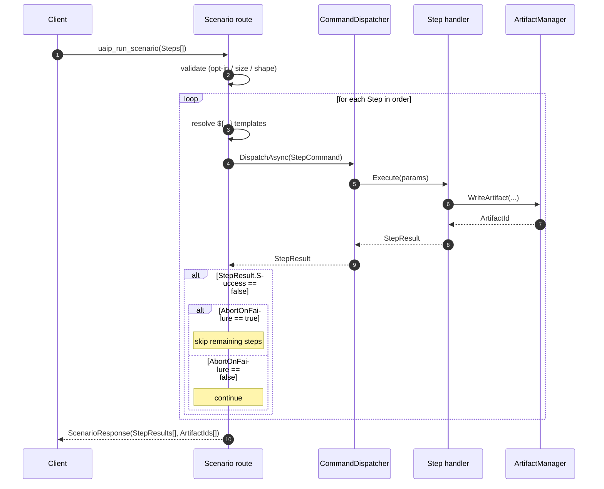
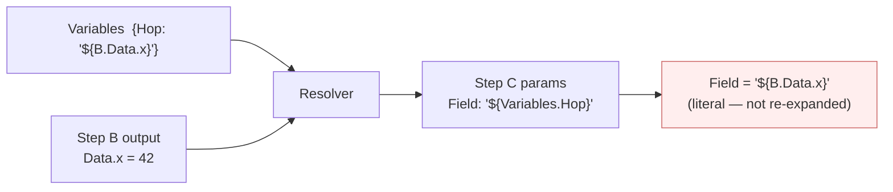

**[日本語](../ja/scenario.md)** | [Back to README](../../README.md)

# Scenario Execution

`uaip_run_scenario` submits an ordered list of commands as one request. Steps run in order on the game thread with per-step abort, retry, and timeout controls.

---

## Enabling scenarios

Scenario execution is disabled by default. Enable it by adding `"enable_scenario": true` to `config.json`:

```json
{
  "editor_path":    "...",
  "uproject_path":  "...",
  "enable_scenario": true
}
```

Reconnect the MCP client after saving.

---

## When to use a scenario

| Use single `uaip_execute` | Use `uaip_run_scenario` |
|---|---|
| One operation (screenshot, open asset) | Ordered procedure (LoadMap → PIE → capture → assert) |
| Read-only, no state transition | Later steps depend on earlier step output |
| Exploration — check result then decide | Need abort-on-failure, retry, or per-step timeout |

**Rule of thumb**: if you are about to call `uaip_execute` two or more times in a row, use a scenario instead.

---

## Execution flow



The scenario route never bypasses authorization — each step goes through the same `CommandDispatcher` and same capability + policy check as a direct `uaip_execute` call. See [Architecture](architecture.md) for the dispatch path.

---

## Invocation shape

```
uaip_run_scenario(
  ScenarioName="MyScenario",          # [A-Za-z0-9_]{1,128}
  SessionId="scenario-<purpose>",      # optional
  Variables={ "Key": "Value", ... },   # optional initial values
  Steps=[
    {
      "StepName":        "Load",        # [A-Za-z0-9_]{1,64}, unique
      "CommandName":     "UAIP.Runtime.PIE.LoadMap",
      "Params":          { "MapPath": "/Game/Maps/TestMap" },
      "AbortOnFailure":  true,          # default: true
      "RetryCount":      0,             # default: 0
      "TimeoutSeconds":  60             # default: 60
    },
    ...
  ]
)
```

---

## Template splicing `${...}`

Use `${StepName.Data.<path>}` to pass output from an earlier step into a later step's params.

| Expression | Meaning |
|---|---|
| `${StepName.Success}` | bool — true if the step succeeded |
| `${StepName.ErrorCode}` | string error code |
| `${StepName.Data.<JsonPointer>}` | Value inside the step's response data |
| `${StepName.Artifacts[0]}` | First artifact id of the step |
| `${Variables.<key>}` | Value from the `Variables` map |

Templates are resolved once before the step runs. They are **not** re-evaluated — a template inside `Variables` is passed as a literal string, not re-expanded.

### Single-pass resolution



If you want `Field` to actually receive `42`, reference `${B.Data.x}` directly from Step C's params instead of hopping through `Variables`.

---

## Response shape

```json
{
  "ScenarioId": "<uuid>",
  "Status": "Completed",
  "AllStepsSucceeded": true,
  "StepResults": [
    {
      "StepName": "Load",
      "Success": true,
      "ErrorCode": "Success",
      "ArtifactIds": ["..."]
    }
  ],
  "ArtifactIds": ["...", "..."]
}
```

| Status | Meaning |
|---|---|
| `Completed` | All steps succeeded |
| `Failed` | At least one step failed |
| `Aborted` | Scenario exceeded the 1800-second wall-clock cap |

---

## Hard limits

| Limit | Value |
|---|---|
| Max steps | 100 |
| Scenario wall-clock cap | 1800 seconds |
| Concurrent scenarios | 1 (returns `TooManyRequests` if another is running) |
| Payload size | 1 MiB total, 8 KiB per Params string |

---

## Example — full PIE validation flow

```json
{
  "ScenarioName": "PIE_HealthCheck",
  "Variables": { "ExpectedHp": 100 },
  "Steps": [
    { "StepName": "Load",   "CommandName": "UAIP.Runtime.PIE.LoadMap",
      "Params": { "MapPath": "/Game/Maps/TestMap" } },
    { "StepName": "Start",  "CommandName": "UAIP.Runtime.PIE.StartPIE", "Params": {} },
    { "StepName": "Settle", "CommandName": "UAIP.Runtime.Assertion.WaitSeconds",
      "Params": { "Seconds": 2 } },
    { "StepName": "Cap",    "CommandName": "UAIP.Runtime.Observation.CaptureViewportImage",
      "Params": {} },
    { "StepName": "Assert", "CommandName": "UAIP.Runtime.Assertion.AssertActorProperty",
      "Params": { "ActorIdentifier": "PlayerCharacter",
                  "PropertyName": "Health",
                  "ExpectedValue": "${Variables.ExpectedHp}" } },
    { "StepName": "Stop",   "CommandName": "UAIP.Runtime.PIE.StopPIE",
      "Params": {}, "AbortOnFailure": false }
  ]
}
```

Setting `AbortOnFailure: false` on the `Stop` step ensures PIE is always terminated even if an earlier step fails.

---

## Common failures

| Symptom | Cause | Fix |
|---|---|---|
| `PolicyViolation: Scenario execution is not enabled` | `enable_scenario` not set | Add `"enable_scenario": true` to `config.json` |
| Steps 2+ missing from `StepResults` | Step 1 failed with default `AbortOnFailure: true` | Set `"AbortOnFailure": false` on the failing step if you want to continue |
| Template left as literal `"${...}"` | Single-pass resolver — `Variables` are not re-expanded | Pass the value directly via `Variables` or split into two steps |
| `TooManyRequests` | Another scenario is running | Wait for it to finish |
