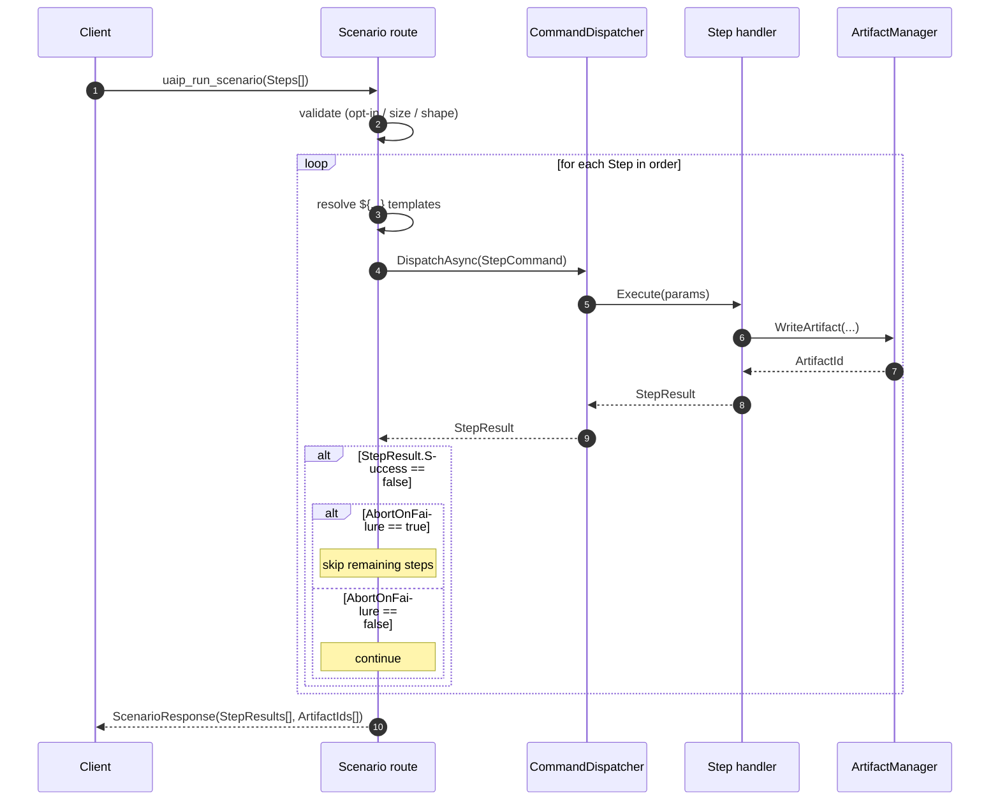
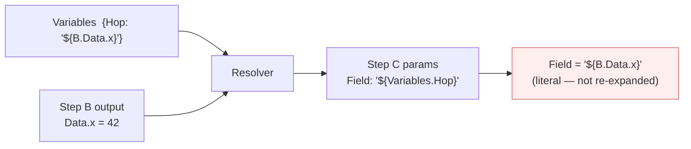

**[日本語](../ja/scenario.md)** | [Back to README](../../README.md)

# Scenario Execution

`uaip_run_scenario` submits an ordered list of commands as one request. Steps run in order on the game thread with per-step abort, retry, and timeout controls.

---

## Enabling scenarios

Scenario execution is disabled by default. Enable it by adding `"enable_scenario": true` to `config.json`:

```json
{
  "editor_path":    "...",
  "uproject_path":  "...",
  "enable_scenario": true
}
```

Reconnect the MCP client after saving.

---

## When to use a scenario

| Use single `uaip_execute` | Use `uaip_run_scenario` |
|---|---|
| One operation (screenshot, open asset) | Ordered procedure (LoadMap → PIE → capture → assert) |
| Read-only, no state transition | Later steps depend on earlier step output |
| Exploration — check result then decide | Need abort-on-failure, retry, or per-step timeout |

**Rule of thumb**: if you are about to call `uaip_execute` two or more times in a row, use a scenario instead.

---

## Execution flow


```mermaid
sequenceDiagram
    autonumber
    participant Cli as Client
    participant Sc as Scenario route
    participant Di as CommandDispatcher
    participant Hd as Step handler
    participant Ar as ArtifactManager

    Cli->>Sc: uaip_run_scenario(Steps[])
    Sc->>Sc: validate (opt-in / size / shape)

    loop for each Step in order
        Sc->>Sc: resolve ${...} templates
        Sc->>Di: DispatchAsync(StepCommand)
        Di->>Hd: Execute(params)
        Hd->>Ar: WriteArtifact(...)
        Ar-->>Hd: ArtifactId
        Hd-->>Di: StepResult
        Di-->>Sc: StepResult
        alt StepResult.Success == false
            alt AbortOnFailure == true
                Note over Sc: skip remaining steps
            else AbortOnFailure == false
                Note over Sc: continue
            end
        end
    end

    Sc-->>Cli: ScenarioResponse(StepResults[], ArtifactIds[])
```

The scenario route never bypasses authorization — each step goes through the same `CommandDispatcher` and same capability + policy check as a direct `uaip_execute` call. See [Architecture](architecture.md) for the dispatch path.

---

## Invocation shape

```
uaip_run_scenario(
  ScenarioName="MyScenario",          # [A-Za-z0-9_]{1,128}
  SessionId="scenario-<purpose>",      # optional
  Variables={ "Key": "Value", ... },   # optional initial values
  Steps=[
    {
      "StepName":        "Load",        # [A-Za-z0-9_]{1,64}, unique
      "CommandName":     "UAIP.Runtime.PIE.LoadMap",
      "Params":          { "MapPath": "/Game/Maps/TestMap" },
      "AbortOnFailure":  true,          # default: true
      "RetryCount":      0,             # default: 0
      "TimeoutSeconds":  60             # default: 60
    },
    ...
  ]
)
```

---

## Template splicing `${...}`

Use `${StepName.Data.<pointer>}` to pass output from an earlier step into a later step's params.

| Expression | Meaning |
|---|---|
| `${StepName.Success}` | bool — true if the step succeeded |
| `${StepName.ErrorCode}` | string error code |
| `${StepName.Data.<pointer>}` | Value inside the step's response data — see notation below |
| `${StepName.Data}` | The whole `Data` object |
| `${StepName.Artifacts[0]}` | First artifact id of the step |
| `${Variables.<key>}` | Value from the `Variables` map |

### JSON Pointer notation

The pointer body has **two accepted notations**, told apart by its first character:

| Notation | Trigger | Behaviour |
|---|---|---|
| **Strict** | Body starts with `/` | Read verbatim as an RFC 6901 JSON Pointer — `.` is never treated as a separator, so a key that itself contains `.` becomes addressable |
| **Lenient** | Body starts with anything else | `.` and `/` are both accepted as segment separators — this is how most existing scenarios are written |

Examples:

| Expression | Notation | Pointer | Result |
|---|---|---|---|
| `${S.Data.Result}` | lenient | `/Result` | The top-level `Result` field |
| `${S.Data.Result/0/refPath}` | lenient | `/Result/0/refPath` | Array element 0's `refPath` field |
| `${S.Data./refPath}` | strict | `/refPath` | Same field, written strictly |
| `${S.Data./a.b/0}` | strict | `/a.b/0` | Array element 0 under the key `a.b` — only reachable in strict notation, since lenient would split on the `.` |
| `${S.Data}` | — | *(empty)* | The whole `Data` object |
| `${S.Data./With~1Slash}` | strict | `/With~1Slash` | A field literally named `With/Slash` (`/` escaped as `~1`) |
| `${S.Data.With~0Tilde}` | lenient | `/With~0Tilde` | A field literally named `With~Tilde` (`~` escaped as `~0`) |

The `~1` / `~0` escapes are part of JSON Pointer semantics, not of the surface notation, so they apply the same way in **both** strict and lenient form. A key that itself contains `~` must be written as `~0`.

Additional constraints:

- **Object key matching is case-sensitive, exact match.** `refPath` does not match a field named `RefPath` or `REFPATH`.
- **Array indices** must be `0` or `[1-9][0-9]*` — no leading zeros (`01`), no sign (`+1`), no trailing characters (`1abc`), no leading whitespace.
- **Objects and arrays can only be spliced as a whole field.** Embedding one inside a larger string (e.g. `"prefix-${S.Data.SomeObject}"`) fails the step instead of silently rendering as an empty string.

Templates are resolved once before the step runs. They are **not** re-evaluated — a template inside `Variables` is passed as a literal string, not re-expanded.

### Template resolution failures

A malformed reference — unknown sub-identifier, empty pointer, invalid `~` escape, a pointer that doesn't match anything in the step's data, an oversized value, an object/array embedded in a mixed string, and so on — fails the step with `ErrorCode: InvalidParams`. This is **not retried**: `RetryCount` only applies to `ExecutionFailed`.

### Template size limits

| Limit | What it bounds | Enforced at |
|---|---|---|
| 64 KiB | One `Variables` entry's value | When the variable is stored |
| 8 KiB | One value spliced from `Step.Data` | Template resolution |
| 256 KiB | One step's whole Params payload, and the total resolved expansion | Submission, and again at resolution |

### Single-pass resolution


```mermaid
flowchart LR
    A["Variables &nbsp;{Hop: '${B.Data.x}'}"] --> R[Resolver]
    B["Step B output<br/>Data.x = 42"] --> R
    R --> C["Step C params<br/>Field: '${Variables.Hop}'"]
    C --> Result["Field = '${B.Data.x}'<br/>(literal — not re-expanded)"]
    style Result fill:#fee,stroke:#c66
```

If you want `Field` to actually receive `42`, reference `${B.Data.x}` directly from Step C's params instead of hopping through `Variables`.

---

## Response shape

```json
{
  "ScenarioId": "<uuid>",
  "Status": "Completed",
  "AllStepsSucceeded": true,
  "StepResults": [
    {
      "StepName": "Load",
      "Success": true,
      "ErrorCode": "Success",
      "ArtifactIds": ["..."]
    }
  ],
  "ArtifactIds": ["...", "..."]
}
```

| Status | Meaning |
|---|---|
| `Completed` | All steps succeeded |
| `Failed` | At least one step failed |
| `Aborted` | Scenario exceeded the 1800-second wall-clock cap |

---

## Hard limits

| Limit | Value |
|---|---|
| Max steps | 100 |
| Scenario wall-clock cap | 1800 seconds |
| Concurrent scenarios | 1 (returns `TooManyRequests` if another is running) |
| Payload size | 1 MiB total, 8 KiB per Params string |

---

## Example — full PIE validation flow

```json
{
  "ScenarioName": "PIE_HealthCheck",
  "Variables": { "ExpectedHp": "100" },
  "Steps": [
    { "StepName": "Load",   "CommandName": "UAIP.Runtime.PIE.LoadMap",
      "Params": { "MapPath": "/Game/Maps/TestMap" } },
    { "StepName": "Start",  "CommandName": "UAIP.Runtime.PIE.StartPIE", "Params": {} },
    { "StepName": "Settle", "CommandName": "UAIP.Runtime.Assertion.WaitSeconds",
      "Params": { "Seconds": 2 } },
    { "StepName": "Cap",    "CommandName": "UAIP.Runtime.Observation.CaptureViewportImage",
      "Params": {} },
    { "StepName": "Assert", "CommandName": "UAIP.Runtime.Assertion.AssertActorProperty",
      "Params": { "ActorIdentifier": "PlayerCharacter",
                  "PropertyName": "Health",
                  "ExpectedValue": "${Variables.ExpectedHp}" } },
    { "StepName": "Stop",   "CommandName": "UAIP.Runtime.PIE.StopPIE",
      "Params": {}, "AbortOnFailure": false }
  ]
}
```

Setting `AbortOnFailure: false` on the `Stop` step ensures PIE is always terminated even if an earlier step fails.

---

## Common failures

| Symptom | Cause | Fix |
|---|---|---|
| `PolicyViolation: Scenario execution is not enabled` | `enable_scenario` not set | Add `"enable_scenario": true` to `config.json` |
| Steps 2+ missing from `StepResults` | Step 1 failed with default `AbortOnFailure: true` | Set `"AbortOnFailure": false` on the failing step if you want to continue |
| Template left as literal `"${...}"` | Single-pass resolver — `Variables` are not re-expanded | Pass the value directly via `Variables` or split into two steps |
| Step fails with `InvalidParams` and a template-related message | Malformed `${...}` reference (wrong notation, bad escape, pointer miss, oversized value, object/array in a mixed string) | Re-read [JSON Pointer notation](#json-pointer-notation) above; this is not retried by `RetryCount` |
| `TooManyRequests` | Another scenario is running | Wait for it to finish |
