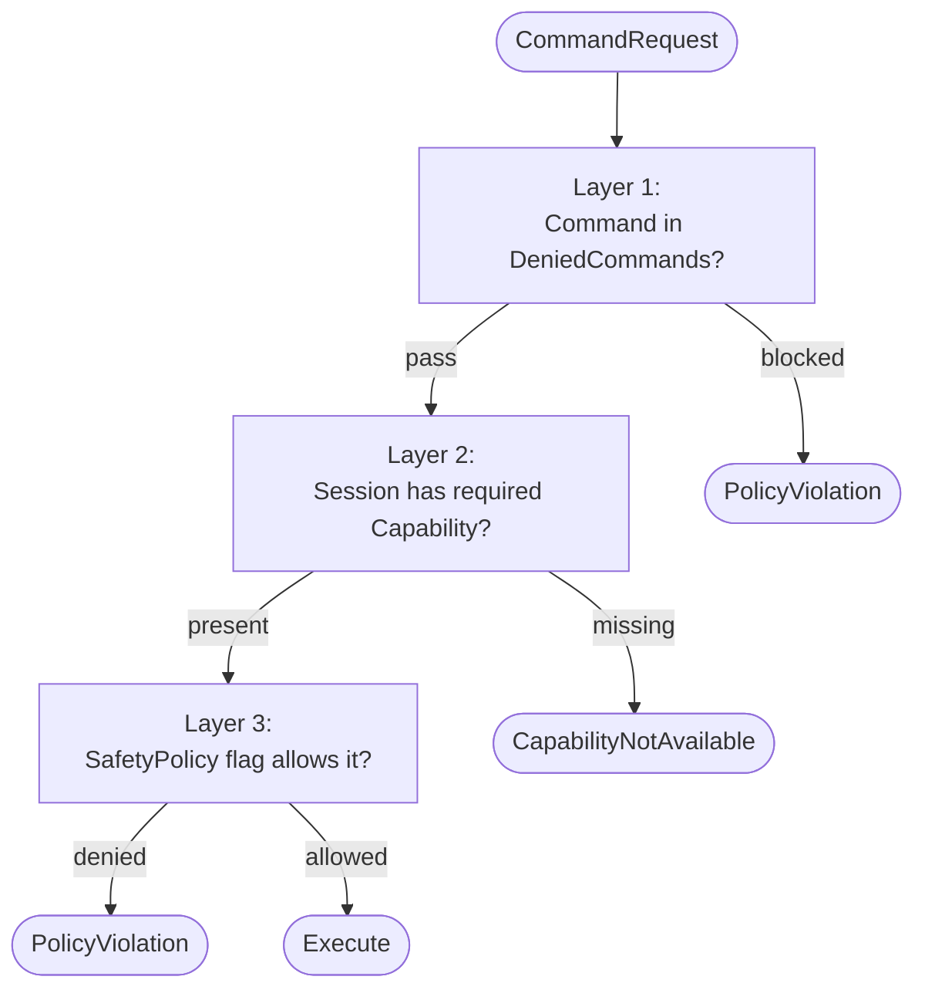

**[日本語](../ja/security.md)** | [Back to README](../../README.md)

# Security Model

UAIP exposes the UE editor and runtime to AI agents and external tools. This page describes the security boundaries: what UAIP allows by default, where the gates are, and what an operator needs to do to harden a deployment.

---

## Threat model

UAIP is designed for **developer machines and trusted internal CI**, not as a public-internet service. The threats it mitigates:

| Threat | Mitigation |
|---|---|
| Network attacker scanning ports | WebSocket binds to loopback; HTTP MCPOnly enforces localhost at the app layer (HTTP FullHTTP intentionally allows remote agents via token + firewall) |
| Local non-UAIP process invoking commands | Bearer token authentication on HTTP / WebSocket |
| AI hallucinating a destructive command | Capability gates (deny-by-default for edits) + per-command `IsReadOnly` flag |
| AI getting tricked into making a wide-scope change | SafetyPolicy can put the editor in process-wide read-only mode |
| File-path injection via response payload | Artifacts returned by ID; raw paths never leave the server |

The threats it does **not** mitigate:

- An attacker with shell access to the host can read `Saved/UAIP/EditorHttpAuthToken.txt` and impersonate the AI client. Treat the host as the trust boundary.
- A malicious project on the same machine that loads UAIP itself can register arbitrary commands. Don't load untrusted UAIP-bearing projects.
- Prompt-injection attacks against the AI client are out of scope for UAIP — they need to be addressed by the client itself.

---

## Network surface

| Component | Bind layer | App-layer filter | Auth | Reachable from another machine |
|---|---|---|---|---|
| HTTP transport — FullHTTP (`-uaip-http-enable`) | `0.0.0.0` | none | Bearer token | **Yes** (with token + firewall allowance — by design) |
| HTTP transport — MCPOnly (`-uaip-mcp-enable`) | `0.0.0.0` | 5-stage localhost enforcement (PeerAddress / Host / Origin) | none (localhost-only by design) | No |
| HTTP transport — `-uaip-http-no-auth` | `0.0.0.0` | none | none | Yes (development-only — never enable in production) |
| WebSocket transport (`-uaip-ws-enable`) | `127.0.0.1` (hard-coded) | ClientIP double-check | Bearer token (first frame) | No |
| MCP Bridge | stdio between AI client and bridge process | — | none — relies on host trust | — |
| CLI transport | none (in-process) | — | none | — |

Only WebSocket is bound to `127.0.0.1` at the socket layer. HTTP FullHTTP intentionally listens on `0.0.0.0` because it's designed to be reached by remote agents — access is gated by the Bearer token and your firewall. If you expose HTTP across machines, secure the token storage and lock down firewall rules at the operator level.

---

## Authentication

### HTTP / WebSocket Bearer Token

On startup, UAIP generates a 32-character random token and writes it to:

```
Saved/UAIP/EditorHttpAuthToken.txt
Saved/UAIP/EditorWsAuthToken.txt
```

Files are written with default OS permissions. Anyone with read access to `Saved/UAIP/` can impersonate a client — treat the editor user as the trust principal.

Token rotation happens automatically on every editor restart. To force rotation while the editor is running, delete the file and restart.

### Disabling auth (development only)

```
UnrealEditor.exe MyProject.uproject -uaip-http-enable -uaip-http-no-auth
UnrealEditor.exe MyProject.uproject -uaip-ws-enable -uaip-ws-no-auth
```

Use **only** on isolated dev machines or CI runners with no untrusted processes. HTTP's `-uaip-http-no-auth` keeps the socket on `0.0.0.0`, so the editor stays reachable from other machines if the firewall is open. WebSocket's `-uaip-ws-no-auth` keeps the socket on loopback, but any local process can still issue commands.

### MCP Bridge

MCP runs as a stdio child of the AI client, so authentication is whatever the AI client uses for its own MCP transport (typically none — it's already a child process). The bridge spawns the editor as its own child, so command flow is end-to-end local.

---

## Authorization

UAIP runs three independent authorization layers on every command:



### Layer 1 — Capability set

Each command declares required capabilities (`BlueprintEdit`, `PIEControl`, …). The session's capability set determines what it can call. DefaultAllow capabilities are granted automatically; DefaultDenied require an explicit `+AllowedCapabilities=<name>` in `Config/DefaultUAIP.ini`.

### Layer 2 — SafetyPolicy boolean flags

Process-wide kill switches:

| Flag | Effect |
|---|---|
| `ReadOnly=True` | Reject every mutating command (`IsReadOnly=false` handlers) |
| `DisableSave=True` | Reject every disk-writing command |
| `AllowLogDump=False` | Reject `DumpOutputLog` / `DumpMessageLog` |
| `AllowContextMenuMutation=False` | Reject `InvokeContextMenuAction` |
| `AllowKeyboardInput=False` | Reject `PressKey` |
| `AllowKeyboardModifierInput=False` | Reject modifier keys in `PressKey` |
| `AllowPasswordFieldWrite=False` | Reject `FillForm` writes to password fields |
| `AllowInputModeBypass=False` | Reject `BypassInputMode=true` in input injection |
| `DisablePIEStart=True` | Reject PIE startup |

These are intentionally process-wide and cannot be changed by the AI at runtime — only the operator (via ini edit + editor restart, or `UAIP.Core.ReloadCapabilities` if `AllowCapabilityReload=True`).

### Layer 3 — Route opt-ins

Some features require a CLI flag at editor launch:

| Feature | Flag |
|---|---|
| HTTP transport | `-uaip-http-enable` |
| WebSocket transport | `-uaip-ws-enable` |
| MCP transport | `-uaip-mcp-enable` |
| Scenario route | `-uaip-enable-scenario` |

Without the flag, the corresponding code path is not registered at all (not "registered but rejected"). Demo binaries reject the HTTP / WS / CLI flags silently.

See [Safety & Capabilities](safety.md) for the full reference and ini examples.

---

## Recommended hardening profiles

### "Read-only review" — for AI code review of untrusted PRs

```ini
[UAIP.SafetyPolicy]
ReadOnly=True
DisableSave=True
AllowLogDump=True
DisablePIEStart=False
```

The AI can observe and capture but cannot edit anything. Useful when you want an LLM to review a PR by exploring a freshly-checked-out branch.

### "Sandbox playtest" — for AI-driven test automation, no editor edits

```ini
[UAIP.SafetyPolicy]
ReadOnly=False
DisableSave=True
AllowLogDump=True

+AllowedCapabilities=PIEControl
+AllowedCapabilities=RuntimeActorManipulation
+AllowedCapabilities=RuntimeExecCommand
+AllowedCapabilities=RuntimeInputInjection
```

PIE control + runtime input + assertions, but no editor-side editing and no disk writes.

### "Full editing" — for AI pair programming with editor edits

```ini
[UAIP.SafetyPolicy]
ReadOnly=False
AllowLogDump=True
AllowContextMenuMutation=True
AllowKeyboardInput=True
AllowKeyboardModifierInput=True
AllowCapabilityReload=True

; List only the editing capabilities you actually want
+AllowedCapabilities=BlueprintEdit
+AllowedCapabilities=BlueprintGraphEdit
+AllowedCapabilities=BlueprintVariableEdit
+AllowedCapabilities=PropertyEdit
+AllowedCapabilities=AssetDelete
+AllowedCapabilities=EditorActorEdit
; …add others as your workflow needs
```

Be deliberate about which `+AllowedCapabilities` you grant. Each one is one more class of operation the AI can perform without confirmation.

---

## Artifact storage

Artifacts are written under `<YourProject>/Saved/UAIP/<SessionId>/`. By default the path is unconstrained — handlers can write anywhere under `Saved/UAIP/`. To enforce a sandbox root:

```ini
[UAIP.SafetyPolicy]
AllowedArtifactDirectory=Saved/UAIP/
```

Paths escaping this root are rejected with `NotAllowed`. The default value is already `Saved/UAIP/`, so explicit configuration is mostly useful when you want a more restrictive subpath (e.g., per-CI-job).

Artifacts are not encrypted on disk. Sensitive data dumped via `DumpWorldState` etc. is readable by any user with filesystem access. If this matters, restrict OS-level permissions on `Saved/UAIP/`.

---

## Audit trail

Every command writes a structured log line to UE's output log. Combined with `DumpOutputLog`, this gives an after-the-fact audit trail of:

- Command name and SessionId
- ErrorCode (if it failed)
- ArtifactIds produced
- Wall-clock duration

For CI, redirect UE output to a file and archive it alongside the test artifacts.

There is no separate command-audit log file in v1.0. If you need one, file a feature request.

---

## Reporting vulnerabilities

For security issues, please **do not** open a public GitHub issue. Email `naotsunworks@gmail.com` with:
- UE version + UAIP version (`UAIP.Core.GetSystemInfo`)
- A description of the vulnerability and steps to reproduce
- Whether the issue is exploitable from a non-loopback origin (highest priority) or requires local code execution (lower priority but still tracked)

This repository is maintained by a single developer, so response times can't be guaranteed. We'll acknowledge and coordinate disclosure as quickly as available time allows.
