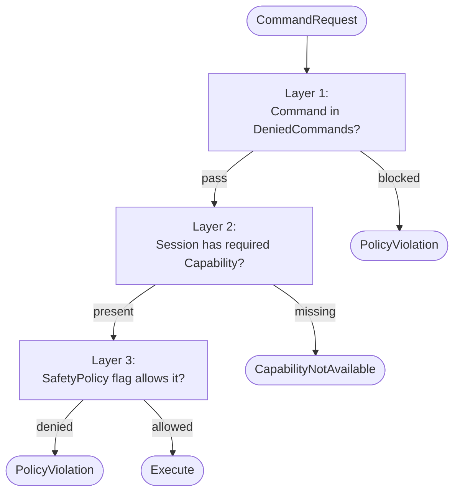

**[日本語](../ja/security.md)** | [Back to README](../../README.md)

# Security Model

UAIP exposes the UE editor and runtime to AI agents and external tools. This page describes the security boundaries: what UAIP allows by default, where the gates are, and what an operator needs to do to harden a deployment.

---

## Threat model

UAIP is designed for **developer machines and trusted internal CI**, not as a public-internet service. The threats it mitigates:

| Threat | Mitigation |
|---|---|
| Network attacker scanning ports | Every transport binds to loopback (`127.0.0.1`) by default — HTTP MCPOnly additionally enforces localhost at the app layer. Reaching UAIP from another machine requires an operator-applied bind-address override at the engine-config layer, which is outside UAIP's own configuration surface (see [Network surface](#network-surface)) |
| Local non-UAIP process invoking commands | Bearer token authentication on HTTP / WebSocket |
| AI hallucinating a destructive command | Capability gates (deny-by-default for edits) + per-command `IsReadOnly` flag |
| AI getting tricked into making a wide-scope change | SafetyPolicy can put the editor in process-wide read-only mode |
| File-path injection via response payload | Artifacts returned by ID; raw paths never leave the server |

The threats it does **not** mitigate:

- An attacker with shell access to the host can read `Saved/UAIP/EditorHttpAuthToken.txt` and impersonate the AI client. Treat the host as the trust boundary.
- A malicious project on the same machine that loads UAIP itself can register arbitrary commands. Don't load untrusted UAIP-bearing projects.
- Prompt-injection attacks against the AI client are out of scope for UAIP — they need to be addressed by the client itself.

---

## Network surface

| Component | Bind layer | App-layer filter | Auth | Reachable from another machine |
|---|---|---|---|---|
| HTTP transport — FullHTTP (`-uaip-http-enable`) | loopback (`127.0.0.1`) | none | Bearer token | No — see note below |
| HTTP transport — MCPOnly (`-uaip-mcp-enable`) | loopback (`127.0.0.1`) | 5-stage localhost enforcement (PeerAddress / Host / Origin) | none (localhost-only by design) | No |
| HTTP transport — `-uaip-http-no-auth` | loopback (`127.0.0.1`) | none | none | No |
| WebSocket transport (`-uaip-ws-enable`) | `127.0.0.1` (hard-coded) | ClientIP double-check | Bearer token (first frame) | No |
| MCP Bridge | stdio between AI client and bridge process | — | none — relies on host trust | — |
| CLI transport | none (in-process) | — | none | — |

Every HTTP transport mode binds to loopback, not just WebSocket. UAIP never passes a bind address to `FHttpServerModule::GetHttpRouter()`; the underlying `FHttpServerListenerConfig::BindAddress` defaults to `"localhost"` in UE, and neither `Config/DefaultUAIP.ini` nor `DefaultEngine.ini` overrides `[HTTPServer.Listeners]` in this project. This is true for FullHTTP just as much as MCPOnly — FullHTTP's Bearer-token authentication was designed with a remote agent in mind, but as shipped the socket itself never leaves the local machine. `-uaip-http-no-auth` only removes the token check; it does not change the bind address either.

An operator who genuinely wants FullHTTP reachable from another machine has to override `BindAddress` for the relevant port under `[HTTPServer.Listeners]` at the engine-config layer themselves — UAIP does not expose a setting for this. Doing so puts the Bearer token and your firewall between the open port and the network; treat that as an explicit, separate decision from just launching with `-uaip-http-enable`.

---

## Authentication

### HTTP / WebSocket Bearer Token

On startup, UAIP generates a 32-character random token and writes it to:

```
Saved/UAIP/EditorHttpAuthToken.txt
Saved/UAIP/EditorWsAuthToken.txt
```

Files are written with default OS permissions. Anyone with read access to `Saved/UAIP/` can impersonate a client — treat the editor user as the trust principal.

Token rotation happens automatically on every editor restart. To force rotation while the editor is running, delete the file and restart.

### Disabling auth (development only)

```
UnrealEditor.exe MyProject.uproject -uaip-http-enable -uaip-http-no-auth
UnrealEditor.exe MyProject.uproject -uaip-ws-enable -uaip-ws-no-auth
```

Use **only** on isolated dev machines or CI runners with no untrusted processes. HTTP's `-uaip-http-no-auth` only removes the Bearer-token check — the socket itself stays on loopback, so the editor does not become reachable from other machines by setting this flag. WebSocket's `-uaip-ws-no-auth` keeps the socket on loopback too, but in both cases any local process can still issue commands with no credential at all.

### MCP Bridge

MCP runs as a stdio child of the AI client, so authentication is whatever the AI client uses for its own MCP transport (typically none — it's already a child process). The bridge spawns the editor as its own child, so command flow is end-to-end local.

---

## Authorization

UAIP runs three independent authorization layers on every command:


```mermaid
flowchart TB
    Req([CommandRequest])
    L1[Layer 1:<br/>Command in DeniedCommands?]
    L2[Layer 2:<br/>Session has required Capability?]
    L3[Layer 3:<br/>SafetyPolicy flag allows it?]
    OK([Execute])

    Req --> L1
    L1 -- blocked --> X1([PolicyViolation])
    L1 -- pass --> L2
    L2 -- missing --> X2([CapabilityNotAvailable])
    L2 -- present --> L3
    L3 -- denied --> X3([PolicyViolation])
    L3 -- allowed --> OK
```

### Layer 1 — Capability set

Each command declares required capabilities (`BlueprintEdit`, `PIEControl`, …). The session's capability set determines what it can call. DefaultAllow capabilities are granted automatically; DefaultDenied require an explicit `+AllowedCapabilities=<name>` in `Config/DefaultUAIP.ini`.

### Layer 2 — SafetyPolicy boolean flags

Process-wide kill switches:

| Flag | Effect |
|---|---|
| `ReadOnly=True` | Reject mutating commands (`IsReadOnly=false` handlers), except `ShutdownEditor` / `RestartEditor` — see [Safety & Capabilities](safety.md#readonly-and-the-editor-lifecycle-commands) |
| `DisableSave=True` | Reject every disk-writing command |
| `AllowLogDump=False` | Reject `DumpOutputLog` / `DumpMessageLog` |
| `AllowContextMenuMutation=False` | Reject `InvokeContextMenuAction` |
| `AllowKeyboardInput=False` | Reject `PressKey` |
| `AllowKeyboardModifierInput=False` | Reject modifier keys in `PressKey` |
| `AllowPasswordFieldWrite=False` | Reject `FillForm` writes to password fields |
| `AllowInputModeBypass=False` | Reject `BypassInputMode=true` in input injection |
| `DisablePIEStart=True` | Reject PIE startup |

These are intentionally process-wide and cannot be changed by the AI at runtime — only the operator (via ini edit + editor restart, or `UAIP.Core.ReloadCapabilities` if `AllowCapabilityReload=True`).

### Layer 3 — Route opt-ins

Some features require a CLI flag at editor launch:

| Feature | Flag |
|---|---|
| HTTP transport | `-uaip-http-enable` |
| WebSocket transport | `-uaip-ws-enable` |
| MCP transport | `-uaip-mcp-enable` |
| Scenario route | `-uaip-enable-scenario` |

Without the flag, the corresponding code path is not registered at all (not "registered but rejected"). Demo binaries reject the HTTP / WS / CLI flags silently.

See [Safety & Capabilities](safety.md) for the full reference and ini examples.

---

## Operational security notes

These cover behavior that is easy to misread as a bug, or a decision that is easy to make without realizing its blast radius. They matter most for the "attach to an already-running editor" workflow — see [Connection Methods → Guest-mode connections](connections.md#guest-mode-connections).

### Auto-start config is shared, not per-developer

`[UAIP.Transport].AutoStartMCP` (see [Configuration](config.md#uaiptransport--auto-starting-the-mcp-transport-on-a-normal-launch)) lives in `Config/DefaultUAIP.ini`, which is committed to source control. The editor has no per-user override layer for it — the runtime override mechanism only applies to packaged, non-editor builds (see [Configuration → Runtime override mechanism](config.md#runtime-override-mechanism-packaged-builds)). If `AutoStartMCP=True` is committed, **every developer who opens that project gets a listening MCP endpoint on every normal launch**, with no way to opt out individually short of editing the ini locally and not committing the change. Treat enabling it in the shared ini as a team-wide decision, not a personal convenience setting.

### Commands can queue behind a modal dialog

An editor started **without** `-unattended` (a normally launched, human-facing editor, as opposed to one the MCP Bridge launches for itself) still runs UAIP commands on the game thread. While a modal dialog is on screen (a "Save changes?" prompt, an asset-validation warning, …), only the small allowlist configured under `[UAIP.CommandPump]` — `UAIP.Core.HealthCheck` and `UAIP.Core.QueryCapabilities` by default — gets answered. Everything else is **held, not rejected**, until the dialog closes. This is deliberate: UAIP does not mutate editor state while a human is mid-decision. But from the caller's side it looks identical to a hang. If a call is unexpectedly slow against a human-attended editor, check whether a dialog is open before assuming something crashed — and be aware that a command held long enough can still time out on the caller's side even though the editor itself is fine.

### Assign a restricted role to guest connections

A "guest" connection — a bridge configured to attach to an editor it did not launch, instead of starting one of its own (`attach_only`, see [Connection Methods → Guest-mode connections](connections.md#guest-mode-connections)) — inherits whatever capabilities that session would normally get. If the project has not defined any [`[UAIP.Roles]`](safety.md#roles-layer-15), a guest attaching to a human's editor can execute anything a first-party session could, including every DefaultAllow capability — the same "same machine is trusted" posture the rest of this page describes, just extended for as long as the human keeps that editor open. Define at least one restricted role (a read-only reviewer role is a reasonable starting point) and configure the guest bridge to authenticate as that role before pointing it at someone else's running editor. Without a role assigned, there is no way to tell — from the editor's side — that a given connection is a guest at all.

---

## Recommended hardening profiles

### "Read-only review" — for AI code review of untrusted PRs

```ini
[UAIP.SafetyPolicy]
ReadOnly=True
DisableSave=True
AllowLogDump=True
DisablePIEStart=False
```

The AI can observe and capture but cannot edit anything. Useful when you want an LLM to review a PR by exploring a freshly-checked-out branch. It can still shut the editor down or restart it — add `+DeniedCommands` entries for `UAIP.Editor.Workspace.ShutdownEditor` and `UAIP.Editor.Workspace.RestartEditor` if you would rather it could not.

### "Sandbox playtest" — for AI-driven test automation, no editor edits

```ini
[UAIP.SafetyPolicy]
ReadOnly=False
DisableSave=True
AllowLogDump=True

+AllowedCapabilities=PIEControl
+AllowedCapabilities=RuntimeActorManipulation
+AllowedCapabilities=RuntimeExecCommand
+AllowedCapabilities=RuntimeInputInjection
```

PIE control + runtime input + assertions, but no editor-side editing and no disk writes.

### "Full editing" — for AI pair programming with editor edits

```ini
[UAIP.SafetyPolicy]
ReadOnly=False
AllowLogDump=True
AllowContextMenuMutation=True
AllowKeyboardInput=True
AllowKeyboardModifierInput=True
AllowCapabilityReload=True

; List only the editing capabilities you actually want
+AllowedCapabilities=BlueprintEdit
+AllowedCapabilities=BlueprintGraphEdit
+AllowedCapabilities=BlueprintVariableEdit
+AllowedCapabilities=PropertyEdit
+AllowedCapabilities=AssetDelete
+AllowedCapabilities=EditorActorEdit
; …add others as your workflow needs
```

Be deliberate about which `+AllowedCapabilities` you grant. Each one is one more class of operation the AI can perform without confirmation.

---

## Artifact storage

Artifacts are written under `<YourProject>/Saved/UAIP/<SessionId>/`. By default the path is unconstrained — handlers can write anywhere under `Saved/UAIP/`. To enforce a sandbox root:

```ini
[UAIP.SafetyPolicy]
AllowedArtifactDirectory=Saved/UAIP/
```

Paths escaping this root are rejected with `NotAllowed`. The default value is already `Saved/UAIP/`, so explicit configuration is mostly useful when you want a more restrictive subpath (e.g., per-CI-job).

Artifacts are not encrypted on disk. Sensitive data dumped via `DumpWorldState` etc. is readable by any user with filesystem access. If this matters, restrict OS-level permissions on `Saved/UAIP/`.

---

## Audit trail

Every command writes a structured log line to UE's output log. Combined with `DumpOutputLog`, this gives an after-the-fact audit trail of:

- Command name and SessionId
- ErrorCode (if it failed)
- ArtifactIds produced
- Wall-clock duration

For CI, redirect UE output to a file and archive it alongside the test artifacts.

There is no separate command-audit log file in v1.0. If you need one, file a feature request.

---

## Reporting vulnerabilities

For security issues, please **do not** open a public GitHub issue. Email `naotsunworks@gmail.com` with:
- UE version + UAIP version (`UAIP.Core.GetSystemInfo`)
- A description of the vulnerability and steps to reproduce
- Whether the issue is exploitable from a non-loopback origin (highest priority) or requires local code execution (lower priority but still tracked)

This repository is maintained by a single developer, so response times can't be guaranteed. We'll acknowledge and coordinate disclosure as quickly as available time allows.
