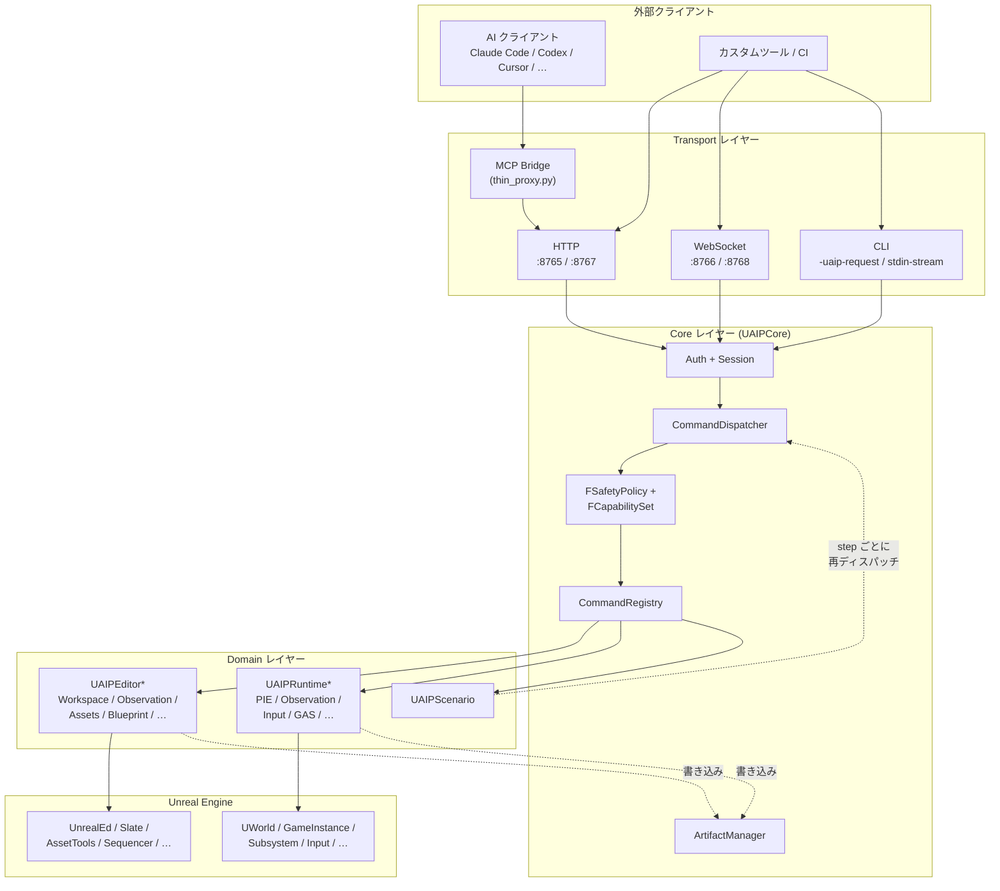
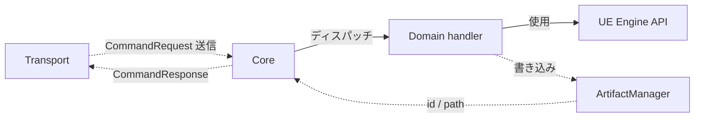
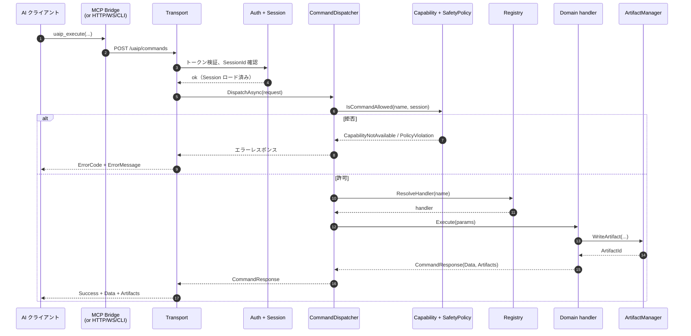
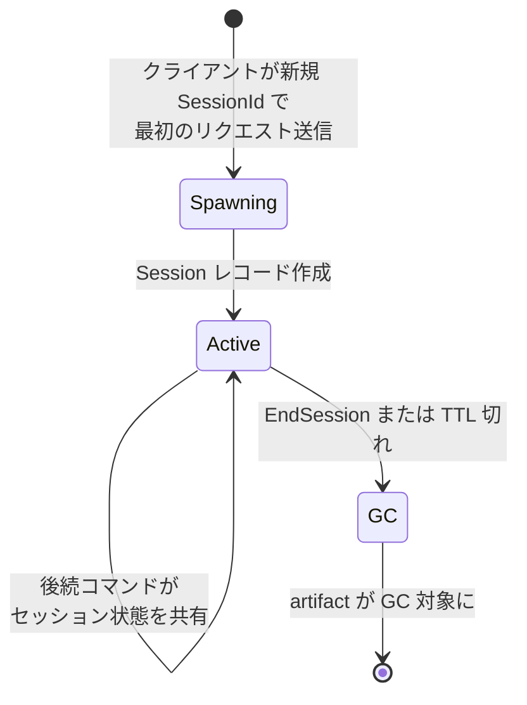
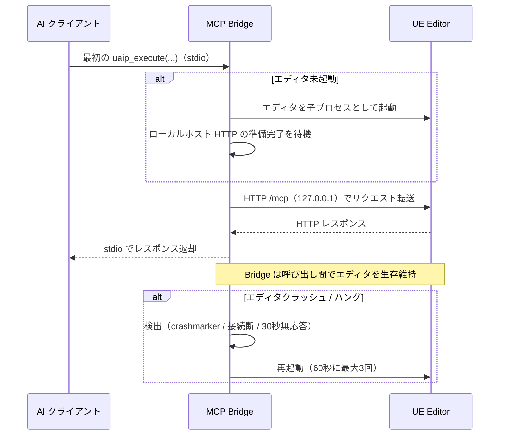

**[English](../en/architecture.md)** | [概要に戻る](overview.md)

# アーキテクチャ

このページでは UAIP の内部構造を解説します。UAIP を使うだけであれば [クイックスタート](quickstart.md) と [コマンドリファレンス](commands.md) で十分です。本ページは、ツールプログラマー・プラグインを拡張する人・レビュアー向けの内容になっています。

---

## 1. レイヤー構成

大原則として、**依存は下位方向にしか流れません**。Transport レイヤーは Domain ハンドラをインポートしませんし、Domain ハンドラも Transport をインポートしません。Core が両者の中間に立っています。

---

## 2. モジュールマップ

| レイヤー | モジュール | 役割 |
|---|---|---|
| **Core** | `UAIPCore` | セッション・Capability・Policy・コマンドレジストリ・Artifact マネージャ。全構成でロード |
| **Shared** | `UAIPEditorShared`, `UAIPRuntimeShared`, `UAIPExecutionShared`, `UAIPArtifacts`, `UAIPBuildSupport`, `UAIPWatchdogSupport` | ドメイン横断のユーティリティ — コマンドは直接持たない |
| **Transports** | `UAIPTransportHTTP`, `UAIPTransportWS`, `UAIPTransportCLI` | 各 transport リスナー（MCP はエディタ外部の Python Bridge） |
| **Editor ドメイン** | `UAIPEditor*`（Workspace, Observation, Execution, UIAutomation, Assets, Level, Property, Blueprint, UMG, Material, GameplayTags, GameFeatures, Niagara, Physics, Dataflow, Skeleton, DataTable, AnimBlueprint, SoundCue, BehaviorTree, MetaSound, EQS, Sequencer, StateTree, Curve, PCG, WorldConditions, Conversation, ControlRig, EnhancedInput, GAS, PythonExtension） | エディタ側意味的コマンド。`EditorNoCommandlet` フェーズでロード |
| **Runtime ドメイン** | `UAIPRuntimePIE`, `UAIPRuntimeObservation`, `UAIPRuntimeExecution`, `UAIPRuntimeAssertion`, `UAIPRuntimeWorld`, `UAIPRuntimeGAS`, `UAIPRuntimeInput`, `UAIPRuntimeNiagara` | Runtime / PIE 側コマンド。一部は Gauntlet 用にパッケージビルドへ opt-in 可能 |
| **Scenario** | `UAIPScenario` | シナリオルート — `uaip_execute` と独立だが `CommandDispatcher` を再利用 |

登録済みコマンドの完全な数は [コマンドリファレンス](commands.md) を参照。

---

## 3. 依存方向

- Transport が Domain を直接呼ぶことはありません
- Domain どうしも互いをインポートしません（例：`UAIPEditorBlueprint` は `UAIPEditorMaterial` に依存しません）
- ドメイン横断で必要な処理は `UAIPEditorShared` / `UAIPRuntimeShared` を経由します
- `UAIPScenario` は `uaip_execute` と並列のルートです。各ステップは Domain を直接叩かず、いったん `CommandDispatcher` を経由して再ディスパッチされます

循環依存は禁止されています。UE の `.Build.cs` システムが強制するため、循環を作ろうとするとそもそもコンパイルが通りません。

---

## 4. コマンドディスパッチシーケンス

**デフォルトではすべてゲームスレッド上で実行されます**。長時間の処理が必要なハンドラは自身を非同期としてマークし、完了時にゲームスレッドへポストバックしてからコールバックを呼ぶ仕組みになっています。

---

## 5. 認可決定フロー

ゲートが 2 種類（Capability と SafetyPolicy）、結果コードが 3 種類（`CapabilityNotAvailable`・`PolicyViolation`・`Success`）あります。`ErrorMessage` には該当する Capability 名やフラグ名が常に含まれているので、AI もユーザーも推測なしに対処できます。詳細は [Safety & Capabilities](safety.md) を参照してください。

---

## 6. セッションライフサイクル

セッションは次のものを所有する単位です：
- Capability セット（spawn 時に SafetyPolicy から決定）
- Widget 観測のキャッシュ（`ObserveWidget` 用）
- Artifact のサブフォルダ（`Saved/UAIP/<SessionId>/`）
- セッション単位のレートリミタ（例：シナリオ submit）

匿名セッション（`SessionId` を指定しない場合）には `MCP-Anonymous-<guid>` という ID が自動付与されます。単発の呼び出しには便利ですが、タスクごとにセッションを分けたほうが Artifact を後から探しやすくなります。

---

## 7. Artifact ライフサイクル

出力を生成するコマンド（キャプチャ・ダンプ・ログ・レポート）はすべて、1 つ以上の **Artifact** を `Saved/UAIP/<SessionId>/` に書き出し、レスポンスには Artifact ID を返します。クライアントは ID を介して内容を取得する仕組みで、ファイルパス自体はレスポンスペイロードに含めません。これによりパスリーク攻撃を防ぎ、トランスポート間で契約も一貫させています。

ディスクレイアウト・インライン埋め込みとフェッチの判定・型ごとのポリシーといった詳細は [Artifacts](artifacts.md) を参照してください。

---

## 8. エディタライフサイクル（Bridge が管理）

AI クライアントと Bridge の間は MCP の stdio、Bridge と UE Editor の間は **ローカルホスト HTTP** で通信します。

エディタプロセスのライフサイクルは Bridge 側が管理するため、クライアント側で気にする必要はありません。AI クライアントは **`taskkill` や `Stop-Process` を使ってはいけません** — 他プロジェクトのエディタまで巻き添えで落ちてしまいます。代わりに `UAIP.Workspace.RestartEditor` を使ってください。詳細は [トラブルシューティング → MCP が固まっている](troubleshooting.md#mcp-が固まったように見える--エディタを-kill-するべき) を参照してください。

---

## 9. 拡張ポイント

UAIP は、本体をフォークしなくてもプロジェクト独自のコマンドを追加できるよう、いくつかの拡張フックを公開しています。なかでもカスタムコマンドの追加は次の 2 つの組み合わせが基本です：

- **`ICommandProvider`** — プロバイダ（コマンドグループ）の単位。モジュール起動時にプロバイダを `CommandRegistry` に登録すると、自分の名前空間配下にコマンドを公開できます。提供する名前・必要 Capability・IsReadOnly などのメタ情報もここで宣言します。
- **`ICommandHandler`** — 個々のコマンドの実装単位。`Execute(Params)` 内でビジネスロジックを書き、結果を `CommandResponse` として返します。ハンドラは登録したプロバイダ経由でディスパッチャから呼ばれます。

この組み合わせを使えば、AI 側の呼び出し方法（`uaip_execute`・スキーマ取得・Capability 判定・Artifact 返却など）は標準コマンドとまったく同じ形式で公開できます。プロジェクト独自のアセットや社内ツールを AI から扱えるようにする際は、まずこの 2 つを実装するところから始めるのが定番です。

その他の拡張フック：

- **`ICaptureProvider`** — 外部のグラフ画像ソース（GraphPrinter など）を橋渡しし、`CaptureCanonicalGraphImage` から利用できるようにします
- **Python `@uaip_command`** — Python の関数を UAIP のコマンドとして登録できます（`PythonScriptPlugin` と `PythonExtensionReload` Capability が必要）

プロジェクト固有の拡張は、UAIP のソースツリーに入れず、**別プラグインまたは別モジュール** として作成してください。UAIP をアップデートしたときに `git pull` がきれいに通るようにするためです。

---

## 10. 次に読む

| 目的 | 移動先 |
|---|---|
| 新規コマンドを実装したい | [コマンドリファレンス](commands.md)（命名規則）+ 該当 `UAIPEditor*` モジュールの既存ハンドラソース |
| 認可機構を深く理解したい | [Safety & Capabilities](safety.md)、[セキュリティ](security.md) |
| シナリオ内部を理解したい | [シナリオ実行](scenario.md) |
| Artifact のストレージ / 取得を理解したい | [Artifacts](artifacts.md) |
| 用語を調べたい | [用語集](glossary.md) |
