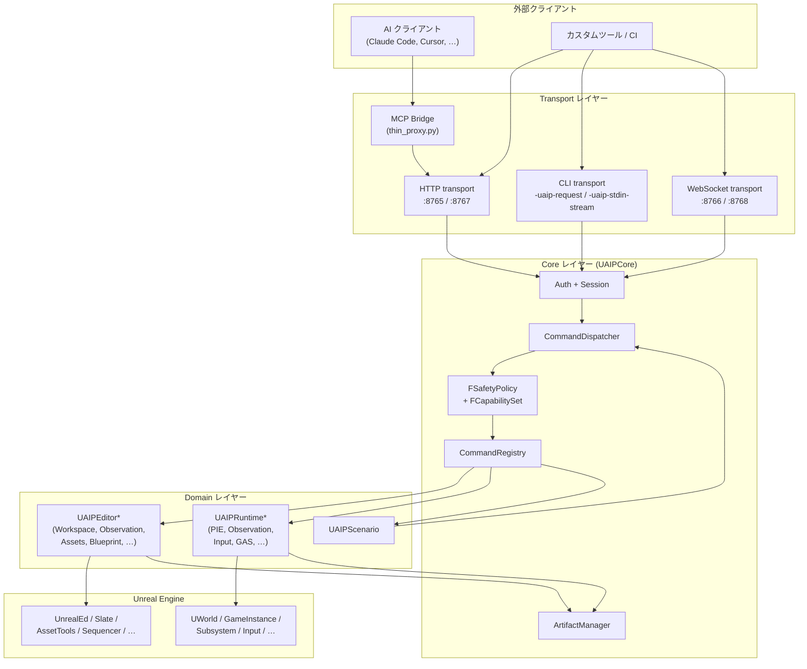
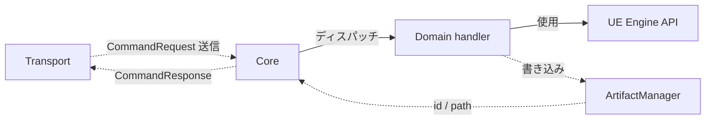
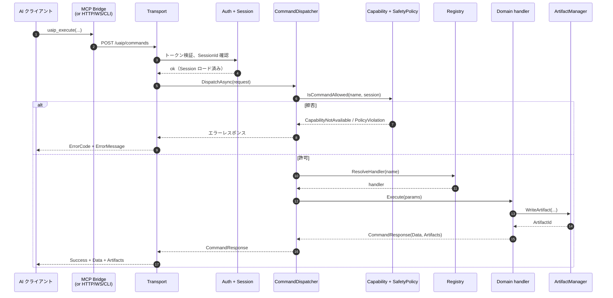
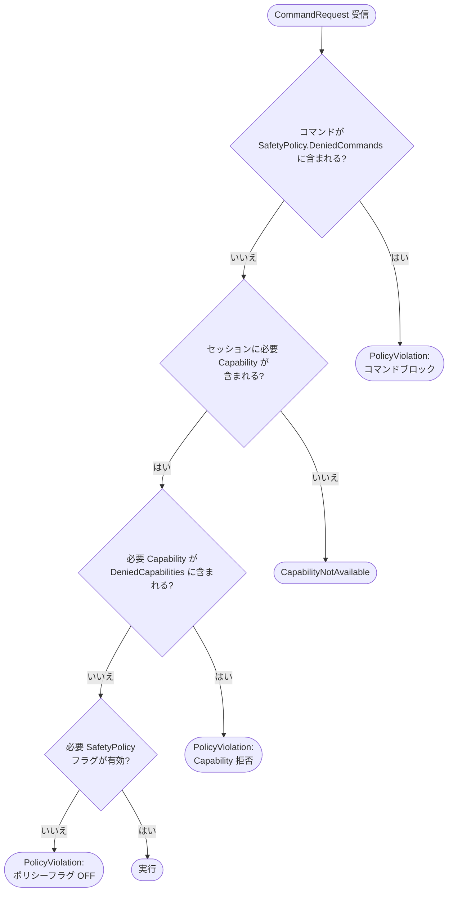
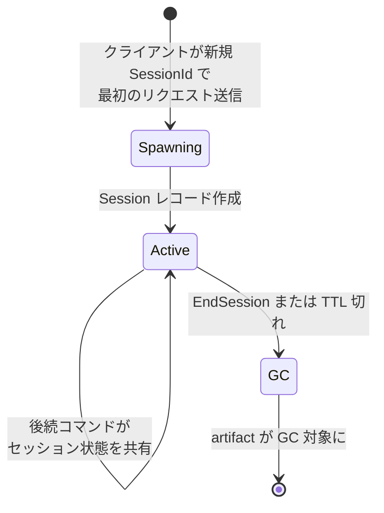
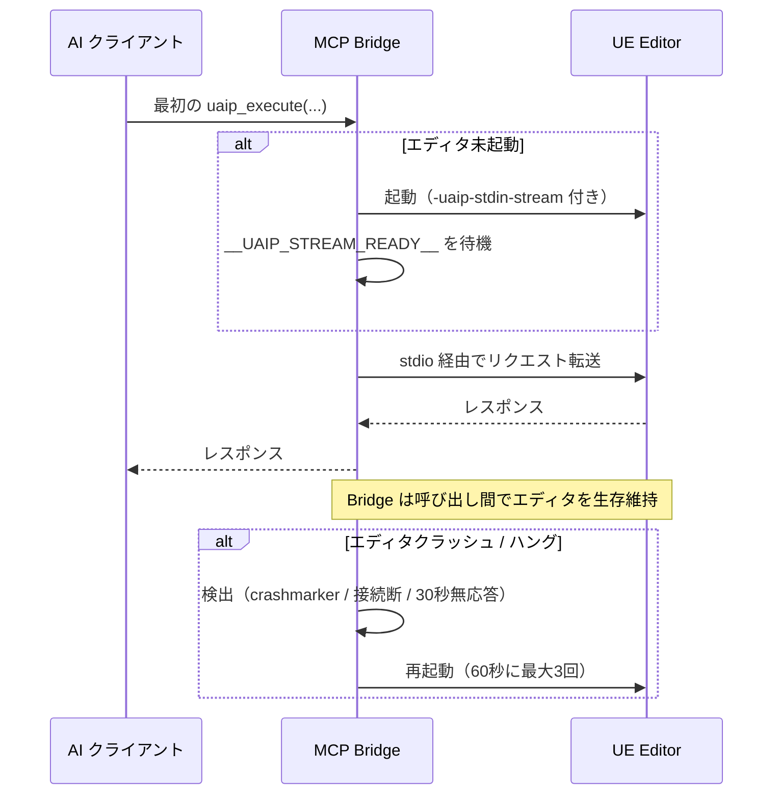

**[English](../en/architecture.md)** | [概要に戻る](overview.md)

# アーキテクチャ

このページは UAIP の内部構造を解説します。UAIP を使うだけなら [クイックスタート](quickstart.md) と [コマンドリファレンス](commands.md) で十分です。本ページはツールプログラマー・プラグイン拡張者・レビュアー向けです。

---

## 1. レイヤー構成

絶対ルール：**依存は下位方向のみ**。Transport レイヤーは Domain ハンドラをインポートしないし、Domain ハンドラは Transport をインポートしない。Core が中央。

---

## 2. モジュールマップ

| レイヤー | モジュール | 役割 |
|---|---|---|
| **Core** | `UAIPCore` | セッション・Capability・Policy・コマンドレジストリ・Artifact マネージャ。全構成でロード |
| **Shared** | `UAIPEditorShared`, `UAIPRuntimeShared`, `UAIPExecutionShared`, `UAIPArtifacts`, `UAIPBuildSupport`, `UAIPWatchdogSupport` | ドメイン横断のユーティリティ — コマンドは直接持たない |
| **Transports** | `UAIPTransportHTTP`, `UAIPTransportWS`, `UAIPTransportCLI` | 各 transport リスナー（MCP はエディタ外部の Python Bridge） |
| **Editor ドメイン** | `UAIPEditor*`（Workspace, Observation, Execution, UIAutomation, Assets, Level, Property, Blueprint, UMG, Material, GameplayTags, GameFeatures, Niagara, Physics, Dataflow, Skeleton, DataTable, AnimBlueprint, SoundCue, BehaviorTree, MetaSound, EQS, Sequencer, StateTree, Curve, PCG, WorldConditions, Conversation, ControlRig, EnhancedInput, GAS, PythonExtension） | エディタ側意味的コマンド。`EditorNoCommandlet` フェーズでロード |
| **Runtime ドメイン** | `UAIPRuntimePIE`, `UAIPRuntimeObservation`, `UAIPRuntimeExecution`, `UAIPRuntimeAssertion`, `UAIPRuntimeWorld`, `UAIPRuntimeGAS`, `UAIPRuntimeInput`, `UAIPRuntimeNiagara` | Runtime / PIE 側コマンド。一部は Gauntlet 用にパッケージビルドへ opt-in 可能 |
| **Scenario** | `UAIPScenario` | シナリオルート — `uaip_execute` と独立だが `CommandDispatcher` を再利用 |

登録済みコマンドの完全な数は [コマンドリファレンス](commands.md) を参照。

---

## 3. 依存方向

- Transport は Domain を直接呼ばない
- Domain は他の Domain をインポートしない（例: `UAIPEditorBlueprint` は `UAIPEditorMaterial` に依存しない）
- ドメイン横断の共通処理は `UAIPEditorShared` / `UAIPRuntimeShared` 経由
- `UAIPScenario` は `uaip_execute` と並列のルート。各 step は Domain を直接叩かず `CommandDispatcher` 経由で再送

循環依存は禁止。UE の `.Build.cs` システムが強制するため、循環を作るとコンパイルが通らない。

---

## 4. コマンドディスパッチシーケンス

**デフォルトはすべてゲームスレッド実行**。長時間処理が必要なハンドラは自身を非同期マークし、完了時にゲームスレッドへポストバックしてからコールバックを呼ぶ。

---

## 5. 認可決定フロー

ゲート 2 種類（Capability と SafetyPolicy）、結果コード 3 種類（`CapabilityNotAvailable`・`PolicyViolation`・`Success`）。`ErrorMessage` には常に該当する Capability 名やフラグ名が含まれ、AI / ユーザーが推測なく対処できます。詳細は [Safety & Capabilities](safety.md)。

---

## 6. セッションライフサイクル

セッションは以下を所有する単位：
- Capability セット（spawn 時に SafetyPolicy から決定）
- Widget 観測キャッシュ（`ObserveWidget` 用）
- Artifact サブフォルダ（`Saved/UAIP/<SessionId>/`）
- セッション単位レートリミタ（例：シナリオ submit）

匿名セッション（`SessionId` 未指定）は自動生成 `MCP-Anonymous-<guid>` ID — 単発呼び出しには便利ですが、タスク単位でセッションを分けると artifact 検索が容易。

---

## 7. Artifact ライフサイクル

出力を生成するコマンド（キャプチャ・ダンプ・ログ・レポート）はすべて、1 つ以上の **artifact** を `Saved/UAIP/<SessionId>/` に書き出し、レスポンスに artifact ID を返します。クライアントは ID 経由で内容を取得 — ファイルパスはレスポンスペイロードに含めません。これにより path leak 攻撃を防ぎ、transport 間で契約を一貫させます。

詳細は [Artifacts](artifacts.md) を参照（ディスクレイアウト・インライン vs フェッチの挙動・型ごとのポリシー）。

---

## 8. エディタライフサイクル（Bridge が管理）

Bridge がエディタプロセスのライフサイクルを所有するため、クライアントは管理不要。AI クライアントは **`taskkill` / `Stop-Process` を使ってはいけません** — 他プロジェクトのエディタも巻き込みで落ちます。代わりに `UAIP.Workspace.RestartEditor` を使用してください。詳細は [トラブルシューティング → MCP が固まっている](troubleshooting.md#mcp-が固まっている--エディタを-kill-すべき)。

---

## 9. 拡張ポイント

UAIP はフォークせずにプロジェクト独自のコマンドを追加できる小さな拡張フックを公開しています：

- **`ICommandProvider`** — モジュール起動時に実装・登録することで、独自ハンドラ付きの新規コマンドグループを追加
- **`ICaptureProvider`** — 外部のグラフ画像ソース（GraphPrinter など）をブリッジし、`CaptureCanonicalGraphImage` から利用可能に
- **`IToolsetCommandHandler`** — Toolset フレームワークコマンドを UAIP のリクエスト / レスポンス形式に適応（製品版、UE 5.8+）
- **Python `@uaip_command`** — Python 関数を UAIP コマンドとして登録（`PythonScriptPlugin` + `PythonExtensionReload` Capability が必要）

プロジェクト固有の拡張は **別プラグイン / 別モジュール** に置くこと（UAIP のソースツリーに入れない）。UAIP アップデート時の `git pull` をクリーンに保つためです。

---

## 10. 次に読む

| 目的 | 移動先 |
|---|---|
| 新規コマンドを実装したい | [コマンドリファレンス](commands.md)（命名規則）+ 該当 `UAIPEditor*` モジュールの既存ハンドラソース |
| 認可機構を深く理解したい | [Safety & Capabilities](safety.md)、[セキュリティ](security.md) |
| シナリオ内部を理解したい | [シナリオ実行](scenario.md) |
| Artifact のストレージ / 取得を理解したい | [Artifacts](artifacts.md) |
| 用語を調べたい | [用語集](glossary.md) |
