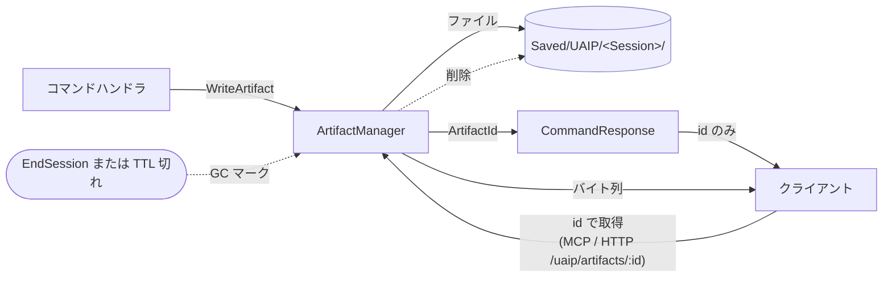
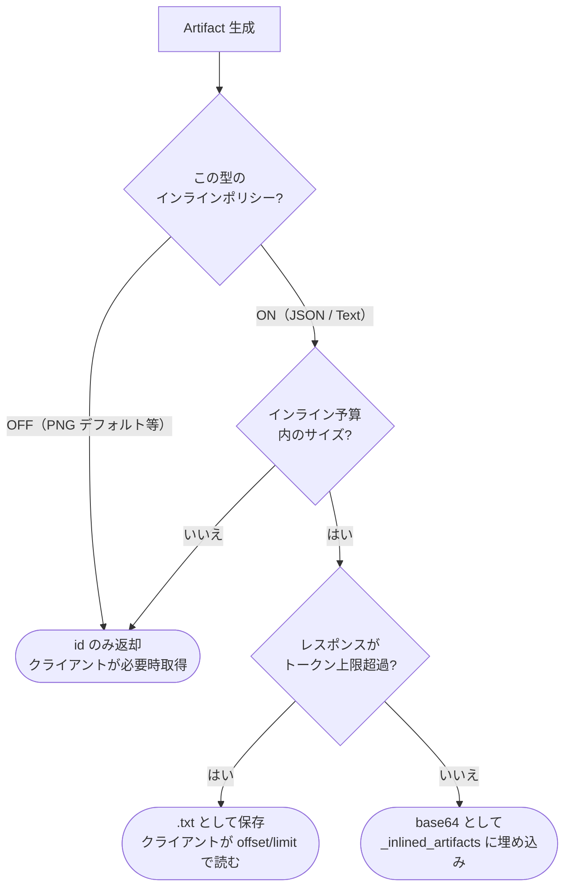

**[English](../en/artifacts.md)** | [概要に戻る](overview.md)

# Artifacts（成果物）

すべての UAIP コマンドは **Artifacts（成果物）** を返します。PNG スクリーンショット、JSON 状態ダンプ、ログ、レポートなどのファイルで、AI がユーザーに確認を取らずにエディタの状態を検証するために使います。

---

## Artifact の種類

| 種類 | 拡張子 | 主な内容 |
|---|---|---|
| `Image` | `.png` | ビューポート・Editor タブ・アクティブウィンドウのスクリーンショット |
| `Json` | `.json` | 状態ダンプ（ワールド・Editor・アクター・Slate ツリー）、コマンドレスポンス |
| `Log` | `.log` / `.txt` | OutputLog / MessageLog のダンプ |
| `Report` | `.json` | Automation Test の結果 |
| `Bundle` | アーカイブ | 複数 Artifact のまとめ（例：`CheckpointCapture`） |

---

## 保存場所

```
Saved/UAIP/<SessionId>/
  Dumps/        ← JSON ダンプ
  Screenshots/  ← PNG キャプチャ
  Logs/         ← ログファイル
  Reports/      ← テストレポート
```

Artifact はセッション単位で保存されます。セッション終了後は GC 対象になります。

---

## Artifact の読み方

### `uaip_execute` のレスポンス

```json
{
  "Success": true,
  "Artifacts": [
    {
      "ArtifactId": "8D1403DB4896B4742E423CBD9F535F19",
      "FilePath": "MCP-Anonymous-.../Screenshots/capture.png",
      "Type": "Image"
    }
  ]
}
```

### `uaip_run_scenario` のレスポンス

```json
{
  "StepResults": [
    { "StepName": "Cap", "ArtifactIds": ["8D1403DB..."] }
  ],
  "ArtifactIds": ["8D1403DB..."]
}
```

シナリオは Artifact の **ID のみ** を返します（ファイルパスは含まれません）。

---

## ライフサイクル — 書き込み・取得・GC



ハンドラはディスクに書き込み ID のみを返却。クライアントは ID 経由で取得 — パスはレスポンスに含まれません。

---

## インライン vs フェッチの判定

MCP Bridge が `CommandResponse` を AI クライアントに送信する際、小さな Artifact は base64 で `_inlined_artifacts` に埋め込まれることがあります。判定は Artifact ごと：



デフォルトポリシー：

| 種類 | デフォルトでインライン | 理由 |
|---|---|---|
| `Image`（PNG） | **いいえ** | MB 単位の PNG は AI クライアントのトークン予算を圧迫 |
| `Json` | はい | 通常 KB レベル — インライン参照が便利 |
| `Text` | はい | ログ断片、通常小さい |

PNG スクリーンショットを確認するには `Read` ツールにファイルパスを渡してください。インラインには頼らないでください。

---

## 自動インライン

MCP Bridge は小さな Artifact をレスポンスに直接埋め込むことがあります（`_inlined_artifacts`）：

```json
{
  "_inlined_artifacts": [
    {
      "artifact_id": "...",
      "content_type": "application/json",
      "data_base64": "..."
    }
  ]
}
```

デフォルトのインラインポリシー：

| 種類 | デフォルトでインライン |
|---|---|
| `Image`（PNG） | **No** — PNG はセッション全体で蓄積するとトークン上限を超える |
| `Json` | Yes |
| `Text` | Yes |

PNG スクリーンショットを確認するには `Read` ツールにファイルパスを渡してください。インラインには頼らないでください。

---

## コマンド別 Artifact

| コマンド | 成果物 |
|---|---|
| `CaptureActiveWindowImage` | PNG 1枚 — アクティブな Editor ウィンドウ |
| `CaptureViewportImage` | PNG 1枚 — PIE / ゲームビューポート |
| `CaptureEditorTabImage` | PNG 1枚 — 指定した Editor タブ |
| `CaptureGraphViewportImage` | PNG 1枚 — グラフエディタ（Blueprint、Material など） |
| `CaptureCanonicalGraphImage` | PNG 1枚 — グラフ全体レイアウト（登録済み外部キャプチャプロバイダが必要） |
| `DumpEditorState` | JSON 1本 — 開いているアセット・アクティブタブ・ウィンドウ寸法 |
| `DumpWorldState` | JSON 1本 — 全アクター・コンポーネント・トランスフォーム（大きくなる場合あり） |
| `DumpSlateTree` | JSON 1本 — Slate ウィジェットツリー |
| `CheckpointCapture` | PNG + JSON のバンドル |
| `LoadMap` / `StartPIE` | JSON 2本 — 前後の状態 |

---

## ベストプラクティス

- **まず Artifact の個数と種類を確認**してから必要なものだけ取得する
- **大きな JSON ダンプ**：ファイル全体をコンテキストに読み込まず、`grep` / `jq` で必要な部分だけ取り出す
- **PNG スクリーンショット**：`Read` ツールで 1 枚ずつ確認し、パスを文章に書くのではなく見た内容を説明する
- **ユーザーに聞く前に自己確認**：ファクトに関する質問はキャプチャや JSON ダンプで自分が答える
  - アクティブな Editor 状態 → `CaptureActiveWindowImage`
  - ビューポート / PIE → `CaptureViewportImage`
  - グラフエディタ → `CaptureGraphViewportImage`
  - ワールドのアクター → `DumpWorldState`
  - Slate ウィジェットツリー → `DumpSlateTree`

---

## 大きな Artifact の扱い

レスポンスがトークン上限を超えた場合、Bridge は内容を `.txt` ファイルに保存して以下のような通知を返します：

```
Output has been saved to <path>.txt.
Use offset and limit parameters to read specific portions...
```

`Read` ツールに `offset` と `limit` を指定してページ単位で読み取ってください。
