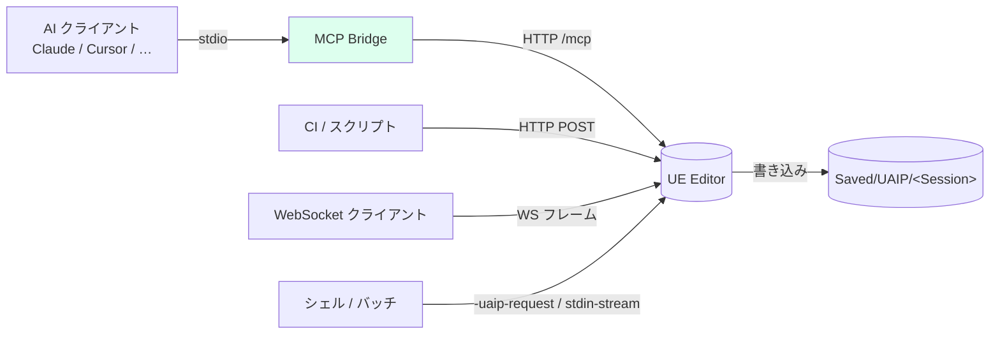
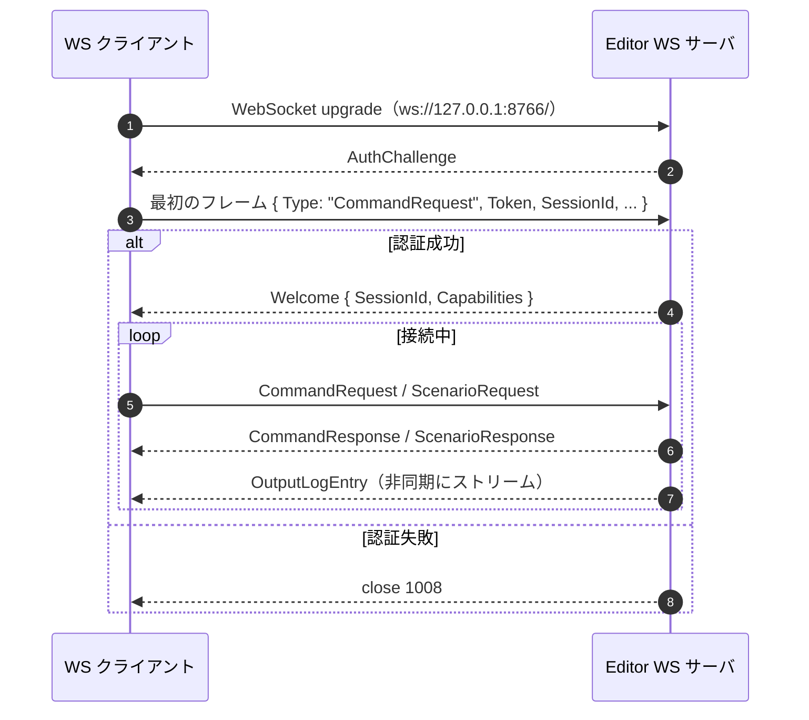
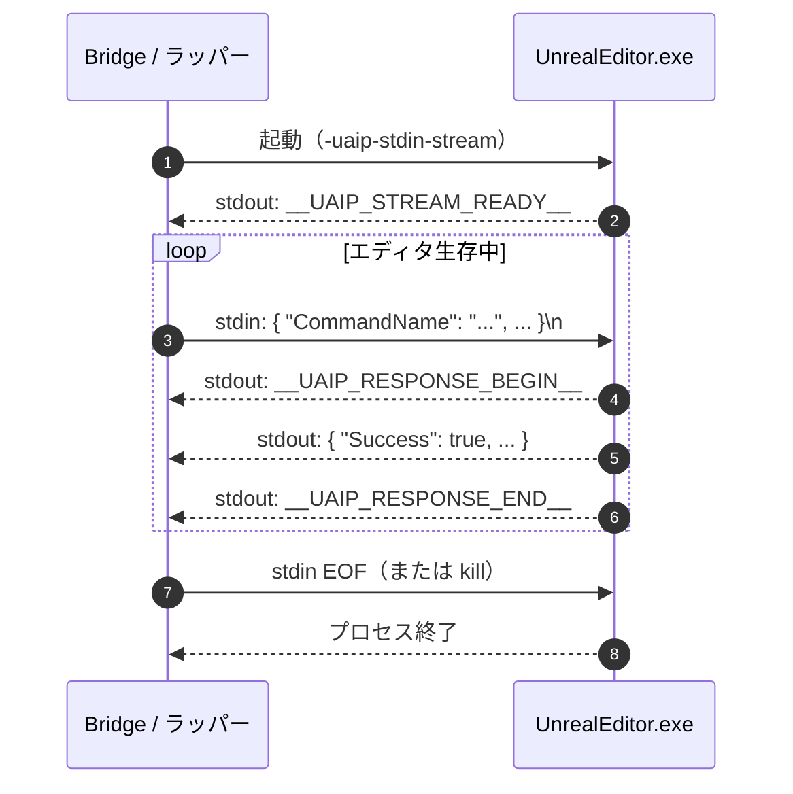

**[English](../en/connections.md)** | [概要に戻る](overview.md)

# 接続方法

UAIP には 4 つのトランスポートが用意されています。用途に合ったものを選んでください。

| トランスポート | ポート（Editor） | ポート（Packaged） | 主な用途 |
|---|---|---|---|
| **MCP Bridge** | — | — | AI クライアント（Claude Code・Cursor・Windsurf・Copilot など） |
| **HTTP API** | 8765 | 8767 | 独自ツール連携・REST クライアント・CI/CD パイプライン |
| **WebSocket** | 8766 | 8768 | リアルタイムストリーミングと永続接続 |
| **CLI** | — | — | 単発の自動化やシェルスクリプト |

> **デモ版の制限**：デモバイナリは **MCP トランスポートのみ** に対応しています。HTTP・WebSocket・CLI を使うには製品版が必要です。

---

## トランスポート比較



4 つのトランスポートはエディタ内の同じディスパッチコアに終端するので（[アーキテクチャ](architecture.md) を参照）、どれを使っても Capability と Policy の挙動は同じです。

---

## MCP Bridge

AI クライアントと連携するなら MCP Bridge がおすすめです。`thin_proxy.py` という Python プロキシが AI クライアントと UE Editor の間に立ち、MCP のツール呼び出しを内部で UAIP の HTTP リクエストに変換します。

インストールと設定の詳細は [セットアップガイド](setup.md) を参照してください。

---

## HTTP API（製品版）

HTTP API はローカルホスト上に REST インターフェースを公開します。AI クライアントを介さない独自スクリプト・CI/CD・独自ツール連携に向いています。

### 有効化

エディタを `-uaip-http-enable` フラグ付きで起動します：

```
UnrealEditor.exe MyProject.uproject -uaip-http-enable
```

ポートを変更する場合（デフォルト：Editor `8765`・Packaged `8767`）：

```
UnrealEditor.exe MyProject.uproject -uaip-http-enable -uaip-http-port=9000
```

### 認証

起動時に UAIP がランダムな 32 文字の Bearer トークンを以下に書き込みます：

```
Saved/UAIP/EditorHttpAuthToken.txt
```

すべてのリクエストにこのトークンを含めてください：

```http
Authorization: Bearer <token>
```

開発環境・CI 環境で認証を無効にする場合（本番環境では使用しないこと）：

```
-uaip-http-no-auth
```

### エンドポイント

| メソッド | パス | 説明 |
|---|---|---|
| GET | `/uaip/health` | ヘルスチェック — `{"status":"ok"}` を返す |
| GET | `/uaip/capabilities` | 現在のセッションで利用可能な Capability 一覧 |
| POST | `/uaip/sessions` | セッション作成 — `{"SessionId":"..."}` を返す |
| DELETE | `/uaip/sessions/:sessionId` | セッション終了 |
| POST | `/uaip/commands` | コマンド実行 |
| POST | `/uaip/scenarios` | シナリオ実行（完了まで待機） |
| GET | `/uaip/artifacts/:artifactId` | Artifact のダウンロード |
| GET | `/uaip/sessions/:sessionId/artifacts` | セッションの Artifact 一覧 |

### コマンド実行例

```http
POST /uaip/commands
Content-Type: application/json
Authorization: Bearer <token>

{
  "CommandName": "UAIP.Core.HealthCheck",
  "Params": {},
  "SessionId": "my-session"
}
```

レスポンス：

```json
{
  "Success": true,
  "Data": { ... },
  "Artifacts": [...],
  "ErrorCode": null,
  "ErrorMessage": null
}
```

### 制限値

| 項目 | 上限 |
|---|---|
| 最大リクエストボディ | 64 KiB |
| 最大 Artifact レスポンス | 100 MiB |
| 最大同時コマンド数 | 1 |
| コマンドタイムアウト | 120 秒 |

---

## WebSocket（製品版）

WebSocket トランスポートはリアルタイムログストリーミングに対応した永続的な双方向接続を提供します。

### 有効化

```
UnrealEditor.exe MyProject.uproject -uaip-ws-enable
```

ポートを変更する場合（デフォルト：Editor `8766`・Packaged `8768`）：

```
UnrealEditor.exe MyProject.uproject -uaip-ws-enable -uaip-ws-port=9001
```

### 接続 URL

```
ws://127.0.0.1:8766/
```

接続はローカルホスト（`127.0.0.1` および `::1`）に限定されます。

### 認証

起動時に UAIP がトークンを以下に書き込みます：

```
Saved/UAIP/EditorWsAuthToken.txt
```

最初のリクエストフレームにトークンを含めてください：

```json
{
  "Type": "CommandRequest",
  "ClientProtocolVersion": "1.0",
  "Token": "<token>",
  "RequestId": "req-001",
  "SessionId": "my-session",
  "CommandName": "UAIP.Core.HealthCheck",
  "Params": {}
}
```

認証を無効にする場合（開発・CI 環境のみ）：

```
-uaip-ws-no-auth
```

### ハンドシェイクとメッセージフロー



### メッセージタイプ

**Inbound（クライアント → サーバー）：**

| `Type` | 用途 |
|---|---|
| `CommandRequest` | コマンド実行 |
| `ScenarioRequest` | シナリオ実行 |

**Outbound（サーバー → クライアント）：**

| `Event` | 用途 |
|---|---|
| `AuthChallenge` | 認証要求 |
| `Welcome` | 接続確立 — `SessionId` と `Capabilities` を含む |
| `CommandResponse` | コマンド結果 |
| `ScenarioResponse` | シナリオ結果 |
| `OutputLogEntry` | ストリーミングログ行（リアルタイム） |

### 出力ログのストリーミング

サーバーは UE の全ログ出力をリアルタイムで `OutputLogEntry` イベントとして送信します。無効にする場合：

```
-uaip-ws-no-output-log
```

### 制限値

| 項目 | 上限 |
|---|---|
| 最大受信メッセージサイズ | 64 KiB |
| 最大シナリオペイロード | 1 MiB |
| 最大同時接続数 | 4 |
| ハンドシェイクタイムアウト | 5 秒 |
| コマンドタイムアウト | 12 秒 |

---

## CLI（製品版）

CLI トランスポートはエディタを特定の引数付きで起動することでコマンドを実行します。永続サーバーを必要としない単発自動化やシェルスクリプト・CI パイプラインに適しています。

### 単発実行（One-shot）

コマンドを実行し、結果を出力してエディタが終了します。

**インライン JSON：**

```
UnrealEditor.exe MyProject.uproject -uaip-request="{\"CommandName\":\"UAIP.Core.HealthCheck\",\"Params\":{}}"
```

**JSON ファイルから：**

```
UnrealEditor.exe MyProject.uproject -uaip-request-file="Saved/UAIP/Requests/cmd.json"
```

**結果をファイルに書き出す：**

```
UnrealEditor.exe MyProject.uproject -uaip-request-file="..." -uaip-response-file="Saved/UAIP/Responses/result.json"
```

**シナリオをファイルから実行：**

```
UnrealEditor.exe MyProject.uproject -uaip-scenario-file="path/to/scenario.json"
```

### ストリームモード

エディタが stdin から JSON リクエストを読み取り、stdout にレスポンスを書き込む永続モードです。MCP Bridge が内部的にこのモードを使用しています。

```
UnrealEditor.exe MyProject.uproject -uaip-stdin-stream
```



マーカー（`__UAIP_*__`）により、通常の UE ログ出力と request/response を同じ stdout で混在させられます。

**stdout マーカー：**

| マーカー | 意味 |
|---|---|
| `__UAIP_STREAM_READY__` | エディタがリクエストを受け付ける準備完了 |
| `__UAIP_RESPONSE_BEGIN__` | JSON レスポンスの開始 |
| `__UAIP_RESPONSE_END__` | JSON レスポンスの終了 |

### CLI フラグ一覧

| フラグ | 説明 |
|---|---|
| `-uaip-request=<json>` | インライン JSON からコマンドを実行 |
| `-uaip-stdin` | stdin から単一リクエストを読み取る |
| `-uaip-request-file=<path>` | JSON ファイルからコマンドを読み取る |
| `-uaip-response-file=<path>` | レスポンスをファイルに書き出す |
| `-uaip-scenario=<json>` | インライン JSON からシナリオを実行 |
| `-uaip-scenario-file=<path>` | JSON ファイルからシナリオを読み取る |
| `-uaip-stdin-stream` | 永続ストリームモードを有効化 |

### 制限値

| 項目 | 上限 |
|---|---|
| 最大リクエストボディ | 1 MiB |
| コマンドタイムアウト | 120 秒 |
