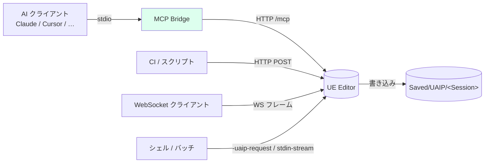
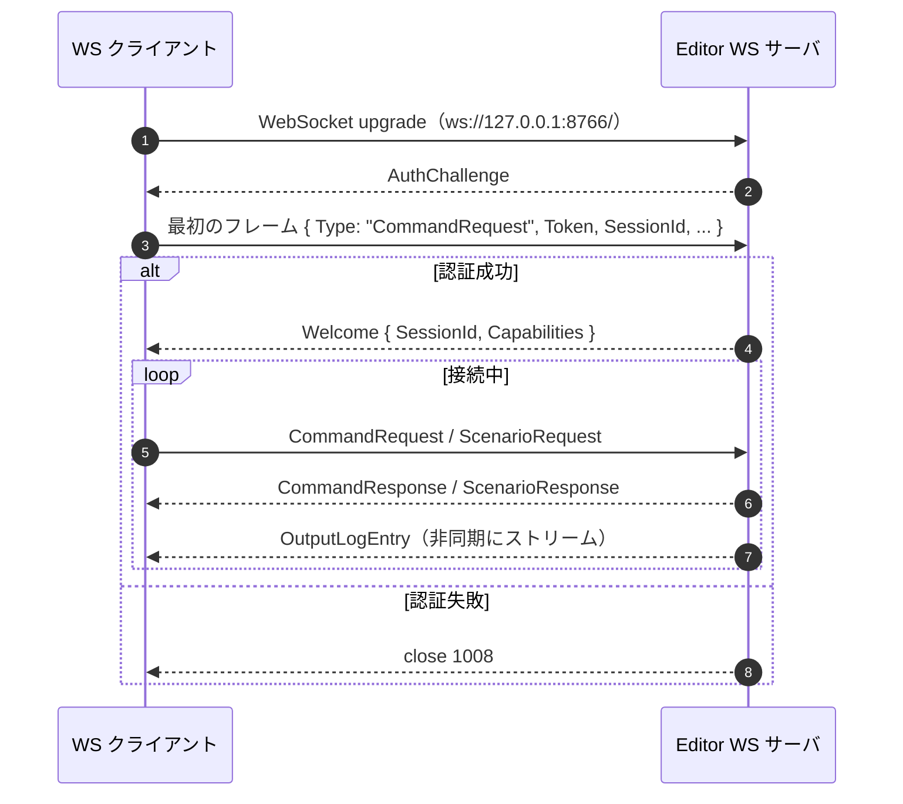
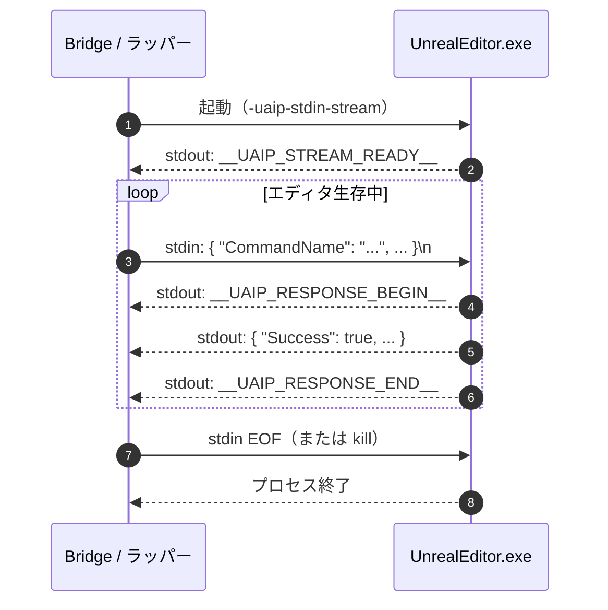

**[English](../en/connections.md)** | [概要に戻る](overview.md)

# 接続方法

UAIP には 4 つのトランスポートが用意されています。用途に合ったものを選んでください。

| トランスポート | ポート（Editor） | ポート（Packaged） | 主な用途 |
|---|---|---|---|
| **MCP Bridge** | — | — | AI クライアント（Claude Code・Cursor・Windsurf・Copilot など） |
| **HTTP API** | 8765 | 8767 | 独自ツール連携・REST クライアント・CI/CD パイプライン |
| **WebSocket** | 8766 | 8768 | リアルタイムストリーミングと永続接続 |
| **CLI** | — | — | 単発の自動化やシェルスクリプト |

> **デモ版の制限**：デモバイナリは **MCP トランスポートのみ** に対応しています。HTTP・WebSocket・CLI を使うには製品版が必要です。

---

## トランスポート比較



4 つのトランスポートはエディタ内の同じディスパッチコアに終端するので（[アーキテクチャ](architecture.md) を参照）、どれを使っても Capability と Policy の挙動は同じです。

---

## MCP Bridge

AI クライアントと連携するなら MCP Bridge がおすすめです。`thin_proxy.py` という Python プロキシが AI クライアントと UE Editor の間に立ち、MCP のツール呼び出しを内部で UAIP の HTTP リクエストに変換します。AI クライアント ↔ Bridge は MCP の stdio、Bridge ↔ UE Editor はループバック HTTP で通信します。

5 分で動かす最短ルートは [クイックスタート](quickstart.md) を参照してください。

> MCP Bridge は **プラグイン本体とは別配布** で、ドキュメントリポジトリの [Releases](../../../releases) から `UAIP-MCPBridge-<version>.zip` をダウンロードします（Fab のパッケージング規約によりプラグインには同梱しません）。UE バージョン非依存の単一 zip です。

### 前提条件

- `Plugins/UnrealAIIntegrationPlatform` フォルダがプロジェクトの `Plugins` 配下に配置されている
- UE プロジェクトで **UnrealAIIntegrationPlatform** プラグインが有効になっている
- Python 3.10 以降がインストールされ `PATH` に通っている
- 対応 AI クライアントのいずれか（Claude Code・Codex CLI・Claude Desktop・Cursor・Windsurf・GitHub Copilot）

### ステップ 1 — Bridge zip をダウンロードして展開

ドキュメントリポジトリの [Releases](../../../releases) から `UAIP-MCPBridge-<version>.zip` をダウンロードし、任意の場所（例：`Downloads/UAIPMCPBridge/`）に展開してください。展開先は **インストーラの実行元** であり、最終的なデプロイ先ではありません。

### ステップ 2 — インストーラを実行

展開したフォルダから `install/install.ps1`（Windows）または `install/install.cmd`（PowerShell 実行ポリシー制限時のラッパー）を実行：

```powershell
.\install\install.ps1
```

引数なしで起動すると **対話形式** になり、プロジェクトプラグインの隣に置くかエンジンプラグインの隣に置くかを尋ね、対応するパスを聞いてきます。

| 選択 | 入力 | デプロイ先 |
|---|---|---|
| `1` プロジェクトインストール | `.uproject` パス | `<Project>/Plugins/UAIPMCPBridge/` |
| `2` エンジンインストール | エンジンルート | `<Engine>/Engine/Plugins/.../UAIPMCPBridge/` |

引数で直接指定すれば対話なしで実行できます：

```powershell
.\install\install.ps1 -ProjectPath "F:\MyProjects\MyGame\MyGame.uproject"
.\install\install.ps1 -EnginePath  "F:\Epic Games\UE_5.8"
```

インストーラの動作：

| ステップ | アクション |
|---|---|
| 1 | UAIP プラグインを探索し、デプロイ先を解決 |
| 2 | Bridge ファイルを `<UAIP-parent>/UAIPMCPBridge/` にコピー |
| 3 | Python 3.10+ の存在を確認 |
| 4 | `<bridge-root>/.venv/` に Python 仮想環境を作成 |
| 5 | venv 内で `pip install -r requirements.txt` |
| 6 | デフォルトの `<bridge-root>/config.json` を生成 |
| 7 | 検出済みパスを埋めた MCP クライアント登録スニペットを表示 |

完了後、Bridge は `<UAIP-parent>/UAIPMCPBridge/`（`UnrealAIIntegrationPlatform/` と同階層）に配置され、venv Python は `<bridge-root>/.venv/Scripts/python.exe`（Windows）または `<bridge-root>/.venv/bin/python`（macOS / Linux）に作成されます。

### ステップ 3 — MCP サーバーキーを決定

サーバーキーは AI クライアント設定内で本 Bridge インスタンスを識別するための名前です。インストーラが既定値を選んで表示するので、別の値が必要な場合のみ参照してください。

| プラグイン配置 | キー形式 | 例 |
|---|---|---|
| プロジェクトプラグイン（Bridge が `<Project>/Plugins/` 配下） | `uaip-<プロジェクト名>` | `uaip-MyGame` |
| エンジンプラグイン（Bridge が `<Engine>/Engine/Plugins/` 配下） | `uaip-<エンジンフォルダ名>` | `uaip-UE_5.8` |

AI クライアント上での表示にしか影響しないので、ユニークなら任意の名前で構いません。

### ステップ 4 — AI クライアントに MCP サーバーを登録

インストーラが venv Python のパスと自動検出した `UAIP_UE_EDITOR_PATH` / `UAIP_UPROJECT_PATH` を含む JSON スニペットを表示します。それをそのままクライアントの設定ファイルに貼り付けてください。

```json
{
  "mcpServers": {
    "<key>": {
      "command": "<bridge-root>/.venv/Scripts/python.exe",
      "args":    ["<bridge-root>/thin_proxy.py"],
      "env": {
        "UAIP_UE_EDITOR_PATH": "<UnrealEditor.exe の絶対パス>",
        "UAIP_UPROJECT_PATH":  "<your.uproject の絶対パス>"
      }
    }
  }
}
```

> インストーラは venv の Python を `command` に指定するため、MCP クライアント側に system-wide Python が `PATH` に通っている必要はありません。

使用するクライアントを選び、対応ページで設定ファイルの場所とクライアント固有の流儀を確認してください：

| クライアント | ページ | 備考 |
|---|---|---|
| **Claude Code**（CLI / VS Code 拡張） | [claude-code.md](clients/claude-code.md) | 最良サポート。プロジェクト毎の `.mcp.json` またはグローバル `~/.claude.json` |
| **Codex CLI** | [codex.md](clients/codex.md) | OpenAI の公式 CLI。`~/.codex/config.toml`（TOML 形式） |
| **Claude Desktop** | [claude-desktop.md](clients/claude-desktop.md) | `claude_desktop_config.json` |
| **Cursor** | [cursor.md](clients/cursor.md) | `~/.cursor/mcp.json` または `.cursor/mcp.json` |
| **Windsurf** | [windsurf.md](clients/windsurf.md) | `~/.codeium/windsurf/mcp_config.json` |
| **GitHub Copilot（VS Code）** | [copilot.md](clients/copilot.md) | `.vscode/mcp.json` |

各クライアント別ページには、設定 JSON のサンプル、AI 利用ガイド（`<bridge-root>/install/guides/`）の配置方法、動作確認の手順（「AI に HealthCheck を実行させる」）がそろっています。

インストーラとパスの詳細リファレンス：Bridge と一緒にデプロイされる `<bridge-root>/install/SETUP.md`。

### シナリオ実行を有効化（オプション）

`uaip_run_scenario` はデフォルトでは無効です。有効化するには `<bridge-root>/config.json` の `enable_scenario` を `true` にしてください：

```json
{
  "editor_path":                  "",
  "uproject_path":                "",
  "http_startup_timeout_seconds": 120,
  "command_timeout_seconds":      60,
  "log_level":                    "INFO",
  "enable_scenario":              true,
  "inline_artifacts": { "image": false, "json": true, "text": true }
}
```

`config.json` の `editor_path` / `uproject_path` はフォールバック値で、MCP クライアントの `env`（`UAIP_UE_EDITOR_PATH` / `UAIP_UPROJECT_PATH`）が優先されます。シナリオで何ができるかは [シナリオ実行](scenario.md)、`config.json` の全キーは [設定リファレンス](config.md#mcp-bridge-configjson) を参照。

### MCP クライアントを再起動せずに config をリロード

`config.json` を編集した後、AI から `uaip_reload_config` を呼び出すことで変更を即時反映できます。Bridge がファイルを読み直し、起動パラメータが変わっていればエディタをシャットダウンして次回コマンド時に再起動します：

```
uaip_reload_config()
```

`config.json` を編集せずに現セッション限りでエンジンバージョンやプロジェクトを切り替えるには：

```
uaip_reload_config(EditorPath="F:\\Epic Games\\UE_5.9\\Engine\\Binaries\\Win64\\UnrealEditor.exe")
```

詳細は [設定リファレンス → 実行時の config リロード](config.md#実行時の-config-リロードuaip_reload_config) を参照。

### MCP セットアップのトラブルシューティング

| 症状 | 原因 | 対処 |
|---|---|---|
| `install.ps1` が実行ポリシーでブロック | PowerShell 実行ポリシー | `install.cmd` を使うか、`Set-ExecutionPolicy -Scope CurrentUser RemoteSigned` を実行して再試行 |
| インストーラが UAIP プラグインを見つけられない | `.uproject` / エンジンパスが誤り | 正しい `-ProjectPath` / `-EnginePath` を指定して再実行 |
| AI クライアントでツールが見つからない | MCP サーバ未接続 | スニペット内のキーと `thin_proxy.py` のパスを確認し、クライアントを再起動 |
| 初回コマンドで 120 秒タイムアウト | エディタ起動失敗 | MCP `env` の `UAIP_UE_EDITOR_PATH` / `UAIP_UPROJECT_PATH` を確認 |
| Python 起動エラー | venv 内の依存不足 | インストーラを再実行（venv が再作成される） |
| `PolicyViolation` が返る | Capability 未付与 / SafetyPolicy フラグ OFF | [Safety & Capabilities](safety.md) を参照 |
| `CommandNotFound` | コマンド名の間違い | `uaip_list_commands(ProviderPrefix="UAIP.Core")` で確認 |

より広範な診断は [トラブルシューティング](troubleshooting.md) を参照してください。

---

## HTTP API（製品版）

HTTP API は REST インターフェースを公開します。AI クライアントを介さない独自スクリプト・CI/CD・独自ツール連携に向いています。socket 層は `0.0.0.0` にバインドするため、Bearer トークンとファイアウォール越しに別 PC からも到達できます（FullHTTP モード）。アクセス制御はトークンと運用側のネットワーク設定で担保してください。詳細は [セキュリティ → ネットワーク面](security.md#ネットワーク面) を参照。

### 有効化

エディタを `-uaip-http-enable` フラグ付きで起動します：

```
UnrealEditor.exe MyProject.uproject -uaip-http-enable
```

ポートを変更する場合（デフォルト：Editor `8765`・Packaged `8767`）：

```
UnrealEditor.exe MyProject.uproject -uaip-http-enable -uaip-http-port=9000
```

### 認証

起動時に UAIP がランダムな 32 文字の Bearer トークンを以下に書き込みます：

```
Saved/UAIP/EditorHttpAuthToken.txt
```

すべてのリクエストにこのトークンを含めてください：

```http
Authorization: Bearer <token>
```

開発環境・CI 環境で認証を無効にする場合（本番環境では使用しないこと）：

```
-uaip-http-no-auth
```

### エンドポイント

| メソッド | パス | 説明 |
|---|---|---|
| GET | `/uaip/health` | ヘルスチェック — `{"status":"ok"}` を返す |
| GET | `/uaip/capabilities` | 現在のセッションで利用可能な Capability 一覧 |
| POST | `/uaip/sessions` | セッション作成 — `{"SessionId":"..."}` を返す |
| DELETE | `/uaip/sessions/:sessionId` | セッション終了 |
| POST | `/uaip/commands` | コマンド実行 |
| POST | `/uaip/scenarios` | シナリオ実行（完了まで待機） |
| GET | `/uaip/artifacts/:artifactId` | Artifact のダウンロード |
| GET | `/uaip/sessions/:sessionId/artifacts` | セッションの Artifact 一覧 |

### コマンド実行例

```http
POST /uaip/commands
Content-Type: application/json
Authorization: Bearer <token>

{
  "CommandName": "UAIP.Core.HealthCheck",
  "Params": {},
  "SessionId": "my-session"
}
```

レスポンス：

```json
{
  "Success": true,
  "Data": { ... },
  "Artifacts": [...],
  "ErrorCode": null,
  "ErrorMessage": null
}
```

### 制限値

| 項目 | 上限 |
|---|---|
| 最大リクエストボディ | 64 KiB |
| 最大 Artifact レスポンス | 100 MiB |
| 最大同時コマンド数 | 1 |
| コマンドタイムアウト | 120 秒 |

---

## WebSocket（製品版）

WebSocket トランスポートはリアルタイムログストリーミングに対応した永続的な双方向接続を提供します。

### 有効化

```
UnrealEditor.exe MyProject.uproject -uaip-ws-enable
```

ポートを変更する場合（デフォルト：Editor `8766`・Packaged `8768`）：

```
UnrealEditor.exe MyProject.uproject -uaip-ws-enable -uaip-ws-port=9001
```

### 接続 URL

```
ws://127.0.0.1:8766/
```

接続はローカルホスト（`127.0.0.1` および `::1`）に限定されます。

### 認証

起動時に UAIP がトークンを以下に書き込みます：

```
Saved/UAIP/EditorWsAuthToken.txt
```

最初のリクエストフレームにトークンを含めてください：

```json
{
  "Type": "CommandRequest",
  "ClientProtocolVersion": "1.0",
  "Token": "<token>",
  "RequestId": "req-001",
  "SessionId": "my-session",
  "CommandName": "UAIP.Core.HealthCheck",
  "Params": {}
}
```

認証を無効にする場合（開発・CI 環境のみ）：

```
-uaip-ws-no-auth
```

### ハンドシェイクとメッセージフロー



### メッセージタイプ

**Inbound（クライアント → サーバー）：**

| `Type` | 用途 |
|---|---|
| `CommandRequest` | コマンド実行 |
| `ScenarioRequest` | シナリオ実行 |

**Outbound（サーバー → クライアント）：**

| `Event` | 用途 |
|---|---|
| `AuthChallenge` | 認証要求 |
| `Welcome` | 接続確立 — `SessionId` と `Capabilities` を含む |
| `CommandResponse` | コマンド結果 |
| `ScenarioResponse` | シナリオ結果 |
| `OutputLogEntry` | ストリーミングログ行（リアルタイム） |

### 出力ログのストリーミング

サーバーは UE の全ログ出力をリアルタイムで `OutputLogEntry` イベントとして送信します。無効にする場合：

```
-uaip-ws-no-output-log
```

### 制限値

| 項目 | 上限 |
|---|---|
| 最大受信メッセージサイズ | 64 KiB |
| 最大シナリオペイロード | 1 MiB |
| 最大同時接続数 | 4 |
| ハンドシェイクタイムアウト | 5 秒 |
| コマンドタイムアウト | 12 秒 |

---

## CLI（製品版）

CLI トランスポートはエディタを特定の引数付きで起動することでコマンドを実行します。永続サーバーを必要としない単発自動化やシェルスクリプト・CI パイプラインに適しています。

### 単発実行（One-shot）

コマンドを実行し、結果を出力してエディタが終了します。

**インライン JSON：**

```
UnrealEditor.exe MyProject.uproject -uaip-request="{\"CommandName\":\"UAIP.Core.HealthCheck\",\"Params\":{}}"
```

**JSON ファイルから：**

```
UnrealEditor.exe MyProject.uproject -uaip-request-file="Saved/UAIP/Requests/cmd.json"
```

**結果をファイルに書き出す：**

```
UnrealEditor.exe MyProject.uproject -uaip-request-file="..." -uaip-response-file="Saved/UAIP/Responses/result.json"
```

**シナリオをファイルから実行：**

```
UnrealEditor.exe MyProject.uproject -uaip-scenario-file="path/to/scenario.json"
```

### ストリームモード

エディタが stdin から JSON リクエストを読み取り、stdout にレスポンスを書き込む永続モードです。シェルスクリプトや CI ラッパーから常駐プロセスとして使う用途を想定しています（現在の MCP Bridge はループバック HTTP 経由でエディタと通信するため、このモードは使用していません）。

```
UnrealEditor.exe MyProject.uproject -uaip-stdin-stream
```



マーカー（`__UAIP_*__`）により、通常の UE ログ出力と request/response を同じ stdout で混在させられます。

**stdout マーカー：**

| マーカー | 意味 |
|---|---|
| `__UAIP_STREAM_READY__` | エディタがリクエストを受け付ける準備完了 |
| `__UAIP_RESPONSE_BEGIN__` | JSON レスポンスの開始 |
| `__UAIP_RESPONSE_END__` | JSON レスポンスの終了 |

### CLI フラグ一覧

| フラグ | 説明 |
|---|---|
| `-uaip-request=<json>` | インライン JSON からコマンドを実行 |
| `-uaip-stdin` | stdin から単一リクエストを読み取る |
| `-uaip-request-file=<path>` | JSON ファイルからコマンドを読み取る |
| `-uaip-response-file=<path>` | レスポンスをファイルに書き出す |
| `-uaip-scenario=<json>` | インライン JSON からシナリオを実行 |
| `-uaip-scenario-file=<path>` | JSON ファイルからシナリオを読み取る |
| `-uaip-stdin-stream` | 永続ストリームモードを有効化 |

### 制限値

| 項目 | 上限 |
|---|---|
| 最大リクエストボディ | 1 MiB |
| コマンドタイムアウト | 120 秒 |
