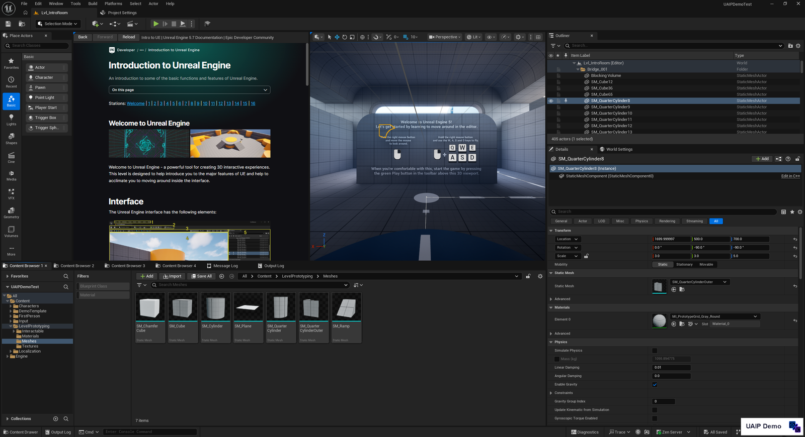
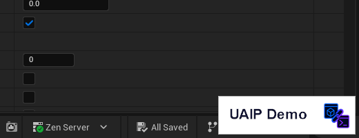

**[English](../en/demo.md)** | [概要に戻る](overview.md)

# デモ版ガイド

UAIP のデモ版は GitHub Releases で無償配布している、機能を絞ったバイナリです。観測・PIE 制御・アサーション・シナリオ実行・UI 自動化に加えて、アセット・レベル上のアクター・プロパティ・プラグイン・設定・ログ・コンソール変数・Unreal Insights トレースの読み取り専用コマンドを利用できるので、AI エージェントをレビューやテストのワークフローに組み込むには十分な機能がそろっています。

> **ライセンス**：デモ版は **個人利用・評価目的のみ** での利用を許諾しています。商用利用は対象外で、リリースアーカイブ同梱の `EULA.txt` に従ってください。商用利用の場合は、製品版（[Fab で公開中](https://www.fab.com/listings/0eedf909-00ac-4d95-b109-8fda51800fff)）をご利用ください。

---

## デモ版と製品版の比較

| | デモ版 | 製品版（Fab） |
|---|:---:|:---:|
| **接続方式** | | |
| MCP | ✅ | ✅ |
| HTTP API（`/uaip/commands` など） | — | ✅ |
| WebSocket | — | ✅ |
| CLI | — | ✅ |
| Artifact 取得（`/uaip/artifacts/*`） | ✅ | ✅ |
| **コマンド** | | |
| Core（HealthCheck、ListCommands など） | ✅ | ✅ |
| Editor 観測（スクリーンショット・ダンプ） | ✅ | ✅ |
| Editor ワークスペース操作（タブのフォーカス・グラフの表示調整・エディタ再起動など） | ✅ | ✅ |
| PIE 制御（StartPIE、StopPIE、LoadMap など） | ✅ | ✅ |
| Runtime 観測（ビューポートキャプチャ・ワールドダンプ） | ✅ | ✅ |
| シナリオ実行（`uaip_run_scenario`） | ✅ | ✅ |
| UI 自動化（ClickWidget、PressKey、FillForm など） | ✅ | ✅ |
| Runtime アサーション（WaitSeconds、AssertActorProperty など） | ✅ | ✅ |
| Editor の読み取り専用コマンド（アセット・レベル上のアクターとコンポーネント・プロパティ・プラグイン・設定・ログ・CVar） | ✅ | ✅ |
| Unreal Insights トレースの参照（チャンネル・状態・取得済みファイル） | ✅ | ✅ |
| Unreal Insights トレースの記録・解析 | — | ✅ |
| Editor 編集（Blueprint、Level、Assets、Material など） | — | ✅ |
| Runtime ワールド編集（SpawnActor、GAS、Input inject など） | — | ✅ |
| Python スクリプト実行（`RunEditorPythonScript`） | — | ✅ |
| **その他** | | |
| キャプチャ画像への透かし | ✅ | — |
| ユーザー拡張ポイント（`ICommandProvider`） | ✅ | ✅ |
| オプションプラグイン連携（Toolset、GAS、Niagara など） | — | ✅ |
| 対応 UE バージョン | 5.7 / 5.8 | 5.7 / 5.8 |

---

## インストール

1. [Releases](../../../releases) ページから `UAIP-Demo-UE<version>-Win64.zip` をダウンロード
2. zip を UE プロジェクトの `Plugins/` フォルダに展開（`Plugins/UnrealAIIntegrationPlatformDemo/` として展開されます）
3. 展開したフォルダ内の `Config/DefaultUAIP.ini` をプロジェクトの `Config/` フォルダにコピー（`AllowLogDump` / `AllowContextMenuMutation` / `AllowKeyboardInput` / `AllowKeyboardModifierInput` が有効で、コンソール変数の読み取り用に `RuntimeCVarRead` Capability を許可済みの設定）。観測・UI 自動化・PIE 制御は既定で許可されているため追記は不要です。下のコマンド表で Capability 名が書かれた一部のコマンドだけは、`[UAIP.SafetyPolicy]` に `+AllowedCapabilities=<Name>` の行を追加してください
4. AI クライアントに MCP サーバーを登録（[接続方法 → MCP Bridge](connections.md#mcp-bridge) を参照）

### 製品版への移行

`Config/DefaultUAIP.ini` の設定形式はデモ版と製品版で共通です。デモ版でコピーした `DefaultUAIP.ini` はそのまま引き継げるため、ini の差し替えは不要です。プラグインフォルダの構造も MCP サーバの登録方法も同じなので、他に変更は必要ありません。

---

## 有効なコマンド一覧

以下はすべてデモ版に登録されているコマンドです。**読み取り専用の一部** と書かれた名前空間では、エディタを変更するコマンドは製品版のみです（[除外コマンド](#除外コマンド) を参照）。備考欄に Capability 名があるコマンドは既定で拒否されるため、`+AllowedCapabilities=<Name>` で許可してから呼び出してください。

### `UAIP.Core.*`

| コマンド | 説明 | 備考 |
|---|---|---|
| `UAIP.Core.HealthCheck` | 接続状態と UAIP バージョンを返す | |
| `UAIP.Core.GetSystemInfo` | プロジェクト名・プラットフォーム・エンジン版・ビルド設定を返す | |
| `UAIP.Core.ListCommands` | 登録済みコマンド一覧を返す（ProviderPrefix・キーワードフィルター対応）。一覧から除外したコマンドの件数と理由も返す（`HiddenCount` / `HiddenReasons`） | |
| `UAIP.Core.DescribeCommand` | コマンドの詳細（説明・パラメータスキーマ・必要 Capability）を返す | |
| `UAIP.Core.QueryCapabilities` | 現在のセッションの Capability セットを返す。`IncludeUnavailable: true` で登録済みの全 Capability も返す | |
| `UAIP.Core.ListIntegrations` | オプションプラグイン連携それぞれの状態を返す（[除外コマンド](#除外コマンド) を参照） | |
| `UAIP.Core.ListPlugins` | UE プラグイン情報（名前・バージョン・有効化状態）を返す | 非推奨。`UAIP.Runtime.Engine.Plugin.ListPlugins` を使用 |
| `UAIP.Core.EndSession` | セッション終了・ウィジェット参照解放・Artifact GC | |
| `UAIP.Core.ReloadCapabilities` | `DefaultUAIP.ini` から Capability を再読み込み | `AllowCapabilityReload=True` が必要 |
| `UAIP.Core.GetPendingInteractionStatus` | 保留中の対話の状態を返す | 対話を開始するコマンドがデモ版に無いため、この 3 つは常に `NotFound` を返す |
| `UAIP.Core.WaitForPendingInteraction` | 保留中の対話が終わるまで待機する | 同上 |
| `UAIP.Core.CancelPendingInteraction` | 自セッションが開始した対話を中止する | 同上 |

### `UAIP.Core.Artifacts.*`

| コマンド | 説明 |
|---|---|
| `UAIP.Core.Artifacts.GetArtifact` | 自セッションが生成した Artifact の保存内容を返す |

### `UAIP.Editor.Observation.*`

| コマンド | 説明 | 備考 |
|---|---|---|
| `UAIP.Editor.Observation.CaptureActiveWindowImage` | アクティブウィンドウのスクリーンショット | 透かしあり |
| `UAIP.Editor.Observation.CaptureEditorTabImage` | 指定エディタータブのスクリーンショット | 透かしあり |
| `UAIP.Editor.Observation.CaptureGraphViewportImage` | グラフビューポート（Blueprint 等）のスクリーンショット | 透かしあり |
| `UAIP.Editor.Observation.CaptureViewportImageAnnotated` | ワールド座標のラベルを描き込んだビューポートのスクリーンショット | 透かしあり。`ViewportAnnotationCapture` |
| `UAIP.Editor.Observation.DumpEditorState` | エディター状態（開いているアセット・アクティブタブ等）を JSON で返す | |
| `UAIP.Editor.Observation.DumpSelectionState` | 現在の選択状態を JSON で返す | |
| `UAIP.Editor.Observation.DumpOpenTabs` | 開いているタブ一覧を JSON で返す | |
| `UAIP.Editor.Observation.DumpOutputLog` | 出力ログを取得する | |
| `UAIP.Editor.Observation.DumpMessageLog` | メッセージログを取得する | |
| `UAIP.Editor.Observation.DumpSlateTree` | Slate ウィジェット階層を JSON で返す | |
| `UAIP.Editor.Observation.InspectMenu` | メニュー構造情報を返す | |
| `UAIP.Editor.Observation.InspectContextMenu` | コンテキストメニュー情報を返す | |
| `UAIP.Editor.Observation.ObserveWidget` | ウィジェットを監視登録（キャッシュ）する | |
| `UAIP.Editor.Observation.ListGraphNodes` | グラフのノード一覧を返す | |
| `UAIP.Editor.Observation.GetLogCategories` | 登録済みのログカテゴリ名を返す | |

### `UAIP.Editor.Workspace.*`

| コマンド | 説明 | 備考 |
|---|---|---|
| `UAIP.Editor.Workspace.FocusEditorTab` | アセットのエディタータブを前面に出す（`AssetPath` で指定） | |
| `UAIP.Editor.Workspace.CloseEditorTab` | アセットのエディタータブを閉じる（`AssetPath` で指定） | |
| `UAIP.Editor.Workspace.ListSpawnableTabs` | 開くことのできるエディタータブを Slate のレイアウト ID 付きで返す | `EditorTabSpawn` |
| `UAIP.Editor.Workspace.OpenTabById` | Slate のレイアウト ID でエディタータブを開く | `EditorTabSpawn` |
| `UAIP.Editor.Workspace.CloseTabById` | Slate のレイアウト ID でエディタータブを閉じる | `EditorTabSpawn` |
| `UAIP.Editor.Workspace.NormalizeEditorLayout` | メイングラフのタブにフォーカスし、一時的なパネルを隠す | |
| `UAIP.Editor.Workspace.SetGraphZoom` | グラフビューのズーム倍率を設定する | |
| `UAIP.Editor.Workspace.FrameGraphAll` | グラフ全体をビューに収める | |
| `UAIP.Editor.Workspace.FrameGraphSelection` | 選択ノードをビューに収める | |
| `UAIP.Editor.Workspace.SetGraphSelection` | グラフノードを ID で選択する | |
| `UAIP.Editor.Workspace.GetUndoHistory` | アンドゥ／リドゥの履歴を変更せずに読み取る | |
| `UAIP.Editor.Workspace.Undo` | 直前のエディタ操作をアンドゥする | `EditorUndoRedo` |
| `UAIP.Editor.Workspace.Redo` | アンドゥした操作をリドゥする | `EditorUndoRedo` |
| `UAIP.Editor.Workspace.SaveAllPackages` | 変更のあるパッケージをすべて保存する | |
| `UAIP.Editor.Workspace.ShutdownEditor` | エディタを終了する | |
| `UAIP.Editor.Workspace.RestartEditor` | エディタを再起動する | |
| `UAIP.Editor.Workspace.GetLastCrashReport` | 最新のクラッシュレポートを取得する | |

### `UAIP.Runtime.PIE.*`

| コマンド | 説明 |
|---|---|
| `UAIP.Runtime.PIE.StartPIE` | Play in Editor（PIE）を起動する |
| `UAIP.Runtime.PIE.StopPIE` | PIE を停止する |
| `UAIP.Runtime.PIE.PausePIE` | PIE を一時停止する |
| `UAIP.Runtime.PIE.ResumePIE` | PIE を再開する |
| `UAIP.Runtime.PIE.LoadMap` | マップを読み込む |
| `UAIP.Runtime.PIE.GetPIEState` | 現在の PIE の状態（`Running` / `Stopped` / `Paused` / `Simulating`）を返す |

### `UAIP.Runtime.Observation.*`

| コマンド | 説明 | 備考 |
|---|---|---|
| `UAIP.Runtime.Observation.CaptureViewportImage` | ゲームビューポートのスクリーンショット | 透かしあり |
| `UAIP.Runtime.Observation.DumpWorldState` | ワールド状態（全アクター・コンポーネント・トランスフォーム）を JSON で返す | |
| `UAIP.Runtime.Observation.DumpActorState` | 指定アクターの状態を JSON で返す | |
| `UAIP.Runtime.Observation.DumpComponentState` | 指定コンポーネントの状態を JSON で返す | |
| `UAIP.Runtime.Observation.DumpRuntimeLog` | ランタイムログを取得する | |
| `UAIP.Runtime.Observation.CapturePerformanceSnapshot` | FPS・メモリ等のパフォーマンス統計を取得する | |
| `UAIP.Runtime.Observation.CheckpointCapture` | スクリーンショット＋状態ダンプの複合観測（シナリオ primitive） | 透かしあり |
| `UAIP.Runtime.Observation.SearchLoadedClasses` | ロード済みクラスを検索する | |

### `UAIP.Runtime.Assertion.*`

| コマンド | 説明 |
|---|---|
| `UAIP.Runtime.Assertion.WaitSeconds` | 指定秒数待機する（シナリオ primitive） |
| `UAIP.Runtime.Assertion.WaitForCondition` | 条件評価ループで待機する（シナリオ primitive） |
| `UAIP.Runtime.Assertion.AssertActorProperty` | アクタープロパティをアサートする（失敗時も Artifact を出力） |
| `UAIP.Runtime.Assertion.AssertWorldState` | 複数プロパティをバッチアサートする |

### `UAIP.Editor.UIAutomation.*`

| コマンド | 説明 | 備考 |
|---|---|---|
| `UAIP.Editor.UIAutomation.SnapshotUI` | UI 構造スナップショットを取得する | |
| `UAIP.Editor.UIAutomation.ClickWidget` | ウィジェットをクリックする | |
| `UAIP.Editor.UIAutomation.SelectMenuItem` | メニューアイテムを選択する | |
| `UAIP.Editor.UIAutomation.InputText` | テキストを入力する | |
| `UAIP.Editor.UIAutomation.SetCheckboxState` | チェックボックスの状態を設定する | |
| `UAIP.Editor.UIAutomation.SetComboSelection` | コンボボックスを選択する | |
| `UAIP.Editor.UIAutomation.DragGraphNode` | グラフノードをドラッグする | |
| `UAIP.Editor.UIAutomation.ConnectGraphPins` | グラフピンを接続する | |
| `UAIP.Editor.UIAutomation.AcceptDialog` | ダイアログを OK で閉じる | |
| `UAIP.Editor.UIAutomation.CancelDialog` | ダイアログをキャンセルで閉じる | |
| `UAIP.Editor.UIAutomation.InvokeContextMenuAction` | コンテキストメニューアクションを呼び出す | |
| `UAIP.Editor.UIAutomation.HoverWidget` | ウィジェットをホバーする | |
| `UAIP.Editor.UIAutomation.PressKey` | キー入力を送る | `EditorKeyboardInput` |
| `UAIP.Editor.UIAutomation.WaitForWidget` | ウィジェットの出現を待機する | |
| `UAIP.Editor.UIAutomation.FillForm` | フォームを自動入力する | |
| `UAIP.Editor.UIAutomation.OpenPasswordTestWindow` | パスワード欄を持つテスト用ウィンドウを開く（パスワード欄のポリシー検証用） | |

### `UAIP.Editor.Assets.*`（読み取り専用の一部）

| コマンド | 説明 | 備考 |
|---|---|---|
| `UAIP.Editor.Assets.SearchAssets` | パス・クラス・タグでアセットを検索する | |
| `UAIP.Editor.Assets.GetOpenAssets` | アセットエディタで開いているアセットを返す | |
| `UAIP.Editor.Assets.GetSelectedAssets` | コンテンツブラウザで選択中のアセットを返す | |
| `UAIP.Editor.Assets.GetContentBrowserPath` | コンテンツブラウザで表示中のフォルダを返す | |
| `UAIP.Editor.Assets.ListDirtyPackages` | 未保存の変更があるパッケージを返す | |
| `UAIP.Editor.Assets.ListAssetRedirectors` | フォルダ配下のアセットリダイレクタを返す | |
| `UAIP.Editor.Assets.ListCreatableAssetClasses` | `CreateAsset` で作成できるアセットクラスを返す | |
| `UAIP.Editor.Assets.ListFactoriesForClass` | アセットクラスに対応するファクトリ候補を返す | |
| `UAIP.Editor.Assets.GetAssetReferences` | アセットの参照グラフ（参照元・依存先）をたどる | |
| `UAIP.Editor.Assets.GetAssetDependencyPath` | 2 つのアセット間の最短依存パスを求める | |
| `UAIP.Editor.Assets.GetAssetSizeMap` | フォルダ配下のアセットごとのサイズを集計する | |
| `UAIP.Editor.Assets.GetAssetSizeMapByClass` | フォルダ配下のサイズをアセットクラスごとに集計する | |
| `UAIP.Editor.Assets.StartAssetAudit` | アセット監査をバックグラウンドのジョブとして開始する（エディタは応答し続ける） | |
| `UAIP.Editor.Assets.GetAssetAuditStatus` | 監査ジョブの進捗を取得する | |
| `UAIP.Editor.Assets.GetAssetAuditResult` | 完了した監査ジョブのレポートを取得する | |
| `UAIP.Editor.Assets.FindUnreferencedAssets` | フォルダ配下の参照されていないアセットを探す | 非推奨。`StartAssetAudit` を使用 |
| `UAIP.Editor.Assets.FindCircularReferences` | フォルダ配下の循環依存を探す | 非推奨。`StartAssetAudit` を使用 |
| `UAIP.Editor.Assets.FindBrokenReferences` | 存在しないパッケージへの依存を探す | 非推奨。`StartAssetAudit` を使用 |
| `UAIP.Editor.Assets.RunAssetAudit` | 複合監査を 1 回の呼び出しで実行する | 非推奨。`StartAssetAudit` を使用 |
| `UAIP.Editor.Assets.ListPrimaryAssetTypes` | 登録済みの Primary Asset Type を返す | |
| `UAIP.Editor.Assets.GetPrimaryAssetTypeInfo` | Primary Asset Type 1 件の詳細を返す | |
| `UAIP.Editor.Assets.ListPrimaryAssets` | Primary Asset Type に属する Primary Asset を返す | |
| `UAIP.Editor.Assets.GetPrimaryAssetIdForPath` | アセットパスを `PrimaryAssetId` に解決する | |
| `UAIP.Editor.Assets.GetPrimaryAssetRules` | Primary Asset に適用されるルールを返す | |
| `UAIP.Editor.Assets.GetAssetBundle` | Primary Asset の Asset Bundle を返す | |
| `UAIP.Editor.Assets.GetManagedPackageList` | Primary Asset が管理するパッケージを返す | |
| `UAIP.Editor.Assets.GetPrimaryAssetLoadList` | Primary Asset で実際にロードされる対象を解決する | |
| `UAIP.Editor.Assets.GetLoadedPrimaryAssets` | ロード中の Primary Asset を返す | |
| `UAIP.Editor.Assets.GetAssetTags` | アセットの Asset Registry タグを返す | |

### `UAIP.Editor.Level.*`（読み取り専用の一部）

| コマンド | 説明 |
|---|---|
| `UAIP.Editor.Level.ListLevelActors` | 開いているレベルの全アクターを返す |
| `UAIP.Editor.Level.ListSelectedActors` | エディタで選択中のアクターを返す |
| `UAIP.Editor.Level.GetActorTransform` | アクターのトランスフォームを返す |
| `UAIP.Editor.Level.GetVisibleActors` | アクティブなビューポートに映っているアクターを返す |
| `UAIP.Editor.Level.GetCameraTransform` | レベルエディタのビューポートカメラの位置と回転を返す |
| `UAIP.Editor.Level.ProjectWorldToScreen` | ワールド座標をスクリーン座標に投影する |
| `UAIP.Editor.Level.ProjectScreenToWorld` | スクリーン座標からワールドへレイを飛ばす |
| `UAIP.Editor.Level.ListActorComponents` | レベルに配置したアクターの全コンポーネントを返す |
| `UAIP.Editor.Level.GetActorComponentProperty` | 配置したアクターのコンポーネントのプロパティを読み取る |

### `UAIP.Editor.Property.*`（読み取り専用の一部）

| コマンド | 説明 |
|---|---|
| `UAIP.Editor.Property.GetActorProperty` | アクターのプロパティ値を取得する |
| `UAIP.Editor.Property.GetAssetProperty` | アセットのプロパティ値を取得する |
| `UAIP.Editor.Property.GetBlueprintDefault` | Blueprint のクラスデフォルトのプロパティを取得する |
| `UAIP.Editor.Property.GetWorldSetting` | World Settings のプロパティを取得する |
| `UAIP.Editor.Property.GetProjectSetting` | プロジェクト設定オブジェクトのプロパティを取得する |
| `UAIP.Editor.Property.GetDataTableRow` | DataTable の行のプロパティを取得する |

秘密情報と思われるプロパティの値はマスクして返します。

### `UAIP.Editor.Engine.*`（読み取り専用の一部）

| コマンド | 説明 |
|---|---|
| `UAIP.Editor.Engine.Plugin.GetPluginDescriptor` | プラグインの `.uplugin` 記述子を読み取る |
| `UAIP.Editor.Engine.Plugin.GetPluginDependents` | 指定プラグインに依存しているプラグインを返す |
| `UAIP.Editor.Engine.Plugin.GetPluginTemplateDescriptions` | 利用できるプラグインテンプレートを返す |
| `UAIP.Editor.Engine.Plugin.IsPluginCreationAllowed` | プラグインを新規作成できるかを確認する |
| `UAIP.Editor.Engine.Plugin.IsPluginModificationAllowed` | プラグインを変更できるかを確認する |
| `UAIP.Editor.Engine.ConfigSettings.ListSettingsContainers` | 設定コンテナ（`Project`・`Editor` など）を返す |
| `UAIP.Editor.Engine.ConfigSettings.ListSettingsCategories` | 設定コンテナのカテゴリを返す |
| `UAIP.Editor.Engine.ConfigSettings.ListSettingsSections` | 設定カテゴリのセクションを返す |
| `UAIP.Editor.Engine.ConfigSettings.GetSettingsSchema` | 設定セクションの編集可能なプロパティを返す |
| `UAIP.Editor.Engine.ConfigSettings.GetSettingsValues` | 設定セクションの現在値を返す（秘密情報はマスク） |
| `UAIP.Editor.Engine.Log.GetLogEntries` | エディタログの最近のエントリを取得する（パターンで絞り込み可） |

### `UAIP.Runtime.Engine.*`（読み取り専用の一部）

| コマンド | 説明 | 備考 |
|---|---|---|
| `UAIP.Runtime.Engine.Plugin.ListPlugins` | 検出済み・有効なプラグインを返す | |
| `UAIP.Runtime.Engine.Plugin.GetPluginInfo` | プラグインの詳細を返す | |
| `UAIP.Runtime.Engine.Plugin.IsEnabled` | プラグインが有効かを確認する | |
| `UAIP.Runtime.Engine.Plugin.GetPluginDependencies` | プラグインの直接の依存先を返す | |
| `UAIP.Runtime.Engine.Plugin.GetPluginForAsset` | アセットパスを所有するプラグインを解決する | |
| `UAIP.Runtime.Engine.Log.GetLogCategories` | 登録済みのログカテゴリ名を返す | |
| `UAIP.Runtime.Engine.Log.GetLogVerbosity` | ログカテゴリの詳細度を返す | |
| `UAIP.Runtime.Engine.Config.GetConfigValue` | セクションとキーを指定して ini の値を読み取る | |
| `UAIP.Runtime.Engine.CVar.GetConsoleVariable` | コンソール変数の値・型・ヘルプを返す | `RuntimeCVarRead`（デモ版の ini で許可済み） |
| `UAIP.Runtime.Engine.CVar.SearchConsoleVariables` | ワイルドカードでコンソール変数を検索する | `RuntimeCVarRead`（デモ版の ini で許可済み） |

### `UAIP.Runtime.Insights.Trace.*`（読み取り専用の一部）

| コマンド | 説明 |
|---|---|
| `UAIP.Runtime.Insights.Trace.ListTraceChannels` | トレースチャンネルと、それぞれの有効状態・記録しうる情報を返す |
| `UAIP.Runtime.Insights.Trace.GetTraceStatus` | トレースを記録中かどうかと、UAIP が開始したトレースの詳細を返す |
| `UAIP.Runtime.Insights.Trace.ListTraceFiles` | UAIP が取得したトレースファイルを返す |

---

## 制限事項

### 接続方式

デモ版は **MCP 専用モード** で動作します。`-uaip-http-enable` を指定しても HTTP API ルート（`/uaip/commands` 等）は登録されません（警告ログが出て無視されます）。有効なエンドポイントは `/mcp`・`/uaip/artifacts/*`・`/uaip/instance-proof` のみです。

### キャプチャ画像への透かし

以下のキャプチャコマンドが出力する PNG には **「UAIP Demo」** の透かしが入ります：

- `CaptureActiveWindowImage`
- `CaptureEditorTabImage`
- `CaptureGraphViewportImage`
- `CaptureViewportImageAnnotated`
- `CaptureViewportImage`（これを使う `CheckpointCapture` のスクリーンショットも含む）

<p align="center">
  
</p>

<p align="center">
  
</p>

レビューやテストの証跡として共有された画像が、デモ版で取得されたものだと分かるようにするための表示です。製品版では入りません。

### 除外コマンド

製品版には存在するが、デモ版では利用できないコマンド：

| コマンド | 理由・デモ版での応答 |
|---|---|
| デモ版に含まれないモジュールのコマンド（Blueprint、Material、Sequencer、Runtime ワールド編集、`UAIP.Editor.Execution.RunEditorPythonScript` などの Python 実行など） | 製品版のみ。`CommandNotFound` を返す |
| オプションプラグイン連携のコマンド（Niagara、StateTree、PCG、GAS、MetaHuman、LiveLink など） | 製品版のみ。`CommandNotFound` に「無償のデモ版には含まれず、Fab の製品版で利用できる」旨の案内が付く。`UAIP.Core.ListIntegrations` ではこれらの連携が `NotInThisEdition` と表示される |
| Toolset ブリッジのコマンド（`Toolset.*`）と `UAIP.Editor.Engine.Toolset.DumpToolsetParameterSchemas` | デモ版に含まれない Toolset 連携が必要。デモ版に含まれるモジュールのものは登録されているが常に利用不可で、`ListCommands` には出ず（`IncludeUnavailable: true` では `Available: false` として出る）、呼び出しても拒否される |
| デモ版に含まれる Assets・Level・Property・Engine・Insights の名前空間のうち、エディタを変更するコマンド（`CreateAsset`、`SaveAsset`、`PlaceActorInLevel`、`AddActorComponent`、`Set*Property`、`SetPluginEnabled`、`SetSettingsValues`、`SetConsoleVariable`、`StartTrace` など） | デモ版は上に挙げた読み取り専用の一部だけを提供する。`CommandNotFound` を返す |
| `UAIP.Editor.Workspace` の `WaitForShaderCompilation`・`RecompileGlobalShaders` と Live Coding 系コマンド | シェーダー・Live Coding の開発操作は製品版のみ。`CommandNotFound` を返す |
| トレース解析（`UAIP.Runtime.Insights.Analysis.*`） | デモ版ではコンパイル対象外。`CommandNotFound` を返す |

### ロード対象

デモ版はエディタ専用のバイナリです。パッケージビルドやランタイム（スタンドアロン・配布ビルド）には載りません。ランタイム側に UAIP を組み込みたい場合（Gauntlet テストや配布後の観測など）は、製品版を利用してください。

---

## シナリオ実行

シナリオ実行（`uaip_run_scenario`）はデモ版でも利用できます。`config.json` で有効化してください：

```json
{
  "editor_path":    "...",
  "uproject_path":  "...",
  "enable_scenario": true
}
```

詳細は [シナリオ実行](scenario.md) を参照してください。
