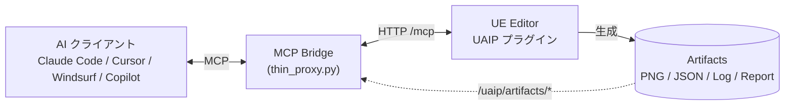

**[English](../../README.md)**

  

# UnrealAIIntegrationPlatform

<!--ts-->
   * [概要](#概要)
   * [動作環境](#動作環境)
   * [インストール](#インストール)
   * [セットアップ](#セットアップ)
   * [ドキュメント](#ドキュメント)
   * [ライセンス](#ライセンス)
   * [作者](#作者)
   * [履歴](#履歴)
<!--te-->

## 概要

**UnrealAIIntegrationPlatform (UAIP)** は、AI エージェントから UE Editor と Runtime を **操作・観測・実行・検証** するための Unreal Engine プラグインです。

Claude Code・Cursor・Windsurf・GitHub Copilot といった AI ツールが **Model Context Protocol (MCP)** 経由で接続し、意味レベルのコマンドを発行できます。座標クリックや壊れやすい UI スクリプトに頼る必要はありません。

主な機能：
- **Editor 操作** — アセットの開閉・保存、Blueprint 編集、アクター操作、Automation Test の実行、Sequencer の制御まで、540 以上の UAIP コマンド（公式 UE 5.8 Toolset への 190+ ブリッジコマンドを含め合計 730+）で Editor のほとんどの機能をカバー
- **視覚的・構造的な観測** — 任意の Editor タブやビューポートのスクリーンショット取得、ワールド状態 / Slate ウィジェットツリー / エディタ状態の JSON ダンプ
- **Runtime / PIE 制御** — PIE の開始と停止、アクターのスポーン、入力の注入、Gauntlet テストの実行、アクタープロパティのアサート
- **シナリオ実行** — 複数のコマンドを順序付きリストとして一括送信。失敗時の中断・リトライ・ステップごとのタイムアウトに対応
- **マルチ Transport** — MCP・HTTP・WebSocket・CLI のいずれからでも操作可能
- **Safety & Capability Policy** — セッション単位の Capability ゲートと、プロセス単位の SafetyPolicy スイッチで権限を細かく制御

### アーキテクチャ

MCP Bridge は AI クライアントからのツール呼び出しを、エディタへの HTTP リクエストへと変換します。キャプチャやダンプ系のコマンドは結果を Artifact として書き出し、Bridge は ID で AI クライアントへ返却します。HTTP API・WebSocket・CLI を直接使う方法は [接続方法](connections.md) を参照してください。

## 動作環境

対象バージョン : UE 5.7 / 5.8  
対象プラットフォーム : Windows  
Python : 3.10 以降（MCP Bridge に必要）

## インストール

UAIP には **デモ版** と **製品版** の 2 つの配布形式があります。

### デモ版（GitHub Releases から無償）

機能制限付きのバイナリ配布で、AI エージェントをレビューやテストのワークフローに組み込むのに十分な機能（MCP 接続・観測・PIE 制御・シナリオ実行・UI 自動化・アサーション）をそろえています。詳しいコマンド一覧と制限事項は [デモ版ガイド](demo.md) を参照してください。

1. このリポジトリの [Releases](../../../releases) から `UAIP-Demo-UE<バージョン>-Win64.zip` をダウンロード
2. zip を展開し、UE プロジェクトの `Plugins/UnrealAIIntegrationPlatform/` に配置
3. プロジェクトを開き、**編集 > プラグイン** で **UnrealAIIntegrationPlatform** が有効になっているか確認

### 製品版（Fab で近日公開予定）

完全版（全トランスポート・Editor / Runtime の編集機能・透かしなし）は **Fab で近日公開予定** です。Fab の Code Plugin 形式に従い、ソース付きで配布する予定です。公開後、Fab からインストールし、同じく `Plugins/UnrealAIIntegrationPlatform/` に配置してください。

## セットアップ

MCP Bridge（`Scripts/MCPBridge/`）は UE Editor と AI クライアントをつなぐ Python プロキシです。

1. `Scripts/MCPBridge/install/install.ps1` を実行
2. AI クライアントの設定ファイルに MCP サーバを登録
3. `Scripts/MCPBridge/install/guides/` の AI 使用ガイドを配置（推奨）
4. AI に「UAIP の HealthCheck を実行して」と聞いて動作確認

5 分で動かす最短ルートは [クイックスタート](quickstart.md) を、クライアント別の詳細な設定は [接続方法](connections.md) を参照してください。

## ドキュメント

| ドキュメント | 内容 |
|---|---|
| [クイックスタート](quickstart.md) | インストールから最初のコマンド実行まで 5 分 |
| [接続方法](connections.md) | 全トランスポート：MCP Bridge のセットアップ + HTTP / WebSocket / CLI（製品版） |
| &nbsp;&nbsp;↳ [Claude Code](clients/claude-code.md) / [Claude Desktop](clients/claude-desktop.md) / [Cursor](clients/cursor.md) / [Windsurf](clients/windsurf.md) / [Copilot](clients/copilot.md) | クライアント別設定 JSON と動作確認手順 |
| [ユースケース](use-cases.md) | 誰が UAIP を何のために使うか — テスト・レビュー・監査・ペアプロ |
| [使用例集 / レシピ集](cookbook.md) | レシピ集 — PIE スモーク・AI レビュー・アセット監査・BP 編集・UI 自動化 |
| [コマンドリファレンス](commands.md) | ドメイン別 730 以上のコマンド一覧 |
| [API リファレンス](api.md) | コマンド完全スキーマ（JSON）— ツール作成・コード生成・バリデーション用 |
| [シナリオ実行](scenario.md) | 複数ステップのコマンド一括実行 |
| [Artifacts（成果物）](artifacts.md) | スクリーンショット・JSON ダンプ・ログの読み方 |
| [Safety & Capabilities](safety.md) | SafetyPolicy と Capability の設定リファレンス |
| [セキュリティ](security.md) | 脅威モデル・認証・推奨セキュリティプロファイル |
| [アーキテクチャ](architecture.md) | レイヤー・ディスパッチシーケンス・Capability 決定フロー |
| [デモ版ガイド](demo.md) | デモ版コマンド一覧・制限事項・インストール手順 |
| [FAQ](faq.md) | デモ/Pro・Capability・ワークフロー・CI などのよくある質問 |
| [トラブルシューティング](troubleshooting.md) | エラーコードリファレンスと典型的な失敗パターン |
| [用語集](glossary.md) | Capability・Artifact・Scenario・Toolset 等の定義 |
| [ロードマップ](roadmap.md) | 今後追加予定の機能と開発方針 |

## ライセンス

本リポジトリの Releases で配布するデモバイナリは、リリースアーカイブに同梱の `EULA.txt` に従って提供されます。  
Fab で配布される製品版は [Fab Standard License (Fab EULA)](https://www.fab.com/ja/eula) に基づいて提供されます。  
特に明記がない限り、本リポジトリ内のドキュメントの著作権は © 2026 Naotsun に帰属し、無断転載は禁止です。

## 作者

[Naotsun](https://twitter.com/Naotsun_UE)

## 履歴

- (2026/06/16) v1.0  
  初版公開
