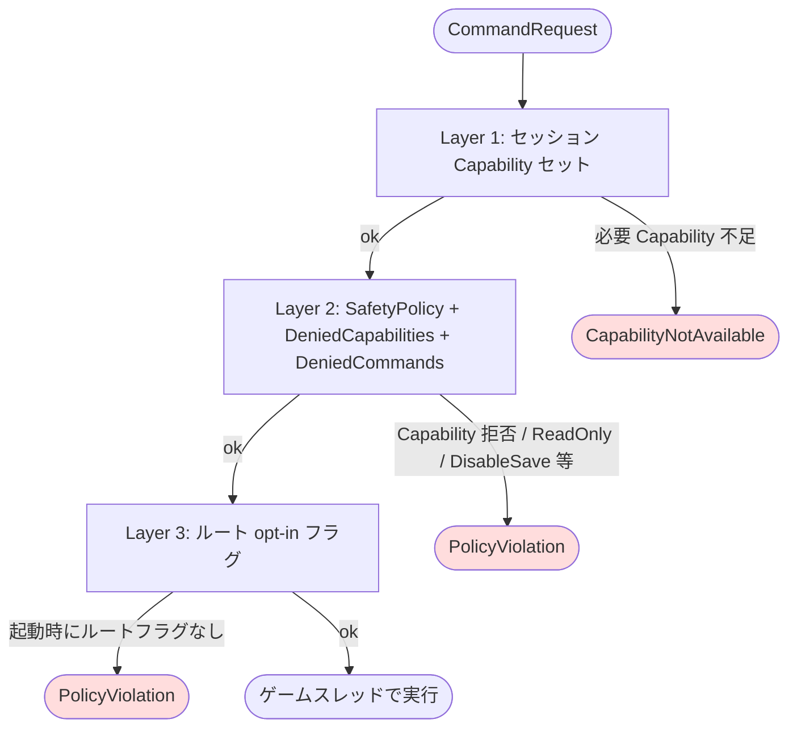
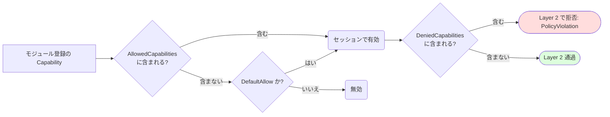

**[English](../en/safety.md)** | [概要に戻る](overview.md)

# Safety & Capabilities

UAIP はコマンドごとの認可を 3 つの層で管理します。層を理解することで、エラーの原因を素早く特定し、ワークフローに合った適切な権限を設定できます。

---

## 認可の 3 層構造

| 層 | メカニズム | 失敗時のエラー |
|---|---|---|
| 1 | セッションの `FCapabilitySet` — セッション × コマンド単位 | `CapabilityNotAvailable` |
| 2 | `FSafetyPolicy` のブールスイッチ / DeniedCapabilities — プロセス全体 | `PolicyViolation` |
| 3 | ルート単位のオプトイン（シナリオルートなど）— プロセス全体 | `PolicyViolation` |



`AllowedCapabilities` と `DeniedCapabilities` は Layer 1 / 2 で **deny-wins** セマンティクスで相互作用します：



---

## Capability リファレンス

各コマンドは必要な Capability を宣言しています。セッションが必要な Capability をすべて持っているときのみコマンドを実行できます。Capability には **DefaultAllow**（自動付与）と **DefaultDenied**（`Config/DefaultUAIP.ini` で明示的に有効化が必要）の 2 種類があります。

🧩 付きの Capability はオプションプラグインへの依存があります。該当プラグインが `.uproject` で有効になっていない環境では Capability が登録されず、必要とするコマンドは `CommandNotFound` を返します。

---

### DefaultAllow（デフォルトで有効）

設定不要で全セッションに付与されます。読み取り専用の観測と、一般的な非破壊操作をカバーします。

| Capability | 有効になる操作 |
|---|---|
| `EditorObservation` | スクリーンショット（`CaptureActiveWindowImage`、`CaptureEditorTabImage`、`CaptureGraphViewportImage`）および JSON 状態ダンプ（`DumpEditorState`、`DumpSlateTree`、`DumpSelectionState`、`DumpOutputLog`、`DumpMessageLog` など） |
| `EditorInspect` | Editor 状態の読み取り専用検査 — アセット・詳細パネル・ビューポート・グラフ情報。共有インフラコマンドが使用 |
| `EditorUIAutomation` | UI 駆動コマンド — `ClickWidget`、`SelectMenuItem`、`InputText`、`SetCheckboxState`、`DragGraphNode`、`AcceptDialog`、`CancelDialog`、`InvokeContextMenuAction`、`WaitForWidget`、`FillForm` など |
| `EditorWorkspaceControl` | タブ・パネル管理 — タブの開閉、グラフエディタのフォーカス、エディタレイアウトの制御 |
| `EditorLifecycle` | エディタライフサイクル操作 — `SaveAll`、`ShutdownEditor`、`RestartEditor` |
| `EditorExecution` | エディタからの Automation Test 実行・Editor Utility Blueprint の実行 |
| `LiveCoding` | ホットリロード・Live Coding コンパイルのトリガー |
| `CrashReportRead` | クラッシュレポート診断情報へのアクセス |
| `AssetCreate` | コンテンツブラウザでの新規アセット作成 |
| `AssetMutate` | 既存アセットのプロパティ変更 |
| `AssetWindowControl` | アセットエディタの開閉 |
| `PIEControl` | PIE セッション制御 — `StartPIE`、`StopPIE`、`PausePIE`、`ResumePIE`、`LoadMap` |
| `RuntimeInspect` | ランタイムワールド状態の読み取り専用検査 — `DumpWorldState`、`DumpActorState`、`DumpComponentState`、`DumpRuntimeLog`、`CapturePerformanceSnapshot` |
| `RuntimeCapture` | ランタイムキャプチャ — `CaptureViewportImage`、`CheckpointCapture` |
| `RuntimeExecution` | PIE または Standalone での機能テスト・Automation Test の実行 |
| `RuntimeGASInspect` 🧩 | PIE 中の GAS 状態読み取り — `GetAttributeValues`、`GetActiveEffects`、`GetGrantedAbilities`、`GetActiveTags`、`FindAttributeSetClasses`（`GameplayAbilities` プラグイン必須） |
| `RuntimeNiagaraInspect` 🧩 | PIE 中の Niagara コンポーネント状態読み取り — `GetUserVariables`、`GetVariable`（`Niagara` プラグイン必須） |

---

### DefaultDenied（デフォルトで無効）

`Config/DefaultUAIP.ini` の `[UAIP.SafetyPolicy]` に `+AllowedCapabilities=<名前>` を追加して明示的に有効化する必要があります。破壊的な操作や重大な編集操作をカバーします。

#### Blueprint・AnimBlueprint 編集

| Capability | 有効になる操作 |
|---|---|
| `BlueprintEdit` | Blueprint アセットのコンパイルと構造検査 |
| `BlueprintVariableEdit` | Blueprint 変数の追加・削除・変更 |
| `BlueprintGraphEdit` | Blueprint イベントグラフへのノード追加・削除・接続 |
| `BlueprintComponentEdit` | Blueprint SCS コンポーネントの追加・削除・リネーム・親変更・複製・プロパティ編集 |
| `AnimBlueprintGraphEdit` | AnimGraph へのノード追加・削除・接続、Anim Blueprint のコンパイル |
| `AnimStateMachineEdit` | Anim ステートマシンへの State・Transition の追加・削除 |

#### Level / アクター / プロパティ編集

| Capability | 有効になる操作 |
|---|---|
| `EditorActorEdit` | Level Editor でのアクターの生成・削除・トランスフォーム変更 |
| `EditorLevelLoad` | エディタビューポートでのレベルオープン・新規作成 |
| `EditorViewportControl` | Level Editor ビューポートカメラの操作 — `FocusOnActors`、`GetCameraTransform`、`SetCameraTransform` |
| `PropertyEdit` | 詳細パネル経由でのアクター / アセットプロパティの読み書き（`GetActorProperty`、`SetActorProperty`、`GetAssetProperty`、`SetAssetProperty` など） |
| `ProjectConfigEdit` | プロジェクト設定の読み書き（`GetProjectSetting`、`SetProjectSetting`） |
| `EditorUndoRedo` | エディタ操作の Undo / Redo |

#### アセット管理

| Capability | 有効になる操作 |
|---|---|
| `AssetDelete` | アセットの永続削除 |
| `FolderDelete` | コンテンツフォルダの永続削除 |
| `AssetFolderRefactor` | アセットとフォルダの移動・リネーム |
| `RedirectorFixup` | 古いアセットリダイレクタの修正 |
| `ShaderCompilation` | シェーダーコンパイルの制御とステータス照会 |

#### マテリアル編集

| Capability | 有効になる操作 |
|---|---|
| `MaterialGraphEdit` | Material グラフへのノード追加・削除・接続、マテリアルのコンパイル |
| `MaterialParameterEdit` | Material パラメータ値とデフォルト値の変更 |
| `MaterialCustomNodeEdit` | Material グラフのカスタム HLSL 式ノードの編集 |

#### DataTable 編集

| Capability | 有効になる操作 |
|---|---|
| `DataTableRowEdit` | DataTable アセットへの行追加・変更 |
| `DataTableRowDelete` | DataTable アセットからの行削除 |
| `DataTableImport` | DataTable アセットへの CSV/JSON データインポート |

#### 物理アセット編集

| Capability | 有効になる操作 |
|---|---|
| `PhysicsAssetEdit` | Physics Asset のシェイプと制約の追加・削除・変更 |
| `PhysicsBodyEdit` | Physics Asset ボディの追加・削除およびボディプロパティの変更（PhysicsMode、MassScale、CollisionProfile、Damping、Offset） |

#### Skeleton / SkeletalMesh 編集

| Capability | 有効になる操作 |
|---|---|
| `SkeletonAssetEdit` | Skeleton アセットのソケット・バーチャルボーンの追加・削除・変更 |
| `SkeletalMeshMaterialEdit` | SkeletalMesh のマテリアルスロットの割り当て・置換 |

#### UMG / Widget 編集

| Capability | 有効になる操作 |
|---|---|
| `WidgetTreeEdit` | UMG Widget Blueprint のウィジェット追加・削除・親子変更 |
| `WidgetVariableEdit` | ウィジェット変数の追加・削除 |
| `WidgetAnimationEdit` | Widget Animation の作成・アニメーショントラックの追加 |
| `WidgetBindingEdit` | プロパティバインディングの追加・削除 |

#### Sequencer 編集

| Capability | 有効になる操作 |
|---|---|
| `SequencerStructureEdit` | トラック・セクションの追加・削除、再生範囲の設定 |
| `SequencerKeyframeEdit` | Sequencer チャンネルへのキーフレーム追加・削除・値編集 |
| `SequencerBindingEdit` | Level Sequence へのアクター Possessable バインドの追加・削除 |
| `SequencerPlaybackControl` | Sequencer 再生状態の制御（Play、Pause、SetPlayheadFrame、SetPlaybackSpeed、SetLoopMode） |
| `SequencerPropertyEdit` | `UMovieSceneSection` プロパティの読み書き |

#### ControlRig 編集

| Capability | 有効になる操作 |
|---|---|
| `ControlRigHierarchyEdit` | ControlRig ヒエラルキーの Control 要素・ボーン・Null の追加・削除・トランスフォーム設定 |
| `ControlRigGraphEdit` | RigVM グラフへのノード追加・削除・ピン接続、ControlRig のコンパイル |
| `ControlRigBlueprintCreate` | `CreateAsset` 経由での ControlRigBlueprint アセット作成 |

#### AI システム

| Capability | 有効になる操作 |
|---|---|
| `BehaviorTreeGraphEdit` | Behavior Tree グラフへのノード追加・削除・プロパティ設定 |
| `BlackboardEdit` | Blackboard キーの追加・削除 |

#### StateTree 編集

| Capability | 有効になる操作 |
|---|---|
| `StateTreeStructureEdit` | StateTree への State 追加・削除、アセットのコンパイル |
| `StateTreeNodeEdit` | Task・Transition の追加・削除、ノードプロパティの編集 |

#### SoundCue 編集

| Capability | 有効になる操作 |
|---|---|
| `SoundCueGraphEdit` | SoundCue グラフへのノード追加・削除・接続、プロパティ編集、SoundCue のコンパイル |

#### Curve 編集

| Capability | 有効になる操作 |
|---|---|
| `CurveKeyEdit` | UCurveFloat / UCurveVector / UCurveLinearColor のキー追加・削除・値・補間・接線の編集 |

#### ゲームプレイシステム

| Capability | 有効になる操作 |
|---|---|
| `GameplayTagEdit` | プロジェクトタグテーブルへのタグ追加・削除・リネーム |
| `GameplayTagRestrictedEdit` | Restricted タグリストの修正 |
| `GameFeatureCreate` 🧩 | GameFeature Plugin 定義の作成・スキャフォールディング（`GameFeatures` + `GameFeaturesEditor` プラグイン必須） |
| `GameplayCueMutation` 🧩 | GameplayCue タグの追加・削除、GameplayCueNotify アセットの作成、アクターへの Cue 実行（`GameplayAbilities` プラグイン必須） |
| `EnhancedInputEdit` | Input Action / Input Mapping Context アセットの編集 — マッピング・Modifier・Trigger の追加・削除・変更 |

#### エディタ操作

| Capability | 有効になる操作 |
|---|---|
| `EditorKeyboardInput` | Editor UI ウィジェットへのキーボード入力シミュレート（`PressKey`） |
| `EditorExecCommand` | `GUnrealEd->Exec` 経由の低レベル Editor コマンド実行 |

#### スクリプト実行

| Capability | 有効になる操作 |
|---|---|
| `ScriptExecution` 🧩 | エディタでの Python スクリプト実行（`RunEditorPythonScript`；`PythonScriptPlugin` 必須） |
| `PythonCommandExecution` 🧩 | `@uaip_command` で動的登録された Python コマンドの実行（`PythonScriptPlugin` 必須） |
| `PythonExtensionReload` 🧩 | 登録済み Python コマンドの再スキャン・リロード（`ReloadPythonCommands`；`PythonScriptPlugin` 必須） |

#### Runtime — 制限付き操作

| Capability | 有効になる操作 |
|---|---|
| `RuntimeCVarRead` | コンソール変数（CVar）値の読み取り — `GetConsoleVariable`、`SearchConsoleVariables` |
| `RuntimeActorManipulation` | PIE 中のアクタースポーン・破棄・テレポート・Possess |
| `RuntimeExecCommand` | `UWorld` 経由のランタイムコンソールコマンド実行 |
| `RuntimeInputInjection` | PIE へのキーボード / Enhanced Input / レガシー入力イベントの注入（`InjectInputKey`、`InjectEnhancedInputAction`、`AddMappingContext`、`SetInputMode`、`FlushInput` など） |
| `RuntimeNiagaraMutation` 🧩 | Runtime での Niagara ユーザー変数設定・Niagara システム差し替え（`SetVariable`、`SetSystem`；`Niagara` プラグイン必須） |
| `GauntletExecution` | Gauntlet 自動テストセッションの起動 |

#### オプショングラフエディタ

以下の Capability はオプションプラグインへの依存があります。プラグインが有効になっていない環境では Capability が登録されません。

| Capability | 必要プラグイン | 有効になる操作 |
|---|---|---|
| `MetaSoundGraphEdit` 🧩 | `Metasound` | MetaSound グラフへのノード追加・削除・接続 |
| `DataflowGraphEdit` 🧩 | `Dataflow` | Dataflow グラフへのノード追加・削除・接続 |
| `PCGGraphEdit` 🧩 | `PCG` | PCG グラフへのノード追加・削除・接続、PCG グラフの実行 |
| `PCGCustomNodeEdit` 🧩 | `PCG` | PCG グラフへのカスタム HLSL ノード追加（予約済み — 未利用） |
| `PCGBlueprintNodeEdit` 🧩 | `PCG` | PCG グラフへの Blueprint ノード追加（予約済み — 未利用） |
| `ConversationGraphEdit` 🧩 | `CommonConversation` | `UConversationDatabase` アセットの構造的編集 |
| `EQSAssetEdit` 🧩 | `EnvironmentQueryEditor` | EQS クエリへの Generator・Test の追加・削除・プロパティ設定 |
| `WorldConditionStructureEdit` 🧩 | `WorldConditions` | WorldCondition アセットへの条件追加・削除 |
| `WorldConditionNodeEdit` 🧩 | `WorldConditions` | WorldCondition の Operator・式の深さ・プロパティの編集 |

#### Niagara 編集

以下の Capability はすべて `Niagara` プラグインが必要です。

| Capability | 有効になる操作 |
|---|---|
| `NiagaraAssetCreate` 🧩 | Niagara System および Parameter Collection アセットの作成 |
| `NiagaraBlueprintCreate` 🧩 | Niagara System・Component から Blueprint ラッパークラスを生成 |
| `NiagaraEmitterEdit` 🧩 | Niagara System へのエミッター追加・削除・設定 |
| `NiagaraStackEdit` 🧩 | Niagara エミッターへのモジュール追加・削除・スタック入力パラメータの設定 |
| `NiagaraStackAutoFix` 🧩 | Niagara スタック診断 Issue の自動修正 |

---

## DefaultDenied Capability を有効にする

プロジェクトの `Config/DefaultUAIP.ini` を開き、`[UAIP.SafetyPolicy]` に `+AllowedCapabilities` を追加します（1 行に 1 つ）：

```ini
[UAIP.SafetyPolicy]
+AllowedCapabilities=BlueprintEdit
+AllowedCapabilities=BlueprintVariableEdit
+AllowedCapabilities=BlueprintGraphEdit
+AllowedCapabilities=EditorActorEdit
```

ini を編集した後、Editor を再起動するか（`AllowCapabilityReload=True` が設定済みなら）以下を呼び出します：

```
uaip_execute(CommandName="UAIP.Core.ReloadCapabilities")
```

---

## SafetyPolicy 設定一覧

Capability ゲートに加え、`FSafetyPolicy` はプロセス全体に適用されるコアスイッチを提供します。すべてデフォルトは `False` です。

```ini
[UAIP.SafetyPolicy]
ReadOnly=False
DisableSave=False
AllowLogDump=False
AllowContextMenuMutation=False
AllowKeyboardInput=False
AllowKeyboardModifierInput=False
AllowPasswordFieldWrite=False
AllowInputModeBypass=False
DisablePIEStart=False

; DefaultDenied の Capability を解除：
; +AllowedCapabilities=BlueprintEdit

; DefaultAllow の Capability をセッションから取り除く：
; +DeniedCapabilities=EditorUIAutomation

; 特定のコマンドをブロック（完全修飾名）：
; +DeniedCommands=UAIP.Editor.Level.PlaceActorInLevel

; 再起動なしで Capability 設定を再読み込み可能にする：
; AllowCapabilityReload=True
```

| キー | デフォルト | 効果 |
|---|---|---|
| `ReadOnly` | `False` | すべての書き込みコマンドを拒否 |
| `DisableSave` | `False` | ディスク書き込みコマンドを拒否 |
| `AllowLogDump` | `False` | `DumpOutputLog` / `DumpMessageLog` を許可 |
| `AllowContextMenuMutation` | `False` | `InvokeContextMenuAction` を許可 |
| `AllowKeyboardInput` | `False` | `PressKey` を許可（`EditorKeyboardInput` Capability も別途必要） |
| `AllowKeyboardModifierInput` | `False` | `PressKey` 内の Ctrl/Alt/Shift 修飾キーを許可 |
| `AllowPasswordFieldWrite` | `False` | `FillForm` でパスワードフィールドへの書き込みを許可 |
| `AllowInputModeBypass` | `False` | Inject 系コマンドの `BypassInputMode=true` を許可 |
| `DisablePIEStart` | `False` | PIE 起動を拒否 |
| `AllowedCapabilities` | 空 | DefaultDenied の Capability を解除（`+` 付きで 1 行に 1 つ） |
| `DeniedCapabilities` | 空 | DefaultAllow の Capability を全セッションから取り除く |
| `DeniedCommands` | 空 | 完全修飾名で指定したコマンドをブロック |
| `AllowCapabilityReload` | `False` | `UAIP.Core.ReloadCapabilities` を有効化（再起動不要で設定反映） |

---

## エラーの診断

| エラーコード | 診断 | 対処 |
|---|---|---|
| `CapabilityNotAvailable` | セッションに Capability がない | `ErrorMessage` の Capability 名を `AllowedCapabilities` に追加して再起動（または `ReloadCapabilities`） |
| `PolicyViolation: ... denied by SafetyPolicy` | SafetyPolicy の ini フラグで拒否されている | `[UAIP.SafetyPolicy]` の対応するフラグを `True` にして再起動 |
| `PolicyViolation: Scenario execution is not enabled` | シナリオルートのオプトイン不足 | `config.json` に `"enable_scenario": true` を追加 |
| `PolicyViolation: Command is denied` | コマンドが `DeniedCommands` に入っている | ini から該当エントリを削除して再起動 |
| 🧩 コマンドで `CommandNotFound` | オプションプラグインが無効 | `.uproject` で必要なプラグインを有効化してリビルド |

---

## その他の ini 設定

このページが扱うのは `[UAIP.SafetyPolicy]` のみです。それ以外の ini セクション（`[UAIP.Session]`、`[UAIP.ArtifactGC]`、`[UAIP.CommandNotification]`、`[UAIP.PythonExtension]`）、`-uaip-*` 系の CLI 起動フラグ、MCP Bridge `config.json` は [設定リファレンス](config.md) を参照してください。
