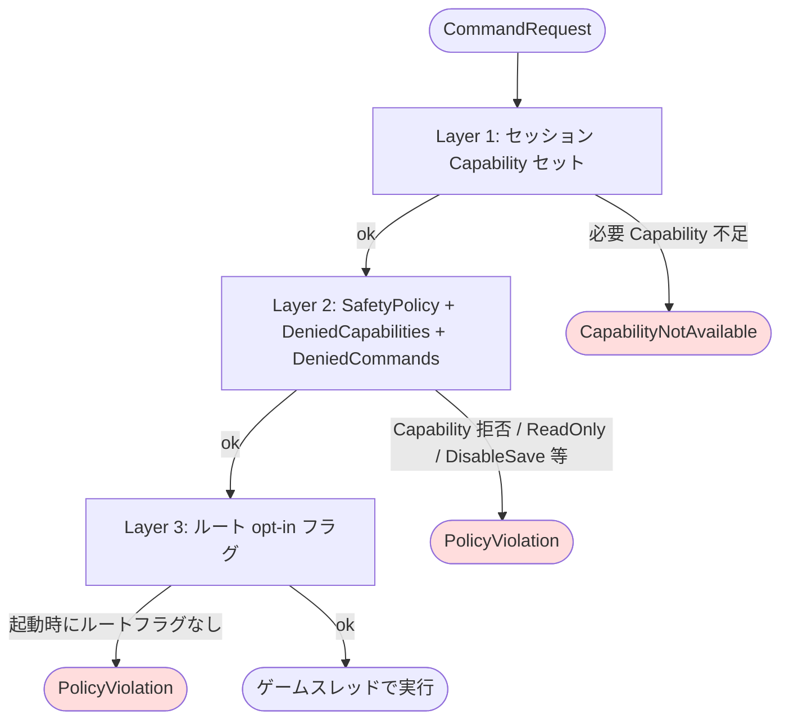
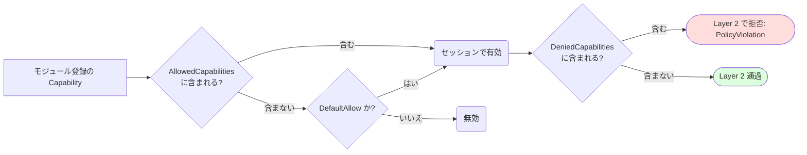

**[English](../en/safety.md)** | [概要に戻る](overview.md)

# Safety & Capabilities

UAIP はコマンドごとの認可を 3 つの層で管理します。層を理解することで、エラーの原因を素早く特定し、ワークフローに合った適切な権限を設定できます。

---

## 認可の 3 層構造

| 層 | メカニズム | 失敗時のエラー |
|---|---|---|
| 1 | セッションの `FCapabilitySet` — セッション × コマンド単位 | `CapabilityNotAvailable` |
| 2 | `FSafetyPolicy` のブールスイッチ / DeniedCapabilities — プロセス全体 | `PolicyViolation` |
| 3 | ルート単位のオプトイン（シナリオルートなど）— プロセス全体 | `PolicyViolation` |


```mermaid
flowchart TB
    Cmd([CommandRequest])
    L1[Layer 1: セッション Capability セット]
    L2[Layer 2: SafetyPolicy + DeniedCapabilities + DeniedCommands]
    L3[Layer 3: ルート opt-in フラグ]
    Exec([ゲームスレッドで実行])

    Cmd --> L1
    L1 -- "必要 Capability 不足" --> E1([CapabilityNotAvailable])
    L1 -- ok --> L2
    L2 -- "Capability 拒否 / ReadOnly / DisableSave 等" --> E2([PolicyViolation])
    L2 -- ok --> L3
    L3 -- "起動時にルートフラグなし" --> E3([PolicyViolation])
    L3 -- ok --> Exec

    style E1 fill:#fdd
    style E2 fill:#fdd
    style E3 fill:#fdd
```

`AllowedCapabilities` と `DeniedCapabilities` は Layer 1 / 2 で **deny-wins** セマンティクスで相互作用します：


```mermaid
flowchart LR
    Reg[モジュール登録の Capability] --> Allow{"AllowedCapabilities<br/>に含まれる?"}
    Allow -- "含む" --> Active(セッションで有効)
    Allow -- "含まない" --> S1{"DefaultAllow か?"}
    S1 -- はい --> Active
    S1 -- いいえ --> X1(無効)
    Active --> Deny{"DeniedCapabilities<br/>に含まれる?"}
    Deny -- "含む" --> Final([Layer 2 で拒否: PolicyViolation])
    Deny -- "含まない" --> OK([Layer 2 通過])
    style Final fill:#fdd
    style OK fill:#dfd
```

---

## Capability リファレンス

各コマンドは必要な Capability を宣言しています。セッションが必要な Capability をすべて持っているときのみコマンドを実行できます。Capability には **DefaultAllow**（自動付与）と **DefaultDenied**（`Config/DefaultUAIP.ini` で明示的に有効化が必要）の 2 種類があります。

🧩 付きの Capability はオプションプラグインへの依存があります。該当プラグインが `.uproject` で有効になっていない環境では Capability が登録されず、必要とするコマンドは `CommandNotFound` を返します。

---

### DefaultAllow（デフォルトで有効）

設定不要で全セッションに付与されます。読み取り専用の観測と、一般的な非破壊操作をカバーします。

| Capability | 有効になる操作 |
|---|---|
| `EditorObservation` | スクリーンショット（`CaptureActiveWindowImage`、`CaptureEditorTabImage`、`CaptureGraphViewportImage`）および JSON 状態ダンプ（`DumpEditorState`、`DumpSlateTree`、`DumpSelectionState`、`DumpOutputLog`、`DumpMessageLog` など） |
| `EditorInspect` | Editor 状態の読み取り専用検査 — アセット・詳細パネル・ビューポート・グラフ情報。共有インフラコマンドが使用 |
| `EditorUIAutomation` | UI 駆動コマンド — `ClickWidget`、`SelectMenuItem`、`InputText`、`SetCheckboxState`、`DragGraphNode`、`AcceptDialog`、`CancelDialog`、`InvokeContextMenuAction`、`WaitForWidget`、`FillForm` など |
| `EditorWorkspaceControl` | タブ・パネル管理 — タブの開閉、グラフエディタのフォーカス、エディタレイアウトの制御 |
| `EditorLifecycle` | エディタライフサイクル操作 — `SaveAll`、`ShutdownEditor`、`RestartEditor` |
| `EditorExecution` | エディタからの Automation Test 実行・Editor Utility Blueprint の実行 |
| `LiveCoding` | ホットリロード・Live Coding コンパイルのトリガー |
| `CrashReportRead` | クラッシュレポート診断情報へのアクセス |
| `AssetCreate` | コンテンツブラウザでの新規アセット作成 |
| `AssetMutate` | 既存アセットのプロパティ変更 |
| `AssetWindowControl` | アセットエディタの開閉 |
| `PIEControl` | PIE セッション制御 — `StartPIE`、`StopPIE`、`PausePIE`、`ResumePIE`、`LoadMap` |
| `RuntimeInspect` | ランタイムワールド状態の読み取り専用検査 — `DumpWorldState`、`DumpActorState`、`DumpComponentState`、`DumpRuntimeLog`、`CapturePerformanceSnapshot` |
| `RuntimeCapture` | ランタイムキャプチャ — `CaptureViewportImage`、`CheckpointCapture` |
| `RuntimeExecution` | PIE または Standalone での機能テスト・Automation Test の実行 |
| `RuntimeGASInspect` 🧩 | PIE 中の GAS 状態読み取り — `GetAttributeValues`、`GetActiveEffects`、`GetGrantedAbilities`、`GetActiveTags`、`FindAttributeSetClasses`（`GameplayAbilities` プラグイン必須） |
| `RuntimeNiagaraInspect` 🧩 | PIE 中の Niagara コンポーネント状態読み取り — `GetUserVariables`、`GetVariable`（`Niagara` プラグイン必須） |
| `SandboxObserve` 🧩 | アクティブな Sandbox の観測 — `GetSandboxStatus`、`GetSandboxChanges`（`FileSandbox` プラグイン必須） |
| `RuntimeInsightsInspect` | Unreal Insights トレースの読み取り専用検査 — `ListTraceChannels`、`GetTraceStatus`、`ListTraceFiles`。トレースの開始・停止・変更は一切できません |

---

### DefaultDenied（デフォルトで無効）

`Config/DefaultUAIP.ini` の `[UAIP.SafetyPolicy]` に `+AllowedCapabilities=<名前>` を追加して明示的に有効化する必要があります。破壊的な操作や重大な編集操作をカバーします。

#### Blueprint・AnimBlueprint 編集

| Capability | 有効になる操作 |
|---|---|
| `BlueprintEdit` | Blueprint アセットのコンパイルと構造検査 |
| `BlueprintVariableEdit` | Blueprint 変数の追加・削除・変更 |
| `BlueprintGraphEdit` | Blueprint イベントグラフへのノード追加・削除・接続 |
| `BlueprintComponentEdit` | Blueprint SCS コンポーネントの追加・削除・リネーム・親変更・複製・プロパティ編集 |
| `AnimBlueprintGraphEdit` | AnimGraph へのノード追加・削除・接続、Anim Blueprint のコンパイル |
| `AnimStateMachineEdit` | Anim ステートマシンへの State・Transition の追加・削除 |

#### Level / アクター / プロパティ編集

| Capability | 有効になる操作 |
|---|---|
| `EditorActorEdit` | Level Editor でのアクターの生成・削除・トランスフォーム変更 |
| `EditorLevelLoad` | エディタビューポートでのレベルオープン・新規作成 |
| `EditorViewportControl` | Level Editor ビューポートカメラの操作 — `FocusOnActors`、`GetCameraTransform`、`SetCameraTransform` |
| `PropertyEdit` | 詳細パネル経由でのアクター / アセットプロパティの読み書き（`GetActorProperty`、`SetActorProperty`、`GetAssetProperty`、`SetAssetProperty` など） |
| `ProjectConfigEdit` | プロジェクト設定の読み書き（`GetProjectSetting`、`SetProjectSetting`） |
| `EditorUndoRedo` | エディタ操作の Undo / Redo |

#### アセット管理

| Capability | 有効になる操作 |
|---|---|
| `AssetDelete` | アセットの永続削除 |
| `FolderDelete` | コンテンツフォルダの永続削除 |
| `AssetFolderRefactor` | アセットとフォルダの移動・リネーム |
| `RedirectorFixup` | 古いアセットリダイレクタの修正 |
| `ShaderCompilation` | シェーダーコンパイルの制御とステータス照会 |
| `ContentBrowserNavigate` | Content Browser のナビゲートとアセット選択 — `SelectAssets`、`SetContentBrowserPath`（native および bridge） |
| `PrimaryAssetTypeAdd` | `PrimaryAssetType` を `PrimaryAssetTypesToScan` に追加（`AddPrimaryAssetType`、`DefaultGame.ini` へ永続化） |
| `PrimaryAssetTypeRemove` | `PrimaryAssetType` を `PrimaryAssetTypesToScan` から削除（`RemovePrimaryAssetType`、永続化） |
| `PrimaryAssetRulesOverride` | 指定 `PrimaryAssetId` の Rule をメモリ内で一時的に上書き（`SetPrimaryAssetRules`、非永続） |
| `PrimaryAssetLoad` | `PrimaryAsset` を明示的にメモリへロード（`LoadPrimaryAsset`） |
| `PrimaryAssetUnload` | `PrimaryAsset` を明示的にメモリからアンロード（`UnloadPrimaryAsset`） |

#### マテリアル編集

| Capability | 有効になる操作 |
|---|---|
| `MaterialGraphEdit` | Material グラフへのノード追加・削除・接続、マテリアルのコンパイル |
| `MaterialParameterEdit` | Material パラメータ値とデフォルト値の変更 |
| `MaterialCustomNodeEdit` | Material グラフのカスタム HLSL 式ノードの編集 |

#### DataTable 編集

| Capability | 有効になる操作 |
|---|---|
| `DataTableRowEdit` | DataTable アセットへの行追加・変更 |
| `DataTableRowDelete` | DataTable アセットからの行削除 |
| `DataTableImport` | DataTable アセットへの CSV/JSON データインポート |

#### 物理アセット編集

| Capability | 有効になる操作 |
|---|---|
| `PhysicsAssetEdit` | Physics Asset のシェイプと制約の追加・削除・変更 |
| `PhysicsBodyEdit` | Physics Asset ボディの追加・削除およびボディプロパティの変更（PhysicsMode、MassScale、CollisionProfile、Damping、Offset） |

#### Skeleton / SkeletalMesh 編集

| Capability | 有効になる操作 |
|---|---|
| `SkeletonAssetEdit` | Skeleton アセットのソケット・バーチャルボーンの追加・削除・変更 |
| `SkeletalMeshMaterialEdit` | SkeletalMesh のマテリアルスロットの割り当て・置換 |

#### MetaHuman キャラクター編集

以下の Capability はいずれも `MetaHumanCharacter` プラグインを必要とします。コマンド数ではなくリスクの性質で分割しています — アセットの新規作成、ディスク上のファイル読み込み、数分かかる合成処理の開始、外部サービスへのデータ送信、失敗時にアセットを削除するビルドの実行は、それぞれ個別に判断すべき事項だからです。

| Capability | 有効になる操作 |
|---|---|
| `MetaHumanAssetCreate` 🧩 | MetaHuman キャラクターアセットの新規作成 — ネイティブ `CreateMetaHumanCharacter` とブリッジ `Toolset.Editor.MetaHuman.Create`。汎用の `UAIP.Editor.Assets.CreateAsset` も、この Capability がない限り `UMetaHumanCharacter`（およびその派生クラス）に対しては拒否されるため、DefaultAllow の `AssetCreate` で迂回することはできません |
| `MetaHumanEdit` 🧩 | 既存キャラクターへのローカルな変更すべて — 体型制約・体型、肌・眼・メイク・ヘッドモデル・顔評価設定、顔の造形とランドマーク編集、コンフォーム / フィッティング、ワードローブスロットの割り当て、プレビュービューポート設定、ビルド前提条件の確認と状態ポーリング、`ReleaseEditSession` — に加え、編集セッションを必要とするため読み取り専用を宣言できない読み取り系コマンド。`Create` を除く全ての `Toolset.Editor.MetaHuman.*` ブリッジコマンドもこの Capability でゲートされます |
| `MetaHumanFileImport` 🧩 | OS ファイルシステム上の顔 DNA ファイルの読み込み — `ImportFaceFromDna`・`FitFaceFromBodyWithEyesTeethDna`。読み込むファイルはエンジン側パーサへ渡される信頼できないバイナリであるため、通常の編集とは別にゲートしています |
| `MetaHumanTextureSynthesis` 🧩 | 高解像度フェイステクスチャ合成の開始 — `RequestTextureSources`。数分間実行され結果をディスクへ書き出すため、通常のパラメータ編集とはまとめて付与しません |
| `MetaHumanCloudRigging` 🧩 | フェイスリグ生成の開始 — `RequestAutoRigging`。⚠️ 本モジュールで唯一、キャラクターデータを外部サービス（Epic のクラウドリギングサービス）へ送信するコマンドであるため、常に明示的な判断を必要とします |
| `MetaHumanBuild` 🧩 | MetaHuman アセットビルドパイプラインの実行 — `BuildMetaHuman`。ビルド完了までゲームスレッドをブロックし、失敗時には作成したアセットを削除するため、応答性と破壊性の両面を持ちます |

#### UMG / Widget 編集

| Capability | 有効になる操作 |
|---|---|
| `WidgetTreeEdit` | UMG Widget Blueprint のウィジェット追加・削除・親子変更 |
| `WidgetVariableEdit` | ウィジェット変数の追加・削除 |
| `WidgetAnimationEdit` | Widget Animation の作成・アニメーショントラックの追加 |
| `WidgetBindingEdit` | プロパティバインディングの追加・削除 |

#### Sequencer 編集

| Capability | 有効になる操作 |
|---|---|
| `SequencerStructureEdit` | トラック・セクションの追加・削除、再生範囲の設定 |
| `SequencerKeyframeEdit` | Sequencer チャンネルへのキーフレーム追加・削除・値編集 |
| `SequencerBindingEdit` | Level Sequence へのアクター Possessable バインドの追加・削除 |
| `SequencerPlaybackControl` | Sequencer 再生状態の制御（Play、Pause、SetPlayheadFrame、SetPlaybackSpeed、SetLoopMode） |
| `SequencerPropertyEdit` | `UMovieSceneSection` プロパティの読み書き |

#### ControlRig 編集

| Capability | 有効になる操作 |
|---|---|
| `ControlRigHierarchyEdit` | ControlRig ヒエラルキーの Control 要素・ボーン・Null の追加・削除・トランスフォーム設定 |
| `ControlRigGraphEdit` | RigVM グラフへのノード追加・削除・ピン接続、ControlRig のコンパイル |
| `ControlRigBlueprintCreate` | `CreateAsset` 経由での ControlRigBlueprint アセット作成 |

#### AI システム

| Capability | 有効になる操作 |
|---|---|
| `BehaviorTreeGraphEdit` | Behavior Tree グラフへのノード追加・削除・プロパティ設定 |
| `BlackboardEdit` | Blackboard キーの追加・削除 |

#### StateTree 編集

| Capability | 有効になる操作 |
|---|---|
| `StateTreeStructureEdit` | StateTree への State 追加・削除、アセットのコンパイル |
| `StateTreeNodeEdit` | Task・Transition の追加・削除、ノードプロパティの編集 |

#### SoundCue 編集

| Capability | 有効になる操作 |
|---|---|
| `SoundCueGraphEdit` | SoundCue グラフへのノード追加・削除・接続、プロパティ編集、SoundCue のコンパイル |

#### サウンドアセット編集

| Capability | 有効になる操作 |
|---|---|
| `SoundClassEdit` | SoundClass アセットのプロパティ設定・子クラス追加・削除（`SetSoundClassSettings`、`AddSoundClassChild`、`RemoveSoundClassChild`） |
| `SoundAttenuationEdit` | SoundAttenuation の FSoundAttenuationSettings フィールド設定（`SetSoundAttenuationSettings`） |
| `SoundMixEdit` | SoundMix のプロパティ設定・SoundClassAdjuster の追加・更新・削除（`SetSoundMixSettings`、`SetSoundMixAdjuster`、`RemoveSoundMixAdjuster`） |

#### MVVM 編集

| Capability | 有効になる操作 |
|---|---|
| `ViewModelBindingEdit` | WidgetBlueprint への View Binding / View Event の追加・削除・更新、ViewModel プロパティの追加・削除（`AddViewBinding`、`RemoveViewBinding`、`UpdateViewBinding`、`SetViewBindingEnabled`、`SetViewBindingConversionFunction`、`SetViewBindingExecutionMode`、`AddViewEvent`、`RemoveViewEvent`、`AddViewModelProperty`、`RemoveViewModelProperty`） |
| `ViewModelSourceEdit` | WidgetBlueprint への ViewModel 接続管理（`AddViewModelToWidget`、`RemoveViewModelFromWidget`、`RenameViewModelInWidget`、`ReparentViewModelInWidget`、`SetViewModelSource`） |

#### Curve 編集

| Capability | 有効になる操作 |
|---|---|
| `CurveKeyEdit` | UCurveFloat / UCurveVector / UCurveLinearColor のキー追加・削除・値・補間・接線の編集 |

#### ゲームプレイシステム

| Capability | 有効になる操作 |
|---|---|
| `GameplayTagEdit` | プロジェクトタグテーブルへのタグ追加・削除・リネーム |
| `GameplayTagRestrictedEdit` | Restricted タグリストの修正 |
| `GameFeatureCreate` 🧩 | GameFeature Plugin 定義の作成・スキャフォールディング（`GameFeatures` + `GameFeaturesEditor` プラグイン必須） |
| `GameplayCueMutation` 🧩 | GameplayCue タグの追加・削除、GameplayCueNotify アセットの作成、アクターへの Cue 実行（`GameplayAbilities` プラグイン必須） |
| `EnhancedInputEdit` | Input Action / Input Mapping Context アセットの編集 — マッピング・Modifier・Trigger の追加・削除・変更 |

#### エディタ操作

| Capability | 有効になる操作 |
|---|---|
| `EditorKeyboardInput` | Editor UI ウィジェットへのキーボード入力シミュレート（`PressKey`） |
| `EditorExecCommand` | `GUnrealEd->Exec` 経由の低レベル Editor コマンド実行 |
| `LogVerbosityEdit` | ログ詳細レベルの変更 — `SetLogVerbosity` native および `Toolset.Editor.Toolset.Logs.SetVerbosity` bridge |
| `ViewportAnnotationCapture` | ワールド座標ラベル付きビューポート画像のキャプチャ — `CaptureViewportImageAnnotated` |

#### スクリプト実行

| Capability | 有効になる操作 |
|---|---|
| `ScriptExecution` 🧩 | エディタでの Python スクリプト実行（`RunEditorPythonScript`；`PythonScriptPlugin` 必須） |
| `PythonCommandExecution` 🧩 | `@uaip_command` で動的登録された Python コマンドの実行（`PythonScriptPlugin` 必須） |
| `PythonExtensionReload` 🧩 | 登録済み Python コマンドの再スキャン・リロード（`ReloadPythonCommands`；`PythonScriptPlugin` 必須） |

#### Runtime — 制限付き操作

| Capability | 有効になる操作 |
|---|---|
| `RuntimeCVarRead` | エンジン全体の CVar 値の読み取り — `UAIP.Runtime.Engine.CVar.GetConsoleVariable`、`SearchConsoleVariables`（`UAIPRuntimeEngineManagement` 所有） |
| `RuntimeCVarWrite` | CVar 値の設定・リセット — `UAIP.Runtime.Engine.CVar.SetConsoleVariable`、`ResetConsoleVariable`（機密名・`ECVF_ReadOnly` は拒否、`ECVF_Cheat` 付きはさらに `AllowCheatCVarWrite` SafetyPolicy スイッチが必要、`UAIPRuntimeEngineManagement` 所有） |
| `CVarInspect` | センシティブパターンフィルタリング付き CVar 検索 — `Toolset.Editor.Toolset.EngineManagement.SearchCVars` bridge（`UAIPEditorEngineManagement` 所有） |
| `RuntimeActorManipulation` | PIE 中のアクタースポーン・破棄・テレポート・Possess |
| `RuntimeExecCommand` | `UWorld` 経由のランタイムコンソールコマンド実行 |
| `RuntimeInputInjection` | PIE へのキーボード / Enhanced Input / レガシー入力イベントの注入（`InjectInputKey`、`InjectEnhancedInputAction`、`AddMappingContext`、`SetInputMode`、`FlushInput` など） |
| `RuntimeNiagaraMutation` 🧩 | Runtime での Niagara ユーザー変数設定・Niagara システム差し替え（`SetVariable`、`SetSystem`；`Niagara` プラグイン必須） |
| `GauntletExecution` | Gauntlet 自動テストセッションの起動 |

#### Runtime Insights トレース採取

Unreal Insights のトレースは 4 つの Capability に分割されています。トレースの状態を読むこと・トレースを操作すること・生の採取ファイルを受け取ること・採取済みトレースを解析することは、それぞれ別の判断だからです。

| Capability | 有効になる操作 |
|---|---|
| `RuntimeInsightsControl` | トレースの開始・停止・一時停止・再開、チャネル集合の変更、ブックマークと区間の書き込み — `StartTrace`、`StopTrace`、`PauseTrace`、`ResumeTrace`、`SetTraceChannels`、`AddTraceBookmark`、`BeginTraceRegion`、`EndTraceRegion` |
| `RuntimeInsightsAttachTraceFile` | 採取した `.utrace` ファイル自体を artifact として引き渡す（`StopTrace` の `AttachTraceFile: true`）。`RuntimeInsightsControl` とは別にゲートされ、トレースの**停止**には不要です（本 Capability を持たないセッションでも常に正常に停止でき、ファイルがスキップされるだけです） |
| `RuntimeInsightsAnalyze` | 採取済みトレースの解析と抽出結果の読み取り — `AnalyzeTrace`、`GetTraceAnalysisStatus`、`GetTraceAnalysisResult`。トレース解析が有効なビルド構成でのみ登録されます |

> ⚠️ **`.utrace` ファイルの受け取りは、チャネル設定から想像される以上の情報を開示します。**
> プロセスのフルコマンドライン（絶対パス・ユーザー名・すべての起動オプション）は、列挙も無効化もできない常時オンの内部チャネルを通じて書き込まれます。したがって記録したチャネルに関わらず**すべての**トレースファイルに含まれ、`AllowLogDump=False` にしていても防げません。`RuntimeInsightsAttachTraceFile` が独立した DefaultDenied Capability として存在するのはこのためです。
> 解析コマンドは等価ではありません。`Diagnostics` セクションはサニタイズ済みのコマンドラインを返すため、**解析結果と生の `.utrace` では開示レベルが異なります**。

**チャネル開示クラスによるゲート。** トレースチャネルは開示しうる内容（ログテキスト・ホスト側パス・画面内容・ネットワークデータ・アセット構造・コード構造・タイミングのみ）で分類されています。実効チャネル集合がログテキストを記録し `AllowLogDump` が false の場合、`StartTrace` は `PolicyViolation` で拒否されます。Insights を `DumpOutputLog` のゲートを迂回する経路として使えないようにするためです。

生ファイルの添付可否は、`RuntimeInsightsAttachTraceFile` Capability に加えて、記録したチャネルの開示クラスごとに判定されます。

| 記録したチャネルが開示しうる内容 | 添付に必要な設定 |
|---|---|
| タイミングのみ / アセット構造 / コード構造 | 不要 — これらは解析セクションが無加工で返す内容であり、生ファイルがそれ以上に開示するものはありません |
| ログテキスト（`log` / `bookmark` / `region`） | `AllowLogDump` — これらのチャネルがそもそも記録してよいか、対応する解析セクションを抽出してよいかを決めているのと同じフラグです |
| ホスト側パス（`file` / `cook`）・画面内容（`screenshot`）・ネットワークアドレス（`net`） | `AllowDisclosingTraceAttachment` — 解析セクションはこれらをサニタイズ / マスク / メタデータ化して返しますが、生ファイルはその加工を一切行いません |
| このビルドが分類していないチャネル | 設定に関わらず拒否 — そのチャネルが何を記録するかを知るものが無い以上、どの設定もそれを代弁できません |

上記の設定に関わらず、採取中にチャネル集合が変更された場合・孤児トレースとして回収された場合・ファイルが 64 MB を超える場合は添付が拒否されます。

> ⚠️ **エディタでは通常、両方のフラグが必要です。** エンジンは `-trace` 引数が無くてもエディタ起動時に `cpu` / `gpu` / `frame` / `log` / `bookmark` / `screenshot` / `region` を有効化するため、エディタで採取したトレースはほぼ必ずログテキストと画面内容の両方を含みます。UAIP はこれらのチャネルを勝手に無効化しません（チャネル状態はプロセスグローバルであり、無効化すると他の人が仕掛けた計測を壊すため）。`.utrace` ファイル自体が必要な場合は、**`AllowLogDump=True` と `AllowDisclosingTraceAttachment=True` の両方**を設定してください。
>
> `StartTrace` はこれを事前に通知します。数百 MB を採り終えてから判明するのを避けるため、記録されるチャネルにポリシーが生ファイルを渡さないクラスが含まれる場合、`Data.Warnings[]` に該当チャネル名と設定名を含む `AttachDisabledByPolicy` エントリが入ります。その場合でも `StopTrace` は成功し、ファイルを返す代わりに `AttachSkippedReason: "DisclosureChannelPolicy"` を報告します（cleanup ステップが失敗してトレースが回り続けることが無いようにするためです）。

> ⚠️ **チャネル集合の確認は約 1 秒間隔のポーリングです。** その間隔より短い時間で有効化・無効化されたチャネルの変化は取りこぼしえます。生ファイルの添付が「観測されたチャネル集合」だけでなく専用 Capability でゲートされているのは、まさにこのためです。ポーリングループはセーフティネットであって保証ではありません。

**ネットワーク宛先制限のスコープ。** 本モジュールのどのコマンドもトレースをネットワーク宛先へ送出できません。接続種別は UAIP 専用トレースディレクトリ内のファイルにハードコードされており、それを露出するパラメータも存在しません。加えて `trace.` プレフィックスは `ExecuteConsoleCommand` の deny-list に含まれているため、`Trace.Send` / `Trace.Start` / `Trace.Enable` に**そのコマンド経由では**到達できません。ただしこの deny-list が塞ぐのは 1 経路であってすべてではありません。`PythonScriptPlugin` が有効なエディタでは `RunEditorPythonScript` から同じコンソールコマンドに到達できます（`ScriptExecution` が独立した Capability になっているのはこのためです）。「本モジュールのコマンドはネットワークへ送出しない」と読むべきであり、「エディタ内のどこからも到達できない」ではありません。

**UAIP 以外が採取したトレースの解析。** `AnalyzeTrace` は既定では `ListTraceFiles` が報告したファイル名しか受け付けず、UAIP 専用トレースディレクトリの内側に閉じています。パッケージ版ビルド・別マシン・CI が生成した `.utrace` を解析するには、`[UAIP.SafetyPolicy]` に**両方**を設定する必要があります。

```ini
AllowExternalTraceAnalysis=True
ExternalTraceDirectory=D:/TraceDrop
```

どちらか一方だけでは何も開きません。設定後、`ExternalTracePath` に渡すパスはそのディレクトリの内側に解決されることが要求されます。

> ⚠️ **シンボリックリンクとジャンクションは解決されません。** `ExternalTraceDirectory` の中に置かれた、外を指すリンクはそのまま辿られます。`ExternalTraceDirectory` には **UAIP 専用の隔離ディレクトリ**を指定してください（共有のドロップ先・ユーザープロファイル配下・プロジェクトディレクトリを指定しないこと）。

> **これはスコープの限定であり、構造的な保証ではありません。** `RunEditorPythonScript` からはエンジンのトレースシステムへ依然として到達できます。Python 実行は capability 層を迂回する既知の経路であり、本モジュールではなく当該コマンドが要求する Capability（`EditorExecution` と、DefaultDenied の `ScriptExecution`）の付与判断で管理されます。`GetTraceStatus` は `TracingToServer` のようなネットワーク宛先を報告しえますが、これは他者のトレースに対する可観測性であって、UAIP 自身が作り出せる状態ではありません。

#### オプショングラフエディタ

以下の Capability はオプションプラグインへの依存があります。プラグインが有効になっていない環境では Capability が登録されません。

| Capability | 必要プラグイン | 有効になる操作 |
|---|---|---|
| `MetaSoundGraphEdit` 🧩 | `Metasound` | MetaSound グラフへのノード追加・削除・接続 |
| `DataflowGraphEdit` 🧩 | `Dataflow` | Dataflow グラフへのノード追加・削除・接続、ノードプロパティの取得・設定 |
| `ClothAssetEdit` 🧩 | `ChaosClothAsset` | Chaos Cloth Asset の作成・変換、legacy Clothing Asset の作成、Skeletal Mesh セクションへのバインド/解除、Weight Map 頂点値の設定、Import ノードへのインポート元メッシュ参照設定（いずれも破壊的操作） |
| `PCGGraphEdit` 🧩 | `PCG` | PCG グラフへのノード追加・削除・接続・移動、グラフ / インスタンスパラメータ編集、コメントボックス・サブグラフノード管理 |
| `PCGCustomNodeEdit` 🧩 | `PCG` | C++ カスタム PCG ノードへのプロパティ書き込み（`SetCustomCppPCGNodeProperty`） |
| `PCGBlueprintNodeEdit` 🧩 | `PCG` | Blueprint カスタム PCG ノードへのプロパティ書き込み（Class CDO / インスタンス 2 モード）（`SetCustomBlueprintPCGNodeProperty`） |
| `PCGGraphAssetCreate` 🧩 | `PCG` | UPCGGraph アセットを新規作成（`CreatePCGGraph`） |
| `PCGGraphExecute` 🧩 | `PCG` | アクターなしの fire-and-forget PCG グラフ実行（`RunPCGInstantGraph`） |
| `PCGVolumeSpawn` 🧩 | `PCG` | APCGVolume アクターを World にスポーン（`SpawnPCGGraphInstance`） — ⚠️ `DefaultUAIP.ini` の `AllowedCapabilities` への追記禁止（World ミューテーションリスク） |
| `PCGNodeInspect` 🧩 | `PCG` | PCG ノードの実行データビューを検査（`GetPCGNodeDataView`） — `PCG_PROFILING_ENABLED=1` 時のみ有効 |
| `PCGToolsetUnsafeNodeAdd` 🧩 | `PCG` + `PCGToolset` | `Toolset.Editor.PCG.AddNode` のノードタイプ Allowlist ガードをバイパス — ⚠️ `DefaultUAIP.ini` の `AllowedCapabilities` への追記禁止（Allowlist 迂回リスク） |
| `ConversationGraphEdit` 🧩 | `CommonConversation` | `UConversationDatabase` アセットの構造的編集 |
| `EQSAssetEdit` 🧩 | `EnvironmentQueryEditor` | EQS クエリへの Generator・Test の追加・削除・プロパティ設定 |
| `WorldConditionStructureEdit` 🧩 | `WorldConditions` | WorldCondition アセットへの条件追加・削除 |
| `WorldConditionNodeEdit` 🧩 | `WorldConditions` | WorldCondition の Operator・式の深さ・プロパティの編集 |

#### セマンティック検索

| Capability | 必要プラグイン | 有効になる操作 |
|---|---|---|
| `SemanticSearchEdit` 🧩 | `SemanticSearch`（UE 5.8+） | セマンティックインデックスの再構築・キャンセル — `StartIndexing`、`CancelIndexing` |

#### Niagara 編集

以下の Capability はすべて `Niagara` プラグインが必要です。

| Capability | 有効になる操作 |
|---|---|
| `NiagaraAssetCreate` 🧩 | Niagara System および Parameter Collection アセットの作成 |
| `NiagaraBlueprintCreate` 🧩 | Niagara System・Component から Blueprint ラッパークラスを生成 |
| `NiagaraEmitterEdit` 🧩 | Niagara System へのエミッター追加・削除・設定 |
| `NiagaraStackEdit` 🧩 | Niagara エミッターへのモジュール追加・削除・スタック入力パラメータの設定 |
| `NiagaraStackAutoFix` 🧩 | Niagara スタック診断 Issue の自動修正 |

#### World Partition 編集

| Capability | 有効になる操作 |
|---|---|
| `WorldPartitionEdit` | World Partition 設定の変更 — `SetWorldPartitionStreamingEnabled`、`SetRuntimeGridSettings`、`SetActorIsSpatiallyLoaded`、`SetActorRuntimeGrid`、`PinActorInWorldPartition`、`UnpinActorFromWorldPartition` |
| `DataLayerEdit` | Data Layer アセット・インスタンスの作成・削除・変更 — `CreateDataLayerAsset`、`DeleteDataLayerAsset`、`CreateDataLayerInstance`、`DeleteDataLayerInstance`、`SetDataLayerType`、`SetDataLayerInitialRuntimeState`、`SetDataLayerIsLoadedInEditor`、`SetDataLayerVisibility`、`SetParentDataLayerInstance`、`AddActorToDataLayer`、`RemoveActorFromDataLayer` |
| `HLODBuild` | HLOD データのビルドと管理 — `CreateHLODLayer`、`DeleteHLODs`、`SetActorHLODLayer`、`BuildHLODs`、`CancelHLODBuild` |

#### フォリッジ編集

| Capability | 有効になる操作 |
|---|---|
| `FoliageTypeEdit` | フォリッジタイプの登録・設定変更 — `AddFoliageTypeToLevel`、`RemoveFoliageTypeFromLevel`、`SetFoliageTypeSettings` |
| `FoliageInstanceEdit` | フォリッジインスタンスの追加・削除 — `AddFoliageInstances`、`RemoveFoliageInstances`、`ResimulateProceduralFoliage` |
| `FoliageBulkDelete` | フォリッジタイプの全インスタンスを一括削除 — `DeleteAllFoliageInstances` |

#### ConfigSettings 編集

| Capability | 有効になる操作 |
|---|---|
| `ConfigSettingsEdit` | プロジェクト設定・エディタ設定の変更および raw ini キーの書き込み — `SetSettingsValues`（`DryRun` 呼び出しにも必要）、`SetConfigValue`（ランタイム） |
| `ConfigSettingsSave` | `ISettingsSection::Save()` 経由でのディスク書き出し — `SaveSettings`（`bDisableSave` が設定されている場合は実行不可） |
| `ConfigSettingsReset` | 設定をクラスデフォルトに戻す — `ResetSettingsToDefaults` |

#### プラグイン管理

プラグインの有効状態やディスクリプタに対する書き込みコマンドです。エンジンおよびマーケットプレイスのプラグインは Capability に関わらず常に読み取り専用です。書き込みコマンドの変更はエディタ再起動後に反映されます。

| Capability | 有効になる操作 |
|---|---|
| `PluginEnableToggle` 🧩 | プロジェクトプラグインの有効・無効切り替え — ネイティブ `SetPluginEnabled` およびブリッジ `Toolset.Plugin.SetPluginEnabled`。常に `RestartRequired: true` を返します。⚠️ GameFeature プラグインはこの Capability に関わらずブロックされます |
| `PluginDescriptorEdit` 🧩 | プラグインの `.uplugin` ファイルの選択フィールドを上書き — ネイティブ `UpdatePluginDescriptor` およびブリッジ `Toolset.Plugin.UpdatePluginDescriptor`。`DryRun` 呼び出しにも必要です |
| `PluginDependencyEdit` 🧩 | プラグインの `.uplugin` の依存エントリを追加・削除 — ネイティブ `AddPluginDependency`・`RemovePluginDependency` およびそれぞれの Toolset ブリッジ |

#### Sandbox セッション管理

これらの Capability はすべて `FileSandbox` プラグインが必要です。

| Capability | 有効になる操作 |
|---|---|
| `SandboxSessionControl` 🧩 | FileSandbox セッションの開始・終了 — `BeginSandboxSession`、`EndSandboxSession` |
| `SandboxPersist` 🧩 | Sandbox 変更のディスクへのフラッシュ — `CommitSandboxChanges` |
| `SandboxRevert` 🧩 | 保留中の Sandbox 変更の破棄 — `RevertSandboxChanges` |

---

## DefaultDenied Capability を有効にする

プロジェクトの `Config/DefaultUAIP.ini` を開き、`[UAIP.SafetyPolicy]` に `+AllowedCapabilities` を追加します（1 行に 1 つ）：

```ini
[UAIP.SafetyPolicy]
+AllowedCapabilities=BlueprintEdit
+AllowedCapabilities=BlueprintVariableEdit
+AllowedCapabilities=BlueprintGraphEdit
+AllowedCapabilities=EditorActorEdit
```

ini を編集した後、Editor を再起動するか（`AllowCapabilityReload=True` が設定済みなら）以下を呼び出します：

```
uaip_execute(CommandName="UAIP.Core.ReloadCapabilities")
```

---

## SafetyPolicy 設定一覧

Capability ゲートに加え、`FSafetyPolicy` はプロセス全体に適用されるコアスイッチを提供します。すべてデフォルトは `False` です。

```ini
[UAIP.SafetyPolicy]
ReadOnly=False
DisableSave=False
AllowLogDump=False
AllowContextMenuMutation=False
AllowKeyboardInput=False
AllowKeyboardModifierInput=False
AllowPasswordFieldWrite=False
AllowInputModeBypass=False
DisablePIEStart=False
AllowCheatCVarWrite=False
AllowExternalTraceAnalysis=False
AllowDisclosingTraceAttachment=False

; UAIP 以外が採取した .utrace を解析してよいディレクトリ。
; 既定値はなく、AllowExternalTraceAnalysis だけでは何も開きません。
; ExternalTraceDirectory=D:/TraceDrop

; DefaultDenied の Capability を解除：
; +AllowedCapabilities=BlueprintEdit

; DefaultAllow の Capability をセッションから取り除く：
; +DeniedCapabilities=EditorUIAutomation

; 特定のコマンドをブロック（完全修飾名）：
; +DeniedCommands=UAIP.Editor.Level.PlaceActorInLevel

; 再起動なしで Capability 設定を再読み込み可能にする：
; AllowCapabilityReload=True
```

| キー | デフォルト | 効果 |
|---|---|---|
| `ReadOnly` | `False` | 書き込みコマンドを拒否。エディタライフサイクルの 2 コマンドのみ例外 — 下記参照 |
| `DisableSave` | `False` | ディスク書き込みコマンドを拒否 |
| `AllowLogDump` | `False` | `DumpOutputLog` / `DumpMessageLog` を許可 |
| `AllowContextMenuMutation` | `False` | `InvokeContextMenuAction` を許可 |
| `AllowKeyboardInput` | `False` | `PressKey` を許可（`EditorKeyboardInput` Capability も別途必要） |
| `AllowKeyboardModifierInput` | `False` | `PressKey` 内の Ctrl/Alt/Shift 修飾キーを許可 |
| `AllowPasswordFieldWrite` | `False` | `FillForm` でパスワードフィールドへの書き込みを許可 |
| `AllowInputModeBypass` | `False` | Inject 系コマンドの `BypassInputMode=true` を許可 |
| `DisablePIEStart` | `False` | PIE 起動を拒否 |
| `AllowCheatCVarWrite` | `False` | `SetConsoleVariable` / `ResetConsoleVariable` による `ECVF_Cheat` フラグ付き CVar への書き込みを許可（`RuntimeCVarWrite` も別途必要） |
| `AllowExternalTraceAnalysis` | `False` | UAIP 以外が採取した `.utrace` の `AnalyzeTrace` による読み取りを許可。**単体では何も許可しません** — `ExternalTraceDirectory` の設定も必須 |
| `ExternalTraceDirectory` | 未設定 | UAIP 以外が採取した `.utrace` が置かれていなければならないルートディレクトリ。ini のみ（CLI での上書き不可）で、意図的に既定値を持ちません |
| `AllowDisclosingTraceAttachment` | `False` | 採取した `.utrace` のチャネルが**ホスト側パス・画面内容・ネットワークアドレス**を記録しえた場合に、`StopTrace` がそのファイルを artifact として引き渡すことを許可。解析セクションはこれらをサニタイズ / マスク / メタデータ化して返しますが生ファイルは加工しないため、引き渡しは別の判断になります。**ログテキスト**の開示は本キーではなく `AllowLogDump` が担い、未分類チャネルは両方の設定に関わらず拒否されます。`RuntimeInsightsAttachTraceFile` Capability も別途必要。エディタではエンジンが log / screenshot チャネルを自分で有効化するため、通常は `AllowLogDump` との併用が必要です |
| `AllowedCapabilities` | 空 | DefaultDenied の Capability を解除（`+` 付きで 1 行に 1 つ） |
| `DeniedCapabilities` | 空 | DefaultAllow の Capability を全セッションから取り除く |
| `DeniedCommands` | 空 | 完全修飾名で指定したコマンドをブロック |
| `AllowCapabilityReload` | `False` | `UAIP.Core.ReloadCapabilities` を有効化（再起動不要で設定反映） |

### ReadOnly とエディタライフサイクルコマンド

`ReadOnly` が守る対象は**プロジェクトのデータ**（アセット・レベル・設定ファイル）です。この拒否には例外が 2 つあり、`UAIP.Editor.Workspace.ShutdownEditor` と `UAIP.Editor.Workspace.RestartEditor` は `ReadOnly=True` でも実行できます。`ListCommands` / `DescribeCommand` もこのモードで両コマンドを `Available: true` として報告します（実際に dispatch した結果と一致させるためです）。

例外にしている理由は、この 2 コマンドが `ReadOnly` の守ろうとしているものを一切書き換えないからです。両コマンドが変更するのはエディタプロセス自身の生存期間だけです。そしてこれらを拒否することには、安全性とは無関係の代償があります。`ReadOnly=True` で起動したエディタはポリシーをメモリ上に保持するため、ini を戻しても走行中のプロセスには届きません。ライフサイクルコマンドまで拒否すると、そのエディタを UAIP 経由で終了・再起動する正規の手段が一つも残らなくなります。

この例外が外すのは `ReadOnly` のゲートだけで、それ以外は何も変わりません。

- 両コマンドは引き続き `EditorLifecycle` Capability を要求します。したがって `+DeniedCapabilities=EditorLifecycle` で全セッションから取り上げることは従来どおり可能です。
- `+DeniedCommands=UAIP.Editor.Workspace.ShutdownEditor` のようにコマンド名で個別にブロックすることも従来どおり有効です。`ReadOnly` の他の挙動はそのままに、この 2 コマンドだけを止めたい場合はこちらを使ってください。
- 省略可能な `SaveAll` を制御するのは `ReadOnly` ではなく `DisableSave` です。`DisableSave=True` であればパッケージのディスク書き込みは従来どおり止まります。

それ以外の変更系コマンドは `ReadOnly` 下で従来どおり拒否されます。例外はハンドラ自身が明示的に宣言する仕組みで、既定は無効です。この 2 コマンド以外に宣言しているコマンドはありません。

---

## エラーの診断

| エラーコード | 診断 | 対処 |
|---|---|---|
| `CapabilityNotAvailable` | セッションに Capability がない | `ErrorMessage` の Capability 名を `AllowedCapabilities` に追加して再起動（または `ReloadCapabilities`） |
| `PolicyViolation: ... denied by SafetyPolicy` | SafetyPolicy の ini フラグで拒否されている | `[UAIP.SafetyPolicy]` の対応するフラグを `True` にして再起動 |
| `PolicyViolation: Scenario execution is not enabled` | シナリオルートのオプトイン不足 | `config.json` に `"enable_scenario": true` を追加 |
| `PolicyViolation: Command is denied` | コマンドが `DeniedCommands` に入っている | ini から該当エントリを削除して再起動 |
| 🧩 コマンドで `CommandNotFound` | オプションプラグインが無効 | `.uproject` で必要なプラグインを有効化してリビルド |

---

## その他の ini 設定

このページが扱うのは `[UAIP.SafetyPolicy]` のみです。それ以外の ini セクション（`[UAIP.Session]`、`[UAIP.ArtifactGC]`、`[UAIP.CommandNotification]`、`[UAIP.PythonExtension]`）、`-uaip-*` 系の CLI 起動フラグ、MCP Bridge `config.json` は [設定リファレンス](config.md) を参照してください。
