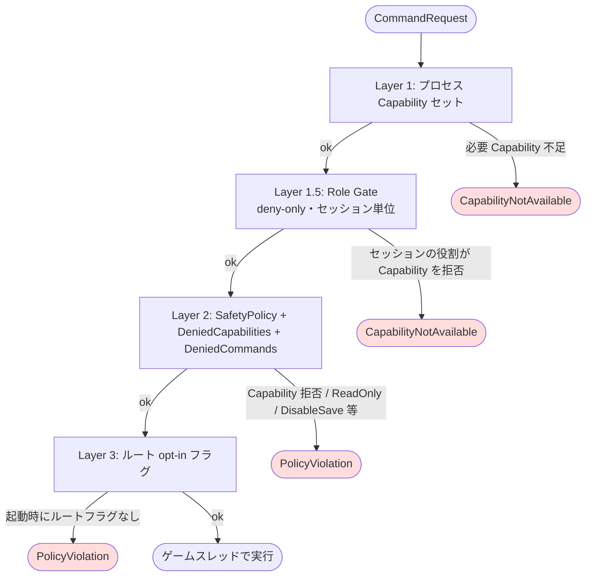
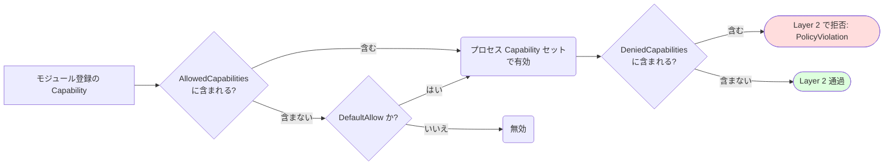

**[English](../en/safety.md)** | [概要に戻る](overview.md)

# Safety & Capabilities

UAIP はコマンドごとの認可を 4 つの層で管理します。層を理解することで、エラーの原因を素早く特定し、ワークフローに合った適切な権限を設定できます。

---

## 認可の 4 層構造

| 層 | メカニズム | スコープ | 失敗時のエラー |
|---|---|---|---|
| 1 | `FCapabilitySet` — エディタ起動時に SafetyPolicy から一度だけ確定するプロセス全体の Capability セット | プロセス全体（全セッションが共有） | `CapabilityNotAvailable` |
| 1.5 | `FRoleGate` — セッションに束縛された deny-only の降格。任意の役割トークンから解決される | セッション単位（Layer 1 が許可した範囲を狭めるだけで、Capability を追加することは無い） | `CapabilityNotAvailable` |
| 2 | `FSafetyPolicy` のブールスイッチ / `DeniedCapabilities` | プロセス全体（実行時不変） | `PolicyViolation` |
| 3 | ルート単位のオプトイン（シナリオルートなど） | プロセス全体 | `PolicyViolation` |

Layer 1 は「セッション単位」**ではありません** — 起動時に確定し（または `ReloadCapabilities` でプロセス全体として再読込され）、すべてのセッションが共有する単一の Capability セットです。セッションごとに変わるのは Layer 1.5 だけです。役割（後述の [役割](#役割layer-15)）が設定されており、あるセッションがその役割に束縛されている場合、そのセッションに限って役割の deny リストが Layer 1 のセットと積を取られます。役割が束縛されていないセッションは、Layer 1 単独と全く同じ挙動をします。


```mermaid
flowchart TB
    Cmd([CommandRequest])
    L1[Layer 1: プロセス Capability セット]
    L15[Layer 1.5: Role Gate<br/>deny-only・セッション単位]
    L2[Layer 2: SafetyPolicy + DeniedCapabilities + DeniedCommands]
    L3[Layer 3: ルート opt-in フラグ]
    Exec([ゲームスレッドで実行])

    Cmd --> L1
    L1 -- "必要 Capability 不足" --> E1([CapabilityNotAvailable])
    L1 -- ok --> L15
    L15 -- "セッションの役割が Capability を拒否" --> E15([CapabilityNotAvailable])
    L15 -- ok --> L2
    L2 -- "Capability 拒否 / ReadOnly / DisableSave 等" --> E2([PolicyViolation])
    L2 -- ok --> L3
    L3 -- "起動時にルートフラグなし" --> E3([PolicyViolation])
    L3 -- ok --> Exec

    style E1 fill:#fdd
    style E15 fill:#fdd
    style E2 fill:#fdd
    style E3 fill:#fdd
```

`AllowedCapabilities` と `DeniedCapabilities` は Layer 1 / 2 で **deny-wins** セマンティクスで相互作用します：


```mermaid
flowchart LR
    Reg[モジュール登録の Capability] --> Allow{"AllowedCapabilities<br/>に含まれる?"}
    Allow -- "含む" --> Active(プロセス Capability セットで有効)
    Allow -- "含まない" --> S1{"DefaultAllow か?"}
    S1 -- はい --> Active
    S1 -- いいえ --> X1(無効)
    Active --> Deny{"DeniedCapabilities<br/>に含まれる?"}
    Deny -- "含む" --> Final([Layer 2 で拒否: PolicyViolation])
    Deny -- "含まない" --> OK([Layer 2 通過])
    style Final fill:#fdd
    style OK fill:#dfd
```

---

## 役割（Layer 1.5）

役割（role）は、それに束縛されたセッションについて、プロセス全体の Capability セット（Layer 1）を狭めます。役割は **deny-only** です — プロセスが既に持っている Capability を取り上げることしかできず、プロセスが持たない Capability を追加することは決してできません。これにより、役割定義による権限昇格は「規約で避ける」ものではなく「構造的に不可能」になっています。

役割は、同じエディタに対して信頼レベルの異なる複数の AI エージェントを同時に動かす用途を想定しています。例えば、アセットを編集できる実装役のエージェントと、誤操作であっても変更系コマンドを一切呼ばないレビュー役のエージェントを分けたい場合です。

### 役割の定義

`Config/DefaultUAIP.ini` の `[UAIP.Roles]` に、役割ごとに 1 行 `+Role=` を追加します。

```ini
[UAIP.Roles]
+Role=(Name="reviewer", DeniedCapabilities=("BlueprintEdit","AssetCreate","AssetDelete","EditorActorEdit"))
+Role=(Name="implementer", DeniedCapabilities=())

; 役割を運べない Transport（後述）も併用する場合のみ必要
; AllowRoleBlindTransports=False
```

- `Name` は `[A-Za-z0-9_-]{1,64}` に一致し、このセクション内で一意である必要があります。不正な形式・重複する名前はエディタ起動時に拒否されます（該当行はスキップされ、エラーとしてログに記録されます。実行時まで持ち越して黙って受理することはありません）。
- `DeniedCapabilities` は何も拒否しない役割のために空（`DeniedCapabilities=()`）にできます。
- `[UAIP.Roles]` に `+Role=` 行が 1 つも無い場合、役割機能は**完全に無効**のままです — 全セッションが、本機能導入前と同じ、プロセス全体の Capability セットをそのまま保持します。

### セッションが役割に束縛される仕組み

役割は `SessionId` から推測されることはありません。この値は MCP / HTTP 経由で呼び出し側が自由に指定できる文字列であり、身元の根拠にはできないためです。代わりに次の仕組みを使います。

- **MCP モード**（`-uaip-mcp-enable`）のリクエストだけが `Authorization: Bearer <role-token>` で役割を運べます。
- エディタは起動時に定義済みの役割ごとに 1 つトークンを生成し、`Saved/UAIP/Roles/<RoleName>.token` へ書き出します（バージョン管理対象外。既存の HTTP/WS 認証トークンと同じ扱いです）。
- MCP Bridge の `config.json` は `role_name` を渡すと（対応するトークンファイルを自動で読み込みます）、あるいはトークンを別の方法で払い出している場合は `role_token` を直接渡すこともできます。どちらも環境変数 `UAIP_ROLE_NAME` / `UAIP_ROLE_TOKEN` で上書きできます。両方とも空のままなら、役割導入前と全く同じリクエストが送られます。
- ある `SessionId` を最初に運んできたリクエストが、そのセッションを解決済みの役割へ束縛します。以降の同じ `SessionId` のリクエストはすべてこの束縛と照合され、不一致の役割は拒否されます — 接続の途中でセッションの役割が変わることはありません。

役割は（リクエストごとではなく）MCP クライアントの接続ごとに、そのクライアント自身の Bridge 設定で構成されるため、「1 つの Bridge プロセスが 1 つの UAIP セッションに対応する」という仕組みと自然に組み合わさります。詳細は Architecture の [セッションライフサイクル](architecture.md#6-セッションライフサイクル) を参照してください。

### 役割を運べない Transport

WebSocket・CLI・HTTP Transport の FullHTTP モードは単一の共有シークレットで認証しており、役割を識別する手段がありません。`[UAIP.Roles]` が 1 つでも役割を定義すると、これらの Transport は**既定で起動を拒否**します — 起動を許すと、これら経由で接続した人が役割の制限をすべて黙って迂回できてしまうためです。`AllowRoleBlindTransports=True` を設定すればそれでも起動しますが、影響を受ける Transport ごとに起動時に警告がログへ出るため、迂回の存在は見える形のままになります。そしてそこ経由で発行されたコマンドは、役割による制限を受けないプロセス全体の Capability セットで実行されます。

### 役割による制限がクライアントにどう見えるか

- `uaip_list_commands` は、役割で拒否されたコマンドを、他の不可用コマンドと同じ扱いで既定応答から除外し、`HiddenReasons.RoleRestricted` に計上します（詳細は [コマンドリファレンス → discovery フィルタ](commands.md) を参照）。
- `uaip_describe_command` は役割で拒否されたコマンドも隠さず表示し、`UnavailableReason: "RoleRestricted"` を付けます。
- `uaip_query_capabilities` の `Capabilities` フィールドは、プロセス全体のセットではなく **セッションの役割で絞り込んだ後**のセットを返します。したがって役割が拒否している Capability が、その役割のセッションに対して「使える」と表示されることはありません。一方 `RegisteredCapabilities` カタログ（`IncludeUnavailable: true` で要求します）は**絞り込みません** — ロード済みモジュールが宣言したすべての Capability を列挙し、このセッションが使えないものには `IsGranted: false` を付けます。これは意図的な設計です。ある Capability の存在を見られなければ、クライアントは運用者へ有効化を依頼することも、期待したコマンドが無い理由を理解することもできません。カタログに現れるのは名前と既定方針だけで、操作そのものは引き続き役割が拒否します。
- 役割で拒否されたコマンドを呼ぶと、プロセス側の Capability 不足と同じ `CapabilityNotAvailable` エラーコードが返りますが、`ErrorMessage` には役割名と Capability 名の両方が入るため、対処の読み方が変わります。プロセス側の Capability 不足は運用者が有効化することで解消しますが、役割による制限は「その役割ではその操作を行わない」ことが解消であり、有効化すべき設定はありません。

---

## この機能が防ぐもの・防がないもの

Layer 1.5（役割）も、役割を識別するトークン認証も、**事故を防ぐための仕組み**であり、敵対者に対する防御境界ではありません。同一ユーザーアカウント・同一マシンで動く AI エージェントに対して資格情報を秘匿する手段は存在しません。トークンをファイルへ書けば読まれ、環境変数へ書けばプロセス環境から読まれ、設定ファイルへ書けば設定ファイルを読まれます。これは既知の恒久的な制約であり、いずれ修正されるバグではありません。

| 想定行動 | 効果 |
|---|---|
| 別の `SessionId` を指定して再試行する | **防ぐ**。MCP Bridge が自分の接続用に発行した `SessionId` で毎回上書きするため、MCP クライアント経由では別のセッションをそもそも表現できません |
| `SessionId` を省略して匿名セッションへ逃げる | **防ぐ**。Bridge が転送するすべての呼び出しへ自分のセッション ID を注入します |
| 役割を運べない Transport（WS / CLI / FullHTTP）へ接続する | 役割が 1 つでも定義されていれば**既定で防ぐ**（該当 Transport が起動を拒否します。詳細は前述の [役割](#役割layer-15) を参照）。運用者が `AllowRoleBlindTransports=True` で明示的に併用を許可した場合は防げませんが、その場合は迂回の存在が起動ログで可視化されます |
| 別の Bridge インスタンス・別のトークンへ MCP クライアントを向け直す | **技術的には防ぎません**。これが可能かどうかは、AI エージェントが MCP クライアント自身の設定ファイルを編集できるかという **OS のファイル権限に完全に依存**します。エージェントが広いファイルシステムアクセス権を持つ環境では、この前提は自動的には成立しません |
| `curl` や生の HTTP クライアントで `POST /mcp` を直接叩く | **防ぎません**。トークン認証はトークンが無い・間違っているリクエストを拒否しますが、トークンファイルを読めるエージェントであれば正しいリクエストを組み立てられます |
| UAIP を経由しない操作（Python スクリプト、Editor Utility Widget など） | **防ぎません**。定義上 UAIP の認可スタックの管轄外です |

本機能が実際に提供するのは次の2点です。

1. **境界の明示**。迂回はもはや事故ではなく、トークンファイルを読む・Bridge の設定ファイルを書き換える・別の方法でクライアントを起動するといった**意図的な行為**になります。
2. **可観測性**。認証失敗・役割束縛の不一致・役割制限による dispatch 拒否はすべて警告としてログに記録されるため、迂回の試み（偶発的であれ意図的であれ）は事後に確認できます。

---

## Capability リファレンス

各コマンドは必要な Capability を宣言しています。プロセスが必要な Capability をすべて持っており（Layer 1）、かつセッションが役割に束縛されている場合はその役割がいずれも拒否していないとき（Layer 1.5）だけコマンドを実行できます。Capability には **DefaultAllow**（自動付与）と **DefaultDenied**（`Config/DefaultUAIP.ini` で明示的に有効化が必要）の 2 種類があります。

🧩 付きの Capability はオプションプラグインへの依存があります。該当プラグインが `.uproject` で有効になっていない環境では Capability が登録されず、必要とするコマンドは `CommandNotFound` を返します。

### どんな Capability が存在するかを調べる

`QueryCapabilities` は 1 つの応答で異なる 2 つの問いに答えます。両者は区別して読んでください。

| フィールド | 答える問い |
|---|---|
| `Capabilities` | **このセッションが今使えるものは何か。** 実効セット — プロセスの Capability セットから `DeniedCapabilities` の分を引き、さらにセッションが束縛されている役割が拒否する分を引いたもの |
| `RegisteredCapabilityCount` / `UngrantedCapabilityCount` | **どれだけ存在し、そのうちこのセッションが使えないものは何件か。** 常に返します（0 件のときも返します）。フィールドが無いことから「未付与は無い」を推測する必要がありません |
| `RegisteredCapabilities` | **そもそも何が存在するか。** ロード済みモジュールが宣言したすべての Capability を、このセッションが保有しているかどうかに関わらず列挙します。各要素は `Name`・`DefaultPolicy`（`Allowed` / `Denied`）・`IsGranted` を持ちます。ここに `IsGranted: false` で現れる名前が、運用者へ有効化を依頼すべきものです。**`IncludeUnavailable: true` を渡したときだけ返ります** |

カタログは**オプトイン**です。`uaip_list_commands` が既定で利用不可のコマンドを隠すのと同じ理由で、通常のエディタでは 100 件を優に超えるうえ、このコマンドは「最初に呼べ」と案内しているものだからです。受け取るには `IncludeUnavailable: true` を渡します。一方で、**カタログの存在自体は隠しません** — 2 つの件数は毎回返るため、一度もオプトインしていないセッションでも「保有していない Capability が何件あるか」を知り、そのうえで一覧を要求できます。

**「運用者が有効化しなければならないものは何か」は `RegisteredCapabilities` だけで分かります** — `DefaultPolicy` が `Denied` の要素がそれにあたります。この一覧を別フィールドとして返すことは意図的にしていません。カタログに既にある名前を繰り返すだけで、新しい情報を持たないからです。

このカタログが必要なのは、DefaultDenied な Capability が定義上そもそも実効セットに現れないためです。多くの場合これは問題になりません — いずれかのコマンドの `RequiredCapabilities` に現れるので `uaip_describe_command` で名前が分かります。例外が `PropertyReferenceEdit` と `PropertyStructuredEdit` で、この 2 つは書き込み対象プロパティの型から dispatch のはるか後に判定されるため、どのコマンドも宣言しません。付与される前にこの 2 つを見つけられる場所は、このカタログだけです。

開示されるのは Capability の名前と既定方針だけです。プロジェクトの内容も値も含まれません。

---

### DefaultAllow（デフォルトで有効）

設定不要で全セッションに付与されます。読み取り専用の観測と、一般的な非破壊操作をカバーします。

| Capability | 有効になる操作 |
|---|---|
| `EditorObservation` | スクリーンショット（`CaptureActiveWindowImage`、`CaptureEditorTabImage`、`CaptureGraphViewportImage`）および JSON 状態ダンプ（`DumpEditorState`、`DumpSlateTree`、`DumpSelectionState`、`DumpOutputLog`、`DumpMessageLog` など） |
| `EditorInspect` | Editor 状態の読み取り専用検査 — アセット・詳細パネル・ビューポート・グラフ情報。共有インフラコマンドが使用 |
| `EditorUIAutomation` | UI 駆動コマンド — `ClickWidget`、`SelectMenuItem`、`InputText`、`SetCheckboxState`、`DragGraphNode`、`AcceptDialog`、`CancelDialog`、`InvokeContextMenuAction`、`WaitForWidget`、`FillForm`、`SnapshotUI` など、およびその `Toolset.Editor.SlateInspector.*` ブリッジ版。ブリッジ版も同じ Capability を要求するようになった（旧リリースでは Capability チェックなしにディスパッチされていた） |
| `EditorWorkspaceControl` | タブ・パネル管理 — タブの開閉、グラフエディタのフォーカス、エディタレイアウトの制御 |
| `EditorLifecycle` | エディタライフサイクル操作 — `SaveAll`、`ShutdownEditor`、`RestartEditor` |
| `EditorExecution` | エディタからの Automation Test 実行・Editor Utility Blueprint の実行 |
| `LiveCoding` | ホットリロード・Live Coding コンパイルのトリガー |
| `CrashReportRead` | クラッシュレポート診断情報へのアクセス |
| `AssetCreate` | コンテンツブラウザでの新規アセット作成 |
| `AssetMutate` | 既存アセットのプロパティ変更 |
| `AssetWindowControl` | アセットエディタの開閉 |
| `PIEControl` | PIE セッション制御 — `StartPIE`、`StopPIE`、`PausePIE`、`ResumePIE`、`LoadMap` |
| `RuntimeInspect` | ランタイムワールド状態の読み取り専用検査 — `DumpWorldState`、`DumpActorState`、`DumpComponentState`、`DumpRuntimeLog`、`CapturePerformanceSnapshot` |
| `RuntimeCapture` | ランタイムキャプチャ — `CaptureViewportImage`、`CheckpointCapture` |
| `RuntimeExecution` | PIE または Standalone での機能テスト・Automation Test の実行 |
| `RuntimeGASInspect` 🧩 | PIE 中の GAS 状態読み取り — `GetAttributeValues`、`GetActiveEffects`、`GetGrantedAbilities`、`GetActiveTags`、`FindAttributeSetClasses`（`GameplayAbilities` プラグイン必須） |
| `RuntimeNiagaraInspect` 🧩 | PIE 中の Niagara コンポーネント状態読み取り — `GetUserVariables`、`GetVariable`（`Niagara` プラグイン必須） |
| `SandboxObserve` 🧩 | アクティブな Sandbox の観測 — `GetSandboxStatus`、`GetSandboxChanges`（`FileSandbox` プラグイン必須） |
| `RuntimeInsightsInspect` | Unreal Insights トレースの読み取り専用検査 — `ListTraceChannels`、`GetTraceStatus`、`ListTraceFiles`。トレースの開始・停止・変更は一切できません |
| `PendingInteractionInspect` | 保留中の対話の状態照会・キャンセル — `GetPendingInteractionStatus`、`WaitForPendingInteraction`、`CancelPendingInteraction`。読み取り専用の照会のみで、対話の開始（`DrawPCGSpline` など）は対話型コマンド自身の Capability と `SafetyPolicy.AllowUserInteractionPrompt` によって別途ゲートされます |

---

### DefaultDenied（デフォルトで無効）

`Config/DefaultUAIP.ini` の `[UAIP.SafetyPolicy]` に `+AllowedCapabilities=<名前>` を追加して明示的に有効化する必要があります。破壊的な操作や重大な編集操作をカバーします。

#### Blueprint・AnimBlueprint 編集

| Capability | 有効になる操作 |
|---|---|
| `BlueprintEdit` | Blueprint アセットのコンパイルと構造検査 |
| `BlueprintVariableEdit` | Blueprint 変数の追加・削除・変更 |
| `BlueprintGraphEdit` | Blueprint イベントグラフへのノード追加・削除・接続 |
| `BlueprintComponentEdit` | Blueprint SCS コンポーネントの追加・削除・リネーム・親変更・複製・プロパティ編集 |
| `AnimBlueprintGraphEdit` | AnimGraph へのノード追加・削除・接続、Anim Blueprint のコンパイル |
| `AnimBlueprintCustomTypeEdit` | `AddAnimGraphNode` の `NodeClass` が、このドメインが信頼する 3 モジュール（`AnimGraph` / `AnimGraphRuntime` / `Engine`）以外 — プロジェクトやプラグインが定義した `UAnimGraphNode_Base` 派生クラス — のとき必要。このドメインには対になる「危険なノード」用の Capability はない。8 種のノードは、どの Capability を持っていても無条件で拒否される。[コマンド — UAIP.Editor.AnimBlueprint](commands.md#uaipeditoranimblueprint) を参照 |
| `AnimStateMachineEdit` | Anim ステートマシンへの State・Transition の追加・削除 |
| `AnimBlueprintReferenceEdit` | Anim Blueprint 上でオブジェクト参照を含む（または参照そのものである）プロパティ・実装済みインターフェース参照・埋め込み UAF グラフ参照を書き込むときに必要。`SetAnimGraphNodeProperty` は書き込みが実際に参照へ触れるときだけ動的に確認する。`ImplementAnimLayerInterface` と `AddUAFGraphNodeToAnimBlueprint` は毎回参照を書き込むため静的に宣言する。`AddLinkedAnimLayerNode` は `InterfacePath` 指定時だけ動的に確認する（自己完結型レイヤーノードは参照を書き込まない） |

#### Level / アクター / プロパティ編集

| Capability | 有効になる操作 |
|---|---|
| `EditorActorEdit` | Level Editor でのアクターの生成・削除・トランスフォーム変更 |
| `EditorLevelLoad` | エディタビューポートでのレベルオープン・新規作成 |
| `EditorViewportControl` | Level Editor ビューポートカメラの操作 — `FocusOnActors`、`GetCameraTransform`、`SetCameraTransform` |
| `PropertyEdit` | 詳細パネル経由でのアクター / アセットプロパティの読み書き（`GetActorProperty`、`SetActorProperty`、`GetAssetProperty`、`SetAssetProperty` など） |
| `PropertyReferenceEdit` | 値がオブジェクト / クラス / ソフト / ウィーク / レイジー / インターフェース参照、デリゲート、フィールドパスであるか、それらを（どの深さであれ）内包するプロパティの書き込み。参照を空にする操作にも必要 — 依存関係を付けることと外すことは同じ種類の変更であるため |
| `PropertyStructuredEdit` | 組み込みの値カタログ外の構造体・配列・セット・マップ・オプショナル・固定長配列の書き込みと、値全体を置き換える代わりにコンテナの要素 1 つを操作すること |
| `ProjectConfigEdit` | プロジェクト設定の読み書き（`GetProjectSetting`、`SetProjectSetting`） |
| `EditorUndoRedo` | エディタ操作の Undo / Redo |

> **Note**: `PropertyReferenceEdit` と `PropertyStructuredEdit` は `UAIP.Editor.Property` 限定ではありません。Blueprint SCS コンポーネント、Sequencer セクション、Sound / SoundCue アセット、PCG / 会話ノード、DataTable 行、World / プロジェクト設定など、**プロパティを書き込むすべてのドメイン**で参照・構造体・コンテナの書き込みを制御します。参照を内包する構造体の書き込みには両方が必要なので、構造側だけで参照のゲートを迂回することはできません。
>
> すでに独自の Capability で参照の書き込みを管理しているモジュールは、参照側についてはその名前を使い続けます — `SetAnimNotifyProperty` は `AnimNotifyReferenceEdit`、`SetDataflowNodeProperty` は `DataflowReferenceEdit`、Subsonic のプロパティ setter 群は `SubsonicEventEdit`、`SetSlotProperties` は `WidgetSlotReferenceEdit`、Enhanced Input のマッピング mutator 群は `EnhancedInputReferenceEdit`、`SetStateTreeParameter` は `StateTreeParameterReferenceEdit`、`AddSetParameterEntry` / `AddSetParametersModule` で参照型パラメータの既定値を書く場合は `NiagaraReferenceEdit` です。構造・コンテナ側は常に `PropertyStructuredEdit` です。例外は `SetPoseSearchSchemaChannelProperty` で、参照については付与できる Capability がありません — 参照を内包する型を一律拒否します。チャンネルのサブチャンネル配列へ直接書けると `AddPoseSearchSchemaChannel` のクラス許可リストを迂回できてしまうためです。
>
> どちらも書き込み実行時にプロパティの型から決まるため、**いずれのコマンドの `RequiredCapabilities` にも現れず**、`uaip_describe_command` にも表示されません。ただし書き込みを試さずに見つけることはできます — `QueryCapabilities` を `IncludeUnavailable: true` で呼ぶと `RegisteredCapabilities` カタログがこの 2 つを列挙し、運用者が有効化するまで `DefaultPolicy: "Denied"` / `IsGranted: false` を返します（[どんな Capability が存在するかを調べる](#どんな-capability-が存在するかを調べる) 参照）。**個別のプロパティ**に何が必要かを知るには、先にそのプロパティを読む（`WriteRequirements` オブジェクトが、書き込みに必要なものと、そのうちセッションが既に保有しているものを返します）か、拒否の返答から名前を読み取ってください。[コマンドリファレンス — 参照・構造体・コンテナの書き込み](commands.md#参照構造体コンテナの書き込み) を参照。

#### アセット管理

| Capability | 有効になる操作 |
|---|---|
| `AssetDelete` | アセットの永続削除 |
| `FolderDelete` | コンテンツフォルダの永続削除 |
| `AssetFolderRefactor` | アセットとフォルダの移動・リネーム |
| `RedirectorFixup` | 古いアセットリダイレクタの修正 |
| `ShaderCompilation` | シェーダーコンパイルの制御とステータス照会 |
| `ContentBrowserNavigate` | Content Browser のナビゲートとアセット選択 — `SelectAssets`、`SetContentBrowserPath`（native および bridge） |
| `PrimaryAssetTypeAdd` | `PrimaryAssetType` を `PrimaryAssetTypesToScan` に追加（`AddPrimaryAssetType`、`DefaultGame.ini` へ永続化） |
| `PrimaryAssetTypeRemove` | `PrimaryAssetType` を `PrimaryAssetTypesToScan` から削除（`RemovePrimaryAssetType`、永続化） |
| `PrimaryAssetRulesOverride` | 指定 `PrimaryAssetId` の Rule をメモリ内で一時的に上書き（`SetPrimaryAssetRules`、非永続） |
| `PrimaryAssetLoad` | `PrimaryAsset` を明示的にメモリへロード（`LoadPrimaryAsset`） |
| `PrimaryAssetUnload` | `PrimaryAsset` を明示的にメモリからアンロード（`UnloadPrimaryAsset`） |

#### マテリアル編集

| Capability | 有効になる操作 |
|---|---|
| `MaterialGraphEdit` | Material グラフへのノード追加・削除・接続、マテリアルのコンパイル |
| `MaterialParameterEdit` | Material パラメータ値とデフォルト値の変更 |
| `MaterialCustomNodeEdit` | `AddMaterialNode` の `ExpressionClass` が `UMaterialExpressionCustom` / `UMaterialExpressionCustomOutput`、またはそのいずれかの派生クラス（任意の HLSL を含められる）のとき、どのモジュール由来かに関わらず必要。この変更以前から登録されていたが、これまでどのコマンドも要求していなかった |
| `MaterialCustomTypeEdit` | `AddMaterialNode` の `ExpressionClass` がエンジン組み込みモジュール（`Engine` / `RenderCore` / `MaterialEditor` / `Landscape`）以外 — プロジェクトやプラグインが定義した `UMaterialExpression` 派生クラス — のとき必要。プロジェクト定義かつカスタム HLSL のクラスは `MaterialCustomNodeEdit` とあわせて両方が必要 |

> **Note**: `MaterialCustomNodeEdit` / `MaterialCustomTypeEdit`、（上の [Blueprint・AnimBlueprint 編集](#blueprintanimblueprint-編集) にある）`AnimBlueprintCustomTypeEdit`、（下の [ControlRig 編集](#controlrig-編集) にある）`ControlRigCustomTypeEdit`、（下の [AI システム](#ai-システム) にある）`BehaviorTreeCustomTypeEdit` / `BehaviorTreeExternalBehaviorNodeEdit` / `BlackboardReferenceKeyTypeEdit`、（下の [ゲームプレイシステム](#ゲームプレイシステム) にある）`EnhancedInputCustomTypeEdit`、および（下の [オプショングラフエディタ](#オプショングラフエディタ) にある）`MetaSoundCustomTypeEdit` / `EQSCustomTypeEdit` / `EQSDelegatedGeneratorEdit` は、ゲートされた型のノードを追加するときだけでなく、その既存ノードに触るあらゆる操作 — 編集・接続・切断・コンパイル・Reparent・削除 — でも同じ Capability があらためて確認されます。⚠️ この変更以前は、こうしたノードの削除・切断は無条件でゲートされていませんでした。もう追加できない型であることは、それ自体では既存ノードを削除・切断できない理由にはなりません。詳細は [コマンドリファレンス — Capability でゲートされたカスタム型](commands.md#capability-でゲートされたカスタム型) を参照してください。

#### DataTable 編集

| Capability | 有効になる操作 |
|---|---|
| `DataTableRowEdit` | DataTable アセットへの行追加・変更 |
| `DataTableRowDelete` | DataTable アセットからの行削除 |
| `DataTableImport` | DataTable アセットへの CSV/JSON データインポート |

#### 物理アセット編集

| Capability | 有効になる操作 |
|---|---|
| `PhysicsAssetEdit` | Physics Asset のシェイプと制約の追加・削除・変更 |
| `PhysicsBodyEdit` | Physics Asset ボディの追加・削除およびボディプロパティの変更（PhysicsMode、MassScale、CollisionProfile、Damping、Offset） |

#### Skeleton / SkeletalMesh 編集

| Capability | 有効になる操作 |
|---|---|
| `SkeletonAssetEdit` | Skeleton アセットのソケット・バーチャルボーン・BlendProfile の追加・削除・変更 |
| `SkeletalMeshMaterialEdit` | SkeletalMesh のマテリアルスロットの割り当て・置換 |

#### Unified Animation Framework（UAF）編集 🧩

Engine 本体の `UAF` プラグインが必要で、無効な場合は以下のコマンドは一切登録されません。**この 3 つの Capability でゲートされるコマンドはすべて `Stability: Experimental` です** — UAF プラグイン自体がエンジン側の Experimental 機能であり、将来のエンジンリリースで API が予告なく変わりうるためです。`UAFReferenceEdit` と（上記の）`AnimBlueprintReferenceEdit` は別々にゲートされています — 前者は UAF ピン参照、後者は Anim Blueprint 上の実装済みインターフェース参照・埋め込みグラフ参照と、指す対象が異なるためです。`AddUAFGraphNodeToAnimBlueprint`（UAF グラフを Anim Blueprint に埋め込むコマンド）は上記の Anim Blueprint 系 Capability でゲートされ、この 3 つでは制御されません。

| Capability | 有効になる操作 |
|---|---|
| `UAFGraphEdit` | UAF アセットのグラフ・変数・コンパイル編集（`AddUAFGraphNode` / `RemoveUAFGraphNode` / `ConnectUAFPins` / `DisconnectUAFPins` / `SetUAFPinValue` / `AddUAFVariable` / `RemoveUAFVariable` / `AddUAFEventGraph` / `CompileUAFAsset`） |
| `UAFCustomTypeEdit` | 追加・接続・切断・削除操作が対象とする RigVM Unit 構造体またはアニメーション Trait が、フレームワーク自身のパッケージ由来でないとき必要 — オプションの UAF サブプラグイン・プロジェクトモジュール・その他このセット外から提供された型。`GetAvailableUAFUnitStructs` と `GetAvailableUAFTraits` は各エントリに必要な Capability を報告する |
| `UAFReferenceEdit` | `SetUAFPinValue` がピンへオブジェクト参照・クラス参照を書き込むとき必要 — ピン自身の宣言型、またはその型グラフのどこかで参照を宣言する構造体のいずれか |

#### Geometry Collection（Chaos Destruction）編集

読み取り専用の観測コマンド（`GetGeometryCollectionInfo`・`GetGeometryCollectionClusterInfo`・`GetGeometryCollectionDestructionSettings`）は DefaultAllow の `EditorInspect` です。読み取り専用の `SelectGeometryCollectionBones` も同じく `EditorInspect` ですが、追加で `Fracture` プラグインが必要です — 詳細は [Commands Reference](commands.md) を参照してください。書き込み系はリスクの性質ごとに 3 つの capability へ分割されています: アセットの作成・マージ、ボーンのフラクチャ・マージ・削除・分割・検証（いずれも破壊的なジオメトリ操作）、それ以外（クラスタ階層・ジオメトリ属性・ダメージ設定）。

| Capability | 有効になる操作 |
|---|---|
| `GeometryCollectionCreate` | Static Mesh から新規 `UGeometryCollection` を作成（`CreateGeometryCollectionFromStaticMesh` 🧩、`GeometryCollectionPlugin` が必要）、および片方のコレクションのジオメトリをもう片方へマージ（`MergeGeometryCollectionAssets`、プラグイン依存なし） |
| `GeometryCollectionFracture` 🧩 | コレクションをフラクチャ（`FractureGeometryCollectionUniform` / `Voronoi` / `Plane` / `Slice` / `Brick` / `WithMesh` / `WithMeshArray`）、ボーンのマージ・削除（`MergeGeometryCollectionBones`・`DeleteGeometryCollectionBranch`）、微小ジオメトリのマージ（`FixGeometryCollectionTinyGeometry`）、非連結アイランドの分割（`SplitGeometryCollectionIslands`）、構造的不整合のクリーンアップ（`ValidateGeometryCollection`）— 計 12 コマンド、いずれも `Fracture` プラグインが必要 |
| `GeometryCollectionEdit` | ボーンのクラスタ階層編集（`ClusterGeometryCollectionBones`・`UnclusterGeometryCollectionBones`・`RenameGeometryCollectionBone`）、ジオメトリの表示 / 派生データ属性編集（可視性・マテリアル・法線・凸包・分解ビュー・ボーンカラー）、ダメージモデル / クラスタリング設定（`SetGeometryCollectionDestructionSettings`）— 計 11 コマンド。`AutoClusterGeometryCollection` と属性編集系 6 コマンド（🧩 印）は追加で `Fracture` プラグインが必要、残る 4 コマンドにプラグイン依存は無い |

#### Motion Matching / Pose Search 編集

| Capability | 有効になる操作 |
|---|---|
| `PoseSearchAssetEdit` 🧩 | PoseSearch Schema アセットへのチャンネル・互換 Skeleton の追加・削除・並べ替え・設定、PoseSearch Database アセットへのアニメーション追加・削除、データベーススキーマ・アニメーション設定・Normalization Set 所属の変更、データベースインデックスビルドの開始（`PoseSearch` プラグイン必須）。`SetPoseSearchSchemaChannelProperty` で構造体・コンテナを書き込むにはさらに `PropertyStructuredEdit` が必要。参照を内包する型は一律拒否され、これを解除できる Capability は存在しない |

#### AnimNotify 編集

| Capability | 有効になる操作 |
|---|---|
| `AnimNotifyEdit` | 通知トラックの追加・削除、`UAnimSequence` / `UAnimMontage` / `UAnimComposite` 上の AnimNotify・AnimNotifyState エントリの追加・削除・編集、無効な通知 guid の修復。`UAIP.Editor.AnimSequence` の全編集系コマンドで必須 |
| `AnimNotifyReferenceEdit` | `SetAnimNotifyProperty` が、あらゆる種類の参照（オブジェクト / クラス / ソフト / ウィーク / レイジー / インターフェース参照、デリゲート、フィールドパス）であるか、それを内包するプロパティへ書き込む場合に `AnimNotifyEdit` に加えて必要。構造体・コンテナの書き込みにはさらに `PropertyStructuredEdit` が必要 |

#### MetaHuman キャラクター編集

以下の Capability はいずれも `MetaHumanCharacter` プラグインを必要とします。コマンド数ではなくリスクの性質で分割しています — アセットの新規作成、ディスク上のファイル読み込み、数分かかる合成処理の開始、外部サービスへのデータ送信、失敗時にアセットを削除するビルドの実行は、それぞれ個別に判断すべき事項だからです。

| Capability | 有効になる操作 |
|---|---|
| `MetaHumanAssetCreate` 🧩 | MetaHuman キャラクターアセットの新規作成 — ネイティブ `CreateMetaHumanCharacter` とブリッジ `Toolset.Editor.MetaHuman.Create`。汎用の `UAIP.Editor.Assets.CreateAsset` も、この Capability がない限り `UMetaHumanCharacter`（およびその派生クラス）に対しては拒否されるため、DefaultAllow の `AssetCreate` で迂回することはできません |
| `MetaHumanEdit` 🧩 | 既存キャラクターへのローカルな変更すべて — 体型制約・体型、肌・眼・メイク・ヘッドモデル・顔評価設定、顔の造形とランドマーク編集、コンフォーム / フィッティング、ワードローブスロットの割り当て、プレビュービューポート設定、ビルド前提条件の確認と状態ポーリング、`ReleaseEditSession` — に加え、編集セッションを必要とするため読み取り専用を宣言できない読み取り系コマンド。`Create` を除く全ての `Toolset.Editor.MetaHuman.*` ブリッジコマンドもこの Capability でゲートされます |
| `MetaHumanFileImport` 🧩 | OS ファイルシステム上の顔 DNA ファイルの読み込み — `ImportFaceFromDna`・`FitFaceFromBodyWithEyesTeethDna`。読み込むファイルはエンジン側パーサへ渡される信頼できないバイナリであるため、通常の編集とは別にゲートしています |
| `MetaHumanTextureSynthesis` 🧩 | 高解像度フェイステクスチャ合成の開始 — `RequestTextureSources`。数分間実行され結果をディスクへ書き出すため、通常のパラメータ編集とはまとめて付与しません |
| `MetaHumanCloudRigging` 🧩 | フェイスリグ生成の開始 — `RequestAutoRigging`。⚠️ 本モジュールで唯一、キャラクターデータを外部サービス（Epic のクラウドリギングサービス）へ送信するコマンドであるため、常に明示的な判断を必要とします |
| `MetaHumanBuild` 🧩 | MetaHuman アセットビルドパイプラインの実行 — `BuildMetaHuman`。ビルド完了までゲームスレッドをブロックし、失敗時には作成したアセットを削除するため、応答性と破壊性の両面を持ちます |

#### UMG / Widget 編集

| Capability | 有効になる操作 |
|---|---|
| `WidgetTreeEdit` | UMG Widget Blueprint のウィジェット追加・削除・親子変更 |
| `WidgetVariableEdit` | ウィジェット変数の追加・削除 |
| `WidgetAnimationEdit` | Widget Animation の作成・アニメーショントラックの追加 |
| `WidgetBindingEdit` | プロパティバインディングの追加・削除 |
| `WidgetSlotReferenceEdit` | `SetSlotProperties` が、あらゆる種類の参照（オブジェクト / クラス / ソフト / ウィーク / レイジー / インターフェース参照、デリゲート、フィールドパス）であるか、それを（どの深さであれ）内包するスロットプロパティへ書き込む場合に必要。書き込み実行時にプロパティの型から決まるため `SetSlotProperties` の宣言する `RequiredCapabilities` には現れない — [Level / アクター / プロパティ編集](#level--アクター--プロパティ編集) の Note を参照。構造体・コンテナの書き込みにはさらに `PropertyStructuredEdit` が必要 |

#### Sequencer 編集

| Capability | 有効になる操作 |
|---|---|
| `SequencerStructureEdit` | トラック・セクションの追加・削除、再生範囲の設定 |
| `SequencerKeyframeEdit` | Sequencer チャンネルへのキーフレーム追加・削除・値編集 |
| `SequencerBindingEdit` | Level Sequence へのアクター Possessable バインドの追加・削除 |
| `SequencerPlaybackControl` | Sequencer 再生状態の制御（Play、Pause、SetPlayheadFrame、SetPlaybackSpeed、SetLoopMode） |
| `SequencerPropertyEdit` | `UMovieSceneSection` プロパティの読み書き |

#### ControlRig 編集

| Capability | 有効になる操作 |
|---|---|
| `ControlRigHierarchyEdit` | ControlRig ヒエラルキーの Control 要素・ボーン・Null の追加・削除・トランスフォーム設定 |
| `ControlRigGraphEdit` | RigVM グラフへのノード追加・削除・ピン接続、ControlRig のコンパイル |
| `ControlRigBlueprintCreate` | `CreateAsset` 経由での ControlRigBlueprint アセット作成 |
| `ControlRigComponentEdit` | ヒエラルキー要素に付くコンポーネント（`FRigBaseComponent` 派生構造体）の追加・削除・改名・付け替え・内容の書き換え — `UAIP.Editor.ControlRig` の汎用コンポーネントコマンドと、`UAIP.Editor.ControlRig.Dynamics` / `UAIP.Editor.ControlRig.Physics` のすべての書き込みが対象。1 つの capability でまとめているのは意図的で、初期内容付きでコンポーネントを作る経路は既存コンポーネントの内容を置き換える経路と同じインポート処理に到達するため、個別に付与できると一方が他方の検査を迂回する手段になる |
| `ControlRigCustomTypeEdit` | RigVM unit 構造体または rig ヒエラルキー component 構造体が、このドメインの受け入れる 7 モジュール（`/Script/ControlRig` / `/Script/ControlRigDynamics` / `/Script/ControlRigPhysics` / `/Script/ControlRigSpline` / `/Script/ControlRigModules` / `/Script/AnimationCore` / `/Script/Engine`）の外に由来する場合に必要 — プロジェクトやプラグインが宣言した構造体が該当します。`AddGraphNode` / `AddComponent` だけでなく、そうした構造体の既存ノード・既存コンポーネントに対するその後の操作すべてをゲートします。このドメインには「危険な型」用の別 Capability は存在せず、control type はゲートされません。`Deprecated` / `Hidden` が付いた構造体はどの Capability を持っていても拒否されます。[コマンドリファレンス — UAIP.Editor.ControlRig](commands.md#uaipeditorcontrolrig) を参照 |

#### AI システム

| Capability | 有効になる操作 |
|---|---|
| `BehaviorTreeGraphEdit` | Behavior Tree グラフへのノード追加・削除・プロパティ設定 |
| `BlackboardEdit` | Blackboard キーの追加・削除 |
| `BehaviorTreeCustomTypeEdit` | 型がこのドメインの出荷物の外から来た場合に、`BehaviorTreeGraphEdit` または `BlackboardEdit` に加えて必要です。このドメインが型を受理する 3 か所すべてを対象とし、受け入れモジュールはそれぞれ異なります — `/Script/AIModule` / `/Script/AITestSuite` 以外のノードクラス、`/Script/AIModule` / `/Script/Engine` 以外のクラスが宣言したノードプロパティ、`/Script/AIModule` 以外の Blackboard キー型。プロジェクトのモジュール、プラグインのモジュール（`GameplayBehaviorSmartObjects` などエンジンプラグインを含む）、Blueprint 生成クラスが該当します。そうした型が名指しされたときの 4 つの `Add*` ノードコマンドと `AddBlackboardKey`、対象がそうした型であるときの `RemoveBehaviorTreeNode` / `SetBehaviorTreeNodeProperty` / `RemoveBlackboardKey` をゲートします。コマンドではなくリクエストで名指しされた型（または対象が持つ型）から判定されるため、どのハンドラーの宣言 `RequiredCapabilities` にも現れません |
| `BehaviorTreeExternalBehaviorNodeEdit` | ノードの本体がクラス自身ではない場所にある 5 系統について、`BehaviorTreeGraphEdit` に加えて必要です — 別の Behavior Tree アセットをまるごと実行する `UBTTask_RunBehavior` / `UBTTask_RunBehaviorDynamic` と、サブクラスがエディタで組まれたグラフを持つ `UBTTask_BlueprintBase` / `UBTDecorator_BlueprintBase` / `UBTService_BlueprintBase`。継承で判定し、クラスの出自とは独立に要求されます — これらの系統は `/Script/AIModule` 自身が出荷しているため、クラスを信頼できることは「そのクラスが何を実行するか」について何も語らないからです。⚠️ プロジェクト製の Blueprint ノードは**両方**に該当するため、これと `BehaviorTreeCustomTypeEdit` が同時に必要です。片方だけを付与しても拒否され、もう一方が不足として名指しされます |
| `BlackboardReferenceKeyTypeEdit` | 保持する値が「書き込む側が指す先を選べる参照」である 2 種のキー型について、`BlackboardEdit` に加えて必要です — プロジェクト内の任意の UObject を受け付ける `UBlackboardKeyType_Object` と、クラス名を保持してエンジンに解決させる `UBlackboardKeyType_Class`。これも継承で判定します。`BehaviorTreeExternalBehaviorNodeEdit` とは意図的に別の名前です — 一方は本体が外にあるノード、他方は値の指す先が外にあるキーを守っており、名前を共有すると前者を許可した運用者が知らないうちに後者も許可してしまうためです。`AddBlackboardKey` と `RemoveBlackboardKey` をゲートします。**Blackboard にそうしたキーが宣言されていても、その Blackboard を参照する Behavior Tree 側でこの Capability が要ることにはなりません**ので、通常のツリー編集はこれなしで通ります。[コマンドリファレンス — UAIP.Editor.BehaviorTree](commands.md#uaipeditorbehaviortree) を参照してください |

#### StateTree 編集

| Capability | 有効になる操作 |
|---|---|
| `StateTreeStructureEdit` | StateTree への State 追加・削除、アセットのコンパイル |
| `StateTreeNodeEdit` | Task・Transition の追加・削除、ノードプロパティの編集 |
| `StateTreeCustomTypeEdit` | Task・Evaluator・Enter Condition フィールドが `/Script/StateTreeModule`・`/Script/AIModule`・`/Script/GameplayStateTreeModule` のいずれでもないモジュール由来（プロジェクトのモジュール、プラグインのモジュール、Blueprint 生成クラス）である場合、またはノードプロパティを宣言しているクラス・struct がこの 3 つの外にある場合に、`StateTreeNodeEdit` に加えて必要。そのようなフィールドまたは宣言型が名指しされたときの `AddStateTask` / `AddGlobalTask` / `AddEvaluator` / `AddStateEnterCondition` と 4 つの `Set*Property` コマンド、削除対象がそのようなノードであるときの `RemoveStateTask` / `RemoveGlobalTask` / `RemoveEvaluator` / `RemoveStateEnterCondition` をゲートする。プロパティの書き込みでは、ノード自身のクラスとプロパティの宣言型を 2 つの独立した問いとして確認し、どちらの不足としても名指しされうる。コマンドではなくリクエストで名指しされた型（または削除対象のノードで見つかった型）から決まるため、いずれのハンドラの宣言する `RequiredCapabilities` にも現れない。そのようなフィールドを単に含んでいるだけのアセットのコンパイルには一切要らない — ゲートされるのは、リクエストが名指しした型、またはリクエストが操作対象にした型だけ。[コマンド — UAIP.Editor.StateTree](commands.md#uaipeditorstatetree) を参照 |
| `StateTreeParameterReferenceEdit` | `SetStateTreeParameter` が、あらゆる種類の参照であるか、それを内包するルートパラメータ値へ書き込む場合に必要。書き込み実行時にパラメータの `PropertyBag` 値型から決まるため `SetStateTreeParameter` の宣言する `RequiredCapabilities` には現れない — [Level / アクター / プロパティ編集](#level--アクター--プロパティ編集) の Note を参照。構造体・コンテナの書き込みにはさらに `PropertyStructuredEdit` が必要 |

#### SoundCue 編集

| Capability | 有効になる操作 |
|---|---|
| `SoundCueGraphEdit` | SoundCue グラフへのノード追加・削除・接続、プロパティ編集、SoundCue のコンパイル |

#### サウンドアセット編集

| Capability | 有効になる操作 |
|---|---|
| `SoundClassEdit` | SoundClass アセットのプロパティ設定・子クラス追加・削除（`SetSoundClassSettings`、`AddSoundClassChild`、`RemoveSoundClassChild`） |
| `SoundAttenuationEdit` | SoundAttenuation の FSoundAttenuationSettings フィールド設定（`SetSoundAttenuationSettings`） |
| `SoundMixEdit` | SoundMix のプロパティ設定・SoundClassAdjuster の追加・更新・削除（`SetSoundMixSettings`、`SetSoundMixAdjuster`、`RemoveSoundMixAdjuster`） |

#### MVVM 編集

| Capability | 有効になる操作 |
|---|---|
| `ViewModelBindingEdit` | WidgetBlueprint への View Binding / View Event の追加・削除・更新、ViewModel プロパティの追加・削除（`AddViewBinding`、`RemoveViewBinding`、`UpdateViewBinding`、`SetViewBindingEnabled`、`SetViewBindingConversionFunction`、`SetViewBindingExecutionMode`、`AddViewEvent`、`RemoveViewEvent`、`AddViewModelProperty`、`RemoveViewModelProperty`） |
| `ViewModelSourceEdit` | WidgetBlueprint への ViewModel 接続管理（`AddViewModelToWidget`、`RemoveViewModelFromWidget`、`RenameViewModelInWidget`、`ReparentViewModelInWidget`、`SetViewModelSource`） |

#### Curve 編集

| Capability | 有効になる操作 |
|---|---|
| `CurveKeyEdit` | UCurveFloat / UCurveVector / UCurveLinearColor のキー追加・削除・値・補間・接線の編集 |

#### ゲームプレイシステム

| Capability | 有効になる操作 |
|---|---|
| `GameplayTagEdit` | プロジェクトタグテーブルへのタグ追加・削除・リネーム |
| `GameplayTagRestrictedEdit` | Restricted タグリストの修正 |
| `GameFeatureCreate` 🧩 | GameFeature Plugin 定義の作成・スキャフォールディング（`GameFeatures` + `GameFeaturesEditor` プラグイン必須） |
| `GameplayCueMutation` 🧩 | GameplayCue タグの追加・削除、GameplayCueNotify アセットの作成、アクターへの Cue 実行（`GameplayAbilities` プラグイン必須） |
| `EnhancedInputEdit` | Input Action / Input Mapping Context アセットの編集 — マッピング・Modifier・Trigger の追加・削除・変更 |
| `EnhancedInputReferenceEdit` | Trigger または Modifier のプロパティが、あらゆる種類の参照（オブジェクト / クラス / ソフト / ウィーク / レイジー / インターフェース参照、デリゲート、フィールドパス）であるか、それを内包する値へ書き込む場合に `EnhancedInputEdit` に加えて必要。書き込み実行時にプロパティの型から決まるため、マッピング mutator 群の宣言する `RequiredCapabilities` には現れない — [Level / アクター / プロパティ編集](#level--アクター--プロパティ編集) の Note を参照。構造体・コンテナの書き込みにはさらに `PropertyStructuredEdit` が必要 |
| `EnhancedInputCustomTypeEdit` | Trigger / Modifier のクラスが `/Script/EnhancedInput` モジュールの外に由来する場合に `EnhancedInputEdit` に加えて必要 — プロジェクトモジュール、プラグインモジュール、`UInputTrigger` / `UInputModifier` の Blueprint 派生クラスが該当する。そうしたクラスを名指しする `SetInputMappingTrigger` / `SetInputMappingModifier` / `SetInputActionTrigger` / `SetInputActionModifier` に加えて、そのインスタンスを保持する対象に対する `RemoveInputMapping` / `DeleteInputAction` / `DeleteMappingContext` もゲートする。コマンドではなくリクエストが名指しした（あるいは対象が保持していた）クラスから決まるため、どのハンドラの宣言する `RequiredCapabilities` にも現れない。このドメインに「危険な型」用の別 Capability は存在せず、2 種の Trigger — `UInputTriggerChordAction` / `UInputTriggerChordBlocker` およびその派生 — はどの Capability を持っていても拒否される。[コマンドリファレンス — UAIP.Editor.EnhancedInput](commands.md#uaipeditorenhancedinput) を参照 |

#### エディタ操作

| Capability | 有効になる操作 |
|---|---|
| `EditorKeyboardInput` | Editor UI ウィジェットへのキーボード入力シミュレート — ネイティブ `PressKey` と `Toolset.Editor.SlateInspector.PressKey` ブリッジ（ブリッジ版も `AllowKeyboardInput` / `AllowKeyboardModifierInput` と危険ショートカットのブロックリストを適用するようになった。ネイティブより厳格な唯一の点は [コマンドリファレンス](commands.md#uaipeditoruiautomation) 参照） |
| `EditorExecCommand` | `GUnrealEd->Exec` 経由の低レベル Editor コマンド実行 |
| `LogVerbosityEdit` | ログ詳細レベルの変更 — `SetLogVerbosity` native および `Toolset.Editor.Toolset.Logs.SetVerbosity` bridge |
| `ViewportAnnotationCapture` | ワールド座標ラベル付きビューポート画像のキャプチャ — `CaptureViewportImageAnnotated` |
| `EditorTabSpawn` | Slate の `FTabId` でエディタタブを開く・閉じる・列挙する — `OpenTabById`、`CloseTabById`、`ListSpawnableTabs`。DefaultAllow の `EditorWorkspaceControl`（`AssetPath` でアセットエディタタブのみに到達する）とは別物です。任意の `TabId` を指定できるということは第三者プラグインが登録したデリゲートを実行しうるということであり、該当するのは開く側の `CanSpawnTab` / `OnSpawnTab`、閉じる側の `OnCanCloseTab` / `OnTabClosed`、読み取り専用の列挙側の表示名・ツールチップ取得（`TAttribute` の bound デリゲート）です。これはメニューに一切表示されない内部タブも対象に含みます。`ListSpawnableTabs` を DefaultAllow にせず同じ Capability を要求するのは、列挙自体が同じデリゲート実行リスクを持つことと、一覧の唯一の用途が開閉の判断であることによります。閉じる操作は**このセッションが開いたタブに限定されません** — 人間が作業のために開いているものを含め、いま開いている任意のタブを閉じられます。また閉じる操作はタブ許可リストを一切通さないため、許可設定を変更した後でも後始末が失敗することはありません |

#### スクリプト実行

| Capability | 有効になる操作 |
|---|---|
| `ScriptExecution` 🧩 | エディタでの Python スクリプト実行（`RunEditorPythonScript`；`PythonScriptPlugin` 必須） |
| `PythonCommandExecution` 🧩 | `@uaip_command` で動的登録された Python コマンドの実行（`PythonScriptPlugin` 必須） |
| `PythonExtensionReload` 🧩 | 登録済み Python コマンドの再スキャン・リロード（`ReloadPythonCommands`；`PythonScriptPlugin` 必須） |

#### Runtime — 制限付き操作

| Capability | 有効になる操作 |
|---|---|
| `RuntimeCVarRead` | エンジン全体の CVar 値の読み取り — `UAIP.Runtime.Engine.CVar.GetConsoleVariable`、`SearchConsoleVariables`（`UAIPRuntimeEngineManagement` 所有） |
| `RuntimeCVarWrite` | CVar 値の設定・リセット — `UAIP.Runtime.Engine.CVar.SetConsoleVariable`、`ResetConsoleVariable`（機密名・`ECVF_ReadOnly` は拒否、`ECVF_Cheat` 付きはさらに `AllowCheatCVarWrite` SafetyPolicy スイッチが必要、`UAIPRuntimeEngineManagement` 所有） |
| `CVarInspect` | センシティブパターンフィルタリング付き CVar 検索 — `Toolset.Editor.Toolset.EngineManagement.SearchCVars` bridge（`UAIPEditorEngineManagement` 所有） |
| `RuntimeActorManipulation` | PIE 中のアクタースポーン・破棄・テレポート・Possess |
| `RuntimeExecCommand` | `UWorld` 経由のランタイムコンソールコマンド実行 |
| `RuntimeInputInjection` | PIE へのキーボード / Enhanced Input / レガシー入力イベントの注入（`InjectInputKey`、`InjectEnhancedInputAction`、`AddMappingContext`、`SetInputMode`、`FlushInput` など） |
| `RuntimeNiagaraMutation` 🧩 | Runtime での Niagara ユーザー変数設定・Niagara システム差し替え（`SetVariable`、`SetSystem`；`Niagara` プラグイン必須） |
| `GauntletExecution` | Gauntlet 自動テストセッションの起動 |

#### Runtime Insights トレース採取

Unreal Insights のトレースは 4 つの Capability に分割されています。トレースの状態を読むこと・トレースを操作すること・生の採取ファイルを受け取ること・採取済みトレースを解析することは、それぞれ別の判断だからです。

| Capability | 有効になる操作 |
|---|---|
| `RuntimeInsightsControl` | トレースの開始・停止・一時停止・再開、チャネル集合の変更、ブックマークと区間の書き込み — `StartTrace`、`StopTrace`、`PauseTrace`、`ResumeTrace`、`SetTraceChannels`、`AddTraceBookmark`、`BeginTraceRegion`、`EndTraceRegion` |
| `RuntimeInsightsAttachTraceFile` | 採取した `.utrace` ファイル自体を artifact として引き渡す（`StopTrace` の `AttachTraceFile: true`）。`RuntimeInsightsControl` とは別にゲートされ、トレースの**停止**には不要です（本 Capability を持たないセッションでも常に正常に停止でき、ファイルがスキップされるだけです） |
| `RuntimeInsightsAnalyze` | 採取済みトレースの解析と抽出結果の読み取り — `AnalyzeTrace`、`GetTraceAnalysisStatus`、`GetTraceAnalysisResult`。トレース解析が有効なビルド構成でのみ登録されます |

> ⚠️ **`.utrace` ファイルの受け取りは、チャネル設定から想像される以上の情報を開示します。**
> プロセスのフルコマンドライン（絶対パス・ユーザー名・すべての起動オプション）は、列挙も無効化もできない常時オンの内部チャネルを通じて書き込まれます。したがって記録したチャネルに関わらず**すべての**トレースファイルに含まれ、`AllowLogDump=False` にしていても防げません。`RuntimeInsightsAttachTraceFile` が独立した DefaultDenied Capability として存在するのはこのためです。
> 解析コマンドは等価ではありません。`Diagnostics` セクションはサニタイズ済みのコマンドラインを返すため、**解析結果と生の `.utrace` では開示レベルが異なります**。

**チャネル開示クラスによるゲート。** トレースチャネルは開示しうる内容（ログテキスト・ホスト側パス・画面内容・ネットワークデータ・アセット構造・コード構造・タイミングのみ）で分類されています。実効チャネル集合がログテキストを記録し `AllowLogDump` が false の場合、`StartTrace` は `PolicyViolation` で拒否されます。Insights を `DumpOutputLog` のゲートを迂回する経路として使えないようにするためです。

生ファイルの添付可否は、`RuntimeInsightsAttachTraceFile` Capability に加えて、記録したチャネルの開示クラスごとに判定されます。

| 記録したチャネルが開示しうる内容 | 添付に必要な設定 |
|---|---|
| タイミングのみ / アセット構造 / コード構造 | 不要 — これらは解析セクションが無加工で返す内容であり、生ファイルがそれ以上に開示するものはありません |
| ログテキスト（`log` / `bookmark` / `region`） | `AllowLogDump` — これらのチャネルがそもそも記録してよいか、対応する解析セクションを抽出してよいかを決めているのと同じフラグです |
| ホスト側パス（`file` / `cook`）・画面内容（`screenshot`）・ネットワークアドレス（`net`） | `AllowDisclosingTraceAttachment` — 解析セクションはこれらをサニタイズ / マスク / メタデータ化して返しますが、生ファイルはその加工を一切行いません |
| このビルドが分類していないチャネル | 設定に関わらず拒否 — そのチャネルが何を記録するかを知るものが無い以上、どの設定もそれを代弁できません |

上記の設定に関わらず、採取中にチャネル集合が変更された場合・孤児トレースとして回収された場合・ファイルが 64 MB を超える場合は添付が拒否されます。

> ⚠️ **エディタでは通常、両方のフラグが必要です。** エンジンは `-trace` 引数が無くてもエディタ起動時に `cpu` / `gpu` / `frame` / `log` / `bookmark` / `screenshot` / `region` を有効化するため、エディタで採取したトレースはほぼ必ずログテキストと画面内容の両方を含みます。UAIP はこれらのチャネルを勝手に無効化しません（チャネル状態はプロセスグローバルであり、無効化すると他の人が仕掛けた計測を壊すため）。`.utrace` ファイル自体が必要な場合は、**`AllowLogDump=True` と `AllowDisclosingTraceAttachment=True` の両方**を設定してください。
>
> `StartTrace` はこれを事前に通知します。数百 MB を採り終えてから判明するのを避けるため、記録されるチャネルにポリシーが生ファイルを渡さないクラスが含まれる場合、`Data.Warnings[]` に該当チャネル名と設定名を含む `AttachDisabledByPolicy` エントリが入ります。その場合でも `StopTrace` は成功し、ファイルを返す代わりに `AttachSkippedReason: "DisclosureChannelPolicy"` を報告します（cleanup ステップが失敗してトレースが回り続けることが無いようにするためです）。

> ⚠️ **チャネル集合の確認は約 1 秒間隔のポーリングです。** その間隔より短い時間で有効化・無効化されたチャネルの変化は取りこぼしえます。生ファイルの添付が「観測されたチャネル集合」だけでなく専用 Capability でゲートされているのは、まさにこのためです。ポーリングループはセーフティネットであって保証ではありません。

**ネットワーク宛先制限のスコープ。** 本モジュールのどのコマンドもトレースをネットワーク宛先へ送出できません。接続種別は UAIP 専用トレースディレクトリ内のファイルにハードコードされており、それを露出するパラメータも存在しません。加えて `trace.` プレフィックスは `ExecuteConsoleCommand` の deny-list に含まれているため、`Trace.Send` / `Trace.Start` / `Trace.Enable` に**そのコマンド経由では**到達できません。ただしこの deny-list が塞ぐのは 1 経路であってすべてではありません。`PythonScriptPlugin` が有効なエディタでは `RunEditorPythonScript` から同じコンソールコマンドに到達できます（`ScriptExecution` が独立した Capability になっているのはこのためです）。「本モジュールのコマンドはネットワークへ送出しない」と読むべきであり、「エディタ内のどこからも到達できない」ではありません。

**UAIP 以外が採取したトレースの解析。** `AnalyzeTrace` は既定では `ListTraceFiles` が報告したファイル名しか受け付けず、UAIP 専用トレースディレクトリの内側に閉じています。パッケージ版ビルド・別マシン・CI が生成した `.utrace` を解析するには、`[UAIP.SafetyPolicy]` に**両方**を設定する必要があります。

```ini
AllowExternalTraceAnalysis=True
ExternalTraceDirectory=D:/TraceDrop
```

どちらか一方だけでは何も開きません。設定後、`ExternalTracePath` に渡すパスはそのディレクトリの内側に解決されることが要求されます。

> ⚠️ **シンボリックリンクとジャンクションは解決されません。** `ExternalTraceDirectory` の中に置かれた、外を指すリンクはそのまま辿られます。`ExternalTraceDirectory` には **UAIP 専用の隔離ディレクトリ**を指定してください（共有のドロップ先・ユーザープロファイル配下・プロジェクトディレクトリを指定しないこと）。

> **これはスコープの限定であり、構造的な保証ではありません。** `RunEditorPythonScript` からはエンジンのトレースシステムへ依然として到達できます。Python 実行は capability 層を迂回する既知の経路であり、本モジュールではなく当該コマンドが要求する Capability（`EditorExecution` と、DefaultDenied の `ScriptExecution`）の付与判断で管理されます。`GetTraceStatus` は `TracingToServer` のようなネットワーク宛先を報告しえますが、これは他者のトレースに対する可観測性であって、UAIP 自身が作り出せる状態ではありません。

#### オプショングラフエディタ

以下の Capability はオプションプラグインへの依存があります。プラグインが有効になっていない環境では Capability が登録されません。

| Capability | 必要プラグイン | 有効になる操作 |
|---|---|---|
| `MetaSoundGraphEdit` 🧩 | `Metasound` | MetaSound グラフへのノード追加・削除・接続 |
| `MetaSoundCustomTypeEdit` 🧩 | `Metasound` | このドメインが従来からノードを受け入れてきた 4 つの Namespace（`UE` / `Metasound` / `MetasoundStandardNodes` / `MetasoundEditor`）の外から来たノードクラス — プロジェクトやプラグインのモジュールが独自の Namespace で登録したクラス、**および MetaSound アセット自身がグラフクラスとして登録される際のクラス（参照先のサブグラフやプリセット対象はこれとして現れます）** — に対して、`MetaSoundGraphEdit` に**追加で**必要になります。そのクラスを名指しする `AddMetaSoundNode`、および対象ノードがそのクラスである `RemoveMetaSoundNode` / `ConnectMetaSoundPins` / `DisconnectMetaSoundPins` / `SetMetaSoundNodeProperty` をゲートします。⚠️ **サブグラフ・プリセットのノードは構成上必ずこれに該当するため、この Capability を持たないセッションではどちらかを使っているグラフを編集できません。サブグラフの再利用が常態ではない他のゲート対象ドメインより、この影響は大きく出ます。** `CompileMetaSound` はこの Capability を要求せず、各 mutation コマンドが変更後に行う暗黙の再登録も要求しません。したがって、そうしたノードを**含むだけ**のアセットは従来どおりコンパイルできます。必要かどうかはリクエストが名指ししたクラス（またはノードから読み取ったクラス）で決まりコマンドでは決まらないため、ハンドラーの宣言された `RequiredCapabilities` には現れません。このドメインに「危険な型」用の独立した Capability はありません — MetaSound ノードはレジストリエントリが記述する固定の信号処理を評価するだけで、リクエストが持ち込んだコードは実行しないためです。[コマンドリファレンス — UAIP.Editor.MetaSound](commands.md#uaipeditormetasound-) を参照 |
| `DataflowGraphEdit` 🧩 | `Dataflow` | Dataflow グラフへのノード追加・削除・接続、ノードプロパティの取得・設定 |
| `DataflowReferenceEdit` 🧩 | `Dataflow` | Dataflow ノードの、あらゆる種類の参照プロパティ（オブジェクト / クラス / ソフト / ウィーク / レイジー / インターフェース参照、デリゲート、フィールドパス。構造体・コンテナに内包されたものを含む）への書き込み。`DataflowGraphEdit` に**追加で**必要で、構造体・コンテナにはさらに `PropertyStructuredEdit` が必要。ハード参照の参照先は既にロード済みでなければならず（書き込みが副作用でアセットをロードすることはない）、ソフト参照はアセットレジストリに対して検証される。グラフが指すアセットを差し替えられるため独立した権限としている |
| `ClothAssetEdit` 🧩 | `ChaosClothAsset` | Chaos Cloth Asset の作成・変換、legacy Clothing Asset の作成、Skeletal Mesh セクションへのバインド/解除、Weight Map 頂点値の設定、Import ノードへのインポート元メッシュ参照設定（いずれも破壊的操作） |
| `PCGGraphEdit` 🧩 | `PCG` | PCG グラフへのノード追加・削除・接続・移動、グラフ / インスタンスパラメータ編集、コメントボックス・サブグラフノード管理 |
| `PCGCustomNodeEdit` 🧩 | `PCG` | C++ カスタム PCG ノードへのプロパティ書き込み（`SetCustomCppPCGNodeProperty`） |
| `PCGBlueprintNodeEdit` 🧩 | `PCG` | Blueprint カスタム PCG ノードへのプロパティ書き込み（Class CDO / インスタンス 2 モード）（`SetCustomBlueprintPCGNodeProperty`） |
| `PCGGraphAssetCreate` 🧩 | `PCG` | UPCGGraph アセットを新規作成（`CreatePCGGraph`） |
| `PCGGraphExecute` 🧩 | `PCG` | アクターなしの fire-and-forget PCG グラフ実行（`RunPCGInstantGraph`） |
| `PCGVolumeSpawn` 🧩 | `PCG` | APCGVolume アクターを World にスポーン（`SpawnPCGGraphInstance`） — ⚠️ `DefaultUAIP.ini` の `AllowedCapabilities` への追記禁止（World ミューテーションリスク） |
| `PCGNodeInspect` 🧩 | `PCG` | PCG ノードの実行データビューを検査（`GetPCGNodeDataView`） — `PCG_PROFILING_ENABLED=1` 時のみ有効 |
| `PCGToolsetUnsafeNodeAdd` 🧩 | `PCG` + `PCGToolset` | `Toolset.Editor.PCG.AddNode` のノードタイプ Allowlist ガードをバイパス — ⚠️ `DefaultUAIP.ini` の `AllowedCapabilities` への追記禁止（Allowlist 迂回リスク） |
| `PCGSplineDraw` 🧩 | `PCG` | レベルビューポートを人間へ引き渡すスプライン描画の対話を開始 — ネイティブ `DrawPCGSpline` と `Toolset.Editor.PCG.DrawSpline` ブリッジ。`SafetyPolicy.AllowUserInteractionPrompt` も別途必要。この Capability は「何に触れてよいか」を、ポリシーフラグは「対話を開始すること自体が人間のビューポートと入力フォーカスを奪う」ことを表す |
| `ConversationGraphEdit` 🧩 | `CommonConversation` | `UConversationDatabase` アセットの構造的編集 |
| `EQSAssetEdit` 🧩 | `EnvironmentQueryEditor` | EQS クエリへの Generator・Test の追加・削除・プロパティ設定 |
| `EQSCustomTypeEdit` 🧩 | `EnvironmentQueryEditor` | Generator クラス・Test クラス、またはプロパティを宣言しているクラスが `/Script/AIModule` の外から来た場合に、`EQSAssetEdit` に**追加で**必要になります — プロジェクトのモジュール、プラグインのモジュール（`SmartObjects` や `MassEQS` のようなエンジンプラグインを含む）、Blueprint 生成の Test クラスが該当します。3 か所で 1 つの名前を共有しているのは意図的です — プロジェクト製の型がどの面から届くかは、その許可を与える運用者が別々に決めたい事柄ではありません。コマンドではなくリクエストで名指しされた型（または対象が持つ型）から判定されるため、どのハンドラーの宣言 `RequiredCapabilities` にも現れません |
| `EQSDelegatedGeneratorEdit` 🧩 | `EnvironmentQueryEditor` | 項目の生成が自身のコンパイル済みコードではない Generator 種別 — 内部に保持した複数の子 Generator インスタンスを走らせる `UEnvQueryGenerator_Composite` と、サブクラスがエディタで組まれたグラフを持つ `UEnvQueryGenerator_BlueprintBase` — と、そうした Generator が宣言するプロパティに対して、`EQSAssetEdit` に**追加で**必要になります。継承で判定し、クラスの出自とは独立に要求されます — `/Script/AIModule` 自身がこの 2 種を出荷しているため、クラスを信頼できることは何を実行するかについて何も語りません。⚠️ プロジェクト製の Composite 派生 Generator は**両方**に該当するため、これと `EQSCustomTypeEdit` が同時に必要です。片方だけを付与しても拒否され、もう一方が不足として名指しされます。Test 面に対になる「危険な型」用の Capability はありません — このドメインが受け入れる Test はどれも自身のコンパイル済みクラス以外の場所でコードを実行しないためです。[コマンドリファレンス — UAIP.Editor.EQS](commands.md#uaipeditoreqs-) を参照 |
| `WorldConditionStructureEdit` 🧩 | `WorldConditions` | WorldCondition アセットへの条件追加・削除 |
| `WorldConditionNodeEdit` 🧩 | `WorldConditions` | WorldCondition の Operator・式の深さ・プロパティの編集 |

#### セマンティック検索

| Capability | 必要プラグイン | 有効になる操作 |
|---|---|---|
| `SemanticSearchEdit` 🧩 | `SemanticSearch`（UE 5.8+） | セマンティックインデックスの再構築・キャンセル — `StartIndexing`、`CancelIndexing` |

#### Niagara 編集

以下の Capability はすべて `Niagara` プラグインが必要です。

| Capability | 有効になる操作 |
|---|---|
| `NiagaraAssetCreate` 🧩 | Niagara System および Parameter Collection アセットの作成 |
| `NiagaraBlueprintCreate` 🧩 | Niagara System・Component から Blueprint ラッパークラスを生成 |
| `NiagaraEmitterEdit` 🧩 | Niagara System へのエミッター追加・削除・設定 |
| `NiagaraStackEdit` 🧩 | Niagara エミッターへのモジュール追加・削除・スタック入力パラメータの設定、レンダラーデータの書き込み（`SetRendererData`。ネイティブ / ブリッジ共通） |
| `NiagaraStackAutoFix` 🧩 | Niagara スタック診断 Issue の自動修正 |
| `NiagaraReferenceEdit` 🧩 | `AddSetParameterEntry` / `AddSetParametersModule` が、型がデータインターフェースまたはオブジェクト参照であるパラメータへ `DefaultValue` を指定する場合に `NiagaraStackEdit` に加えて必要。値はオブジェクトパスで渡し、`FNiagaraVariant` のデータインターフェース / オブジェクト専用スロットへ保存されるため、参照は正しく保持されます — 他のパラメータ型が使うバイト列へ詰め込まれるわけではありません。書き込み実行時にパラメータの型から決まるため、どちらのコマンドの宣言する `RequiredCapabilities` にも現れません — [Level / アクター / プロパティ編集](#level--アクター--プロパティ編集) の Note を参照。`DefaultValue` を指定しない場合は追加の Capability は不要です。⚠️ 実運用で到達できるのは**データインターフェース**型だけです。`UTexture2D` のような通常のオブジェクト型は、この Capability が参照されるより前に、パラメータ型名の許可リストの段階で拒否されます |

#### World Partition 編集

| Capability | 有効になる操作 |
|---|---|
| `WorldPartitionEdit` | World Partition 設定の変更 — `SetWorldPartitionStreamingEnabled`、`SetRuntimeGridSettings`、`SetActorIsSpatiallyLoaded`、`SetActorRuntimeGrid`、`PinActorInWorldPartition`、`UnpinActorFromWorldPartition` |
| `DataLayerEdit` | Data Layer アセット・インスタンスの作成・削除・変更 — `CreateDataLayerAsset`、`DeleteDataLayerAsset`、`CreateDataLayerInstance`、`DeleteDataLayerInstance`、`SetDataLayerType`、`SetDataLayerInitialRuntimeState`、`SetDataLayerIsLoadedInEditor`、`SetDataLayerVisibility`、`SetParentDataLayerInstance`、`AddActorToDataLayer`、`RemoveActorFromDataLayer` |
| `HLODBuild` | HLOD データのビルドと管理 — `CreateHLODLayer`、`DeleteHLODs`、`SetActorHLODLayer`、`BuildHLODs`、`CancelHLODBuild` |

#### フォリッジ編集

| Capability | 有効になる操作 |
|---|---|
| `FoliageTypeEdit` | フォリッジタイプの登録・設定変更 — `AddFoliageTypeToLevel`、`RemoveFoliageTypeFromLevel`、`SetFoliageTypeSettings` |
| `FoliageInstanceEdit` | フォリッジインスタンスの追加・削除 — `AddFoliageInstances`、`RemoveFoliageInstances`、`ResimulateProceduralFoliage` |
| `FoliageBulkDelete` | フォリッジタイプの全インスタンスを一括削除 — `DeleteAllFoliageInstances` |

#### ConfigSettings 編集

| Capability | 有効になる操作 |
|---|---|
| `ConfigSettingsEdit` | プロジェクト設定・エディタ設定の変更および raw ini キーの書き込み — `SetSettingsValues`（`DryRun` 呼び出しにも必要）、`SetConfigValue`（ランタイム） |
| `ConfigSettingsSave` | `ISettingsSection::Save()` 経由でのディスク書き出し — `SaveSettings`（`bDisableSave` が設定されている場合は実行不可） |
| `ConfigSettingsReset` | 設定をクラスデフォルトに戻す — `ResetSettingsToDefaults` |

#### プラグイン管理

プラグインの有効状態やディスクリプタに対する書き込みコマンドです。エンジンおよびマーケットプレイスのプラグインは Capability に関わらず常に読み取り専用です。書き込みコマンドの変更はエディタ再起動後に反映されます。

| Capability | 有効になる操作 |
|---|---|
| `PluginEnableToggle` 🧩 | プロジェクトプラグインの有効・無効切り替え — ネイティブ `SetPluginEnabled` およびブリッジ `Toolset.Plugin.SetPluginEnabled`。常に `RestartRequired: true` を返します。⚠️ GameFeature プラグインはこの Capability に関わらずブロックされます |
| `PluginDescriptorEdit` 🧩 | プラグインの `.uplugin` ファイルの選択フィールドを上書き — ネイティブ `UpdatePluginDescriptor` およびブリッジ `Toolset.Plugin.UpdatePluginDescriptor`。`DryRun` 呼び出しにも必要です |
| `PluginDependencyEdit` 🧩 | プラグインの `.uplugin` の依存エントリを追加・削除 — ネイティブ `AddPluginDependency`・`RemovePluginDependency` およびそれぞれの Toolset ブリッジ |

#### Sandbox セッション管理

これらの Capability はすべて `FileSandbox` プラグインが必要です。

| Capability | 有効になる操作 |
|---|---|
| `SandboxSessionControl` 🧩 | FileSandbox セッションの開始・終了 — `BeginSandboxSession`、`EndSandboxSession` |
| `SandboxPersist` 🧩 | Sandbox 変更のディスクへのフラッシュ — `CommitSandboxChanges` |
| `SandboxRevert` 🧩 | 保留中の Sandbox 変更の破棄 — `RevertSandboxChanges` |

#### Subsonic 編集・試聴

これらの Capability はいずれも UE 5.8 以降と `Subsonic` プラグイン（Experimental）が必要です。

| Capability | 有効になる操作 |
|---|---|
| `SubsonicEventEdit` 🧩 | `USubsonicEventCollection` アセットに対する編集系の event / action / modifier / parameter / property-binding コマンドすべて — 16 コマンド。いずれも 1 つのアセットを 1 トランザクション内で変更するため、`PhysicsAssetEdit` と同じ粒度でまとめられている。3 つのプロパティ setter における参照側の Capability も兼ねるため、参照の書き込みに別途の付与は不要。ただし構造体・コンテナの書き込みにはさらに `PropertyStructuredEdit` が必要 |
| `SubsonicEventAudition` 🧩 | イベントの試聴と現在の試聴の停止 — `AuditionSubsonicEvent`、`StopSubsonicAudition`。試聴はアセットを変更しないが、オーディオデバイスの副作用を駆動しロード済みアクション型の `Execute()` を実行するため、`SubsonicEventEdit` とは別に切り出されている |

#### Groom 編集

これらの Capability はいずれも `HairStrands` プラグイン（Optional・既定無効）が必要です。プラグインが無効な場合、`UAIP.Editor.GroomAsset` ドメイン全体が利用できません。分割はコマンド数ではなく「失敗すると何を失うか」の観点で行っています — 設定変更はソースのカーブデータに触れず古い値を書き戻せば復元でき、新規アセット生成は既存の何も破壊せず、カーブ/バインディングの作り直しは呼び出し側が取り戻せない形でデータを失いうるためです。

| Capability | 有効になる操作 |
|---|---|
| `GroomAssetEdit` 🧩 | グループ/LOD/補間/レンダリング設定のパッチ、アセット全体設定、LOD スロットの追加・削除、カード/メッシュのソース設定と派生データビルド、非破壊な Dataflow グラフ割り当て — 12 コマンド。影響するのはいずれも保存された設定値であり、呼び出し側が以前の値を書き戻せば復元できる。ソースのカーブデータ自体には一切触れない |
| `GroomAssetCreate` 🧩 | Groom から元を変更せずに新規アセットを作る操作 — 毛根マスク/ストランドテクスチャの生成（`GenerateGroomFollicleMaskTexture`、`GenerateGroomStrandsTextures`）と、RBF 変形を新規 `UGroomAsset` へ焼き込む操作（`BakeGroomRBFDeformation`）— 3 コマンド。既存の何かが失われることは無いが、いずれも重い処理（GPU でのテクスチャ生成、または失敗時にエディタプロセスをクラッシュさせうるエンジン側の RBF ルートデータ生成を伴う焼き込み。詳細は[コマンドリファレンス](commands.md)の `BakeGroomRBFDeformation` の項を参照） |
| `GroomCurveEdit` 🧩 | ガイド/ストランドのカーブ制御点を上書きしうる操作すべて — 直接書き込み（`SetGroomGuideCurves`、`SetGroomStrandCurves`）、Dataflow グラフの実行（`EvaluateGroomDataflow`）、元ファイルからの Groom 再取り込み（`ReimportGroom`）— 4 コマンド。この経路で失われたカーブデータは設定の書き戻しでは復元できない。特に再取り込みの失敗は、アセットの以前の内容が保たれる保証が無い |
| `GroomBindingEdit` 🧩 | 対象の SkeletalMesh または GeometryCache に対する `UGroomBindingAsset` の作成、および既存バインディングの派生データのその場での再ビルド — 3 コマンド（`CreateGroomBinding`、`CreateGeometryCacheGroomBinding`、`RebuildGroomBinding`）。作成は何も破壊しないが、再ビルドの失敗は破壊的である — エンジンが再生成の前にバインディングの既存の派生データを破棄するため |

#### アセット検証

これらの Capability は `DataValidation` プラグインが必要で、プロジェクトの `.uproject` で明示的に宣言しておく必要があります（[コマンドリファレンス](commands.md)の `UAIP.Editor.Validation` セクション参照）。バリデータの列挙、検証ジョブの追跡、結果の取得は DefaultAllow（`EditorInspect`）で、ここでゲートされるのはバリデータの実行と修正の適用だけです。

| Capability | 有効になる操作 |
|---|---|
| `AssetValidation` 🧩 | プロジェクトが登録したバリデータをアセットに対して実行 — `ValidateAssets`（同期、最大 8 件）と `StartValidationJob`（フォルダまたはリストを段階実行）。検証はプロジェクトが提供する任意の C++ / Blueprint / Python コードを実行し、エンジンはそれらに副作用を禁じていないこと、およびアセットのロードとシェーダーコンパイルを伴うことから、既定では拒否されます。両コマンドは無関係のセッションが Sandbox を開いているだけで止まらないよう read-only を宣言しますが、`ReadOnly` ポリシーは自前で評価し、有効なら拒否します |
| `AssetValidationFix` 🧩 | バリデータが提供した修正を 1 件適用 — `ApplyValidationFix`。実アセットを書き換え、fixer 経由でディスクへ保存されうるため、既定では拒否されます。`DisableSave` が有効な間は修正の種類を問わず一律に拒否され、UAIP が書き込まないルート配下のアセットも拒否されます — 検証はエンジンコンテンツを読めますが、修正はそこまで届きません |

---

## DefaultDenied Capability を有効にする

プロジェクトの `Config/DefaultUAIP.ini` を開き、`[UAIP.SafetyPolicy]` に `+AllowedCapabilities` を追加します（1 行に 1 つ）：

```ini
[UAIP.SafetyPolicy]
+AllowedCapabilities=BlueprintEdit
+AllowedCapabilities=BlueprintVariableEdit
+AllowedCapabilities=BlueprintGraphEdit
+AllowedCapabilities=EditorActorEdit
```

ini を編集した後、Editor を再起動するか（`AllowCapabilityReload=True` が設定済みなら）以下を呼び出します：

```
uaip_execute(CommandName="UAIP.Core.ReloadCapabilities")
```

---

## SafetyPolicy 設定一覧

Capability ゲートに加え、`FSafetyPolicy` はプロセス全体に適用されるコアスイッチを提供します。すべてデフォルトは `False` です。

```ini
[UAIP.SafetyPolicy]
ReadOnly=False
DisableSave=False
AllowLogDump=False
AllowContextMenuMutation=False
AllowKeyboardInput=False
AllowKeyboardModifierInput=False
AllowPasswordFieldWrite=False
AllowInputModeBypass=False
DisablePIEStart=False
AllowCheatCVarWrite=False
AllowExternalTraceAnalysis=False
AllowDisclosingTraceAttachment=False
AllowUserInteractionPrompt=False

; UAIP 以外が採取した .utrace を解析してよいディレクトリ。
; 既定値はなく、AllowExternalTraceAnalysis だけでは何も開きません。
; ExternalTraceDirectory=D:/TraceDrop

; DefaultDenied の Capability を解除：
; +AllowedCapabilities=BlueprintEdit

; DefaultAllow の Capability をセッションから取り除く：
; +DeniedCapabilities=EditorUIAutomation

; 特定のコマンドをブロック（完全修飾名）：
; +DeniedCommands=UAIP.Editor.Level.PlaceActorInLevel

; 再起動なしで Capability 設定を再読み込み可能にする：
; AllowCapabilityReload=True
```

| キー | デフォルト | 効果 |
|---|---|---|
| `ReadOnly` | `False` | 書き込みコマンドを拒否。エディタライフサイクルの 2 コマンドのみ例外 — 下記参照 |
| `DisableSave` | `False` | ディスク書き込みコマンドを拒否 |
| `AllowLogDump` | `False` | `DumpOutputLog` / `DumpMessageLog` を許可 |
| `AllowContextMenuMutation` | `False` | `InvokeContextMenuAction` を許可 |
| `AllowKeyboardInput` | `False` | `PressKey` を許可（`EditorKeyboardInput` Capability も別途必要） |
| `AllowKeyboardModifierInput` | `False` | `PressKey` 内の Ctrl/Alt/Shift 修飾キーを許可 |
| `AllowPasswordFieldWrite` | `False` | `FillForm` でパスワードフィールドへの書き込みを許可 |
| `AllowInputModeBypass` | `False` | Inject 系コマンドの `BypassInputMode=true` を許可 |
| `DisablePIEStart` | `False` | PIE 起動を拒否 |
| `AllowCheatCVarWrite` | `False` | `SetConsoleVariable` / `ResetConsoleVariable` による `ECVF_Cheat` フラグ付き CVar への書き込みを許可（`RuntimeCVarWrite` も別途必要） |
| `AllowExternalTraceAnalysis` | `False` | UAIP 以外が採取した `.utrace` の `AnalyzeTrace` による読み取りを許可。**単体では何も許可しません** — `ExternalTraceDirectory` の設定も必須 |
| `ExternalTraceDirectory` | 未設定 | UAIP 以外が採取した `.utrace` が置かれていなければならないルートディレクトリ。ini のみ（CLI での上書き不可）で、意図的に既定値を持ちません |
| `AllowDisclosingTraceAttachment` | `False` | 採取した `.utrace` のチャネルが**ホスト側パス・画面内容・ネットワークアドレス**を記録しえた場合に、`StopTrace` がそのファイルを artifact として引き渡すことを許可。解析セクションはこれらをサニタイズ / マスク / メタデータ化して返しますが生ファイルは加工しないため、引き渡しは別の判断になります。**ログテキスト**の開示は本キーではなく `AllowLogDump` が担い、未分類チャネルは両方の設定に関わらず拒否されます。`RuntimeInsightsAttachTraceFile` Capability も別途必要。エディタではエンジンが log / screenshot チャネルを自分で有効化するため、通常は `AllowLogDump` との併用が必要です |
| `AllowUserInteractionPrompt` | `False` | 保留中の対話（自力では完了せずエディタ内の人間へ処理を委ねるコマンド。例：`DrawPCGSpline`）の開始自体を許可する。無効時はリソースの予約やエディタへの変更が一切行われる前に `PolicyViolation` で拒否されます。対話型コマンド自身の DefaultDenied Capability（例：`PCGSplineDraw`）とは別の軸で、Capability が「何に触れてよいか」を表すのに対し、本フラグは「人間のビューポートと入力フォーカスを奪うこと自体を許可するか」を表します。本フラグとは独立に、人間へプロンプトを提示できるものが現在何も登録されていない場合も開始は拒否されます — [コマンドリファレンス](commands.md) の `UAIP.Editor.PCG` セクション参照 |
| `AllowedCapabilities` | 空 | DefaultDenied の Capability を解除（`+` 付きで 1 行に 1 つ） |
| `DeniedCapabilities` | 空 | DefaultAllow の Capability を全セッションから取り除く |
| `DeniedCommands` | 空 | 完全修飾名で指定したコマンドをブロック。ブロックされたコマンドは `ListCommands` の既定応答からは隠れ、`HiddenReasons.DeniedCommand` に計上される。`IncludeUnavailable=true` を指定すると `Available: false`・`UnavailableReason: "DeniedCommand"` として明示的に列挙できる。`DescribeCommand` では常に表示される |
| `AllowCapabilityReload` | `False` | `UAIP.Core.ReloadCapabilities` を有効化（再起動不要で設定反映） |

### ReadOnly とエディタライフサイクルコマンド

`ReadOnly` が守る対象は**プロジェクトのデータ**（アセット・レベル・設定ファイル）です。この拒否には例外が 2 つあり、`UAIP.Editor.Workspace.ShutdownEditor` と `UAIP.Editor.Workspace.RestartEditor` は `ReadOnly=True` でも実行できます。`ListCommands` / `DescribeCommand` もこのモードで両コマンドを `Available: true` として報告します（実際に dispatch した結果と一致させるためです）。

例外にしている理由は、この 2 コマンドが `ReadOnly` の守ろうとしているものを一切書き換えないからです。両コマンドが変更するのはエディタプロセス自身の生存期間だけです。そしてこれらを拒否することには、安全性とは無関係の代償があります。`ReadOnly=True` で起動したエディタはポリシーをメモリ上に保持するため、ini を戻しても走行中のプロセスには届きません。ライフサイクルコマンドまで拒否すると、そのエディタを UAIP 経由で終了・再起動する正規の手段が一つも残らなくなります。

この例外が外すのは `ReadOnly` のゲートだけで、それ以外は何も変わりません。

- 両コマンドは引き続き `EditorLifecycle` Capability を要求します。したがって `+DeniedCapabilities=EditorLifecycle` で全セッションから取り上げることは従来どおり可能です。
- `+DeniedCommands=UAIP.Editor.Workspace.ShutdownEditor` のようにコマンド名で個別にブロックすることも従来どおり有効です。`ReadOnly` の他の挙動はそのままに、この 2 コマンドだけを止めたい場合はこちらを使ってください。
- 省略可能な `SaveAll` を制御するのは `ReadOnly` ではなく `DisableSave` です。`DisableSave=True` であればパッケージのディスク書き込みは従来どおり止まります。

それ以外の変更系コマンドは `ReadOnly` 下で従来どおり拒否されます。例外はハンドラ自身が明示的に宣言する仕組みで、既定は無効です。この 2 コマンド以外に宣言しているコマンドはありません。

---

## エラーの診断

| エラーコード | 診断 | 対処 |
|---|---|---|
| `CapabilityNotAvailable` | プロセスに Capability がない | `ErrorMessage` の Capability 名を `AllowedCapabilities` に追加して再起動（または `ReloadCapabilities`） |
| `CapabilityNotAvailable`（`ErrorMessage` に役割名が入る） | セッションの役割がこの Capability を拒否している（Layer 1.5） | 有効化すべき設定はない — 別の役割のセッションから操作するか、運用者にその役割の `DeniedCapabilities` を変更して再起動してもらう |
| `PolicyViolation: ... denied by SafetyPolicy` | SafetyPolicy の ini フラグで拒否されている | `[UAIP.SafetyPolicy]` の対応するフラグを `True` にして再起動 |
| `PolicyViolation: Scenario execution is not enabled` | シナリオルートのオプトイン不足 | `config.json` に `"enable_scenario": true` を追加 |
| `PolicyViolation: Command is denied` | コマンドが `DeniedCommands` に入っている | ini から該当エントリを削除して再起動 |
| 🧩 コマンドで `CommandNotFound` | オプションプラグインが無効 | `.uproject` で必要なプラグインを有効化してリビルド |

---

## その他の ini 設定

このページが扱うのは `[UAIP.SafetyPolicy]` のみです。それ以外の ini セクション（`[UAIP.Session]`、`[UAIP.ArtifactGC]`、`[UAIP.CommandNotification]`、`[UAIP.PythonExtension]`）、`-uaip-*` 系の CLI 起動フラグ、MCP Bridge `config.json` は [設定リファレンス](config.md) を参照してください。
