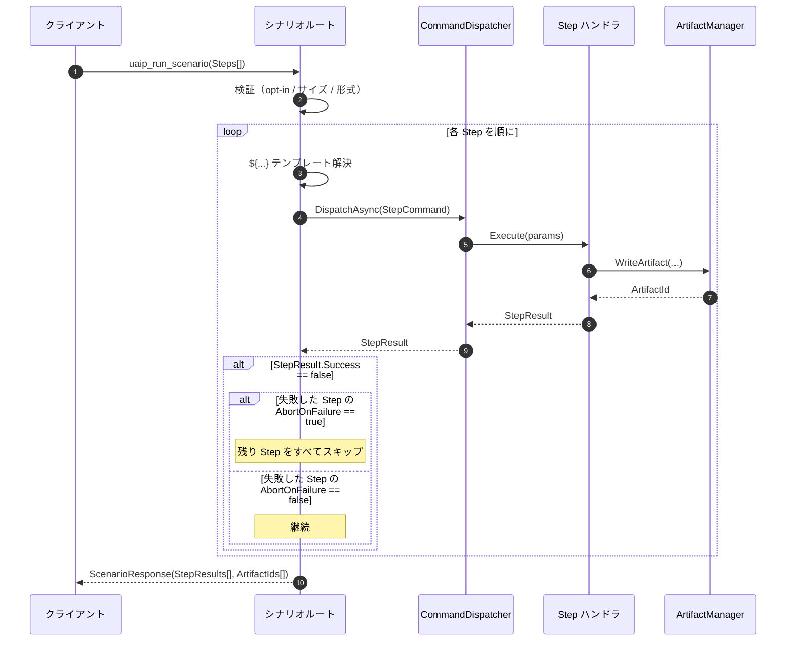
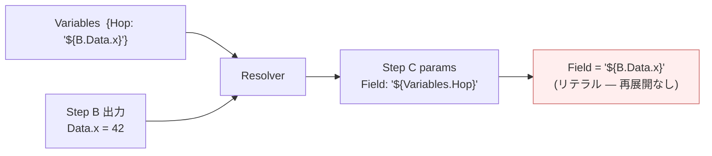

**[English](../en/scenario.md)** | [概要に戻る](overview.md)

# シナリオ実行

`uaip_run_scenario` は複数のコマンドを順序付きリストとして一括送信します。各ステップはゲームスレッド上で順番に実行され、失敗時の中断・リトライ・ステップごとのタイムアウトを宣言的に設定できます。

---

## 有効化

シナリオ実行はデフォルトで無効です。`config.json` に `"enable_scenario": true` を追加して MCP クライアントを再接続すると有効になります：

```json
{
  "editor_path":    "...",
  "uproject_path":  "...",
  "enable_scenario": true
}
```

---

## 単発コマンドとシナリオの使い分け

| `uaip_execute` を使う場面 | `uaip_run_scenario` を使う場面 |
|---|---|
| 1 回で完結する操作（スクリーンショット、アセットを開く） | 順序のある手順（LoadMap → PIE → キャプチャ → アサート） |
| 読み取り専用で状態変化なし | 後のステップが前のステップの出力を必要とする |
| 探索フェーズ — 結果を見てから次を決める | 失敗時の中断・リトライ・ステップごとのタイムアウトが必要 |

**目安**：`uaip_execute` を 2 回以上続けて呼び出すときは、シナリオにまとめることを検討してください。

---

## 実行フロー



シナリオルートは認可をバイパスしません — 各 Step は直接 `uaip_execute` を呼ぶ場合と同じ `CommandDispatcher` を通り、同じ Capability + Policy チェックを受けます。詳細は [アーキテクチャ](architecture.md)。

---

## 呼び出し形式

```
uaip_run_scenario(
  ScenarioName="MyScenario",          # [A-Za-z0-9_]{1,128}
  SessionId="scenario-<purpose>",      # 省略可
  Variables={ "Key": "Value", ... },   # 省略可（初期値マップ）
  Steps=[
    {
      "StepName":        "Load",        # [A-Za-z0-9_]{1,64}、Steps 内で一意
      "CommandName":     "UAIP.Runtime.PIE.LoadMap",
      "Params":          { "MapPath": "/Game/Maps/TestMap" },
      "AbortOnFailure":  true,          # デフォルト: true（「失敗時の挙動とクリーンアップ」を参照）
      "RetryCount":      0,             # デフォルト: 0
      "TimeoutSeconds":  60             # デフォルト: 60
    },
    ...
  ]
)
```

---

## テンプレート `${...}` による値の受け渡し

`${StepName.Data.<pointer>}` を使って前のステップの出力を後のステップのパラメータに渡せます。

| 式 | 意味 |
|---|---|
| `${StepName.Success}` | bool — ステップが成功したか |
| `${StepName.ErrorCode}` | エラーコード文字列 |
| `${StepName.Data.<pointer>}` | ステップのレスポンスデータ内の値 — 記法は下記参照 |
| `${StepName.Data}` | `Data` オブジェクト全体 |
| `${StepName.Artifacts[0]}` | ステップの最初の Artifact ID |
| `${Variables.<key>}` | `Variables` マップの値 |

### JSON Pointer の記法

ポインタ本体には**2 つの記法**があり、先頭の文字で判別されます。

| 記法 | 判定条件 | 挙動 |
|---|---|---|
| **strict** | 本体が `/` で始まる | RFC 6901 の JSON Pointer としてそのまま読む — `.` は区切り文字として扱われないため、`.` を含むキーもアドレス可能になる |
| **lenient** | それ以外 | `.` と `/` の両方を区切り文字として受け付ける — 既存シナリオの大半はこの書き方 |

例：

| 式 | 記法 | ポインタ | 結果 |
|---|---|---|---|
| `${S.Data.Result}` | lenient | `/Result` | トップレベルの `Result` フィールド |
| `${S.Data.Result/0/refPath}` | lenient | `/Result/0/refPath` | 配列 0 番の `refPath` フィールド |
| `${S.Data./refPath}` | strict | `/refPath` | 同じフィールドを strict で書いた場合 |
| `${S.Data./a.b/0}` | strict | `/a.b/0` | キー `a.b` の下の配列 0 番 — lenient では `.` で分割されるため strict でしか到達できない |
| `${S.Data}` | — | *(空)* | `Data` オブジェクト全体 |
| `${S.Data./With~1Slash}` | strict | `/With~1Slash` | `With/Slash` という名前のフィールド（`/` を `~1` としてエスケープ） |
| `${S.Data.With~0Tilde}` | lenient | `/With~0Tilde` | `With~Tilde` という名前のフィールド（`~` を `~0` としてエスケープ） |

`~1` / `~0` のエスケープは表記方式ではなく JSON Pointer の意味論そのものなので、strict / lenient **どちらでも**同じように働きます。`~` を含むキーは `~0` と書く必要があります。

その他の制約：

- **オブジェクトキーの照合は大文字小文字を区別する完全一致です。** `refPath` は `RefPath` や `REFPATH` という名前のフィールドにはマッチしません。
- **配列添字**は `0` または `[1-9][0-9]*` のみです — 先頭ゼロ（`01`）・符号（`+1`）・余分な文字（`1abc`）・先頭の空白は不一致になります。
- **オブジェクト・配列は単一フィールドとしてのみ**綴じ込めます。より大きな文字列の中に埋め込む（例：`"prefix-${S.Data.SomeObject}"`）と、空文字に縮退せずステップが失敗します。

テンプレートはステップ実行直前に 1 回だけ解決されます。`Variables` に `${...}` を書いても再展開はされません（循環展開防止のための仕様）。

### テンプレート解決の失敗

不正な参照（未知のサブ識別子、空のポインタ、不正な `~` エスケープ、ステップのデータに一致しないポインタ、サイズ超過の値、混在文字列へのオブジェクト・配列埋め込みなど）は、`ErrorCode: InvalidParams` でステップを失敗させます。これは**リトライされません**：`RetryCount` は `ExecutionFailed` にのみ適用されます。

### テンプレートのサイズ制限

| 上限 | 縛る対象 | 適用時点 |
|---|---|---|
| 64 KiB | 1 つの `Variables` エントリの値 | 変数の格納時 |
| 8 KiB | `Step.Data` から綴じ込む 1 つの値 | テンプレート解決時 |
| 256 KiB | 1 ステップの Params 全体 / 展開差分の総量 | 投入時 + 解決時 |

### 単一パス解決



`Field` に実際の値 `42` を入れたい場合は、`Variables` を経由せず Step C のパラメータから直接 `${B.Data.x}` を参照してください。

---

## レスポンスの形式

```json
{
  "ScenarioId": "<uuid>",
  "Status": "Completed",
  "AllStepsSucceeded": true,
  "StepResults": [
    {
      "StepName": "Load",
      "Success": true,
      "ErrorCode": "Success",
      "ArtifactIds": ["..."]
    }
  ],
  "ArtifactIds": ["...", "..."]
}
```

| Status | 意味 |
|---|---|
| `Completed` | すべてのステップが成功 |
| `Failed` | 1 つ以上のステップが失敗 |
| `Aborted` | シナリオ全体が 1800 秒の制限を超過 |

---

## 上限値

| 項目 | 上限 |
|---|---|
| 最大ステップ数 | 100 |
| シナリオ全体の制限時間 | 1800 秒 |
| 同時実行数 | 1（実行中に送信すると `TooManyRequests`） |
| ペイロードサイズ | 合計 1 MiB、Params 文字列 8 KiB |

---

## 単発コマンドとの排他

シナリオの排他は他のシナリオに対してだけではなく、`uaip_execute` で送信する単発コマンドとの間でも双方向に働きます。しかも **HTTP・MCP・WebSocket のすべての transport** で有効です。

- **シナリオ実行中は**、どのセッションからの単発コマンドも — シナリオを投入した本人のセッションであっても — `TooManyRequests` で拒否されます。これは実行全体（最長で 1800 秒のウォールクロック上限まで）にわたって有効で、ウォールクロックウォッチドッグが発火してもランナー自体がまだ終わっていなければ、実際に終わるまで拒否は続きます。唯一の例外は受動的待機コマンドです（[設定リファレンス → `[UAIP.Transport]` 受動的待機の同時実行](config.md#uaiptransport--受動的待機の同時実行既定オフ) を参照）。`AllowConcurrentPassiveWaits=True` が設定されていれば、これらはシナリオ実行中でも通ります — 状態を変更しないため、シナリオのステップと衝突しようがないからです。
- **逆方向も同様です**: 受動的待機以外のコマンドがエディタのどこかで実行中の間は、シナリオの投入自体が `TooManyRequests` で拒否されます。応答自体はすでにタイムアウトしている（HTTP / MCP の 120 秒非同期タイムアウト）が、サーバ側では実行が続いているコマンド — マップ読み込みやシェーダー再コンパイルの途中など — も対象に含まれます。受動的待機はこの判定にカウントされないため、長い待機の最中でもシナリオの開始自体は妨げられません。
- 同じコマンドが、シナリオ自身のウォールクロック上限をはるかに超えて実行中のままであれば、拒否の種類は `TooManyRequests` から `InternalError` へ変わり、エディタの再起動が必要であることを示すメッセージが返ります。これは通常の混雑（再送する価値がある）と、詰まったハンドラ（再送しても無駄）を区別するためです。
- どちらの方向でも、**何が実行中かは明かされません**。実行中であるという事実だけが分かります。

これは新しく opt-in する制限ではなく、**正しさの是正**です。以前のリリースでは他のシナリオに対してしか排他が効いておらず、シナリオの途中に単発コマンドが割り込めていました。同じセッションから、2 つのシナリオ投入の間に単発コマンドを差し込む運用をしていた場合は、その運用は成立しなくなります — 作業を 2 つのシナリオへ分割するか、単発コマンドをシナリオの前後（実行中ではないタイミング）に移動してください。

---

## 例 — PIE バリデーションの完全なフロー

```json
{
  "ScenarioName": "PIE_HealthCheck",
  "Variables": { "ExpectedHp": "100" },
  "Steps": [
    { "StepName": "Load",   "CommandName": "UAIP.Runtime.PIE.LoadMap",
      "Params": { "MapPath": "/Game/Maps/TestMap" } },
    { "StepName": "Start",  "CommandName": "UAIP.Runtime.PIE.StartPIE", "Params": {} },
    { "StepName": "Settle", "CommandName": "UAIP.Runtime.Assertion.WaitSeconds",
      "Params": { "Seconds": 2 } },
    { "StepName": "Cap",    "CommandName": "UAIP.Runtime.Observation.CaptureViewportImage",
      "Params": {} },
    { "StepName": "Assert", "CommandName": "UAIP.Runtime.Assertion.AssertActorProperty",
      "Params": { "ActorIdentifier": "PlayerCharacter",
                  "PropertyName": "Health",
                  "ExpectedValue": "${Variables.ExpectedHp}" } },
    { "StepName": "Stop",   "CommandName": "UAIP.Runtime.PIE.StopPIE",
      "Params": {} }
  ]
}
```

この記述のままでは、`Load` 〜 `Assert` のいずれかが失敗した時点でシナリオが終了し、`Stop` はディスパッチされません（PIE は起動したまま残ります）。理由と対処は次のセクションを参照してください。

---

## 失敗時の挙動とクリーンアップ

`AbortOnFailure` は **失敗したステップ自身** に対して評価されます。後続のステップに設定した値は参照されません。

- 失敗したステップ自身の `AbortOnFailure` が `true`（デフォルト）→ その時点でシナリオが終了します。後続のステップは一切ディスパッチされず、`StepResults` にも現れません。
- 失敗したステップ自身の `AbortOnFailure` が `false` → 次のステップへ進みます。失敗自体は `StepResults` に記録されます。

つまり `AbortOnFailure: false` は「**このステップ** の失敗を致命的として扱わない」という意味であり、「前のステップが失敗してもこのステップを実行する」という意味ではありません。末尾のクリーンアップ用ステップ（`StopPIE`・一時アセット削除・タブクローズなど）にだけ `false` を付けても、そのステップは他の後続ステップと一緒にスキップされます。

テンプレート解決に失敗した場合（`InvalidParams`）も同じルールで、失敗したステップ自身のフラグが参照されます。

### クリーンアップを実際に実行させる方法

| 方法 | 具体的な対応 | トレードオフ |
|---|---|---|
| fail-fast を諦める | クリーンアップ用ステップより **前にある全ステップ** に `AbortOnFailure: false` を設定する（クリーンアップ用ステップだけではない） | シナリオが途中で止まらなくなるため、失敗後のステップも前提が壊れた状態で実行され、多くの場合そのまま失敗します。最初の失敗箇所は `StepResults` から特定してください |
| シナリオの外でクリーンアップする | fail-fast は維持し、シナリオの応答が返ってから `uaip_execute`（またはクリーンアップ専用のシナリオ）で後始末する | 往復が増えますが、クライアント側が後始末を主導するため、下記のケースもカバーできます |
| 後始末が不要な構成にする | トレースを残す操作より前に、失敗しやすいステップを配置する | 常に実現できるとは限りません |

### シナリオ内のどのパターンでもカバーできないケース

- **送信時の拒否**（opt-in 未設定・ペイロード不正・`TooManyRequests`）— ステップが 1 つも実行されません。
- **シナリオ全体のウォッチドッグ** — 制限時間を超過すると、ルートは **`StepResults` を含まない** 結果を即座に返しますが、ランナー自体はバックグラウンドで動き続けます。応答からはクリーンアップが実行されたかどうかを判断できず、ランナーが終わるまで次の送信も拒否されます。
- **シナリオ実行中のエディタのクラッシュ・ハング** — 以降は何も実行されません。

いずれの方法を採る場合も、シナリオの応答が返った後に状態ダンプを取り、トレースが実際に消えている（PIE が停止している・一時アセットが削除されている）ことを確認してください。`StepResults` からの推測に頼らないでください。

---

## よくある問題

| 症状 | 原因 | 対処 |
|---|---|---|
| `PolicyViolation: Scenario execution is not enabled` | `enable_scenario` が未設定 | `config.json` に `"enable_scenario": true` を追加 |
| `StepResults` に Step 2 以降が含まれない | Step 1 がデフォルトの `AbortOnFailure: true` で失敗 | 続行したいステップではなく、**失敗するステップ側** に `"AbortOnFailure": false` を設定する |
| `AbortOnFailure: false` を付けたクリーンアップ用ステップが実行されない | 前のステップがデフォルトの `AbortOnFailure: true` で失敗し、到達前にシナリオが終了した | [失敗時の挙動とクリーンアップ](#失敗時の挙動とクリーンアップ) を参照。前にある全ステップを `false` にするか、シナリオの外で後始末する |
| テンプレートが `"${...}"` のまま展開されない | シングルパス解決の仕様 — `Variables` は再展開されない | 値を `Variables` で直接渡すか、2 つのステップに分割する |
| `InvalidParams` とテンプレート関連のメッセージでステップが失敗する | `${...}` 参照の記法誤り（記法の取り違え・不正なエスケープ・ポインタ不一致・サイズ超過・混在文字列へのオブジェクト/配列埋め込み） | 上記の [JSON Pointer の記法](#json-pointer-の記法) を再確認する。`RetryCount` によるリトライ対象外 |
| `TooManyRequests` | 別のシナリオが実行中 | 完了するまで待つ |
