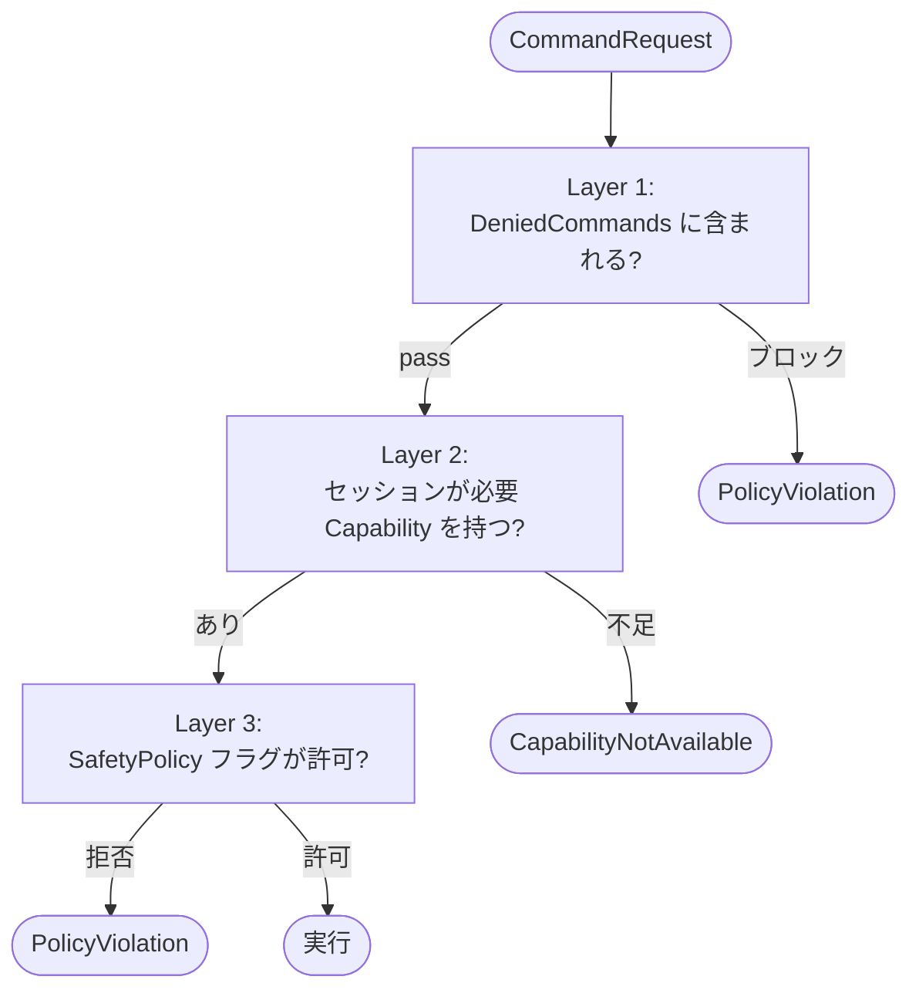

**[English](../en/security.md)** | [概要に戻る](overview.md)

# セキュリティモデル

UAIP は UE エディタと Runtime を AI エージェントや外部ツールに公開します。本ページでは、そのセキュリティ境界を解説します — UAIP がデフォルトで許可している範囲、どこにゲートがあるか、運用者がデプロイ環境を強化するためにできる設定、といった内容です。

---

## 脅威モデル

UAIP は **開発者マシンと、信頼できる社内 CI** での利用を想定して設計されています。公開インターネット向けのサービスとして使うことは想定していません。UAIP が対処している脅威は次のとおりです：

| 脅威 | 対処方法 |
|---|---|
| ネットワーク越しの攻撃者によるポートスキャン | ループバック限定のバインド（外部インターフェースでは待ち受けない） |
| 同一マシン上の UAIP 以外のプロセスからのコマンド呼び出し | HTTP / WebSocket での Bearer トークン認証 |
| AI が破壊的なコマンドを誤って呼び出してしまう | Capability ゲート（編集系はデフォルトで拒否）と、コマンドごとの `IsReadOnly` フラグ |
| AI が誘導されて広範囲な変更を実行してしまう | SafetyPolicy でプロセス全体を Read-Only モードに切り替え可能 |
| レスポンス経由のファイルパスインジェクション | Artifact は ID で参照する設計で、生パスをサーバの外に出さない |
| 透かしを除去する目的のプラグインファイル差し替え | 透かしのデータを DLL にコンパイル、合成失敗時はフェイルクローズ |

一方、UAIP が **対処しない** 脅威は次のとおりです：

- ホストにシェルアクセスできる攻撃者は `Saved/UAIP/EditorHttpAuthToken.txt` を読めるため、AI クライアントを偽装できます。ホストそのものを信頼境界として扱ってください
- 同じマシン上で UAIP をロードしている悪意あるプロジェクトは、任意のコマンドを登録できます。信頼できない UAIP 入りプロジェクトはロードしないでください
- AI クライアントへのプロンプトインジェクションは UAIP のスコープ外です。AI クライアント側で対処してください

---

## ネットワーク面

| コンポーネント | バインド | デフォルトポート | 認証 |
|---|---|---|---|
| HTTP transport（製品版） | `127.0.0.1` と `::1` | 8765（エディタ）/ 8767（パッケージ） | Bearer トークン |
| WebSocket transport（製品版） | `127.0.0.1` と `::1` | 8766（エディタ）/ 8768（パッケージ） | Bearer トークン（最初のフレーム） |
| MCP Bridge | AI クライアントと Bridge プロセス間の stdio | — | なし — ホスト信頼に依存 |
| CLI transport（製品版） | なし（プロセス内） | — | なし |

**UAIP のトランスポートはすべて、ループバック以外からの接続を拒否します。** `-uaip-http-bind=0.0.0.0` のようなフラグは用意していません。マシンをまたいで UAIP を公開したい場合は、自分で管理するリバースプロキシや VPN の背後に置いてください。

---

## 認証

### HTTP / WebSocket Bearer トークン

起動時に UAIP が 32 文字のランダムトークンを生成し、以下に書き出します：

```
Saved/UAIP/EditorHttpAuthToken.txt
Saved/UAIP/EditorWsAuthToken.txt
```

ファイルは OS のデフォルト権限で書き出されます。`Saved/UAIP/` を読めるユーザーは誰でもクライアントを偽装できるため、エディタを起動しているユーザー自身を信頼プリンシパルと見なしてください。

トークンはエディタを再起動するたびに自動でローテーションされます。起動中に強制的にローテーションしたい場合は、ファイルを削除してから再起動してください。

### 認証無効化（開発時のみ）

```
UnrealEditor.exe MyProject.uproject -uaip-http-enable -uaip-http-no-auth
UnrealEditor.exe MyProject.uproject -uaip-ws-enable -uaip-ws-no-auth
```

**信頼できないプロセスが存在しない**、隔離された開発マシンや CI ランナーでのみ使用してください。バインドはあくまでループバック限定なので `-no-auth` でもネットワークからは到達できませんが、同じマシン上の他プロセスは UAIP のコマンドを発行できるようになります。

### MCP Bridge

MCP は AI クライアントの stdio 子プロセスとして動くため、認証は AI クライアント側の MCP トランスポートが使う仕組み（通常はなし — そもそも子プロセスのため）に依存します。Bridge はエディタを自身の子プロセスとして起動するので、コマンドの流れは最初から最後までローカルで完結します。

---

## 認可

UAIP は各コマンドに対して 3 つの独立した認可層を実行します：



### Layer 1 — Capability セット

各コマンドは必要な Capability を宣言しています（`BlueprintEdit`・`PIEControl` など）。何を呼べるかは、セッションが持つ Capability セットで決まります。DefaultAllow の Capability は自動で付与されますが、DefaultDenied の Capability を使うには `Config/DefaultUAIP.ini` に `+AllowedCapabilities=<名前>` を明示的に追加する必要があります。

### Layer 2 — SafetyPolicy 真偽フラグ

プロセス全体のキルスイッチ：

| フラグ | 効果 |
|---|---|
| `ReadOnly=True` | すべての変更コマンドを拒否（`IsReadOnly=false` ハンドラ） |
| `DisableSave=True` | すべてのディスク書き込みコマンドを拒否 |
| `AllowLogDump=False` | `DumpOutputLog` / `DumpMessageLog` を拒否 |
| `AllowContextMenuMutation=False` | `InvokeContextMenuAction` を拒否 |
| `AllowKeyboardInput=False` | `PressKey` を拒否 |
| `AllowKeyboardModifierInput=False` | `PressKey` 内の修飾キーを拒否 |
| `AllowPasswordFieldWrite=False` | `FillForm` のパスワードフィールド書き込みを拒否 |
| `AllowInputModeBypass=False` | 入力注入の `BypassInputMode=true` を拒否 |
| `DisablePIEStart=True` | PIE 起動を拒否 |

これらは意図的にプロセス全体に適用されるスコープで、AI が Runtime で変更することはできません。変更できるのはオペレーターだけです（ini を編集してエディタを再起動するか、`AllowCapabilityReload=True` を設定している場合は `UAIP.Core.ReloadCapabilities` を呼ぶ）。

### Layer 3 — ルート opt-in

一部の機能はエディタ起動時の CLI フラグが必要：

| 機能 | フラグ |
|---|---|
| HTTP transport | `-uaip-http-enable` |
| WebSocket transport | `-uaip-ws-enable` |
| MCP transport | `-uaip-mcp-enable` |
| シナリオルート | `-uaip-enable-scenario` |

フラグを指定しない場合、対応するコードパス自体が登録されません（「登録されているが拒否される」のではなく、そもそも存在しない状態になります）。デモバイナリでは HTTP / WS / CLI のフラグはサイレントに無視されます。

完全なリファレンスや ini の例は [Safety & Capabilities](safety.md) を参照してください。

---

## 推奨セキュリティプロファイル

### 「Read-only レビュー」 — 信頼できない PR の AI レビュー用

```ini
[UAIP.SafetyPolicy]
ReadOnly=True
DisableSave=True
AllowLogDump=True
DisablePIEStart=False
```

AI は観測やキャプチャはできますが、何も編集できない構成です。新しくチェックアウトしたブランチを LLM に PR レビューさせたいときに有用です。

### 「サンドボックスプレイテスト」 — AI 駆動テスト自動化（エディタ編集なし）

```ini
[UAIP.SafetyPolicy]
ReadOnly=False
DisableSave=True
AllowLogDump=True

+AllowedCapabilities=PIEControl
+AllowedCapabilities=RuntimeActorManipulation
+AllowedCapabilities=RuntimeExecCommand
+AllowedCapabilities=RuntimeInputInjection
```

PIE 制御・Runtime 入力・アサートは使えますが、エディタの編集とディスク書き込みは禁止される構成です。

### 「フル編集」 — エディタ編集を含む AI ペアプロ用

```ini
[UAIP.SafetyPolicy]
ReadOnly=False
AllowLogDump=True
AllowContextMenuMutation=True
AllowKeyboardInput=True
AllowKeyboardModifierInput=True
AllowCapabilityReload=True

; 実際に必要な編集 Capability のみ列挙すること
+AllowedCapabilities=BlueprintEdit
+AllowedCapabilities=BlueprintGraphEdit
+AllowedCapabilities=BlueprintVariableEdit
+AllowedCapabilities=PropertyEdit
+AllowedCapabilities=AssetDelete
+AllowedCapabilities=EditorActorEdit
; …ワークフローに応じて追加
```

`+AllowedCapabilities` の付与は慎重に行ってください。1 つ追加するごとに、AI が確認なしで実行できる操作カテゴリが 1 つ増えることになります。

---

## Artifact のストレージ

Artifact は `<プロジェクト>/Saved/UAIP/<SessionId>/` 配下に書き出されます。デフォルトではパスの制約はなく、ハンドラは `Saved/UAIP/` 配下のどこにでも書き込めます。サンドボックスのルートを強制したい場合は次のように設定します：

```ini
[UAIP.SafetyPolicy]
AllowedArtifactDirectory=Saved/UAIP/
```

このルートからはずれるパスは `NotAllowed` として拒否されます。デフォルト値はすでに `Saved/UAIP/` になっているので、明示的な設定が必要になるのは、より厳しいサブパス（例：CI ジョブごと）を指定したいときです。

Artifact はディスク上では暗号化されません。`DumpWorldState` などでダンプされた機密データは、ファイルシステムにアクセスできるユーザーなら誰でも読めてしまいます。問題になる環境では、`Saved/UAIP/` の OS レベルの権限を制限してください。

---

## 監査ログ

各コマンドは UE の出力ログに構造化されたログ行を書き出します。`DumpOutputLog` と組み合わせると、次のような事後監査用のトレイルが得られます：

- コマンド名と SessionId
- ErrorCode（失敗時）
- 生成された ArtifactId
- 実行にかかった壁時計時間

CI で使う場合は、UE の出力をファイルにリダイレクトし、テスト Artifact と一緒にアーカイブしておくことをおすすめします。

v1.0 時点ではコマンド専用の監査ログファイルは用意していません。必要であれば機能リクエストをお寄せください。

---

## 脆弱性報告

セキュリティ問題については、**公開 GitHub Issue を立てないでください**。代わりに `1999naotsun0411@gmail.com` 宛にメールで、次の情報を添えてご連絡ください：

- UE バージョンと UAIP バージョン（`UAIP.Core.GetSystemInfo`）
- 脆弱性の内容と再現手順
- ループバック以外のオリジンから悪用できるか（最優先）／ローカルでのコード実行が前提か（優先度は下がりますがトラッキングします）

数営業日以内に受領確認のうえ、開示の段取りをご相談します。
