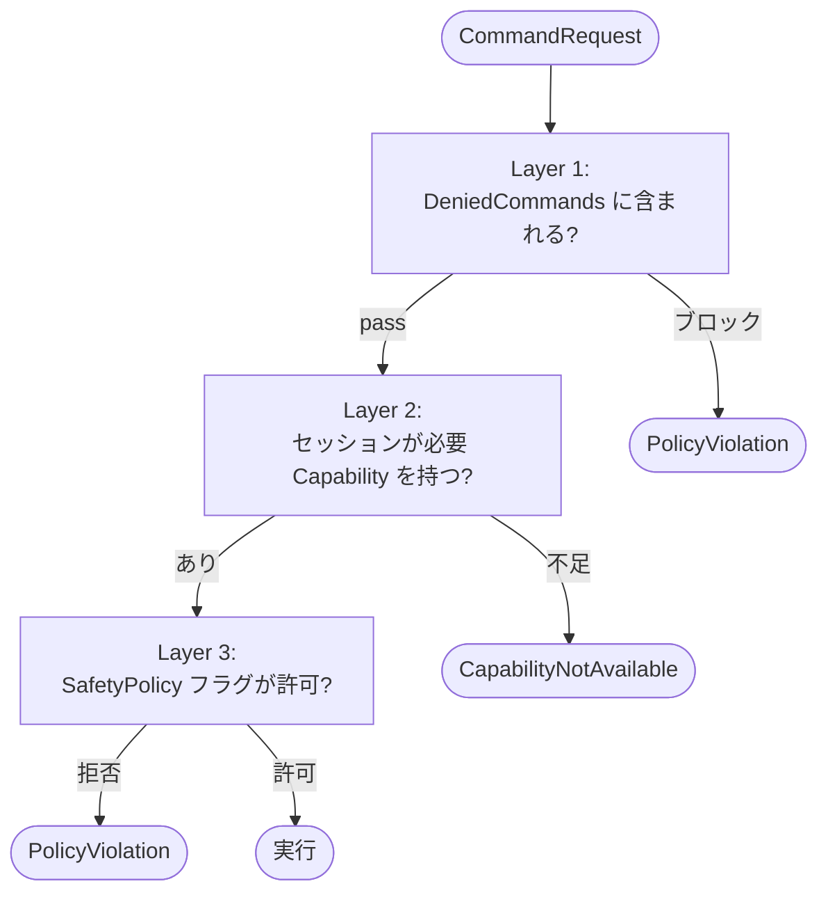

**[English](../en/security.md)** | [概要に戻る](overview.md)

# セキュリティモデル

UAIP は UE エディタと Runtime を AI エージェントや外部ツールに公開します。本ページでは、そのセキュリティ境界を解説します — UAIP がデフォルトで許可している範囲、どこにゲートがあるか、運用者がデプロイ環境を強化するためにできる設定、といった内容です。

---

## 脅威モデル

UAIP は **開発者マシンと、信頼できる社内 CI** での利用を想定して設計されています。公開インターネット向けのサービスとして使うことは想定していません。UAIP が対処している脅威は次のとおりです：

| 脅威 | 対処方法 |
|---|---|
| ネットワーク越しの攻撃者によるスキャン | すべての transport が既定でループバック（`127.0.0.1`）にバインドされます。HTTP MCPOnly モードはさらにアプリ層で localhost を強制します。別 PC から UAIP へ到達するには、UAIP 自身の設定範囲外にある、エンジン設定層での bind アドレス上書きを運用者が明示的に行う必要があります（[ネットワーク面](#ネットワーク面) を参照） |
| 同一マシン上の UAIP 以外のプロセスからのコマンド呼び出し | HTTP / WebSocket での Bearer トークン認証 |
| AI が破壊的なコマンドを誤って呼び出してしまう | Capability ゲート（編集系はデフォルトで拒否）と、コマンドごとの `IsReadOnly` フラグ |
| AI が誘導されて広範囲な変更を実行してしまう | SafetyPolicy でプロセス全体を Read-Only モードに切り替え可能 |
| レスポンス経由のファイルパスインジェクション | Artifact は ID で参照する設計で、生パスをサーバの外に出さない |

一方、UAIP が **対処しない** 脅威は次のとおりです：

- ホストにシェルアクセスできる攻撃者は `Saved/UAIP/EditorHttpAuthToken.txt` を読めるため、AI クライアントを偽装できます。ホストそのものを信頼境界として扱ってください
- 同じマシン上で UAIP をロードしている悪意あるプロジェクトは、任意のコマンドを登録できます。信頼できない UAIP 入りプロジェクトはロードしないでください
- AI クライアントへのプロンプトインジェクションは UAIP のスコープ外です。AI クライアント側で対処してください

---

## ネットワーク面

| コンポーネント | bind 層 | アプリ層フィルタ | 認証 | 別 PC からの到達 |
|---|---|---|---|---|
| HTTP transport — FullHTTP モード（`-uaip-http-enable`） | ループバック（`127.0.0.1`） | なし | Bearer トークン | 不可 — 下の補足を参照 |
| HTTP transport — MCPOnly モード（`-uaip-mcp-enable`） | ループバック（`127.0.0.1`） | PeerAddress / Host / Origin を 5 段検査して localhost 強制 | なし（localhost 前提） | 不可 |
| HTTP transport — `-uaip-http-no-auth` | ループバック（`127.0.0.1`） | なし | なし | 不可 |
| WebSocket transport（`-uaip-ws-enable`） | `127.0.0.1` 固定 | ClientIP を二重チェック | Bearer トークン（最初のフレーム） | 不可 |
| MCP Bridge | AI クライアントと Bridge プロセス間の stdio | — | なし — ホスト信頼に依存 | — |
| CLI transport | なし（プロセス内） | — | なし | — |

WebSocket だけでなく、HTTP のどのモードもループバックにバインドされます。UAIP は `FHttpServerModule::GetHttpRouter()` を呼ぶ際に bind アドレスを一切指定していません。エンジン側の `FHttpServerListenerConfig::BindAddress` の既定値は `"localhost"` であり、本プロジェクトの `Config/DefaultUAIP.ini` にも `DefaultEngine.ini` にも `[HTTPServer.Listeners]` の上書きはありません。これは MCPOnly だけでなく FullHTTP にも当てはまります — FullHTTP の Bearer トークン認証はリモートエージェントからの接続を想定して設計されましたが、実装としては socket 自体がマシンの外へは出ません。`-uaip-http-no-auth` もトークン検証を外すだけで、bind アドレスは変わりません。

FullHTTP を本当に別 PC から到達可能にしたい運用者は、エンジン設定層の `[HTTPServer.Listeners]` で該当ポートの `BindAddress` を自分で上書きする必要があります（UAIP 側にはこのための設定項目はありません）。そうした場合、開いたポートとネットワークの間にあるのは Bearer トークンとファイアウォールだけになります。`-uaip-http-enable` を付けて起動するだけとは別の、明示的な判断として扱ってください。

---

## 認証

### HTTP / WebSocket Bearer トークン

起動時に UAIP が 32 文字のランダムトークンを生成し、以下に書き出します：

```
Saved/UAIP/EditorHttpAuthToken.txt
Saved/UAIP/EditorWsAuthToken.txt
```

ファイルは OS のデフォルト権限で書き出されます。`Saved/UAIP/` を読めるユーザーは誰でもクライアントを偽装できるため、エディタを起動しているユーザー自身を信頼プリンシパルと見なしてください。

トークンはエディタを再起動するたびに自動でローテーションされます。起動中に強制的にローテーションしたい場合は、ファイルを削除してから再起動してください。

### 認証無効化（開発時のみ）

```
UnrealEditor.exe MyProject.uproject -uaip-http-enable -uaip-http-no-auth
UnrealEditor.exe MyProject.uproject -uaip-ws-enable -uaip-ws-no-auth
```

**信頼できないプロセスが存在しない**、隔離された開発マシンや CI ランナーでのみ使用してください。HTTP の `-uaip-http-no-auth` は Bearer トークン検証を外すだけで、socket 自体はループバックのままなので、このフラグを付けただけで別 PC から到達できるようになるわけではありません。WebSocket の `-uaip-ws-no-auth` も socket 層はループバック限定です。ただしどちらの場合も、同じマシン上の他プロセスは認証なしでコマンドを発行できるようになります。

### MCP Bridge

MCP は AI クライアントの stdio 子プロセスとして動くため、認証は AI クライアント側の MCP トランスポートが使う仕組み（通常はなし — そもそも子プロセスのため）に依存します。Bridge はエディタを自身の子プロセスとして起動するので、コマンドの流れは最初から最後までローカルで完結します。

---

## 認可

UAIP は各コマンドに対して 3 つの独立した認可層を実行します：


```mermaid
flowchart TB
    Req([CommandRequest])
    L1[Layer 1:<br/>DeniedCommands に含まれる?]
    L2[Layer 2:<br/>セッションが必要 Capability を持つ?]
    L3[Layer 3:<br/>SafetyPolicy フラグが許可?]
    OK([実行])

    Req --> L1
    L1 -- ブロック --> X1([PolicyViolation])
    L1 -- pass --> L2
    L2 -- 不足 --> X2([CapabilityNotAvailable])
    L2 -- あり --> L3
    L3 -- 拒否 --> X3([PolicyViolation])
    L3 -- 許可 --> OK
```

### Layer 1 — Capability セット

各コマンドは必要な Capability を宣言しています（`BlueprintEdit`・`PIEControl` など）。何を呼べるかは、セッションが持つ Capability セットで決まります。DefaultAllow の Capability は自動で付与されますが、DefaultDenied の Capability を使うには `Config/DefaultUAIP.ini` に `+AllowedCapabilities=<名前>` を明示的に追加する必要があります。

### Layer 2 — SafetyPolicy 真偽フラグ

プロセス全体のキルスイッチ：

| フラグ | 効果 |
|---|---|
| `ReadOnly=True` | 変更コマンドを拒否（`IsReadOnly=false` ハンドラ）。`ShutdownEditor` / `RestartEditor` のみ例外 — [Safety & Capabilities](safety.md#readonly-とエディタライフサイクルコマンド) を参照 |
| `DisableSave=True` | すべてのディスク書き込みコマンドを拒否 |
| `AllowLogDump=False` | `DumpOutputLog` / `DumpMessageLog` を拒否 |
| `AllowContextMenuMutation=False` | `InvokeContextMenuAction` を拒否 |
| `AllowKeyboardInput=False` | `PressKey` を拒否 |
| `AllowKeyboardModifierInput=False` | `PressKey` 内の修飾キーを拒否 |
| `AllowPasswordFieldWrite=False` | `FillForm` のパスワードフィールド書き込みを拒否 |
| `AllowInputModeBypass=False` | 入力注入の `BypassInputMode=true` を拒否 |
| `DisablePIEStart=True` | PIE 起動を拒否 |

これらは意図的にプロセス全体に適用されるスコープで、AI が Runtime で変更することはできません。変更できるのはオペレーターだけです（ini を編集してエディタを再起動するか、`AllowCapabilityReload=True` を設定している場合は `UAIP.Core.ReloadCapabilities` を呼ぶ）。

### Layer 3 — ルート opt-in

一部の機能はエディタ起動時の CLI フラグが必要：

| 機能 | フラグ |
|---|---|
| HTTP transport | `-uaip-http-enable` |
| WebSocket transport | `-uaip-ws-enable` |
| MCP transport | `-uaip-mcp-enable` |
| シナリオルート | `-uaip-enable-scenario` |

フラグを指定しない場合、対応するコードパス自体が登録されません（「登録されているが拒否される」のではなく、そもそも存在しない状態になります）。デモバイナリでは HTTP / WS / CLI のフラグはサイレントに無視されます。

完全なリファレンスや ini の例は [Safety & Capabilities](safety.md) を参照してください。

---

## 運用上のセキュリティ注意点

不具合と誤解されやすい挙動、あるいは影響範囲に気付かないまま選んでしまいがちな設定をまとめます。特に「既に起動しているエディタへ後から接続する」ワークフローで重要です — [接続方法 → ゲストモード接続](connections.md#ゲストモード接続) を参照してください。

### 自動起動の設定はチーム共有であり、個人単位ではない

`[UAIP.Transport].AutoStartMCP`（[設定リファレンス](config.md#uaiptransport--通常起動のエディタで-mcp-transport-を自動起動する) を参照）は `Config/DefaultUAIP.ini` に置かれ、バージョン管理対象です。エディタにはこれに対する per-user のオーバーライド層がありません — ランタイムオーバーライド機構はパッケージビルド（エディタではないビルド）にしか適用されません（[設定リファレンス → ランタイムオーバーライド機構](config.md#ランタイムオーバーライド機構パッケージビルド) を参照）。`AutoStartMCP=True` がコミットされると、**そのプロジェクトを開く全開発者が、通常の起動のたびに接続を受け付ける MCP エンドポイントを持つ**ことになります。個人単位で打ち消す仕組みはなく、ローカルで ini を編集してコミットしないという運用でしか回避できません。共有 ini でこれを有効化することは、個人の利便設定ではなくチーム全体の判断として扱ってください。

### モーダルダイアログの裏でコマンドが順番待ちになることがある

`-unattended` を付けずに起動したエディタ（人間が普段どおり操作する、通常起動のエディタ。MCP Bridge が自分で起動するエディタとは異なる）でも、UAIP コマンドはゲームスレッド上で実行されます。モーダルダイアログが表示されている間（「保存しますか？」やアセット検証の警告など）は、`[UAIP.CommandPump]` で設定された小さな allowlist（既定では `UAIP.Core.HealthCheck` と `UAIP.Core.QueryCapabilities` のみ）だけが応答します。それ以外は**拒否されるのではなく、ダイアログが閉じるまで順番待ちのまま保留**されます。これは意図した動作です — 人間が判断の途中にあるとき、UAIP はエディタの状態を変更しません。ただし呼び出し側からは、これはハングと見分けがつきません。人間が操作しているエディタに対する呼び出しが予想外に遅い場合は、故障を疑う前にダイアログが開いていないか確認してください。また、十分長く保留されると、エディタ自体は正常でも呼び出し側でタイムアウトになることがあります。

### ゲスト接続には制限付きの役割を割り当てる

「ゲスト」接続 — 自分でエディタを起動する代わりに、既に起動しているエディタへアタッチするよう設定された接続（`attach_only`。[接続方法 → ゲストモード接続](connections.md#ゲストモード接続) を参照） — は、そのセッションが本来持つはずの Capability をそのまま引き継ぎます。プロジェクトに [`[UAIP.Roles]`](safety.md#役割layer-15) が 1 つも定義されていない場合、人間のエディタへアタッチしたゲストは、DefaultAllow の Capability を含め、一次接続と同じことを何でも実行できます — このページの他の箇所で説明している「同じマシンは信頼する」という前提が、そのままそのエディタが開いている間ずっと延長される形です。少なくとも 1 つの制限付き役割（読み取り専用のレビュー用役割などが妥当な出発点です）を定義し、他人が起動しているエディタへ向ける前に、ゲスト側の Bridge をその役割で認証するよう設定してください。役割を割り当てていない場合、エディタ側からは、ある接続がゲストかどうかを見分ける手段がありません。

---

## 推奨セキュリティプロファイル

### 「Read-only レビュー」 — 信頼できない PR の AI レビュー用

```ini
[UAIP.SafetyPolicy]
ReadOnly=True
DisableSave=True
AllowLogDump=True
DisablePIEStart=False
```

AI は観測やキャプチャはできますが、何も編集できない構成です。新しくチェックアウトしたブランチを LLM に PR レビューさせたいときに有用です。なおエディタの終了・再起動は依然として可能です。これも塞ぎたい場合は `UAIP.Editor.Workspace.ShutdownEditor` と `UAIP.Editor.Workspace.RestartEditor` を `+DeniedCommands` に追加してください。

### 「サンドボックスプレイテスト」 — AI 駆動テスト自動化（エディタ編集なし）

```ini
[UAIP.SafetyPolicy]
ReadOnly=False
DisableSave=True
AllowLogDump=True

+AllowedCapabilities=PIEControl
+AllowedCapabilities=RuntimeActorManipulation
+AllowedCapabilities=RuntimeExecCommand
+AllowedCapabilities=RuntimeInputInjection
```

PIE 制御・Runtime 入力・アサートは使えますが、エディタの編集とディスク書き込みは禁止される構成です。

### 「フル編集」 — エディタ編集を含む AI ペアプロ用

```ini
[UAIP.SafetyPolicy]
ReadOnly=False
AllowLogDump=True
AllowContextMenuMutation=True
AllowKeyboardInput=True
AllowKeyboardModifierInput=True
AllowCapabilityReload=True

; 実際に必要な編集 Capability のみ列挙すること
+AllowedCapabilities=BlueprintEdit
+AllowedCapabilities=BlueprintGraphEdit
+AllowedCapabilities=BlueprintVariableEdit
+AllowedCapabilities=PropertyEdit
+AllowedCapabilities=AssetDelete
+AllowedCapabilities=EditorActorEdit
; …ワークフローに応じて追加
```

`+AllowedCapabilities` の付与は慎重に行ってください。1 つ追加するごとに、AI が確認なしで実行できる操作カテゴリが 1 つ増えることになります。

---

## Artifact のストレージ

Artifact は `<プロジェクト>/Saved/UAIP/<SessionId>/` 配下に書き出されます。デフォルトではパスの制約はなく、ハンドラは `Saved/UAIP/` 配下のどこにでも書き込めます。サンドボックスのルートを強制したい場合は次のように設定します：

```ini
[UAIP.SafetyPolicy]
AllowedArtifactDirectory=Saved/UAIP/
```

このルートからはずれるパスは `NotAllowed` として拒否されます。デフォルト値はすでに `Saved/UAIP/` になっているので、明示的な設定が必要になるのは、より厳しいサブパス（例：CI ジョブごと）を指定したいときです。

Artifact はディスク上では暗号化されません。`DumpWorldState` などでダンプされた機密データは、ファイルシステムにアクセスできるユーザーなら誰でも読めてしまいます。問題になる環境では、`Saved/UAIP/` の OS レベルの権限を制限してください。

---

## 監査ログ

各コマンドは UE の出力ログに構造化されたログ行を書き出します。`DumpOutputLog` と組み合わせると、次のような事後監査用のトレイルが得られます：

- コマンド名と SessionId
- ErrorCode（失敗時）
- 生成された ArtifactId
- 実行にかかった壁時計時間

CI で使う場合は、UE の出力をファイルにリダイレクトし、テスト Artifact と一緒にアーカイブしておくことをおすすめします。

v1.0 時点ではコマンド専用の監査ログファイルは用意していません。必要であれば機能リクエストをお寄せください。

---

## 脆弱性報告

セキュリティ問題については、**公開 GitHub Issue を立てないでください**。代わりに `naotsunworks@gmail.com` 宛にメールで、次の情報を添えてご連絡ください：

- UE バージョンと UAIP バージョン（`UAIP.Core.GetSystemInfo`）
- 脆弱性の内容と再現手順
- ループバック以外のオリジンから悪用できるか（最優先）／ローカルでのコード実行が前提か（優先度は下がりますがトラッキングします）

本リポジトリは個人開発のため対応時間は確約できませんが、受領後、可能な範囲で随時開示の段取りをご相談します。
